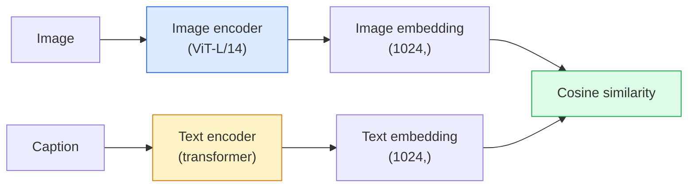

# 开放词表视觉：CLIP

> 把图像 encoder 和文本 encoder 一起训练，让匹配的（image, caption）对落在同一个共享空间中的同一点附近。诀窍就是这么简单。

**类型：** 构建 + 使用
**语言：** Python
**前置要求：** 阶段 4 第 14 课（ViT），阶段 4 第 17 课（自监督）
**时间：** ~45 分钟

## 学习目标

- 解释 CLIP 的 two-tower 架构和 contrastive training objective
- 使用预训练 CLIP（或 SigLIP）做 zero-shot classification，不需要任何特定任务训练
- 从零实现 zero-shot classification：编码 class prompts，计算 cosine similarity，取 argmax
- 区分 CLIP、SigLIP、OpenCLIP 和 LLaVA/LLaMA-vision models：说明 2026 年各自适合做什么

## 问题

传统 classifier 是 closed-vocabulary：一个 1000 类 ImageNet 模型只能预测 1000 个 labels。每个新类别都需要标注数据和重新训练的 head。

CLIP（Radford et al., OpenAI 2021）展示了：在从 web 抓取的 4 亿个（image, caption）对上训练，可以得到一个模型，在推理时能分类到任意类别集合，只要这些类别用自然语言描述。你只需要写一句话，就给了它一个新类别。

这种能力，也就是 zero-shot transfer，是每个现代视觉系统都从 CLIP-family checkpoint 开始的原因。Detection（Grounding DINO、OWL-ViT）、segmentation（CLIPSeg、SAM）、retrieval、content moderation、VLMs 和 text-to-image generation 都构建在 CLIP-style joint embeddings 之上。

## 概念

### Two towers



两个 encoders 的末端都有一个线性投影，投到同一个 embedding dimension（CLIP-B/32 是 512，CLIP-L/14 是 1024）。做 L2-normalise，然后计算 cosine similarity。

### Objective

给定一个包含 N 个（image, caption）对的 batch，构建一个 NxN similarity matrix。训练两个 encoders，使对角线（匹配 pairs）有高 similarity，非对角线（不匹配）有低 similarity。

```
sim_matrix = image_embeddings @ text_embeddings.T / tau

loss_i2t = cross_entropy(sim_matrix,       targets=arange(N))
loss_t2i = cross_entropy(sim_matrix.T,     targets=arange(N))
loss = (loss_i2t + loss_t2i) / 2
```

它是对称的，因为 image-to-text 和 text-to-image retrieval 都应该有效。`tau`（temperature）通常是一个学习出来的标量参数，初始化为 0.07。

### SigLIP：更好的 loss

SigLIP（Zhai et al., 2023）把 softmax 换成了逐 pair 的 sigmoid：

```
loss = mean over pairs of log(1 + exp(-y_ij * sim_ij))
y_ij = +1 if matching, -1 otherwise
```

逐 pair loss 移除了 CLIP 所需的 batch-level normalisation。SigLIP 在小 batch size 上训练更好，并且在相同数据下达到或超过 CLIP。

### Zero-shot classification

给定一个训练好的 CLIP：

1. 对每个类别组合一个 prompt："a photo of a {class}"。
2. 用 text encoder 编码所有 class prompts -> `T` shape (C, d)。
3. 编码测试图片 -> `I` shape (1, d)。
4. Similarity = `I @ T.T` shape (1, C)。
5. Argmax -> predicted class。

Prompt engineering 很重要。OpenAI 为 ImageNet 发布了 80 个 prompt templates（"a photo of a {}"、"a blurry photo of a {}"、"a sketch of a {}" 等）。对每个 class，把所有 templates 的 embeddings 平均，可以额外提升 1-3% top-1 accuracy。

### 2026 年 CLIP-style 模型用在哪里

- **Zero-shot classification**：直接使用。
- **Image retrieval**：先把所有图片编码一次，推理时 embed query。
- **Text-conditioned detection**：Grounding DINO、OWL-ViT 在 detector 外包了一层 CLIP text tower。
- **Text-conditioned segmentation**：CLIPSeg；SAM 通过 CLIP 使用 text-prompt inputs。
- **VLMs**：LLaVA、Qwen-VL、InternVL 把 CLIP-family vision encoder 接进 LLM。
- **Text-to-image gen**：Stable Diffusion、DALL-E 3 以 CLIP text embeddings 为条件。

一旦有了共享 embedding space，每个 vision+language 任务都会变成距离计算。

## 构建它

### 第 1 步：一个小型 two-tower model

真实 CLIP 是 ViT + transformer。本课中的 towers 是基于预提取特征的小 MLP，这样训练信号在 CPU 上也看得见。

```python
import torch
import torch.nn as nn
import torch.nn.functional as F


class TwoTower(nn.Module):
    def __init__(self, img_in=128, txt_in=64, emb=64):
        super().__init__()
        self.image_proj = nn.Sequential(nn.Linear(img_in, 128), nn.ReLU(), nn.Linear(128, emb))
        self.text_proj = nn.Sequential(nn.Linear(txt_in, 128), nn.ReLU(), nn.Linear(128, emb))
        self.logit_scale = nn.Parameter(torch.ones([]) * 2.6592)  # ln(1/0.07)

    def forward(self, img_feats, txt_feats):
        i = F.normalize(self.image_proj(img_feats), dim=-1)
        t = F.normalize(self.text_proj(txt_feats), dim=-1)
        return i, t, self.logit_scale.exp()
```

两个 projection、共享维度输出、学习出来的 temperature。形状和真实 CLIP API 相同。

### 第 2 步：Contrastive loss

```python
def clip_loss(image_emb, text_emb, logit_scale):
    N = image_emb.size(0)
    sim = logit_scale * image_emb @ text_emb.T
    targets = torch.arange(N, device=sim.device)
    l_i = F.cross_entropy(sim, targets)
    l_t = F.cross_entropy(sim.T, targets)
    return (l_i + l_t) / 2
```

对称。更高的 logit_scale = 更尖锐的 softmax = 更自信，但有不稳定风险。

### 第 3 步：Zero-shot classifier

```python
@torch.no_grad()
def zero_shot_classify(model, image_feats, class_text_feats, class_names):
    """
    image_feats:      (N, img_in)
    class_text_feats: (C, txt_in)   one averaged embedding per class
    """
    i = F.normalize(model.image_proj(image_feats), dim=-1)
    t = F.normalize(model.text_proj(class_text_feats), dim=-1)
    sim = i @ t.T
    pred = sim.argmax(dim=-1)
    return [class_names[p] for p in pred.tolist()]
```

每一步一行。这正是生产 CLIP checkpoint 使用的 zero-shot 流程。

### 第 4 步：Sanity check

```python
torch.manual_seed(0)
model = TwoTower()

img = torch.randn(8, 128)
txt = torch.randn(8, 64)
i, t, scale = model(img, txt)
loss = clip_loss(i, t, scale)
print(f"batch size: {i.size(0)}   loss: {loss.item():.3f}")
```

随机初始化模型的 loss 应接近 `log(N) = log(8) = 2.08`，这是尚未学习到结构时的对称 cross-entropy 目标。

## 使用它

OpenCLIP 是 2026 年社区默认选择：

```python
import open_clip
import torch
from PIL import Image

model, _, preprocess = open_clip.create_model_and_transforms("ViT-B-32", pretrained="laion2b_s34b_b79k")
tokenizer = open_clip.get_tokenizer("ViT-B-32")

image = preprocess(Image.open("dog.jpg")).unsqueeze(0)
text = tokenizer(["a photo of a dog", "a photo of a cat", "a photo of a car"])

with torch.no_grad():
    image_features = model.encode_image(image)
    text_features = model.encode_text(text)
    image_features = image_features / image_features.norm(dim=-1, keepdim=True)
    text_features = text_features / text_features.norm(dim=-1, keepdim=True)
    probs = (100.0 * image_features @ text_features.T).softmax(dim=-1)

print(probs)
```

SigLIP 更新，在小规模上训练更好，也是新工作的首选：`google/siglip-base-patch16-224`。Hugging Face 同时提供二者。

## 交付它

本课产出：

- `outputs/prompt-zero-shot-class-picker.md`：一个 prompt，会根据 class 列表和 domain 为 zero-shot CLIP 设计 class templates。
- `outputs/skill-image-text-retriever.md`：一个 skill，会用任意 CLIP checkpoint 构建 image embedding index，并支持 query-by-text 与 query-by-image。

## 练习

1. **（简单）** 使用预训练 OpenCLIP ViT-B/32 和 80-template prompt set，在 CIFAR-10 上做 zero-shot classification。报告 top-1 accuracy；它应该大约在 85-90%。
2. **（中等）** 在同一个 CIFAR-10 任务上比较单 template（"a photo of a {}"）和 80-template averaged embeddings。量化差距，并解释为什么 templates 有帮助。
3. **（困难）** 构建一个 zero-shot image retrieval index：用 CLIP embed 1,000 张图片，构建 FAISS index，用自然语言描述查询。为你手写的 20 个 held-out queries 报告 retrieval recall@5。

## 关键术语

| 术语 | 人们常说 | 实际含义 |
|------|----------------|----------------------|
| Two-tower | “Dual encoder” | 分离的图像和文本 encoders，末端是共享维度的 projection head |
| Zero-shot | “没有特定任务训练” | 推理时分类到只由文本描述的 classes；不接触 labels |
| Temperature / logit_scale | “tau” | softmax 前缩放 similarity matrix 的学习标量 |
| Prompt template | “A photo of a {}” | 包在 class names 外面的自然语言；平均多个 templates 能提升 zero-shot accuracy |
| CLIP | “Image+text model” | 2021 年 OpenAI 模型；2026 年这个领域的基础词汇 |
| SigLIP | “Sigmoid CLIP” | 用逐 pair sigmoid 替代 softmax；小 batch 上训练更好 |
| OpenCLIP | “Open reproduction” | 社区在 LAION 上训练的 CLIP variants；开源 pipelines 的生产默认选择 |
| VLM | “Vision-language model” | CLIP-family encoder 加 LLM，训练用来回答图像问题 |

## 延伸阅读

- [CLIP: Learning Transferable Visual Models from Natural Language Supervision (Radford et al., 2021)](https://arxiv.org/abs/2103.00020)
- [SigLIP: Sigmoid Loss for Language-Image Pre-Training (Zhai et al., 2023)](https://arxiv.org/abs/2303.15343)
- [OpenCLIP](https://github.com/mlfoundations/open_clip) — 社区代码库
- [DINOv2 vs CLIP vs MAE: a features comparison](https://huggingface.co/blog/dinov2) — HF 指南，包含并排用例对比
