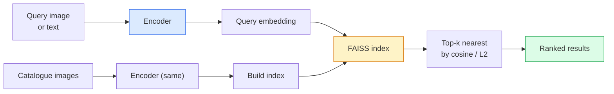

# 图像检索与度量学习

> 检索系统会根据 embedding space 中的距离对候选结果排序。度量学习的任务，是塑造这个空间，让距离表达你想表达的东西。

**类型：** 构建
**语言：** Python
**前置要求：** 阶段 4 第 14 课（ViT），阶段 4 第 18 课（CLIP）
**时间：** ~45 分钟

## 学习目标

- 解释 triplet、contrastive 和 proxy-based metric learning losses，并为给定数据集选择合适方法
- 正确实现 L2-normalisation 和 cosine similarity，并审计“same item”和“same class”检索之间的差异
- 构建 FAISS index，用文本和图片查询，并为 held-out query set 报告 recall@K
- 使用 DINOv2、CLIP 和 SigLIP 作为现成 embedding backbones，并知道每个什么时候赢

## 问题

检索在生产视觉中无处不在：重复检测、反向图片搜索、视觉搜索（“找到类似商品”）、人脸 re-identification、监控中的 person re-ID、电商里的 instance-level matching。产品问题永远一样：“给定这张 query image，给我的 catalogue 排序。”

两个设计决策塑造整个系统。Embedding：哪个模型产生向量。Index：如何大规模寻找 nearest neighbours。到 2026 年二者都已经商品化（embedding 用 DINOv2，index 用 FAISS），这也提高了门槛：难点在于为你的应用定义**什么算相似**，然后塑造 embedding space，让距离与定义匹配。

这种塑造就是 metric learning。它很小，但杠杆很高。

## 概念

### 一眼看懂检索



### 四类 loss family

| Loss | 需要 | 优点 | 缺点 |
|------|----------|------|------|
| **Contrastive** | (anchor, positive) + negatives | 简单，适用于任意 pair label | 没有大量 negatives 时收敛慢 |
| **Triplet** | (anchor, positive, negative) | 直观；直接控制 margin | Hard-triplet mining 昂贵 |
| **NT-Xent / InfoNCE** | Pairs + batch-mined negatives | 能扩展到大 batch | 需要大 batch 或 momentum queue |
| **Proxy-based (ProxyNCA)** | 只有 class labels | 快、稳定、无需 mining | 小数据集上可能 overfit 到 proxies |

对大多数生产用例，从预训练 backbone 开始；只有当现成 embeddings 在你的测试集上表现不佳时，才加入 metric-learning fine-tune。

### Triplet loss 的形式

```
L = max(0, ||f(a) - f(p)||^2 - ||f(a) - f(n)||^2 + margin)
```

把 anchor `a` 拉近 positive `p`，推远 negative `n`，并用 `margin` 确保间隔。三张图片的结构可以推广到任意相似度排序。

Mining 很重要：easy triplets（`n` 已经离 `a` 很远）贡献零 loss；只有 hard triplets 会教网络。Semi-hard mining（`n` 比 `p` 更远但仍在 margin 内）是 2016 年 FaceNet recipe，今天仍然占主导。

### Cosine similarity vs L2

两个指标，两套惯例：

- **Cosine**：向量之间的角度。需要 L2-normalised embeddings。
- **L2**：欧氏距离。可用于 raw 或 normalised embeddings，但通常与 L2-normalised + squared L2 搭配。

对多数现代网络来说二者等价：当 `||a|| = ||b|| = 1` 时，`||a - b||^2 = 2 - 2 cos(a, b)`。选择与你的 embedding training 匹配的约定；混用会静默改变“nearest”的含义。

### Recall@K

标准检索指标：

```
recall@K = fraction of queries where at least one correct match is in the top K results
```

并排报告 recall@1、@5、@10。recall@10 高于 0.95 但 recall@1 低于 0.5，说明 embedding space 结构是对的，但排序有噪声：尝试更长 fine-tune 或 re-ranking step。

对重复检测，precision@K 更重要，因为每个 false positive 都是用户可见错误。对视觉搜索，recall@K 是产品信号。

### 一段话理解 FAISS

Facebook AI Similarity Search。事实上的 nearest-neighbour search 库。三种 index 选择：

- `IndexFlatIP` / `IndexFlatL2`：brute force、精确、无需训练。最多用到 ~1M vectors。
- `IndexIVFFlat`：分成 K 个 cells，只搜索最近的少数 cells。近似、快速、需要训练数据。
- `IndexHNSW`：graph-based，对许多 query 最快，index size 大。

10 万 vectors 大概率用基于 cosine similarity 的 `IndexFlatIP`。1000 万用 `IndexIVFFlat`。1 亿+ 搭配 product quantisation（`IndexIVFPQ`）。

### Instance-level vs category-level retrieval

两个名字相同但完全不同的问题：

- **Category-level**：“在我的 catalogue 里找猫。”Class-conditional similarity；现成 CLIP / DINOv2 embeddings 效果很好。
- **Instance-level**：“在我的 catalogue 里找**这个具体商品**。”需要区分同类中视觉相似的物体；现成 embeddings 表现不足；使用 metric learning fine-tuning 很重要。

选模型前，永远先问你在解决哪一种。

## 构建它

### 第 1 步：Triplet loss

```python
import torch
import torch.nn.functional as F

def triplet_loss(anchor, positive, negative, margin=0.2):
    d_ap = F.pairwise_distance(anchor, positive, p=2)
    d_an = F.pairwise_distance(anchor, negative, p=2)
    return F.relu(d_ap - d_an + margin).mean()
```

一行。适用于 L2-normalised 或 raw embeddings。

### 第 2 步：Semi-hard mining

给定一批 embeddings 和 labels，为每个 anchor 找到最难的 semi-hard negative。

```python
def semi_hard_negatives(emb, labels, margin=0.2):
    dist = torch.cdist(emb, emb)
    same_class = labels[:, None] == labels[None, :]
    diff_class = ~same_class
    N = emb.size(0)

    positives = dist.clone()
    positives[~same_class] = float("-inf")
    positives.fill_diagonal_(float("-inf"))
    pos_idx = positives.argmax(dim=1)

    semi_hard = dist.clone()
    semi_hard[same_class] = float("inf")
    d_ap = dist[torch.arange(N), pos_idx].unsqueeze(1)
    semi_hard[dist <= d_ap] = float("inf")
    neg_idx = semi_hard.argmin(dim=1)

    fallback_mask = semi_hard[torch.arange(N), neg_idx] == float("inf")
    if fallback_mask.any():
        hardest = dist.clone()
        hardest[same_class] = float("inf")
        neg_idx = torch.where(fallback_mask, hardest.argmin(dim=1), neg_idx)
    return pos_idx, neg_idx
```

每个 anchor 得到 class 内最难 positive，以及一个比 positive 更远但仍在 margin 内的 semi-hard negative。

### 第 3 步：Recall@K

```python
def recall_at_k(query_emb, gallery_emb, query_labels, gallery_labels, k=1):
    sim = query_emb @ gallery_emb.T
    _, top_k = sim.topk(k, dim=-1)
    matches = (gallery_labels[top_k] == query_labels[:, None]).any(dim=-1)
    return matches.float().mean().item()
```

在 L2-normalised embeddings 上，按 inner product 取 top-k 等价于按 cosine 取 top-k。报告至少有一个正确 neighbour 的 query 平均比例。

### 第 4 步：串起来

```python
import torch
import torch.nn as nn
from torch.optim import Adam

class Encoder(nn.Module):
    def __init__(self, in_dim=128, emb_dim=64):
        super().__init__()
        self.net = nn.Sequential(
            nn.Linear(in_dim, 128), nn.ReLU(),
            nn.Linear(128, emb_dim),
        )

    def forward(self, x):
        return F.normalize(self.net(x), dim=-1)

torch.manual_seed(0)
num_classes = 6
protos = F.normalize(torch.randn(num_classes, 128), dim=-1)

def sample_batch(bs=32):
    labels = torch.randint(0, num_classes, (bs,))
    x = protos[labels] + 0.15 * torch.randn(bs, 128)
    return x, labels

enc = Encoder()
opt = Adam(enc.parameters(), lr=3e-3)

for step in range(200):
    x, y = sample_batch(32)
    emb = enc(x)
    pos_idx, neg_idx = semi_hard_negatives(emb, y)
    loss = triplet_loss(emb, emb[pos_idx], emb[neg_idx])
    opt.zero_grad(); loss.backward(); opt.step()
```

几百步后，embedding clusters 会形成每个 class 一个 cluster。

## 使用它

2026 年的生产栈：

- **DINOv2 + FAISS**：通用视觉检索。开箱可用。
- **CLIP + FAISS**：当 query 是文本时。
- **Fine-tuned DINOv2 + FAISS**：instance-level retrieval、人脸 re-ID、时尚、电商。
- **Milvus / Weaviate / Qdrant**：围绕 FAISS 或 HNSW 的托管 vector DB wrappers。

SOTA instance retrieval 的 recipe 是：DINOv2 backbone，加 embedding head，用 instance-labelled pairs 上的 triplet 或 InfoNCE loss fine-tune，再放进 FAISS index。

## 交付它

本课产出：

- `outputs/prompt-retrieval-loss-picker.md`：一个 prompt，会为给定检索问题选择 triplet / InfoNCE / ProxyNCA。
- `outputs/skill-recall-at-k-runner.md`：一个 skill，会写出干净的 recall@K evaluation harness，包含 train/val/gallery splits 和正确 data contract。

## 练习

1. **（简单）** 运行上面的 toy example。训练前后用 PCA 画出 embeddings，观察六个 clusters 形成。
2. **（中等）** 添加一个 ProxyNCA loss 实现：每个 class 一个学习到的 “proxy”，在 cosine similarity 上做标准 cross-entropy。和 toy data 上的 triplet loss 比较收敛速度。
3. **（困难）** 取 1,000 张 ImageNet validation images，通过 HuggingFace 用 DINOv2 embed，构建 FAISS flat index，并针对同一批图片作为 queries 报告 recall@{1, 5, 10}（应该是 1.0），再用 ImageNet labels 作为 ground truth，在 held-out split 上报告结果。

## 关键术语

| 术语 | 人们常说 | 实际含义 |
|------|----------------|----------------------|
| Metric learning | “塑造空间” | 训练 encoder，让其输出空间中的距离反映目标相似度 |
| Triplet loss | “拉近推远” | L = max(0, d(a, p) - d(a, n) + margin)；经典 metric-learning loss |
| Semi-hard mining | “有用 negatives” | 比 positive 离 anchor 更远但仍在 margin 内的 negatives；经验上信息量最大 |
| Proxy-based loss | “Class prototypes” | 每个 class 一个学习到的 proxy；对 similarity-to-proxies 做 cross-entropy；无需 pair mining |
| Recall@K | “Top-K 命中率” | top K 中至少有一个正确结果的 query 占比 |
| Instance retrieval | “找到这个确切东西” | 细粒度匹配；现成 features 通常表现不足 |
| FAISS | “NN library” | Facebook 的 nearest-neighbour library；支持精确和近似 indexes |
| HNSW | “Graph index” | Hierarchical navigable small world；内存开销小、速度快的近似 NN |

## 延伸阅读

- [FaceNet: A Unified Embedding for Face Recognition (Schroff et al., 2015)](https://arxiv.org/abs/1503.03832) — triplet loss / semi-hard mining 论文
- [In Defense of the Triplet Loss for Person Re-Identification (Hermans et al., 2017)](https://arxiv.org/abs/1703.07737) — triplet fine-tuning 实用指南
- [FAISS documentation](https://github.com/facebookresearch/faiss/wiki) — 每种 index 和每种取舍
- [SMoT: Metric Learning Taxonomy (Kim et al., 2021)](https://arxiv.org/abs/2010.06927) — 现代 losses 及其联系的综述
