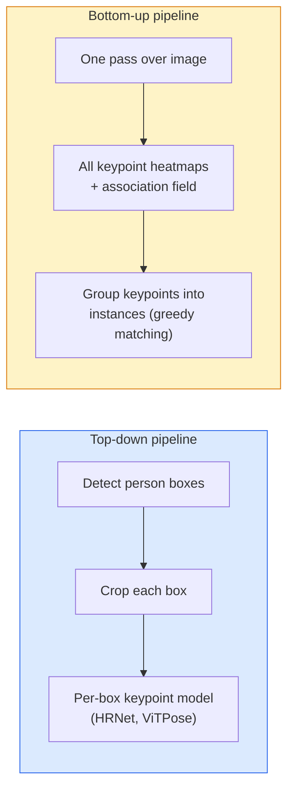

# 关键点检测与姿态估计

> 姿态是一组有序关键点。关键点 detector 是一个 heatmap regressor。其他一切都是 bookkeeping。

**类型：** 构建
**语言：** Python
**前置要求：** 阶段 4 第 06 课（Detection），阶段 4 第 07 课（U-Net）
**时间：** ~45 分钟

## 学习目标

- 区分 top-down 和 bottom-up pose estimation，并说明各自在什么时候使用
- 用 Gaussian-per-keypoint target 为 K 个关键点回归 heatmaps，并在推理时抽取 keypoint coordinates
- 解释 Part Affinity Fields（PAFs），以及 bottom-up pipelines 如何把 keypoints 关联成 instances
- 使用 MediaPipe Pose 或 MMPose 做生产级关键点估计，并理解它们的输出格式

## 问题

关键点任务藏在很多名字下面：人体姿态（17 个身体关节）、face landmarks（68 或 478 个点）、手部（21 个点）、动物姿态、机器人 object pose、医学解剖 landmarks。它们都有同一个结构：检测物体上的 K 个离散点，并输出它们的 `(x, y)` 坐标。

姿态估计是 motion capture、健身 app、体育分析、手势控制、动画、AR 试穿和机器人抓取的基础。2D 情况已经成熟；3D pose（从单相机估计世界坐标中的关节位置）是当前研究前沿。

工程问题是规模。单图单人姿态是一个 20ms 问题。拥挤场景中 30 fps 的多人姿态，是另一个问题，也需要不同架构。

## 概念

### Top-down vs bottom-up



- **Top-down**：先检测人，再对每个 crop 运行 per-person keypoint model。准确率最高；随人数线性扩展。
- **Bottom-up**：一次 forward pass 预测所有 keypoints 和 association field；再分组。无论 crowd size 多大，时间基本恒定。

Top-down（HRNet、ViTPose）是准确率领先者；bottom-up（OpenPose、HigherHRNet）是拥挤场景中的吞吐领先者。

### Heatmap regression

不要直接回归 `(x, y)`，而是为每个 keypoint 预测一个 `H x W` heatmap，其中真值位置中心是一个 Gaussian blob。

```
target[k, y, x] = exp(-((x - cx_k)^2 + (y - cy_k)^2) / (2 sigma^2))
```

推理时，每个 heatmap 的 argmax 就是预测的 keypoint location。

为什么 heatmaps 比直接回归更好：网络的空间结构（conv feature map）天然和空间输出对齐。Gaussian targets 也提供正则化：小定位误差会产生小 loss，而不是直接变成零。

### Sub-pixel localisation

Argmax 给出整数坐标。要做 sub-pixel precision，可以对 argmax 及其邻居拟合抛物线，或使用著名的 offset `(dx, dy) = 0.25 * (heatmap[y, x+1] - heatmap[y, x-1], ...)` 方向。

### Part Affinity Fields（PAFs）

OpenPose 用于 bottom-up association 的技巧。对每对相连关键点（例如 left shoulder 到 left elbow），预测一个 2-channel field，编码从一个点指向另一个点的单位向量。要把 shoulder 和 elbow 关联起来，就沿着候选 pair 的连线积分 PAF；积分最高的 pair 被匹配。

```
For each connection (limb):
  PAF channels: 2 (unit vector x, y)
  Line integral: sum over sample points of (PAF . line_direction)
  Higher integral = stronger match
```

优雅，而且无需 per-person crops 就能扩展到任意 crowd size。

### COCO keypoints

标准 body-pose 数据集：每个人 17 个 keypoints，指标是 PCK（Percentage of Correct Keypoints）和 OKS（Object Keypoint Similarity）。OKS 是 IoU 的关键点类比，也是 COCO mAP@OKS 报告的内容。

### 2D vs 3D

- **2D pose**：图像坐标；已经达到生产质量（MediaPipe、HRNet、ViTPose）。
- **3D pose**：世界 / 相机坐标；仍是活跃研究方向。常见方法：
  - 用小 MLP 把 2D 预测 lift 到 3D（VideoPose3D）。
  - 从图像直接做 3D regression（PyMAF、MHFormer）。
  - 用多视角设置（CMU Panoptic）获得 ground truth。

## 构建它

### 第 1 步：Gaussian heatmap target

```python
import numpy as np
import torch

def gaussian_heatmap(size, cx, cy, sigma=2.0):
    yy, xx = np.meshgrid(np.arange(size), np.arange(size), indexing="ij")
    return np.exp(-((xx - cx) ** 2 + (yy - cy) ** 2) / (2 * sigma ** 2)).astype(np.float32)

hm = gaussian_heatmap(64, 32, 32, sigma=2.0)
print(f"peak: {hm.max():.3f} at ({hm.argmax() % 64}, {hm.argmax() // 64})")
```

沿 channel axis 堆叠 per-keypoint heatmaps，就得到完整 target tensor。

### 第 2 步：Tiny keypoint head

一个 U-Net-style 模型，输出 K 个 heatmap channels。

```python
import torch.nn as nn
import torch.nn.functional as F

class TinyKeypointNet(nn.Module):
    def __init__(self, num_keypoints=4, base=16):
        super().__init__()
        self.down1 = nn.Sequential(nn.Conv2d(3, base, 3, 2, 1), nn.ReLU(inplace=True))
        self.down2 = nn.Sequential(nn.Conv2d(base, base * 2, 3, 2, 1), nn.ReLU(inplace=True))
        self.mid = nn.Sequential(nn.Conv2d(base * 2, base * 2, 3, 1, 1), nn.ReLU(inplace=True))
        self.up1 = nn.ConvTranspose2d(base * 2, base, 2, 2)
        self.up2 = nn.ConvTranspose2d(base, num_keypoints, 2, 2)

    def forward(self, x):
        h1 = self.down1(x)
        h2 = self.down2(h1)
        h3 = self.mid(h2)
        u1 = self.up1(h3)
        return self.up2(u1)
```

输入 `(N, 3, H, W)`，输出 `(N, K, H, W)`。Loss 是对 Gaussian targets 的 per-pixel MSE。

### 第 3 步：Inference：抽取关键点坐标

```python
def heatmap_to_coords(heatmaps):
    """
    heatmaps: (N, K, H, W)
    returns:  (N, K, 2) float coordinates in image pixels
    """
    N, K, H, W = heatmaps.shape
    hm = heatmaps.reshape(N, K, -1)
    idx = hm.argmax(dim=-1)
    ys = (idx // W).float()
    xs = (idx % W).float()
    return torch.stack([xs, ys], dim=-1)

coords = heatmap_to_coords(torch.randn(2, 4, 32, 32))
print(f"coords: {coords.shape}")  # (2, 4, 2)
```

推理时一行完成。要做 sub-pixel refinement，就在 argmax 周围插值。

### 第 4 步：Synthetic keypoint dataset

很简单：在白色画布上画四个点，学习预测它们。

```python
def make_synthetic_sample(size=64):
    img = np.ones((3, size, size), dtype=np.float32)
    rng = np.random.default_rng()
    kps = rng.integers(8, size - 8, size=(4, 2))
    for cx, cy in kps:
        img[:, cy - 2:cy + 2, cx - 2:cx + 2] = 0.0
    hms = np.stack([gaussian_heatmap(size, cx, cy) for cx, cy in kps])
    return img, hms, kps
```

足够简单，小模型一分钟内就能学会。

### 第 5 步：训练

```python
model = TinyKeypointNet(num_keypoints=4)
opt = torch.optim.Adam(model.parameters(), lr=3e-3)

for step in range(200):
    batch = [make_synthetic_sample() for _ in range(16)]
    imgs = torch.from_numpy(np.stack([b[0] for b in batch]))
    hms = torch.from_numpy(np.stack([b[1] for b in batch]))
    pred = model(imgs)
    # Upsample pred to full resolution
    pred = F.interpolate(pred, size=hms.shape[-2:], mode="bilinear", align_corners=False)
    loss = F.mse_loss(pred, hms)
    opt.zero_grad(); loss.backward(); opt.step()
```

## 使用它

- **MediaPipe Pose**：Google 的生产级 pose estimator；提供 WebGL + mobile runtimes，延迟低于 10ms。
- **MMPose**（OpenMMLab）：全面的研究代码库；每个 SOTA 架构都有 pretrained weights。
- **YOLOv8-pose**：最快的实时多人 pose，一次 forward pass。
- **transformers HumanDPT / PoseAnything**：更新的 vision-language 方法，用于 open-vocabulary pose（任意物体、任意 keypoint set）。

## 交付它

本课产出：

- `outputs/prompt-pose-stack-picker.md`：一个 prompt，会根据 latency、crowd size 和 2D vs 3D 需求选择 MediaPipe / YOLOv8-pose / HRNet / ViTPose。
- `outputs/skill-heatmap-to-coords.md`：一个 skill，会写出每个生产 pose model 都会用到的 sub-pixel heatmap-to-coordinate routine。

## 练习

1. **（简单）** 在 synthetic 4-point dataset 上训练 tiny keypoint model。报告 200 steps 后预测 keypoints 与真实 keypoints 的 mean L2 error。
2. **（中等）** 添加 sub-pixel refinement：给定 argmax 位置，从邻近像素沿 x 和 y 拟合 1D parabola。报告相对于 integer argmax 的准确率提升。
3. **（困难）** 构建一个 2-person synthetic dataset，每张图片显示两个 4-keypoint pattern 的 instances。训练一个带 PAFs 的 bottom-up pipeline，预测哪个 keypoint 属于哪个 instance，并评估 OKS。

## 关键术语

| 术语 | 人们常说 | 实际含义 |
|------|----------------|----------------------|
| Keypoint | “landmark” | 物体上的一个特定有序点（关节、角点、特征点） |
| Pose | “skeleton” | 属于一个 instance 的有序 keypoints 集合 |
| Top-down | “先检测再姿态” | 两阶段 pipeline：person detector + per-crop keypoint model；准确率最高 |
| Bottom-up | “先姿态后分组” | 单次 pass 预测所有 keypoints + grouping；时间不随 crowd size 增长 |
| Heatmap | “Gaussian target” | 每个 keypoint 一个 H x W tensor，真值位置处有 peak；首选 regression target |
| PAF | “Part Affinity Field” | 编码 limb directions 的 2-channel unit vector field；用于把 keypoints 分组成 instances |
| OKS | “Keypoint IoU” | Object Keypoint Similarity；COCO 的 pose 指标 |
| HRNet | “High-Resolution Net” | 主导 top-down keypoint 的架构；始终保留 high-res features |

## 延伸阅读

- [OpenPose (Cao et al., 2017)](https://arxiv.org/abs/1812.08008) — 使用 PAFs 的 bottom-up 方法；仍然是该方法的最佳说明
- [HRNet (Sun et al., 2019)](https://arxiv.org/abs/1902.09212) — top-down 参考架构
- [ViTPose (Xu et al., 2022)](https://arxiv.org/abs/2204.12484) — 把普通 ViT 用作 pose backbone；很多 benchmark 上的当前 SOTA
- [MediaPipe Pose](https://developers.google.com/mediapipe/solutions/vision/pose_landmarker) — 生产级实时 pose；2026 年部署最快的 stack
