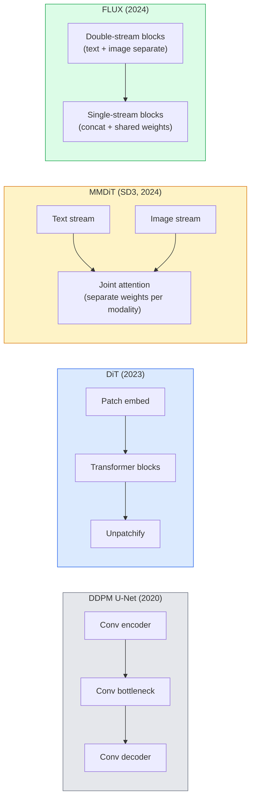

# Diffusion Transformers 与 Rectified Flow

> U-Net 不是 diffusion 的秘密。把它换成 transformer，把 noise schedule 换成直线路径 flow，你就突然拥有了 SD3、FLUX，以及 2026 年每个 text-to-image 模型。

**类型：** 学习 + 构建
**语言：** Python
**前置要求：** 阶段 4 第 10 课（Diffusion DDPM），阶段 4 第 14 课（ViT），阶段 7 第 02 课（Self-Attention）
**时间：** ~75 分钟

## 学习目标

- 追踪从 U-Net DDPM（第 10 课）到 Diffusion Transformer（DiT）、MMDiT（SD3）和 single+double-stream DiT（FLUX）的演进
- 解释 rectified flow：为什么 noise 和 data 之间的直线路径让模型能用 20 步而不是 1000 步采样
- 实现一个 tiny DiT block 和一个 rectified-flow training loop，二者都控制在 100 行以内
- 按架构、参数量和许可区分模型变体（SD3、FLUX.1-dev、FLUX.1-schnell、Z-Image、Qwen-Image）

## 问题

第 10 课用 U-Net denoiser 构建了 DDPM。这个 recipe 主导了 2020-2023：U-Net + beta schedule + noise-prediction loss。它产生了 Stable Diffusion 1.5、2.1 和 DALL-E 2。

到 2026 年，每个 state-of-the-art text-to-image 模型都已经越过它。Stable Diffusion 3、FLUX、SD4、Z-Image、Qwen-Image、Hunyuan-Image 都不使用 U-Net。它们使用 Diffusion Transformers（DiT）。SD3 和 FLUX 还把 DDPM noise schedule 换成 rectified flow，把从 noise 到 data 的路径拉直，并通过 consistency 或 distilled variants 支持 1-4 步推理。

这个转变很重要，因为它解释了为什么基于 diffusion 的图像生成变得可控、prompt-accurate（SD3/SD4 解决了文本渲染）并且足够快进入生产。理解 DiT + rectified flow，就是理解 2026 年 generative-image stack。

## 概念

### 从 U-Net 到 transformer



- **DiT**（Peebles & Xie, 2023）：把 U-Net 替换成作用在 latent patches 上的 ViT-like transformer。通过 adaptive layer norm（AdaLN）做 conditioning。
- **MMDiT**（SD3，Esser et al., 2024）：text 和 image tokens 有两条 stream，权重分离，共享 joint attention。
- **FLUX**（Black Forest Labs, 2024）：前 N 个 blocks 像 SD3 一样 double-stream，后续 blocks concat 并共享权重（single-stream），提升高深度下的效率。
- **Z-Image**（2025）：6B 参数的高效 single-stream DiT，挑战“无脑堆 scale”的路线。

### 一段话理解 rectified flow

DDPM 把 forward process 定义为一个 noisy SDE，`x_t` 会逐渐被腐蚀。学习到的 reverse 是第二个 SDE，需要 1000 个小步求解。

Rectified flow 定义的是 clean data 和 pure noise 之间的**直线**插值：

```
x_t = (1 - t) * x_0 + t * epsilon,     t in [0, 1]
```

训练一个网络预测 velocity `v_theta(x_t, t) = epsilon - x_0`，也就是从 clean data 到 noise 的直线路径上的 forward direction（`dx_t/dt`）。采样时，你把这个 velocity 反向积分，从 noise 走向 data。得到的 ODE 更接近直线，因此采样所需的积分步数少得多。

SD3 把它称为 **Rectified Flow Matching**。FLUX、Z-Image 和大多数 2026 模型都使用同一目标。典型推理：20-30 Euler steps（确定性），而旧 DDPM regime 中 DDIM 需要 50+ steps。Distilled / turbo / schnell / LCM variants 会进一步降到 1-4 steps。

### AdaLN conditioning

DiT 通过 **adaptive layer norm** 对 timestep 和 class/text 做 conditioning：从 conditioning vector 预测 `scale` 和 `shift`，并在 LayerNorm 后应用。它比 U-Net 里的 FiLM-style modulation 更干净，也是每个现代 DiT 的默认做法。

```
cond -> MLP -> (scale, shift, gate)
norm(x) * (1 + scale) + shift, then residual add * gate
```

### SD3 和 FLUX 中的文本 encoder

- **SD3** 使用三个 text encoders：两个 CLIP models + T5-XXL。Embeddings 拼接后作为 text conditioning 输入 image stream。
- **FLUX** 使用一个 CLIP-L + T5-XXL。
- **Qwen-Image / Z-Image** variants 使用与其 base LLM 对齐的自研 text encoders。

Text encoder 是 SD3/FLUX 比 SD1.5 更能理解 prompts 的重要原因。仅 T5-XXL 就有 4.7B 参数。

### Classifier-free guidance 仍然成立

Rectified flow 改变 sampler，而不改变 conditioning。Classifier-free guidance（训练时以 10% 概率丢弃文本，推理时混合 conditional 和 unconditional predictions）在 rectified flow 中同样工作。多数 2026 模型使用 guidance scale 3.5-5，比 SD1.5 的 7.5 更低，因为 rectified-flow 模型默认更紧密地跟随 prompt。

### Consistency、Turbo、Schnell、LCM

四个名字讲的是同一个想法：把慢的多步模型 distil 成快的少步模型。

- **LCM（Latent Consistency Model）**：训练一个 student，从任意中间 `x_t` 一步预测最终 `x_0`。
- **SDXL Turbo / FLUX schnell**：用 adversarial diffusion distillation 训练出的 1-4 step 模型。
- **SD Turbo**：适配到 latent diffusion 的 OpenAI-style Consistency Models。

任何新模型的生产 serving 通常同时交付“full quality”checkpoint 和“turbo / schnell”variant。Schnell（德语“fast”，Black Forest Labs 的命名约定）运行 1-4 steps，适合实时 pipelines。

### 2026 年模型版图

| Model | Size | Architecture | License |
|-------|------|--------------|---------|
| Stable Diffusion 3 Medium | 2B | MMDiT | SAI Community |
| Stable Diffusion 3.5 Large | 8B | MMDiT | SAI Community |
| FLUX.1-dev | 12B | Double + Single Stream DiT | non-commercial |
| FLUX.1-schnell | 12B | same, distilled | Apache 2.0 |
| FLUX.2 | — | iterated FLUX.1 | mixed |
| Z-Image | 6B | S3-DiT (Scalable Single-Stream) | permissive |
| Qwen-Image | ~20B | DiT + Qwen text tower | Apache 2.0 |
| Hunyuan-Image-3.0 | ~80B | DiT | research |
| SD4 Turbo | 3B | DiT + distillation | SAI Commercial |

FLUX.1-schnell 是 2026 年开源默认选择。Z-Image 是效率领先者。FLUX.2 和 SD4 是当前质量尖端。

### 为什么这个阶段迁移重要

DDPM + U-Net 有效。DiT + rectified flow **更好、更快，并且更干净地扩展**。这场迁移类似 NLP 中从 RNN 到 transformer 的迁移：两种架构解决同一个问题，但 transformer 更能 scale，因此成为主导。2026 年每篇图像、视频或 3D generation 论文都使用 DiT-shaped denoiser，通常也使用 rectified flow objective。U-Net DDPM 现在主要是教学工具（第 10 课）。

## 构建它

### 第 1 步：带 AdaLN 的 DiT block

```python
import torch
import torch.nn as nn


class AdaLNZero(nn.Module):
    """
    Adaptive LayerNorm with a gate. Predicts (scale, shift, gate) from the conditioning.
    Init such that the whole block starts as identity ("zero init").
    """

    def __init__(self, dim, cond_dim):
        super().__init__()
        self.norm = nn.LayerNorm(dim, elementwise_affine=False)
        self.mlp = nn.Linear(cond_dim, dim * 3)
        nn.init.zeros_(self.mlp.weight)
        nn.init.zeros_(self.mlp.bias)

    def forward(self, x, cond):
        scale, shift, gate = self.mlp(cond).chunk(3, dim=-1)
        h = self.norm(x) * (1 + scale.unsqueeze(1)) + shift.unsqueeze(1)
        return h, gate.unsqueeze(1)


class DiTBlock(nn.Module):
    def __init__(self, dim=192, heads=3, mlp_ratio=4, cond_dim=192):
        super().__init__()
        self.adaln1 = AdaLNZero(dim, cond_dim)
        self.attn = nn.MultiheadAttention(dim, heads, batch_first=True)
        self.adaln2 = AdaLNZero(dim, cond_dim)
        self.mlp = nn.Sequential(
            nn.Linear(dim, dim * mlp_ratio),
            nn.GELU(),
            nn.Linear(dim * mlp_ratio, dim),
        )

    def forward(self, x, cond):
        h, gate1 = self.adaln1(x, cond)
        a, _ = self.attn(h, h, h, need_weights=False)
        x = x + gate1 * a
        h, gate2 = self.adaln2(x, cond)
        x = x + gate2 * self.mlp(h)
        return x
```

`AdaLNZero` 一开始是 identity mapping，因为它的 MLP weights 初始化为零。训练会把 block 从 identity 慢慢推开；这会显著稳定深层 transformer diffusion models。

### 第 2 步：一个 tiny DiT

```python
def timestep_embedding(t, dim):
    import math
    half = dim // 2
    freqs = torch.exp(-math.log(10000) * torch.arange(half, device=t.device) / half)
    args = t[:, None].float() * freqs[None]
    return torch.cat([args.sin(), args.cos()], dim=-1)


class TinyDiT(nn.Module):
    def __init__(self, image_size=16, patch_size=2, in_channels=3, dim=96, depth=4, heads=3):
        super().__init__()
        self.patch_size = patch_size
        self.num_patches = (image_size // patch_size) ** 2
        self.patch = nn.Conv2d(in_channels, dim, kernel_size=patch_size, stride=patch_size)
        self.pos = nn.Parameter(torch.zeros(1, self.num_patches, dim))
        self.time_mlp = nn.Sequential(
            nn.Linear(dim, dim * 2),
            nn.SiLU(),
            nn.Linear(dim * 2, dim),
        )
        self.blocks = nn.ModuleList([DiTBlock(dim, heads, cond_dim=dim) for _ in range(depth)])
        self.norm_out = nn.LayerNorm(dim, elementwise_affine=False)
        self.head = nn.Linear(dim, patch_size * patch_size * in_channels)

    def forward(self, x, t):
        n = x.size(0)
        x = self.patch(x)
        x = x.flatten(2).transpose(1, 2) + self.pos
        t_emb = self.time_mlp(timestep_embedding(t, self.pos.size(-1)))
        for blk in self.blocks:
            x = blk(x, t_emb)
        x = self.norm_out(x)
        x = self.head(x)
        return self._unpatchify(x, n)

    def _unpatchify(self, x, n):
        p = self.patch_size
        h = w = int(self.num_patches ** 0.5)
        x = x.view(n, h, w, p, p, -1).permute(0, 5, 1, 3, 2, 4).reshape(n, -1, h * p, w * p)
        return x
```

### 第 3 步：Rectified flow training

```python
import torch.nn.functional as F

def rectified_flow_train_step(model, x0, optimizer, device):
    model.train()
    x0 = x0.to(device)
    n = x0.size(0)
    t = torch.rand(n, device=device)
    epsilon = torch.randn_like(x0)
    x_t = (1 - t[:, None, None, None]) * x0 + t[:, None, None, None] * epsilon

    target_velocity = epsilon - x0
    pred_velocity = model(x_t, t)

    loss = F.mse_loss(pred_velocity, target_velocity)
    optimizer.zero_grad()
    loss.backward()
    optimizer.step()
    return loss.item()
```

和 DDPM 的 noise-prediction loss（第 10 课）相比：结构相同，target 不同。我们不是预测噪声 `epsilon`，而是预测 **velocity** `epsilon - x_0`，它沿着直线插值从 data 指向 noise。

### 第 4 步：Euler sampler

Rectified flow 是一个 ODE。Euler method 最简单；对训练良好的 rectified-flow model 来说，20+ steps 时几乎和高阶 solver 一样准确。

```python
@torch.no_grad()
def rectified_flow_sample(model, shape, steps=20, device="cpu"):
    model.eval()
    x = torch.randn(shape, device=device)
    dt = 1.0 / steps
    t = torch.ones(shape[0], device=device)
    for _ in range(steps):
        v = model(x, t)
        x = x - dt * v
        t = t - dt
    return x
```

20 steps。对训练好的模型，它产生的 samples 可与 1000-step DDPM 相比。

### 第 5 步：端到端 smoke test

```python
import numpy as np

def synthetic_blobs(num=200, size=16, seed=0):
    rng = np.random.default_rng(seed)
    out = np.zeros((num, 3, size, size), dtype=np.float32)
    yy, xx = np.meshgrid(np.arange(size), np.arange(size), indexing="ij")
    for i in range(num):
        cx, cy = rng.uniform(4, size - 4, size=2)
        r = rng.uniform(2, 4)
        mask = (xx - cx) ** 2 + (yy - cy) ** 2 < r ** 2
        colour = rng.uniform(-1, 1, size=3)
        for c in range(3):
            out[i, c][mask] = colour[c]
    return torch.from_numpy(out)
```

用 rectified flow 在这个数据上训练 `TinyDiT`。500 steps 后，sampled outputs 应该像淡淡的彩色 blobs。

## 使用它

真实图像生成中，`diffusers` 对 FLUX / SD3 / Z-Image 都提供统一 API：

```python
from diffusers import FluxPipeline, StableDiffusion3Pipeline
import torch

pipe = FluxPipeline.from_pretrained(
    "black-forest-labs/FLUX.1-schnell",
    torch_dtype=torch.bfloat16,
).to("cuda")

out = pipe(
    prompt="a golden retriever surfing a tsunami, hyperrealistic, studio lighting",
    guidance_scale=0.0,           # schnell was trained without CFG
    num_inference_steps=4,
    max_sequence_length=256,
).images[0]
out.save("surf.png")
```

三行。`FLUX.1-schnell` 四步出图。把 model id 换成 `black-forest-labs/FLUX.1-dev`，可以在 20-30 steps 和 CFG 下获得更高质量。

对 SD3：

```python
pipe = StableDiffusion3Pipeline.from_pretrained(
    "stabilityai/stable-diffusion-3.5-large",
    torch_dtype=torch.bfloat16,
).to("cuda")
out = pipe(prompt, guidance_scale=3.5, num_inference_steps=28).images[0]
```

## 交付它

本课产出：

- `outputs/prompt-dit-model-picker.md`：根据 quality、latency 和 license constraints，在 SD3、FLUX.1-dev、FLUX.1-schnell、Z-Image、SD4 Turbo 之间选择。
- `outputs/skill-rectified-flow-trainer.md`：写出完整 rectified flow training loop，包含 AdaLN DiT 和 Euler sampling。

## 练习

1. **（简单）** 在 synthetic blob dataset 上训练上面的 TinyDiT 500 steps。比较 10、20 和 50 个 Euler steps 生成的 samples。
2. **（中等）** 通过把 learned class embedding 拼到 time embedding 上添加 text conditioning（按颜色分 10 个 blob “classes”）。对 class 0、5 和 9 采样，并验证颜色匹配。
3. **（困难）** 在同样数据、同样网络大小、同样训练步数下，计算 rectified-flow 和 DDPM 版本生成 samples 之间的 Fréchet distance（FID proxy）。报告哪个收敛更快。

## 关键术语

| 术语 | 人们常说 | 实际含义 |
|------|----------------|----------------------|
| DiT | “Diffusion transformer” | 替代 U-Net 作为 diffusion denoiser 的 transformer；作用在 patchified latents 上 |
| AdaLN | “Adaptive layer norm” | 通过 learned scale、shift、gate 在 LayerNorm 后应用 timestep/text conditioning；每个现代 DiT 的标准 |
| MMDiT | “Multi-modal DiT (SD3)” | text 和 image tokens 使用分离权重 stream，并共享 joint self-attention |
| Single-stream / double-stream | “FLUX trick” | 前 N 个 blocks double-stream（每个 modality 分离权重），后续 single-stream（concat + shared weights）以提升效率 |
| Rectified flow | “Straight-line noise-to-data” | data 和 noise 之间的线性插值；网络预测 velocity；推理所需 ODE steps 更少 |
| Velocity target | “epsilon - x_0” | rectified flow 中的 regression target；从 clean data 指向 noise |
| CFG guidance | “classifier-free guidance” | 混合 conditional 和 unconditional predictions；仍用于 rectified-flow models |
| Schnell / turbo / LCM | “1-4 step distillation” | 从 full-quality models 蒸馏出的少步 variants；生产实时使用 |

## 延伸阅读

- [Scalable Diffusion Models with Transformers (Peebles & Xie, 2023)](https://arxiv.org/abs/2212.09748) — DiT 论文
- [Scaling Rectified Flow Transformers (Esser et al., SD3 paper)](https://arxiv.org/abs/2403.03206) — 大规模 MMDiT 与 rectified-flow
- [FLUX.1 model card and technical report (Black Forest Labs)](https://huggingface.co/black-forest-labs/FLUX.1-dev) — double + single-stream 细节
- [Z-Image: Efficient Image Generation Foundation Model (2025)](https://arxiv.org/html/2511.22699v1) — 6B single-stream DiT
- [Elucidating the Design Space of Diffusion (Karras et al., 2022)](https://arxiv.org/abs/2206.00364) — 每个 diffusion 设计取舍的参考
- [Latent Consistency Models (Luo et al., 2023)](https://arxiv.org/abs/2310.04378) — LCM-LoRA 如何提供 4-step inference
