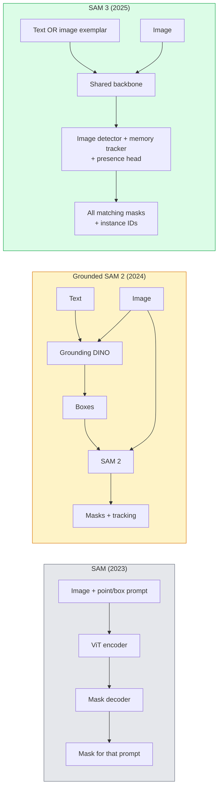

# SAM 3 与开放词表分割

> 给模型一个文本 prompt 和一张图片，就能得到每个匹配物体的 masks。SAM 3 把这件事变成了一次 forward pass。

**类型：** 使用 + 构建
**语言：** Python
**前置要求：** 阶段 4 第 07 课（U-Net），阶段 4 第 08 课（Mask R-CNN），阶段 4 第 18 课（CLIP）
**时间：** ~60 分钟

## 学习目标

- 区分 SAM（只支持 visual prompts）、Grounded SAM / SAM 2（detector + SAM）和 SAM 3（通过 Promptable Concept Segmentation 原生支持 text prompts）
- 解释 SAM 3 架构：shared backbone + image detector + memory-based video tracker + presence head + decoupled detector-tracker design
- 使用 Hugging Face `transformers` 的 SAM 3 集成做 text-prompted detection、segmentation 和 video tracking
- 根据 latency、concept complexity 和 deployment target，在 SAM 3、Grounded SAM 2、YOLO-World 和 SAM-MI 之间选择

## 问题

2023 年的 SAM 是一个只支持 visual-prompt 的模型：你点击一个点或画一个 box，它返回一个 mask。想做“给我这张照片里所有橙子”，你需要一个 detector（Grounding DINO）产生 boxes，然后用 SAM 分割每一个。Grounded SAM 把这做成了 pipeline，但它是两个冻结模型的级联，错误累积不可避免。

SAM 3（Meta，2025 年 11 月，ICLR 2026）折叠了这个级联。它接受短 noun phrase 或 image exemplar 作为 prompt，并在一次 forward pass 中返回所有匹配的 masks 和 instance IDs。这就是 **Promptable Concept Segmentation（PCS）**。结合 2026 年 3 月 Object Multiplex 更新（SAM 3.1），它能高效追踪视频中同一 concept 的多个 instances。

本课关注的是这个结构性转变。2D segmentation、detection 和 text-image grounding 已经合并成一个模型。生产问题不再是“我要把哪些 pipeline 串起来”，而是“哪个 promptable model 能端到端处理我的用例”。

## 概念

### 三代模型



### Promptable Concept Segmentation

“Concept prompt” 是一个短 noun phrase（`"yellow school bus"`、`"striped red umbrella"`、`"hand holding a mug"`）或一个 image exemplar。模型会返回图像中每个匹配该 concept 的 instance segmentation masks，并给每个 match 一个唯一 instance ID。

它与经典 visual-prompt SAM 有三个不同：

1. 不需要逐 instance prompt：一个 text prompt 返回所有 matches。
2. Open-vocabulary：concept 可以是自然语言可描述的任何东西。
3. 一次返回多个 instances，而不是每个 prompt 返回一个 mask。

### 关键架构组件

- **Shared backbone**：单个 ViT 处理图像。Detector head 和 memory-based tracker 都读取它的 features。
- **Presence head**：预测 concept 是否存在于图像中。把“这里有没有？”和“在哪里？”解耦。减少 absent concepts 上的 false positives。
- **Decoupled detector-tracker**：image-level detection 和 video-level tracking 有独立 heads，避免互相干扰。
- **Memory bank**：跨 frames 存储 per-instance features，用于 video tracking（与 SAM 2 使用的机制相同）。

### 大规模训练

SAM 3 在 **400 万个 unique concepts** 上训练，这些 concepts 由一个数据引擎生成：AI + human review 迭代标注和修正。新的 **SA-CO benchmark** 包含 270K unique concepts，比之前 benchmarks 大 50 倍。SAM 3 在 SA-CO 上达到人类表现的 75-80%，并在 image + video PCS 上把现有系统翻倍。

### SAM 3.1 Object Multiplex

2026 年 3 月更新：**Object Multiplex** 引入了 shared-memory 机制，用于联合追踪同一 concept 的多个 instances。以前追踪 N 个 instances 意味着 N 个独立 memory banks。Multiplex 把它折叠成一个 shared memory 加 per-instance queries。结果：多 object tracking 明显更快，且不牺牲准确率。

### 2026 年 Grounded SAM 仍然重要的场景

- 当你需要换入某个特定 open-vocabulary detector（DINO-X、Florence-2）。
- 当 SAM 3 license（HF 上 gated）是 blocker。
- 当你需要比 SAM 3 暴露的 detector threshold 更细控制。
- 做 detector component 的 research / ablation。

模块化 pipelines 仍有位置。对多数生产工作，SAM 3 是更简单的答案。

### YOLO-World vs SAM 3

- **YOLO-World**：仅 open-vocabulary detector（无 masks）。实时。适合高 fps boxes。
- **SAM 3**：完整 segmentation + tracking。更慢，但输出更丰富。

生产切分：快速 detection-only pipelines（机器人导航、快速 dashboards）用 YOLO-World；任何需要 masks 或 tracking 的场景用 SAM 3。

### SAM-MI 效率

SAM-MI（2025-2026）解决 SAM 的 decoder bottleneck。关键想法：

- **Sparse point prompting**：使用少数精心选择的点，而不是 dense prompts；decoder calls 减少 96%。
- **Shallow mask aggregation**：把粗糙 mask predictions 合成一个更锐利的 mask。
- **Decoupled mask injection**：decoder 接收预计算 mask features，而不是重新运行。

结果：在 open-vocabulary benchmarks 上相对 Grounded-SAM 约 1.6 倍提速。

### 三类模型的输出格式

它们都返回同一种大体结构（boxes + labels + scores + masks + IDs），这很有帮助：你的下游 pipeline 不必按运行了哪个模型分支。

## 构建它

### 第 1 步：Prompt construction

构建一个 helper，把用户句子变成 SAM 3 concept prompts 列表。这是“用户输入”和“模型消费内容”的边界。

```python
def split_concepts(sentence):
    """
    Heuristic splitter for multi-concept prompts.
    Returns list of short noun phrases.
    """
    for sep in [",", ";", "and", "or", "&"]:
        if sep in sentence:
            parts = [p.strip() for p in sentence.replace("and ", ",").split(",")]
            return [p for p in parts if p]
    return [sentence.strip()]

print(split_concepts("cats, dogs and balloons"))
```

SAM 3 每次 forward pass 接受一个 concept；对 multi-concept queries，可以 loop 或 batch。

### 第 2 步：Post-processing helpers

把 SAM 3 的 raw outputs 转成干净的 detections 列表，匹配阶段 4 第 16 课的 pipeline contract。

```python
from dataclasses import dataclass
from typing import List

@dataclass
class ConceptDetection:
    concept: str
    instance_id: int
    box: tuple          # (x1, y1, x2, y2)
    score: float
    mask_rle: str       # run-length encoded


def rle_encode(binary_mask):
    flat = binary_mask.flatten().astype("uint8")
    runs = []
    prev, count = flat[0], 0
    for v in flat:
        if v == prev:
            count += 1
        else:
            runs.append((int(prev), count))
            prev, count = v, 1
    runs.append((int(prev), count))
    return ";".join(f"{v}x{c}" for v, c in runs)
```

即使有很多高分辨率 masks，RLE 也能让 response payload 保持小。SAM 2、SAM 3、Grounded SAM 2 都可以使用同一格式。

### 第 3 步：统一 open-vocab segmentation interface

把你拥有的任何 backend（SAM 3、Grounded SAM 2、YOLO-World + SAM 2）包装到一个方法后面。Backend 变化时，下游代码不变。

```python
from abc import ABC, abstractmethod
import numpy as np

class OpenVocabSeg(ABC):
    @abstractmethod
    def detect(self, image: np.ndarray, concept: str) -> List[ConceptDetection]:
        ...


class StubOpenVocabSeg(OpenVocabSeg):
    """
    Deterministic stub used for pipeline testing when real models are not loaded.
    """
    def detect(self, image, concept):
        h, w = image.shape[:2]
        return [
            ConceptDetection(
                concept=concept,
                instance_id=0,
                box=(w * 0.2, h * 0.3, w * 0.5, h * 0.8),
                score=0.89,
                mask_rle="0x100;1x50;0x200",
            ),
            ConceptDetection(
                concept=concept,
                instance_id=1,
                box=(w * 0.55, h * 0.25, w * 0.85, h * 0.75),
                score=0.74,
                mask_rle="0x80;1x40;0x220",
            ),
        ]
```

真实的 `SAM3OpenVocabSeg` subclass 会包装 `transformers.Sam3Model` 和 `Sam3Processor`。

### 第 4 步：Hugging Face SAM 3 usage（reference）

实际模型的 `transformers` 集成：

```python
from transformers import Sam3Processor, Sam3Model
import torch

processor = Sam3Processor.from_pretrained("facebook/sam3")
model = Sam3Model.from_pretrained("facebook/sam3").eval()

inputs = processor(images=pil_image, return_tensors="pt")
inputs = processor.set_text_prompt(inputs, "yellow school bus")

with torch.no_grad():
    outputs = model(**inputs)

masks = processor.post_process_masks(
    outputs.masks, inputs.original_sizes, inputs.reshaped_input_sizes
)
boxes = outputs.boxes
scores = outputs.scores
```

一个 prompt，所有 matches 在一次 call 中返回。

### 第 5 步：测量 Grounded SAM 2 曾经免费给你的东西

一个诚实的 benchmark：当你在真实 pipeline 中把 Grounded SAM 2 换成 SAM 3，会发生什么？

- Latency：SAM 3 省掉一次 forward pass（没有单独 detector），但模型本身更重；通常净效果持平或略快。
- Accuracy：SAM 3 在 rare 或 compositional concepts（"striped red umbrella"）上明显更好。常见单词 concepts 上类似。
- Flexibility：Grounded SAM 2 允许你换 detectors（DINO-X、Florence-2、Grounding DINO 1.5）；SAM 3 是 monolithic。

结论：SAM 3 是 2026 年 open-vocab seg 默认选择。当你需要 detector flexibility 或不同 license terms 时，Grounded SAM 2 仍然正确。

## 使用它

生产部署模式：

- **Real-time annotation**：SAM 3 + CVAT 的 label-as-text-prompt feature。标注员选择 label name；SAM 3 预标注所有匹配 instances。人工 review 和修正。
- **Video analytics**：SAM 3.1 Object Multiplex 做 multi-object tracking；把 frames 喂给 memory-based tracker。
- **Robotics**：SAM 3 做 open-vocab manipulation（"pick up the red cup"）；作为 planning primitive 运行。
- **Medical imaging**：在 medical concepts 上 fine-tune SAM 3；需要 HF access request。

Ultralytics 在 Python package 中包装了 SAM 3：

```python
from ultralytics import SAM

model = SAM("sam3.pt")
results = model(image_path, prompts="yellow school bus")
```

接口和 YOLO、SAM 2 相同。

## 交付它

本课产出：

- `outputs/prompt-open-vocab-stack-picker.md`：一个 prompt，会根据 latency、concept complexity 和 licensing 选择 SAM 3 / Grounded SAM 2 / YOLO-World / SAM-MI。
- `outputs/skill-concept-prompt-designer.md`：一个 skill，会把用户话语转成格式良好的 SAM 3 concept prompts（splitting、disambiguation、fallbacks）。

## 练习

1. **（简单）** 在 10 张图片上用你选择的 concept prompts 运行 SAM 3。在同一批图片上与 SAM 2 + Grounding DINO 1.5 比较。报告每个模型错过了哪些 concepts。
2. **（中等）** 在 SAM 3 上构建一个“click-to-include / click-to-exclude” UI：text prompt 返回 candidate instances；用户点击保留哪些算 positive。把最终 concept set 输出为 JSON。
3. **（困难）** 在一个 custom concept set（例如 5 种电子元件）上 fine-tune SAM 3，每类 20 张 labelled images。在同一个 test set 上与 zero-shot SAM 3 比较；测量 mask IoU improvement。

## 关键术语

| 术语 | 人们常说 | 实际含义 |
|------|----------------|----------------------|
| Open-vocabulary segmentation | “按文本分割” | 为自然语言描述的 objects 产生 masks，而不是固定 label set |
| PCS | “Promptable Concept Segmentation” | SAM 3 的核心任务：给定 noun-phrase 或 image exemplar，分割所有匹配 instances |
| Concept prompt | “文本输入” | 短 noun phrase 或 image exemplar；不是完整句子 |
| Presence head | “这里有没有？” | SAM 3 模块，在 localisation 前判断 concept 是否存在于图像中 |
| SA-CO | “SAM 3 benchmark” | 270K-concept open-vocabulary segmentation benchmark；比以前 open-vocab benchmarks 大 50 倍 |
| Object Multiplex | “SAM 3.1 update” | Shared-memory multi-object tracking；快速联合追踪多个 instances |
| Grounded SAM 2 | “模块化 pipeline” | Detector + SAM 2 级联；当 detector swap 很重要时仍然相关 |
| SAM-MI | “高效 SAM variant” | Mask Injection，相对 Grounded-SAM 提速 1.6x |

## 延伸阅读

- [SAM 3: Segment Anything with Concepts (arXiv 2511.16719)](https://arxiv.org/abs/2511.16719)
- [SAM 3.1 Object Multiplex (Meta AI, March 2026)](https://ai.meta.com/blog/segment-anything-model-3/)
- [SAM 3 model page on Hugging Face](https://huggingface.co/facebook/sam3)
- [Grounded SAM 2 tutorial (PyImageSearch)](https://pyimagesearch.com/2026/01/19/grounded-sam-2-from-open-set-detection-to-segmentation-and-tracking/)
- [Ultralytics SAM 3 docs](https://docs.ultralytics.com/models/sam-3/)
- [SAM3-I: Instruction-aware SAM (arXiv 2512.04585)](https://arxiv.org/abs/2512.04585)
