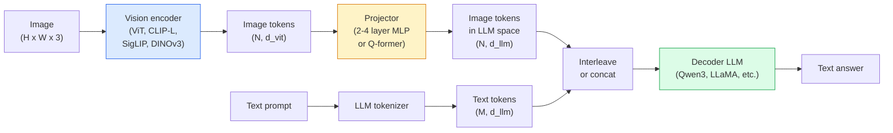

# 视觉语言模型：ViT-MLP-LLM 模式

> 视觉 encoder 把图像转换成 tokens。MLP projector 把这些 tokens 映射到 LLM 的 embedding space。语言模型完成剩下的工作。这个模式，也就是 ViT-MLP-LLM，是 2026 年每个生产 VLM 的形状。

**类型：** 学习 + 使用
**语言：** Python
**前置要求：** 阶段 4 第 14 课（ViT），阶段 4 第 18 课（CLIP），阶段 7 第 02 课（Self-Attention）
**时间：** ~75 分钟

## 学习目标

- 说出 ViT-MLP-LLM 架构，并解释三个组件各自贡献什么
- 比较 Qwen3-VL、InternVL3.5、LLaVA-Next 和 GLM-4.6V 的参数量、context length 和 benchmark performance
- 解释 DeepStack：为什么 multi-level ViT features 比单个 last-layer feature 更能收紧 vision-language alignment
- 在生产中用 Cross-Modal Error Rate（CMER）测量 VLM hallucination，并根据这个信号行动

## 问题

CLIP（阶段 4 第 18 课）给你一个图像和文本共享的 embedding space，足够做 zero-shot classification 和 retrieval。但它无法回答“这张图里有多少辆红色汽车？”，因为 CLIP 不生成文本，它只给 similarity 打分。

Vision-Language Models（VLMs），也就是 Qwen3-VL、InternVL3.5、LLaVA-Next、GLM-4.6V，会把 CLIP-family image encoder 接到完整语言模型上。模型看到一张图加一个问题，然后生成答案。到 2026 年，开源 VLMs 在 multimodal benchmarks（MMMU、MMBench、DocVQA、ChartQA、MathVista、OSWorld）上已经接近或超过 GPT-5 和 Gemini-2.5-Pro。

这组三件套（ViT、projector、LLM）就是标准。模型之间的差异在于用哪个 ViT、哪个 projector、哪个 LLM、什么训练数据，以及什么 alignment recipe。一旦理解这个模式，替换任意组件都是机械工作。

## 概念

### ViT-MLP-LLM 架构



1. **Vision encoder**：一个预训练 ViT（CLIP-L/14、SigLIP、DINOv3 或 fine-tuned variant）。产生 patch tokens。
2. **Projector**：一个小模块（2-4 layer MLP，或 Q-former），把 vision tokens 映射到 LLM 的 embedding dimension。大多数 fine-tuning 都发生在这里。
3. **LLM**：decoder-only language model（Qwen3、Llama、Mistral、GLM、InternLM）。按序读取 vision + text tokens，并生成文本。

原则上三部分都可训练。实践中，vision encoder 和 LLM 大多保持 frozen，只训练 projector：用便宜代价接入数十亿参数的信号。

### DeepStack

朴素 projection 只使用最后一层 ViT。DeepStack（Qwen3-VL）从多个 ViT 深度采样 features 并堆叠。更深层携带 high-level semantics；更浅层携带 fine-grained spatial 和 texture 信息。把二者都送进 LLM，会缩小“图像包含什么”（语义）和“具体在哪里”（空间 grounding）之间的差距。

### 三个训练阶段

现代 VLMs 分阶段训练：

1. **Alignment**：冻结 ViT 和 LLM。只在 image-caption pairs 上训练 projector。教 projector 把 vision space 映射到 language space。
2. **Pre-training**：解冻全部。用大规模 interleaved image-text data（500M+ pairs）训练。构建模型的视觉知识。
3. **Instruction tuning**：在 curated（image, question, answer）triples 上 fine-tune。教会 conversational behaviour 和 task formats。这一步把“vision-aware LM”变成可用 assistant。

多数 LoRA fine-tunes 都是在 stage 3 上，用小标注数据集完成。

### Model family comparison（2026 年初）

| Model | Params | Vision encoder | LLM | Context | Strengths |
|-------|--------|----------------|-----|---------|-----------|
| Qwen3-VL-235B-A22B (MoE) | 235B (22B active) | custom ViT + DeepStack | Qwen3 | 256K | General SOTA, GUI agent |
| Qwen3-VL-30B-A3B (MoE) | 30B (3B active) | custom ViT + DeepStack | Qwen3 | 256K | Smaller MoE alternative |
| Qwen3-VL-8B (dense) | 8B | custom ViT | Qwen3 | 128K | Production dense default |
| InternVL3.5-38B | 38B | InternViT-6B | Qwen3 + GPT-OSS | 128K | Strong MMBench / MMVet |
| InternVL3.5-241B-A28B | 241B (28B active) | InternViT-6B | Qwen3 | 128K | Competitive with GPT-4o |
| LLaVA-Next 72B | 72B | SigLIP | Llama-3 | 32K | Open, easy to fine-tune |
| GLM-4.6V | ~70B | custom | GLM | 64K | Open-source, strong OCR |
| MiniCPM-V-2.6 | 8B | SigLIP | MiniCPM | 32K | Edge-friendly |

### Visual agents

Qwen3-VL-235B 在 OSWorld 上达到全球顶级表现。OSWorld 是一个面向 **visual agents** 的 benchmark，它们操作 GUI（桌面、移动端、web）。模型看到 screenshot，理解 UI，并输出 actions（click、type、scroll）。结合工具后，它能闭环完成常见桌面任务。这就是多数 2026 “AI PC” demo 的底层机制。

### Agentic capabilities + RoPE variants

VLMs 需要知道视频中某一帧**什么时候**发生。Qwen3-VL 从 T-RoPE（temporal rotary position embeddings）演进到 **text-based time alignment**：把显式 timestamp text tokens 与 video frames 交错。模型看到 "`<timestamp 00:32>` frame, prompt"，就能推理时间关系。

### Alignment problem

爬取得到的数据集中有 12% 的 image-text pairs 包含没有完全 grounded 在图像中的描述。VLM 在这些数据上训练，会静默学会 hallucinate：编造物体、读错数字、发明关系。在生产中，这是主导失败模式。

Skywork.ai 引入了 **Cross-Modal Error Rate（CMER）** 来追踪它：

```
CMER = fraction of outputs where the text confidence is high but the image-text similarity (via a CLIP-family checker) is low
```

CMER 高意味着模型正在自信地说出没有 grounded 在图像中的东西。监控 CMER 并把它作为生产 KPI，在他们的部署中把 hallucination rate 降低了约 35%。诀窍不是“修好模型”，而是“把高 CMER 输出路由给人工 review”。

### 用 LoRA / QLoRA fine-tuning

对大多数团队来说，完整 fine-tune 一个 70B VLM 不现实。对 attention + projector layers 做 LoRA（rank 16-64），或者用 4-bit base weights 做 QLoRA，可以塞进单张 A100 / H100。成本：5,000-50,000 examples、100-5,000 美元算力、2-10 小时训练。

### Spatial reasoning 仍然弱

当前 VLMs 在 spatial reasoning benchmarks（above-below、left-right、counting、distance）上得分 50-60%（高于随机但低于人类）。如果你的用例依赖“哪个物体在另一个物体上面”，要重度验证：通用 VLM 表现低于人类。对纯 spatial tasks，更好选择是 specialised keypoint / pose estimator、depth model，或 detection model 加 box geometry 后处理。

## 构建它

### 第 1 步：Projector

这是你最常训练的部分。2-4 layer MLP，使用 GELU。

```python
import torch
import torch.nn as nn


class Projector(nn.Module):
    def __init__(self, vit_dim=768, llm_dim=4096, hidden=4096):
        super().__init__()
        self.net = nn.Sequential(
            nn.Linear(vit_dim, hidden),
            nn.GELU(),
            nn.Linear(hidden, llm_dim),
        )

    def forward(self, x):
        return self.net(x)
```

输入是 `(N_patches, d_vit)` token tensor。输出是 `(N_patches, d_llm)`。LLM 会把每一行输出都当作另一个 token。

### 第 2 步：端到端组装 ViT-MLP-LLM

一个 minimal VLM forward pass 的骨架。真实代码使用 `transformers`；这里展示概念布局。

```python
class MinimalVLM(nn.Module):
    def __init__(self, vit, projector, llm, image_token_id):
        super().__init__()
        self.vit = vit
        self.projector = projector
        self.llm = llm
        self.image_token_id = image_token_id  # placeholder token in text prompt

    def forward(self, image, input_ids, attention_mask):
        # 1. vision features
        vision_tokens = self.vit(image)                     # (B, N_patches, d_vit)
        vision_embeds = self.projector(vision_tokens)       # (B, N_patches, d_llm)

        # 2. text embeddings
        text_embeds = self.llm.get_input_embeddings()(input_ids)  # (B, M, d_llm)

        # 3. replace image placeholder tokens with vision embeds
        merged = self._merge(text_embeds, vision_embeds, input_ids)

        # 4. run LLM
        return self.llm(inputs_embeds=merged, attention_mask=attention_mask)

    def _merge(self, text_embeds, vision_embeds, input_ids):
        out = text_embeds.clone()
        expected = vision_embeds.size(1)
        for b in range(input_ids.size(0)):
            positions = (input_ids[b] == self.image_token_id).nonzero(as_tuple=True)[0]
            if len(positions) != expected:
                raise ValueError(
                    f"batch item {b} has {len(positions)} image tokens but vision_embeds has {expected} patches."
                    " Every sample in the batch must be pre-padded to the same number of image placeholder tokens.")
            out[b, positions] = vision_embeds[b]
        return out
```

文本中的 `<image>` placeholder token 会被真实 image embeddings 替换，这和 LLaVA、Qwen-VL、InternVL 使用的是同一个模式。

### 第 3 步：CMER computation

一个轻量 runtime check。

```python
import torch.nn.functional as F


def cross_modal_error_rate(image_emb, text_emb, text_confidence, sim_threshold=0.25, conf_threshold=0.8):
    """
    image_emb, text_emb: embeddings of image and generated text (normalised internally)
    text_confidence:     mean per-token probability in [0, 1]
    Returns:             fraction of high-confidence outputs with low image-text alignment
    """
    image_emb = F.normalize(image_emb, dim=-1)
    text_emb = F.normalize(text_emb, dim=-1)
    sim = (image_emb * text_emb).sum(dim=-1)        # cosine similarity
    high_conf_low_sim = (text_confidence > conf_threshold) & (sim < sim_threshold)
    return high_conf_low_sim.float().mean().item()
```

把 CMER 当作生产 KPI。按 endpoint、prompt type、customer 监控。CMER 上升说明模型开始在某个输入分布上 hallucinate。

### 第 4 步：Toy VLM classifier（可运行）

演示 projector 会训练。Fake “ViT features” 输入；tiny LLM-style token 预测类别。

```python
class ToyVLM(nn.Module):
    def __init__(self, vit_dim=32, llm_dim=64, num_classes=5):
        super().__init__()
        self.projector = Projector(vit_dim, llm_dim, hidden=64)
        self.head = nn.Linear(llm_dim, num_classes)

    def forward(self, vision_tokens):
        projected = self.projector(vision_tokens)
        pooled = projected.mean(dim=1)
        return self.head(pooled)
```

它可以在 synthetic（feature, class）pairs 上 200 steps 内拟合，足以说明 projector pattern 有效。

## 使用它

2026 年生产团队使用 VLMs 的三种方式：

- **Hosted API**：OpenAI Vision、Anthropic Claude Vision、Google Gemini Vision。零基础设施，有 vendor risk。
- **Open-source self-host**：通过 `transformers` 和 `vllm` 部署 Qwen3-VL 或 InternVL3.5。完全控制，前期工作量更高。
- **Fine-tune on domain**：加载 Qwen2.5-VL-7B 或 LLaVA-1.6-7B，在 5k-50k custom examples 上做 LoRA，用 `vllm` 或 `TGI` serving。

```python
from transformers import AutoProcessor, AutoModelForVision2Seq
import torch
from PIL import Image

model_id = "Qwen/Qwen3-VL-8B-Instruct"
processor = AutoProcessor.from_pretrained(model_id)
model = AutoModelForVision2Seq.from_pretrained(model_id, torch_dtype=torch.bfloat16, device_map="auto")

messages = [{
    "role": "user",
    "content": [
        {"type": "image", "image": Image.open("plot.png")},
        {"type": "text", "text": "What does this chart show?"},
    ],
}]
inputs = processor.apply_chat_template(messages, add_generation_prompt=True, tokenize=True, return_dict=True, return_tensors="pt").to("cuda")
generated = model.generate(**inputs, max_new_tokens=256)
answer = processor.decode(generated[0][inputs["input_ids"].shape[1]:], skip_special_tokens=True)
```

`apply_chat_template` 隐藏了 `<image>` placeholder tokenisation；模型内部处理 merge。

## 交付它

本课产出：

- `outputs/prompt-vlm-selector.md`：根据 accuracy、latency、context length 和 budget 选择 Qwen3-VL / InternVL3.5 / LLaVA-Next / API。
- `outputs/skill-cmer-monitor.md`：输出代码，为生产 VLM endpoint 加上 cross-modal error rate、per-endpoint dashboards 和 alerting thresholds。

## 练习

1. **（简单）** 在五张图片上，把三个 prompts（"what is this?"、"count the objects"、"describe the scene"）跑过任意 open VLM。手工把每个答案标为 correct / partially correct / hallucinated。计算一个 first-pass CMER-like rate。
2. **（中等）** 用 LoRA（rank 16）在目标 domain 的 500 张带 captions 图片上 fine-tune Qwen2.5-VL-3B 或 LLaVA-1.6-7B。比较 zero-shot 与 fine-tuned 的 MMBench-style accuracy。
3. **（困难）** 把 VLM 的 image encoder 换成 DINOv3，而不是默认 SigLIP/CLIP。只重新训练 projector（frozen LLM + frozen DINOv3）。测量 dense-prediction tasks（counting、spatial reasoning）是否改善。

## 关键术语

| 术语 | 人们常说 | 实际含义 |
|------|----------------|----------------------|
| ViT-MLP-LLM | “VLM pattern” | Vision encoder + projector + language model；每个 2026 VLM |
| Projector | “桥” | 2-4 layer MLP（或 Q-former），把 vision tokens 映射到 LLM embedding space |
| DeepStack | “Qwen3-VL feature trick” | 堆叠 multi-level ViT features，而不是只用 last-layer |
| Image token | “<image> placeholder” | 文本流中的 special token，会被 projected vision embeddings 替换 |
| CMER | “Hallucination KPI” | Cross-Modal Error Rate；当 text confidence 高但 image-text similarity 低时升高 |
| Visual agent | “会点击的 VLM” | 用 tool calls 操作 GUI（OSWorld、mobile、web）的 VLM |
| Q-former | “Fixed-count token bridge” | BLIP-2 风格 projector，产生固定数量的 visual query tokens |
| Alignment / pre-training / instruction tuning | “三个阶段” | 标准 VLM training pipeline |

## 延伸阅读

- [Qwen3-VL Technical Report (arXiv 2511.21631)](https://arxiv.org/abs/2511.21631)
- [InternVL3.5 Advancing Open-Source Multimodal Models (arXiv 2508.18265)](https://arxiv.org/html/2508.18265v1)
- [LLaVA-Next series](https://llava-vl.github.io/blog/2024-05-10-llava-next-stronger-llms/)
- [BentoML: Best Open-Source VLMs 2026](https://www.bentoml.com/blog/multimodal-ai-a-guide-to-open-source-vision-language-models)
- [MMMU: Multi-discipline Multimodal Understanding benchmark](https://mmmu-benchmark.github.io/)
- [VLMs in manufacturing (Robotics Tomorrow, March 2026)](https://www.roboticstomorrow.com/story/2026/03/when-machines-learn-to-see-like-experts-the-rise-of-vision-language-models-in-manufacturing/26335/)
