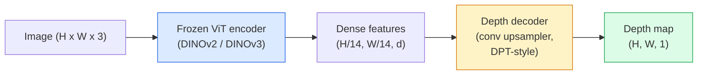

# 单目深度与几何估计

> 深度图是一张单通道图像，其中每个像素都是到相机的距离。过去，如果没有 stereo 或 LiDAR，从一帧 RGB 预测它几乎不可能。到 2026 年，一个 frozen ViT encoder 加轻量 head，就能接近 ground truth 的几个百分点以内。

**类型：** 构建 + 使用
**语言：** Python
**前置要求：** 阶段 4 第 14 课（ViT），阶段 4 第 17 课（自监督视觉），阶段 4 第 07 课（U-Net）
**时间：** ~60 分钟

## 学习目标

- 区分 relative depth 和 metric depth，并说明每个生产模型（MiDaS、Marigold、Depth Anything V3、ZoeDepth）分别解决哪一种
- 使用 Depth Anything V3（DINOv2 backbone）为任意单张图片预测 depth，无需 calibration
- 解释为什么单张图也能做 monocular depth（perspective cues、texture gradients、learned priors），以及它无法恢复什么（absolute scale、occluded geometry）
- 使用 depth map 和 pinhole camera intrinsics，把 2D detections lift 到 3D points

## 问题

Depth 是 2D computer vision 中缺失的轴。给定 RGB，你知道物体在 image plane 的位置，却不知道它们有多远。Depth sensors（stereo rigs、LiDAR、time-of-flight）可以直接解决这个问题，但昂贵、脆弱、范围有限。

Monocular depth estimation，也就是从单张 RGB frame 预测 depth，曾经只会产生模糊且不可靠的输出。到 2026 年，大型预训练 encoders 改变了这一点：Depth Anything V3 使用 frozen DINOv2 backbone，产生能跨 indoor、outdoor、medical 和 satellite domains 泛化的 depth maps。Marigold 把 depth 重写成 conditional diffusion 问题。ZoeDepth 回归真实 metric distances。

Depth 也是 2D detection 和 3D understanding 之间的桥：把检测框里的像素乘以 depth，就能把 2D object lift 成 3D point cloud。这是每个 AR occlusion system、每条 obstacle-avoidance pipeline，以及每个“pick up the cup”机器人的核心。

## 概念

### Relative vs metric depth

- **Relative depth**：没有真实世界单位的有序 `z` 值。“Pixel A 比 pixel B 更近，但距离比例没有锚定到米。”
- **Metric depth**：从相机出发的绝对距离，单位是米。要求模型学到图像线索和真实距离之间的统计关系。

MiDaS 和 Depth Anything V3 产生 relative depth。Marigold 产生 relative depth。ZoeDepth、UniDepth 和 Metric3D 产生 metric depth。Metric models 对 camera intrinsics 敏感；relative models 不敏感。

### Encoder-decoder 模式



Depth Anything V3 冻结 encoder，只训练 DPT-style decoder。Encoder 提供丰富 features；decoder 把它们插值回图像分辨率并回归 depth。

### 为什么单张图也能产生 depth

一张 2D 图片包含许多与 depth 相关的 monocular cues：

- **Perspective**：3D 中的平行线会在 2D 中汇聚。
- **Texture gradient**：远处表面有更小、更密集的纹理。
- **Occlusion order**：较近物体遮挡较远物体。
- **Size constancy**：已知物体（汽车、人）给出近似尺度。
- **Atmospheric perspective**：户外场景中远处物体更朦胧、更偏蓝。

在数十亿图片上训练的 ViT 会内化这些 cues。有足够数据和强 backbone 后，monocular depth 不需要显式 3D supervision 也能达到合理准确率。

### Monocular depth 做不到什么

- 没有 intrinsics 或场景中已知物体时，无法得到**绝对 metric scale**。网络可以预测“杯子比勺子远两倍”，但不知道杯子到底是 1 m 还是 10 m 远。
- **Occluded geometry**：椅子背面不可见，不能可靠推断。
- **真正无纹理 / 反光表面**：镜子、玻璃、均匀墙面。网络会报告 plausible 但错误的 depth。

### 2026 年的 Depth Anything V3

- Vanilla DINOv2 ViT-L/14 作为 encoder（frozen）。
- DPT decoder。
- 在多来源 posed image pairs 上训练（除了 photometric consistency，不需要显式 depth supervision）。
- 从**任意数量 visual inputs 中预测空间一致的几何结构，有或没有已知 camera poses 都可以**。
- 在 monocular depth、any-view geometry、visual rendering、camera pose estimation 上达到 SOTA。

这是 2026 年需要 depth 时的 drop-in 模型。

### Marigold：用 diffusion 做 depth

Marigold（Ke et al., CVPR 2024）把 depth estimation 重写成 conditional image-to-image diffusion。Conditioning：RGB。Target：depth map。使用预训练 Stable Diffusion 2 U-Net 作为 backbone。输出 depth maps 在 object boundaries 上非常锐利。取舍：比 feed-forward models 推理更慢（10-50 denoising steps）。

### Intrinsics 和 pinhole camera

把 depth 为 `d` 的像素 `(u, v)` lift 到相机坐标中的 3D point `(X, Y, Z)`：

```
fx, fy, cx, cy = camera intrinsics
X = (u - cx) * d / fx
Y = (v - cy) * d / fy
Z = d
```

Intrinsics 来自 EXIF metadata、calibration pattern，或 monocular intrinsics estimator（Perspective Fields、UniDepth）。没有 intrinsics 时，你仍然可以假设 60-70° FOV 和中等分辨率主点来渲染 point cloud，适合 visualization，不适合 measurement。

### 评估

两个标准指标：

- **AbsRel**（absolute relative error）：`mean(|d_pred - d_gt| / d_gt)`。越低越好。生产模型约 0.05-0.1。
- **delta < 1.25**（threshold accuracy）：满足 `max(d_pred/d_gt, d_gt/d_pred) < 1.25` 的像素比例。越高越好。SOTA 为 0.9+。

对 relative depth（Depth Anything V3、MiDaS），评估使用二者的 scale-and-shift invariant 版本。

## 构建它

### 第 1 步：Depth metrics

```python
import torch

def abs_rel_error(pred, target, mask=None):
    if mask is not None:
        pred = pred[mask]
        target = target[mask]
    return (torch.abs(pred - target) / target.clamp(min=1e-6)).mean().item()


def delta_accuracy(pred, target, threshold=1.25, mask=None):
    if mask is not None:
        pred = pred[mask]
        target = target[mask]
    ratio = torch.maximum(pred / target.clamp(min=1e-6), target / pred.clamp(min=1e-6))
    return (ratio < threshold).float().mean().item()
```

评估前始终 mask invalid depth pixels（zero、NaN、saturated）。

### 第 2 步：Scale-and-shift alignment

对 relative-depth models，在计算 metrics 前先把 prediction 对齐到 ground truth。对 `a * pred + b = target` 做 least-squares fit：

```python
def align_scale_shift(pred, target, mask=None):
    if mask is not None:
        p = pred[mask]
        t = target[mask]
    else:
        p = pred.flatten()
        t = target.flatten()
    A = torch.stack([p, torch.ones_like(p)], dim=1)
    coeffs, *_ = torch.linalg.lstsq(A, t.unsqueeze(-1))
    a, b = coeffs[:2, 0]
    return a * pred + b
```

评估 MiDaS / Depth Anything 时，先运行 `align_scale_shift`，再运行 `abs_rel_error`。

### 第 3 步：把 depth lift 到 point cloud

```python
import numpy as np

def depth_to_point_cloud(depth, intrinsics):
    H, W = depth.shape
    fx, fy, cx, cy = intrinsics
    v, u = np.meshgrid(np.arange(H), np.arange(W), indexing="ij")
    z = depth
    x = (u - cx) * z / fx
    y = (v - cy) * z / fy
    return np.stack([x, y, z], axis=-1)


depth = np.random.uniform(0.5, 4.0, (240, 320))
intr = (320.0, 320.0, 160.0, 120.0)
pc = depth_to_point_cloud(depth, intr)
print(f"point cloud shape: {pc.shape}  (H, W, 3)")
```

一个函数，所有 3D-lifted application 都会用。把 point cloud 导出为 `.ply`，在 MeshLab 或 CloudCompare 中打开。

### 第 4 步：用 synthetic depth scene 做 smoke test

```python
def synthetic_depth(size=96):
    yy, xx = np.meshgrid(np.arange(size), np.arange(size), indexing="ij")
    # Floor: linear gradient from near (top) to far (bottom)
    depth = 1.0 + (yy / size) * 4.0
    # Box in the middle: closer
    mask = (np.abs(xx - size / 2) < size / 6) & (np.abs(yy - size * 0.6) < size / 6)
    depth[mask] = 2.0
    return depth.astype(np.float32)


gt = torch.from_numpy(synthetic_depth(96))
pred = gt + 0.3 * torch.randn_like(gt)  # simulated prediction
aligned = align_scale_shift(pred, gt)
print(f"before align  absRel = {abs_rel_error(pred, gt):.3f}")
print(f"after align   absRel = {abs_rel_error(aligned, gt):.3f}")
```

### 第 5 步：Depth Anything V3 usage（reference）

```python
import torch
from transformers import pipeline
from PIL import Image

pipe = pipeline(task="depth-estimation", model="LiheYoung/depth-anything-v2-large")

image = Image.open("street.jpg").convert("RGB")
out = pipe(image)
depth_np = np.array(out["depth"])
```

三行。`out["depth"]` 是 PIL grayscale；转换成 numpy 做数学。对 Depth Anything V3，发布后替换 model id 即可；API 不变。

## 使用它

- **Depth Anything V3**（Meta AI / ByteDance，2024-2026）：relative depth 默认选择。生产中最快的 ViT-large-backbone model。
- **Marigold**（ETH，2024）：最高视觉质量，推理慢。
- **UniDepth**（ETH，2024）：带 camera intrinsics estimation 的 metric depth。
- **ZoeDepth**（Intel，2023）：metric depth；较旧但仍可靠。
- **MiDaS v3.1**：legacy 但稳定；好的对比 baseline。

典型集成模式：

1. RGB frame 到达。
2. Depth model 产生 depth map。
3. Detector 产生 boxes。
4. 通过 depth 把 box centroids lift 到 3D；如果有 point cloud，则合并。
5. 下游：AR occlusion、path planning、object-size estimation、stereo replacement。

实时使用时，Depth Anything V2 Small（INT8 quantised）在 consumer GPU 上以 518x518 达到 ~30 fps。

## 交付它

本课产出：

- `outputs/prompt-depth-model-picker.md`：根据 latency、metric-vs-relative need 和 scene type，在 Depth Anything V3、Marigold、UniDepth、MiDaS 之间选择。
- `outputs/skill-depth-to-pointcloud.md`：一个 skill，会用正确 intrinsics handling 从 depth maps 构建 point clouds，并导出到 `.ply`。

## 练习

1. **（简单）** 在你桌子的任意 10 张图片上运行 Depth Anything V2。把 depth 保存为 grayscale PNGs 并检查。找出一个 predicted depth 明显错误的物体，并解释 monocular cues 为什么失败。
2. **（中等）** 给定 RGB + Depth Anything V2 的 depth，lift 到 point cloud，并用 `open3d` 渲染。比较两个场景（indoor / outdoor），说明哪个看起来更可信。
3. **（困难）** 取五对图片，差异只是一件已知物体的位置（例如瓶子靠近 30 cm）。用 UniDepth 在两张图上预测 metric depth。报告 predicted distance delta vs true 30 cm。

## 关键术语

| 术语 | 人们常说 | 实际含义 |
|------|----------------|----------------------|
| Monocular depth | “单图深度” | 从一帧 RGB 估计 depth，不用 stereo 或 LiDAR |
| Relative depth | “有序深度” | 没有真实世界单位的有序 z-values |
| Metric depth | “绝对距离” | 以米为单位的 depth；需要 calibration 或用 metric supervision 训练的模型 |
| AbsRel | “Absolute relative error” | `mean(abs(d_pred - d_gt) / d_gt)`；标准 depth metric |
| Delta accuracy | “delta < 1.25” | prediction 在 ground truth 25% 以内的像素比例 |
| Pinhole camera | “fx, fy, cx, cy” | 用于把 (u, v, d) lift 成 (X, Y, Z) 的 camera model |
| DPT | “Dense Prediction Transformer” | 在 frozen ViT encoders 之上的 conv-based decoder，用于 depth |
| DINOv2 backbone | “它有效的原因” | 无需 depth labels 就能跨 domains 泛化的 self-supervised features |

## 延伸阅读

- [Depth Anything V3 paper page](https://depth-anything.github.io/) — 使用 DINOv2 encoder 的 SOTA monocular depth
- [Marigold (Ke et al., CVPR 2024)](https://marigoldmonodepth.github.io/) — diffusion-based depth estimation
- [UniDepth (Piccinelli et al., 2024)](https://arxiv.org/abs/2403.18913) — 带 intrinsics 的 metric depth
- [MiDaS v3.1 (Intel ISL)](https://github.com/isl-org/MiDaS) — 经典 relative-depth baseline
- [DINOv3 blog post (Meta)](https://ai.meta.com/blog/dinov3-self-supervised-vision-model/) — 提升 depth accuracy 的 encoder family
