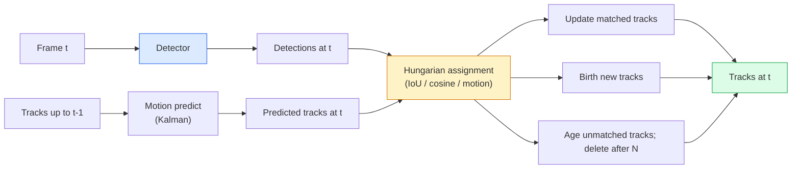

# 多目标跟踪与视频记忆

> Tracking 是 detection 加 association。每一帧都检测。把这一帧的 detections 按 ID 匹配到上一帧的 tracks。

**类型：** 构建
**语言：** Python
**前置要求：** 阶段 4 第 06 课（YOLO Detection），阶段 4 第 08 课（Mask R-CNN），阶段 4 第 24 课（SAM 3）
**时间：** ~60 分钟

## 学习目标

- 区分 tracking-by-detection 和 query-based tracking，并说出算法家族（SORT、DeepSORT、ByteTrack、BoT-SORT、SAM 2 memory tracker、SAM 3.1 Object Multiplex）
- 从零实现 IoU + Hungarian assignment，用于经典 tracking-by-detection
- 解释 SAM 2 的 memory bank，以及为什么它比基于 IoU 的 association 更能处理 occlusion
- 读懂三个 tracking metrics（MOTA、IDF1、HOTA），并为给定用例选择哪个最重要

## 问题

Detector 告诉你单帧中的物体在哪里。Tracker 告诉你 frame `t` 中的哪个 detection，和 frame `t-1` 中的哪个 detection 是同一个物体。没有它，你无法数有多少物体跨过一条线，无法跟踪被遮挡的球，也无法知道“4 号车已经在车道里待了 8 秒”。

Tracking 对每个面向视频的产品都很关键：体育分析、监控、自动驾驶、医疗视频分析、野生动物监测、wordmark counting。核心 building blocks 是共通的：per-frame detector、motion model（Kalman filter 或更丰富的东西）、association step（在 IoU / cosine / learned features 上用 Hungarian algorithm）、track lifecycle（birth、update、death）。

2026 年出现了两个新模式：**SAM 2 memory-based tracking**（feature-memory 替代 motion-model association）和 **SAM 3.1 Object Multiplex**（同一 concept 的多个 instances 使用 shared memory）。本课先走经典栈，再走 memory-based 方法。

## 概念

### Tracking-by-detection



2026 年你遇到的每个 tracker，都是这个循环的变体。差异在于：

- **SORT**（2016）：Kalman filter + IoU Hungarian。简单、快速、没有 appearance model。
- **DeepSORT**（2017）：SORT + 每条 track 一个 CNN-based appearance feature（ReID embedding）。更擅长处理交叉。
- **ByteTrack**（2021）：第二阶段关联 low-confidence detections；不需要 appearance features，但在 MOT17 上表现顶尖。
- **BoT-SORT**（2022）：Byte + camera motion compensation + ReID。
- **StrongSORT / OC-SORT**：ByteTrack 后代，motion 和 appearance 更好。

### 一段话理解 Kalman filter

Kalman filter 为每条 track 维护一个带 covariance 的状态 `(x, y, w, h, dx, dy, dw, dh)`。每帧先用 constant-velocity model **predict** 状态，再用匹配到的 detection **update**。当 predict uncertainty 高时，update 会更信任 detection。这给出平滑轨迹，并能让 track 穿过短 occlusion（1-5 帧）继续存在。

每个经典 tracker 都在 motion-prediction step 使用 Kalman filter。

### Hungarian algorithm

给定一个 `M x N` cost matrix（tracks x detections），找到使总 cost 最小的一对一 assignment。Cost 通常是 `1 - IoU(track_bbox, detection_bbox)`，或 appearance features 的 negative cosine similarity。运行时是 O((M+N)^3)；对 M、N 直到 ~1000 的规模，通过 `scipy.optimize.linear_sum_assignment` 在 Python 中足够快。

### ByteTrack 的关键想法

标准 trackers 会丢弃 low-confidence detections（< 0.5）。ByteTrack 把它们保留下来作为 **second-stage candidates**：先把 tracks 匹配到 high-confidence detections；未匹配的 tracks 再用稍微宽松的 IoU threshold 尝试匹配 low-confidence detections。它能恢复短 occlusions，减少人群附近的 ID switches。

### SAM 2 memory-based tracking

SAM 2 通过保存 per-instance spatio-temporal features 的 **memory bank** 处理视频。给某一帧上的 prompt（click、box、text），它把该 instance 编进 memory。后续帧中，memory 会和新帧 features 做 cross-attention，decoder 产生同一 instance 在新帧中的 mask。

没有 Kalman filter，没有 Hungarian assignment。Association 隐式发生在 memory-attention operation 中。

优点：

- 对大 occlusions 鲁棒（memory 在多帧中携带 instance identity）。
- 与 SAM 3 的 text prompts 结合时支持 open-vocabulary。
- 不需要单独 motion model。

缺点：

- many-object tracking 时比 ByteTrack 慢。
- Memory bank 会增长；限制 context window。

### SAM 3.1 Object Multiplex

之前 SAM 2 / SAM 3 tracking 会为每个 instance 保存独立 memory bank。50 个 objects 就是 50 个 memory banks。Object Multiplex（2026 年 3 月）把它们折叠成一个 shared memory 加 **per-instance query tokens**。成本随 instance 数量亚线性增长。

Multiplex 是 2026 年 crowd tracking 的新默认选择：演唱会人群、仓库工人、交通路口。

### 必须知道的三个指标

- **MOTA（Multi-Object Tracking Accuracy）**：1 - (FN + FP + ID switches) / GT。按错误类型加权；一个混合 detection 和 association failures 的单指标。
- **IDF1（ID F1）**：ID precision 和 recall 的 harmonic mean。专门关注每条 ground-truth track 随时间保持 ID 的程度。对 ID-switch-sensitive tasks 比 MOTA 更好。
- **HOTA（Higher Order Tracking Accuracy）**：分解成 detection accuracy（DetA）和 association accuracy（AssA）。2020 年以来的社区标准；最全面。

监控（谁是谁）报告 IDF1。体育分析（数传球）报告 HOTA。一般学术比较报告 HOTA。

## 构建它

### 第 1 步：IoU-based cost matrix

```python
import numpy as np


def bbox_iou(a, b):
    """
    a, b: (N, 4) arrays of [x1, y1, x2, y2].
    Returns (N_a, N_b) IoU matrix.
    """
    ax1, ay1, ax2, ay2 = a[:, 0], a[:, 1], a[:, 2], a[:, 3]
    bx1, by1, bx2, by2 = b[:, 0], b[:, 1], b[:, 2], b[:, 3]
    inter_x1 = np.maximum(ax1[:, None], bx1[None, :])
    inter_y1 = np.maximum(ay1[:, None], by1[None, :])
    inter_x2 = np.minimum(ax2[:, None], bx2[None, :])
    inter_y2 = np.minimum(ay2[:, None], by2[None, :])
    inter = np.clip(inter_x2 - inter_x1, 0, None) * np.clip(inter_y2 - inter_y1, 0, None)
    area_a = (ax2 - ax1) * (ay2 - ay1)
    area_b = (bx2 - bx1) * (by2 - by1)
    union = area_a[:, None] + area_b[None, :] - inter
    return inter / np.clip(union, 1e-8, None)
```

### 第 2 步：Minimal SORT-style tracker

为了简短，固定 constant-velocity Kalman 被省略了，这里使用简单 IoU association；生产中 Kalman predict 是必要的。`sort` Python package 提供完整版本。

```python
from scipy.optimize import linear_sum_assignment


class Track:
    def __init__(self, tid, bbox, frame):
        self.id = tid
        self.bbox = bbox
        self.last_frame = frame
        self.hits = 1

    def update(self, bbox, frame):
        self.bbox = bbox
        self.last_frame = frame
        self.hits += 1


class SimpleTracker:
    def __init__(self, iou_threshold=0.3, max_age=5):
        self.tracks = []
        self.next_id = 1
        self.iou_threshold = iou_threshold
        self.max_age = max_age

    def step(self, detections, frame):
        if not self.tracks:
            for d in detections:
                self.tracks.append(Track(self.next_id, d, frame))
                self.next_id += 1
            return [(t.id, t.bbox) for t in self.tracks]

        track_boxes = np.array([t.bbox for t in self.tracks])
        det_boxes = np.array(detections) if len(detections) else np.empty((0, 4))

        iou = bbox_iou(track_boxes, det_boxes) if len(det_boxes) else np.zeros((len(track_boxes), 0))
        cost = 1 - iou
        cost[iou < self.iou_threshold] = 1e6

        matched_track = set()
        matched_det = set()
        if cost.size > 0:
            row, col = linear_sum_assignment(cost)
            for r, c in zip(row, col):
                if cost[r, c] < 1.0:
                    self.tracks[r].update(det_boxes[c], frame)
                    matched_track.add(r); matched_det.add(c)

        for i, d in enumerate(det_boxes):
            if i not in matched_det:
                self.tracks.append(Track(self.next_id, d, frame))
                self.next_id += 1

        self.tracks = [t for t in self.tracks if frame - t.last_frame <= self.max_age]
        return [(t.id, t.bbox) for t in self.tracks]
```

60 行。接收 per-frame detections，返回 per-frame track IDs。真实系统会添加 Kalman predict、ByteTrack 的 second-stage re-match 和 appearance features。

### 第 3 步：Synthetic trajectory test

```python
def synthetic_frames(num_frames=20, num_objects=3, H=240, W=320, seed=0):
    rng = np.random.default_rng(seed)
    starts = rng.uniform(20, 200, size=(num_objects, 2))
    velocities = rng.uniform(-5, 5, size=(num_objects, 2))
    frames = []
    for f in range(num_frames):
        dets = []
        for i in range(num_objects):
            cx, cy = starts[i] + f * velocities[i]
            dets.append([cx - 10, cy - 10, cx + 10, cy + 10])
        frames.append(dets)
    return frames


tracker = SimpleTracker()
for f, dets in enumerate(synthetic_frames()):
    tracks = tracker.step(dets, f)
```

三个沿直线运动的 objects 应该在全部 20 帧中保持 ID。

### 第 4 步：ID-switch metric

```python
def count_id_switches(tracks_per_frame, gt_per_frame):
    """
    tracks_per_frame:  list of list of (track_id, bbox)
    gt_per_frame:      list of list of (gt_id, bbox)
    Returns number of ID switches.
    """
    prev_assignment = {}
    switches = 0
    for tracks, gts in zip(tracks_per_frame, gt_per_frame):
        if not tracks or not gts:
            continue
        t_boxes = np.array([b for _, b in tracks])
        g_boxes = np.array([b for _, b in gts])
        iou = bbox_iou(g_boxes, t_boxes)
        for g_idx, (gt_id, _) in enumerate(gts):
            j = iou[g_idx].argmax()
            if iou[g_idx, j] > 0.5:
                t_id = tracks[j][0]
                if gt_id in prev_assignment and prev_assignment[gt_id] != t_id:
                    switches += 1
                prev_assignment[gt_id] = t_id
    return switches
```

这是一个简化的 IDF1-adjacent metric：统计 ground-truth object 的 assigned predicted track ID 改变了多少次。真实 MOTA / IDF1 / HOTA 工具在 `py-motmetrics` 和 `TrackEval` 中。

## 使用它

2026 年生产 trackers：

- `ultralytics`：内置 YOLOv8 + ByteTrack / BoT-SORT。`results = model.track(source, tracker="bytetrack.yaml")`。默认选择。
- `supervision`（Roboflow）：ByteTrack wrappers 加 annotation utilities。
- SAM 2 / SAM 3.1：通过 `processor.track()` 做 memory-based tracking。
- Custom stack：detector（YOLOv8 / RT-DETR）+ `sort-tracker` / `OC-SORT` / `StrongSORT`。

选择：

- 30+ fps 的 pedestrians / cars / boxes：**ByteTrack with ultralytics**。
- crowd 中同一类的很多 instances：**SAM 3.1 Object Multiplex**。
- 具有可辨 appearance 的重 occlusions：**DeepSORT / StrongSORT**（ReID features）。
- 体育 / 复杂交互：**BoT-SORT** 或 learned trackers（MOTRv3）。

## 交付它

本课产出：

- `outputs/prompt-tracker-picker.md`：根据 scene type、occlusion patterns 和 latency budget 选择 SORT / ByteTrack / BoT-SORT / SAM 2 / SAM 3.1。
- `outputs/skill-mot-evaluator.md`：写出完整 evaluation harness，对 ground-truth tracks 计算 MOTA / IDF1 / HOTA。

## 练习

1. **（简单）** 用 3、10 和 30 个 objects 运行上面的 synthetic tracker。报告每种情况的 ID-switch count。指出简单 IoU-only association 从哪里开始失败。
2. **（中等）** 在 association 前加入 constant-velocity Kalman predict step。展示短（2-3 frame）occlusions 不再造成 ID switches。
3. **（困难）** 把 SAM 2 的 memory-based tracker（通过 `transformers`）集成为另一个 tracker backend。在一段 30 秒人群视频上运行 SimpleTracker 和 SAM 2，手工为 5 个显著人物标注 ground-truth IDs，并比较 ID-switch counts。

## 关键术语

| 术语 | 人们常说 | 实际含义 |
|------|----------------|----------------------|
| Tracking-by-detection | “检测再关联” | Per-frame detector + 在 IoU / appearance 上做 Hungarian assignment |
| Kalman filter | “Motion predict” | 线性动力学 + covariance，用于平滑 track predictions 和处理 occlusion |
| Hungarian algorithm | “Optimal assignment” | 求解最小成本 bipartite matching 问题；`scipy.optimize.linear_sum_assignment` |
| ByteTrack | “Low-confidence second pass” | 把未匹配 tracks 重新匹配到 low-confidence detections，以恢复短 occlusions |
| DeepSORT | “SORT + appearance” | 加入 ReID feature 进行跨帧 matching；更利于 ID preservation |
| Memory bank | “SAM 2 trick” | 跨 frames 存储的 per-instance spatio-temporal features；用 cross-attention 替代显式 association |
| Object Multiplex | “SAM 3.1 shared memory” | 单个 shared memory 加 per-instance queries，用于快速 many-object tracking |
| HOTA | “Modern tracking metric” | 分解成 detection 和 association accuracy；社区标准 |

## 延伸阅读

- [SORT (Bewley et al., 2016)](https://arxiv.org/abs/1602.00763) — 最小 tracking-by-detection 论文
- [DeepSORT (Wojke et al., 2017)](https://arxiv.org/abs/1703.07402) — 添加 appearance feature
- [ByteTrack (Zhang et al., 2022)](https://arxiv.org/abs/2110.06864) — low-confidence second pass
- [BoT-SORT (Aharon et al., 2022)](https://arxiv.org/abs/2206.14651) — camera motion compensation
- [HOTA (Luiten et al., 2020)](https://arxiv.org/abs/2009.07736) — decomposed tracking metric
- [SAM 2 video segmentation (Meta, 2024)](https://ai.meta.com/sam2/) — memory-based tracker
- [SAM 3.1 Object Multiplex (Meta, March 2026)](https://ai.meta.com/blog/segment-anything-model-3/)
