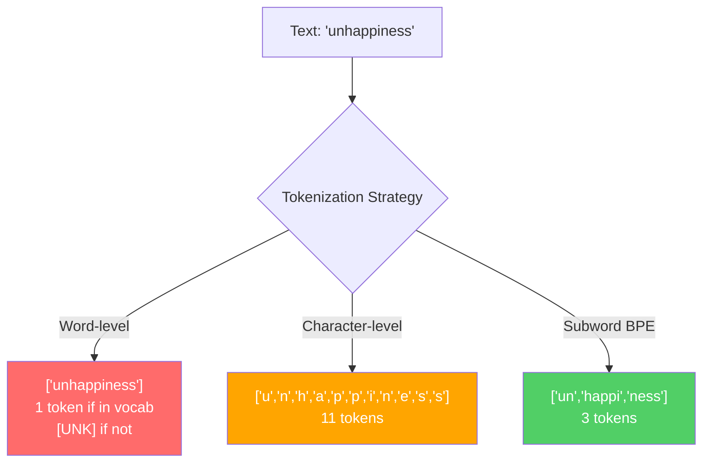
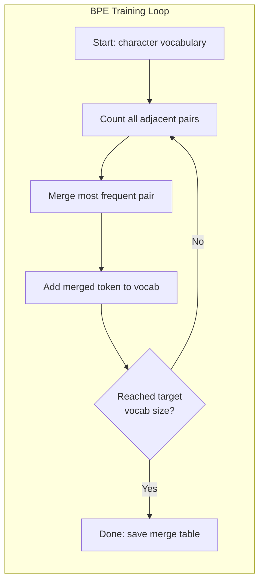
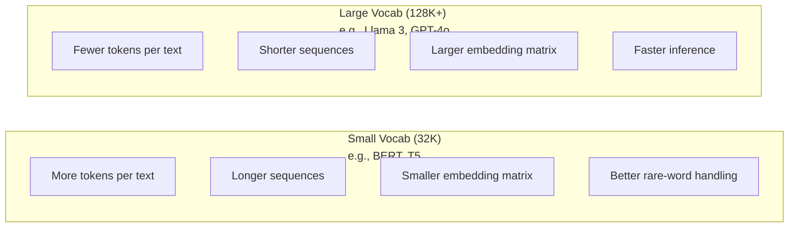

# Tokenizers：BPE、WordPiece、SentencePiece

> 你的 LLM 读的不是英语。它读的是整数。tokenizer 决定这些整数承载的是意义，还是浪费。

**类型：** 构建
**语言：** Python
**前置要求：** 阶段 05（NLP 基础）
**时间：** ~90 分钟

## 学习目标

- 从零实现 BPE、WordPiece 和 Unigram tokenization 算法，并比较它们的合并策略
- 解释词表大小如何影响模型效率：太小会产生很长的序列，太大会浪费 embedding 参数
- 分析不同语言和代码中的 tokenization 痕迹，识别具体 tokenizer 会在哪里失效
- 使用 tiktoken 和 sentencepiece 库对文本做 tokenize，并检查生成的 token ID

## 问题

你的 LLM 不读英语。它不读任何自然语言。它读数字。

从 `"Hello, world!"` 到 `[15496, 11, 995, 0]` 之间的桥梁就是 tokenizer。模型处理之前，每个词、每个空格、每个标点都必须转换成一个整数。这个转换不是中性的。它会把一些假设烙进模型里，之后无法再撤销。

如果做错了，模型会把容量浪费在用多个 token 编码常见词上。`"unfortunately"` 变成四个 token，而不是一个。对于包含大量多音节词的文本，你的 128K context window 等于缩水了 75%。如果做对了，同样的 context window 能容纳两倍的意义。一个模型到底是“很会处理代码”还是“见到 Python 就卡住”，往往取决于 tokenizer 是怎么训练出来的。

你对 GPT-4 或 Claude 发起的每次 API 调用都按 token 计价。模型生成的每个 token 都消耗计算。表示同一段输出所需的 token 越少，端到端 inference 就越快。Tokenization 不是 preprocessing。它是 architecture。

## 概念

### 三种失败的方案（和一个胜出的方案）

把文本转换成数字有三种显而易见的方法。其中两种无法规模化。

**Word-level tokenization** 按空格和标点切分。`"The cat sat"` 变成 `["The", "cat", "sat"]`。简单。但 `"tokenization"` 呢？`"GPT-4o"` 呢？德语复合词 `"Geschwindigkeitsbegrenzung"` 呢？Word-level 需要巨大的词表才能覆盖每种语言中的每个词。一旦漏掉某个词，你就得到可怕的 `[UNK]` token，也就是模型在说“我不知道这是什么”。单是英语就有一百多万种词形。再加上代码、URL、科学计数法和另外 100 种语言，你需要一个无限词表。

**Character-level tokenization** 走向另一个极端。`"hello"` 变成 `["h", "e", "l", "l", "o"]`。词表很小（几百个字符）。永远没有未知 token。但序列会变得极长。一个本来只需要 10 个 word-level token 的句子，会变成 50 个 character-level token。模型必须学会 `"t"`、`"h"`、`"e"` 合在一起表示 `"the"`，把 attention 容量烧在三岁孩子就能学会的事情上。

**Subword tokenization** 找到了甜蜜点。常见词保持完整：`"the"` 是一个 token。罕见词拆成有意义的片段：`"unhappiness"` 变成 `["un", "happi", "ness"]`。词表保持可控（30K 到 128K token）。序列保持较短。未知 token 基本消失，因为任何词都可以用 subword 片段拼出来。

每个现代 LLM 都使用 subword tokenization。GPT-2、GPT-4、BERT、Llama 3、Claude，全都是。问题是使用哪种算法。



### BPE：Byte Pair Encoding

BPE 本来是一个贪心压缩算法，后来被改造成 tokenization 算法。它的想法简单到可以写在一张索引卡上。

从单个字符开始。统计训练语料中每一对相邻符号。把出现最频繁的一对合并成一个新 token。重复，直到达到目标词表大小。

下面是在一个很小的语料上运行 BPE，语料包含 `"lower"`、`"lowest"` 和 `"newest"`：

```
Corpus (with word frequencies):
  "lower"  x5
  "lowest" x2
  "newest" x6

Step 0 -- Start with characters:
  l o w e r       (x5)
  l o w e s t     (x2)
  n e w e s t     (x6)

Step 1 -- Count adjacent pairs:
  (e,s): 8    (s,t): 8    (l,o): 7    (o,w): 7
  (w,e): 13   (e,r): 5    (n,e): 6    ...

Step 2 -- Merge most frequent pair (w,e) -> "we":
  l o we r        (x5)
  l o we s t      (x2)
  n e we s t      (x6)

Step 3 -- Recount and merge (e,s) -> "es":
  l o we r        (x5)
  l o we s t      (x2)    <- 'es' only forms from 'e'+'s', not 'we'+'s'
  n e we s t      (x6)    <- wait, the 'e' before 'we' and 's' after 'we'

Actually tracking this precisely:
  After "we" merge, remaining pairs:
  (l,o): 7   (o,we): 7   (we,r): 5   (we,s): 8
  (s,t): 8   (n,e): 6    (e,we): 6

Step 3 -- Merge (we,s) -> "wes" or (s,t) -> "st" (tied at 8, pick first):
  Merge (we,s) -> "wes":
  l o we r        (x5)
  l o wes t       (x2)
  n e wes t       (x6)

Step 4 -- Merge (wes,t) -> "west":
  l o we r        (x5)
  l o west        (x2)
  n e west        (x6)

...continue until target vocab size reached.
```

合并表就是 tokenizer。编码新文本时，按训练时学到的顺序应用这些合并。训练语料决定哪些合并存在，而这个选择会永久塑造模型看到的内容。



### Byte-Level BPE（GPT-2、GPT-3、GPT-4）

标准 BPE 作用在 Unicode 字符上。Byte-level BPE 作用在原始字节（0-255）上。这让基础词表正好是 256 个条目，能处理任意语言或编码，并且永远不会产生未知 token。

GPT-2 引入了这种方法。基础词表覆盖每一种可能的字节。BPE 合并在这个基础上继续构建。OpenAI 的 tiktoken 库实现了 byte-level BPE，并使用这些词表大小：

- GPT-2：50,257 tokens
- GPT-3.5/GPT-4：~100,256 tokens（cl100k_base encoding）
- GPT-4o：200,019 tokens（o200k_base encoding）

### WordPiece（BERT）

WordPiece 看起来类似 BPE，但选择合并的方式不同。它不是看原始频率，而是最大化训练数据的 likelihood：

```
BPE merge criterion:      count(A, B)
WordPiece merge criterion: count(AB) / (count(A) * count(B))
```

BPE 问：“哪一对出现得最多？”WordPiece 问：“哪一对一起出现的频率高于随机情况下的预期？”这个细微差别会产生不同的词表。WordPiece 偏好那些共现令人意外的合并，而不只是频繁的合并。

WordPiece 还用 `"##"` 前缀标记 continuation subword：

```
"unhappiness" -> ["un", "##happi", "##ness"]
"embedding"   -> ["em", "##bed", "##ding"]
```

`"##"` 前缀表示这个片段延续前一个 token。BERT 使用 30,522 个 token 的 WordPiece 词表。每个 BERT 变体都与此有关；DistilBERT 沿用 BERT，RoBERTa 的 tokenizer 实际上是 BPE，但 BERT 本身是 WordPiece。

### SentencePiece（Llama、T5）

SentencePiece 把输入视作原始 Unicode 字符流，包括空白字符。没有 pre-tokenization 步骤。没有关于词边界的语言特定规则。这让它真正与语言无关，能处理中文、日文、泰文，以及其他不用空格分词的语言。

SentencePiece 支持两种算法：

- **BPE mode**：与标准 BPE 相同的合并逻辑，应用在原始字符序列上
- **Unigram mode**：从一个大词表开始，迭代删除对整体 likelihood 影响最小的 token。它是 BPE 的反向操作：不是合并，而是剪枝。

Llama 2 使用 32,000 token 的 SentencePiece BPE。T5 使用 32,000 token 的 SentencePiece Unigram。注意：Llama 3 切换到了基于 tiktoken 的 byte-level BPE tokenizer，词表大小为 128,256。

### 词表大小的权衡

这是一个真实的工程决策，有可测量的后果。



看具体数字。对于 128K 词表和 4,096 维 embedding，仅 embedding matrix 就有 128,000 x 4,096 = 5.24 亿参数。对于 32K 词表，它是 1.31 亿参数。仅 tokenizer 选择就带来 4 亿参数的差异。

但更大的词表能更激进地压缩文本。同一段英文，用 32K 词表可能需要 100 个 token，用 128K 词表可能只需要 70 个 token。这意味着生成时 forward pass 少 30%。对服务数百万请求的模型来说，这会直接降低计算成本。

趋势很清楚：词表越来越大。GPT-2 用 50,257。GPT-4 用 ~100K。Llama 3 用 128K。GPT-4o 用 200K。

| Model | Vocab Size | Tokenizer Type | Avg Tokens per English Word |
|-------|-----------|----------------|---------------------------|
| BERT | 30,522 | WordPiece | ~1.4 |
| GPT-2 | 50,257 | Byte-level BPE | ~1.3 |
| Llama 2 | 32,000 | SentencePiece BPE | ~1.4 |
| GPT-4 | ~100,256 | Byte-level BPE | ~1.2 |
| Llama 3 | 128,256 | Byte-level BPE (tiktoken) | ~1.1 |
| GPT-4o | 200,019 | Byte-level BPE | ~1.0 |

### 多语言税

主要在英语上训练的 tokenizer 对其他语言很残酷。GPT-2 tokenizer 中的韩语文本平均每个词 2-3 个 token。中文可能更糟。这意味着韩语用户实际拥有的 context window 只有英语用户的一半，却付着同样的价格，得到更低的信息密度。

这就是 Llama 3 把词表从 32K 扩大到 128K 的原因。更多 token 分配给非英语文字系统，意味着跨语言压缩更公平。

## 构建它

### 第 1 步：Character-Level Tokenizer

从基础开始。character-level tokenizer 把每个字符映射到它的 Unicode code point。不需要训练。没有未知 token。只是直接映射。

```python
class CharTokenizer:
    def encode(self, text):
        return [ord(c) for c in text]

    def decode(self, tokens):
        return "".join(chr(t) for t in tokens)
```

`"hello"` 变成 `[104, 101, 108, 108, 111]`。每个字符都是自己的 token。这是我们要改进的 baseline。

### 第 2 步：从零实现 BPE Tokenizer

真正的实现。我们在原始字节上训练（像 GPT-2 一样），统计 pair，合并最频繁的一对，并按顺序记录每次合并。合并表就是 tokenizer。

```python
from collections import Counter

class BPETokenizer:
    def __init__(self):
        self.merges = {}
        self.vocab = {}

    def _get_pairs(self, tokens):
        pairs = Counter()
        for i in range(len(tokens) - 1):
            pairs[(tokens[i], tokens[i + 1])] += 1
        return pairs

    def _merge_pair(self, tokens, pair, new_token):
        merged = []
        i = 0
        while i < len(tokens):
            if i < len(tokens) - 1 and tokens[i] == pair[0] and tokens[i + 1] == pair[1]:
                merged.append(new_token)
                i += 2
            else:
                merged.append(tokens[i])
                i += 1
        return merged

    def train(self, text, num_merges):
        tokens = list(text.encode("utf-8"))
        self.vocab = {i: bytes([i]) for i in range(256)}

        for i in range(num_merges):
            pairs = self._get_pairs(tokens)
            if not pairs:
                break
            best_pair = max(pairs, key=pairs.get)
            new_token = 256 + i
            tokens = self._merge_pair(tokens, best_pair, new_token)
            self.merges[best_pair] = new_token
            self.vocab[new_token] = self.vocab[best_pair[0]] + self.vocab[best_pair[1]]

        return self

    def encode(self, text):
        tokens = list(text.encode("utf-8"))
        for pair, new_token in self.merges.items():
            tokens = self._merge_pair(tokens, pair, new_token)
        return tokens

    def decode(self, tokens):
        byte_sequence = b"".join(self.vocab[t] for t in tokens)
        return byte_sequence.decode("utf-8", errors="replace")
```

BPE 的核心就是这个训练循环：统计 pair，合并赢家，重复。每次合并都会减少总 token 数。经过 `num_merges` 轮之后，词表从 256 个基础字节增长到 256 + num_merges。

编码会按照学到的确切顺序应用合并。这一点很重要。如果第 1 次合并创建了 `"th"`，第 5 次合并创建了 `"the"`，编码时必须先应用第 1 次合并，这样 `"the"` 才能在第 5 次合并中由 `"th"` + `"e"` 形成。

解码是反向操作：在词表里查找每个 token ID，拼接字节，再解码成 UTF-8。

### 第 3 步：Encode 和 Decode Roundtrip

```python
corpus = (
    "The cat sat on the mat. The cat ate the rat. "
    "The dog sat on the log. The dog ate the frog. "
    "Natural language processing is the study of how computers "
    "understand and generate human language. "
    "Tokenization is the first step in any NLP pipeline."
)

tokenizer = BPETokenizer()
tokenizer.train(corpus, num_merges=40)

test_sentences = [
    "The cat sat on the mat.",
    "Natural language processing",
    "tokenization pipeline",
    "unhappiness",
]

for sentence in test_sentences:
    encoded = tokenizer.encode(sentence)
    decoded = tokenizer.decode(encoded)
    raw_bytes = len(sentence.encode("utf-8"))
    ratio = len(encoded) / raw_bytes
    print(f"'{sentence}'")
    print(f"  Tokens: {len(encoded)} (from {raw_bytes} bytes) -- ratio: {ratio:.2f}")
    print(f"  Roundtrip: {'PASS' if decoded == sentence else 'FAIL'}")
```

compression ratio 告诉你 tokenizer 有多有效。0.50 表示 tokenizer 把文本压缩到了原始字节数的一半。越低越好。在训练语料上，ratio 会不错。在 `"unhappiness"` 这种 out-of-distribution 文本上（它没有出现在语料里），ratio 会更差，因为 tokenizer 会对没见过的模式退回到字符级编码。

### 第 4 步：与 tiktoken 比较

```python
import tiktoken

enc = tiktoken.get_encoding("cl100k_base")

texts = [
    "The cat sat on the mat.",
    "unhappiness",
    "Hello, world!",
    "def fibonacci(n): return n if n < 2 else fibonacci(n-1) + fibonacci(n-2)",
    "Geschwindigkeitsbegrenzung",
]

for text in texts:
    our_tokens = tokenizer.encode(text)
    tiktoken_tokens = enc.encode(text)
    tiktoken_pieces = [enc.decode([t]) for t in tiktoken_tokens]
    print(f"'{text}'")
    print(f"  Our BPE:   {len(our_tokens)} tokens")
    print(f"  tiktoken:  {len(tiktoken_tokens)} tokens -> {tiktoken_pieces}")
```

tiktoken 使用完全相同的算法，但它是在数百 GB 文本上训练的，并且有 100,000 次合并。算法相同。差别是训练数据和合并次数。你这个在一段话上训练、只有 40 次合并的 tokenizer，不可能在大规模语料和 100K 合并的 tiktoken 面前竞争。但机制是一样的。

### 第 5 步：词表分析

```python
def analyze_vocabulary(tokenizer, test_texts):
    total_tokens = 0
    total_chars = 0
    token_usage = Counter()

    for text in test_texts:
        encoded = tokenizer.encode(text)
        total_tokens += len(encoded)
        total_chars += len(text)
        for t in encoded:
            token_usage[t] += 1

    print(f"Vocabulary size: {len(tokenizer.vocab)}")
    print(f"Total tokens across all texts: {total_tokens}")
    print(f"Total characters: {total_chars}")
    print(f"Avg tokens per character: {total_tokens / total_chars:.2f}")

    print(f"\nMost used tokens:")
    for token_id, count in token_usage.most_common(10):
        token_bytes = tokenizer.vocab[token_id]
        display = token_bytes.decode("utf-8", errors="replace")
        print(f"  Token {token_id:4d}: '{display}' (used {count} times)")

    unused = [t for t in tokenizer.vocab if t not in token_usage]
    print(f"\nUnused tokens: {len(unused)} out of {len(tokenizer.vocab)}")
```

这会揭示词表中的 Zipf 分布。少数 token 占据主导（空格、`"the"`、`"e"`）。多数 token 很少使用。生产 tokenizer 会围绕这种分布做优化：常见模式得到短 token ID，罕见模式得到更长的表示。

## 使用它

你的 scratch BPE 已经能工作了。现在看看生产工具是什么样子。

### tiktoken（OpenAI）

```python
import tiktoken

enc = tiktoken.get_encoding("cl100k_base")

text = "Tokenizers convert text to integers"
tokens = enc.encode(text)
print(f"Tokens: {tokens}")
print(f"Pieces: {[enc.decode([t]) for t in tokens]}")
print(f"Roundtrip: {enc.decode(tokens)}")
```

tiktoken 用 Rust 编写，并提供 Python binding。它每秒能编码数百万个 token。相同的 BPE 算法，工业级实现。

### Hugging Face tokenizers

```python
from tokenizers import Tokenizer
from tokenizers.models import BPE
from tokenizers.trainers import BpeTrainer
from tokenizers.pre_tokenizers import ByteLevel

tokenizer = Tokenizer(BPE())
tokenizer.pre_tokenizer = ByteLevel()

trainer = BpeTrainer(vocab_size=1000, special_tokens=["<pad>", "<eos>", "<unk>"])
tokenizer.train(["corpus.txt"], trainer)

output = tokenizer.encode("The cat sat on the mat.")
print(f"Tokens: {output.tokens}")
print(f"IDs: {output.ids}")
```

Hugging Face tokenizers 库底层同样是 Rust。它能在几秒内对 GB 级语料训练 BPE。训练你自己的模型时，这就是你会使用的工具。

### 加载 Llama 的 Tokenizer

```python
from transformers import AutoTokenizer

tokenizer = AutoTokenizer.from_pretrained("meta-llama/Llama-3.1-8B")

text = "Tokenizers are the unsung heroes of LLMs"
tokens = tokenizer.encode(text)
print(f"Token IDs: {tokens}")
print(f"Tokens: {tokenizer.convert_ids_to_tokens(tokens)}")
print(f"Vocab size: {tokenizer.vocab_size}")

multilingual = ["Hello world", "Hola mundo", "Bonjour le monde"]
for text in multilingual:
    ids = tokenizer.encode(text)
    print(f"'{text}' -> {len(ids)} tokens")
```

Llama 3 的 128K 词表对非英语文本的压缩明显好于 GPT-2 的 50K 词表。你可以自己验证：用多种语言编码同一句话，然后数 token。

## 交付它

本课会产出 `outputs/prompt-tokenizer-analyzer.md`，这是一个可复用的 prompt，用来分析任意文本和模型组合的 tokenization 效率。给它一段文本样本，它会告诉你哪个模型的 tokenizer 处理得最好。

## 练习

1. 修改 BPE tokenizer，让它在每一步合并时打印词表。观察 `"t"` + `"h"` 如何变成 `"th"`，然后 `"th"` + `"e"` 如何变成 `"the"`。跟踪常见英文词如何一片一片组装起来。

2. 给 BPE tokenizer 添加 special tokens（`<pad>`、`<eos>`、`<unk>`）。把它们分配为 ID 0、1、2，并相应地平移其他所有 token。实现一个在运行 BPE 之前按空白切分的 pre-tokenization 步骤。

3. 实现 WordPiece 的合并准则（likelihood ratio，而不是 frequency）。在同一语料、相同合并次数下训练 BPE 和 WordPiece。比较生成的词表：哪一个产生了更多语言学上有意义的 subword？

4. 构建一个多语言 tokenizer 效率 benchmark。选取英语、西班牙语、中文、韩语和阿拉伯语各 10 个句子。用 tiktoken（cl100k_base）对每句 tokenize，并测量平均 tokens per character。量化每种语言的“多语言税”。

5. 在更大的语料上训练你的 BPE tokenizer（下载一篇 Wikipedia 文章）。调节合并次数，使它在同一文本上的 compression ratio 达到 tiktoken 的 10% 以内。这会迫使你理解语料大小、合并次数和压缩质量之间的关系。

## 关键词

| Term | What people say | What it actually means |
|------|----------------|----------------------|
| Token | “一个词” | 模型词表中的一个单位，可以是字符、subword、词，或多词片段 |
| BPE | “某种压缩东西” | Byte Pair Encoding：反复合并出现最频繁的相邻 token pair，直到达到目标词表大小 |
| WordPiece | “BERT 的 tokenizer” | 类似 BPE，但合并依据是 likelihood ratio `count(AB)/(count(A)*count(B))`，而不是原始频率 |
| SentencePiece | “一个 tokenizer 库” | 与语言无关的 tokenizer，直接作用于原始 Unicode，不做 pre-tokenization，支持 BPE 和 Unigram 算法 |
| Vocabulary size | “它认识多少词” | 唯一 token 的总数：GPT-2 有 50,257，BERT 有 30,522，Llama 3 有 128,256 |
| Fertility | “不像 tokenizer 术语” | 平均每个词产生多少 token，用来衡量跨语言 tokenizer 效率（1.0 最理想，3.0 表示模型要多做三倍工作） |
| Byte-level BPE | “GPT 的 tokenizer” | 作用在原始字节（0-255）而不是 Unicode 字符上的 BPE，保证任何输入都没有未知 token |
| Merge table | “tokenizer 文件” | 训练中学到的 pair merge 有序列表；这就是 tokenizer，而且顺序很重要 |
| Pre-tokenization | “按空格切分” | subword tokenization 之前应用的规则：空白切分、数字分离、标点处理 |
| Compression ratio | “tokenizer 有多高效” | 生成的 token 数除以输入字节数；越低表示压缩越好，inference 越快 |

## 延伸阅读

- [Sennrich et al., 2016 -- "Neural Machine Translation of Rare Words with Subword Units"](https://arxiv.org/abs/1508.07909) -- 将 BPE 引入 NLP 的论文，把 1994 年的压缩算法变成现代 tokenization 的基础
- [Kudo & Richardson, 2018 -- "SentencePiece: A simple and language independent subword tokenizer"](https://arxiv.org/abs/1808.06226) -- 让多语言模型变得实用的语言无关 tokenization
- [OpenAI tiktoken repository](https://github.com/openai/tiktoken) -- Rust 编写、带 Python binding 的生产级 BPE 实现，GPT-3.5/4/4o 使用
- [Hugging Face Tokenizers documentation](https://huggingface.co/docs/tokenizers) -- 具备 Rust 性能的生产级 tokenizer 训练
