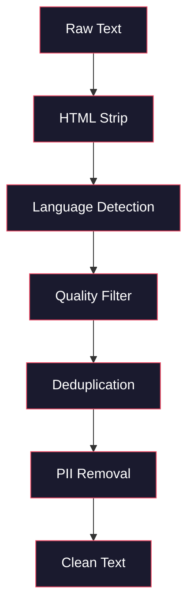
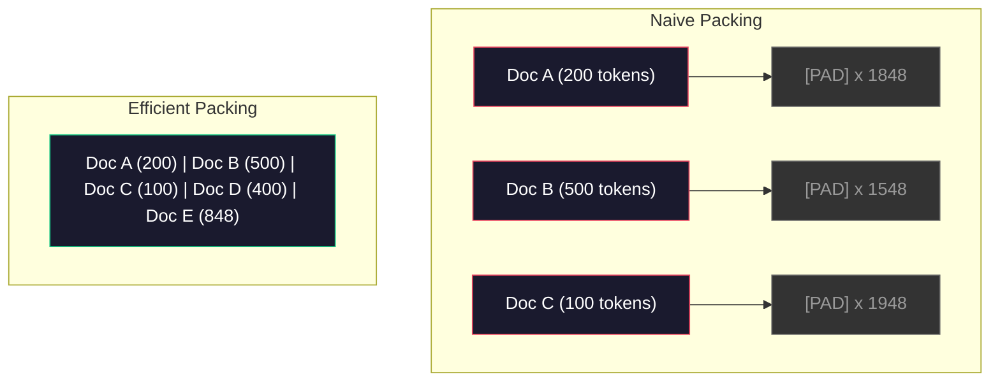

# Pre-Training 数据 Pipeline

> 模型是一面镜子。你喂给它什么数据，它就流利地反射什么数据。喂垃圾，它就完美流利地反射垃圾。

**类型：** 构建
**语言：** Python
**前置要求：** 阶段 10，第 01-02 课（Tokenizers，Building a Tokenizer）
**时间：** ~90 分钟

## 学习目标

- 构建 streaming data pipeline，在不把 TB 级文本全部加载到内存的情况下完成 tokenize、chunk、shuffle 和 batching
- 实现真实 pre-training pipeline 中使用的数据质量过滤（deduplication、language detection、content filtering）
- 创建固定长度训练序列，并正确处理 attention mask 和文档边界
- profile pipeline throughput，确保 dataloader 能跟上 GPU 训练速度

## 问题

你已经有了 tokenizer。现在你需要数据。

不是一个 dataset。不是一个 CSV 文件。而是 TB 级文本：清洗过、去重过、经过质量过滤、tokenized 成固定长度序列，并且以足够快的速度随机批量供应，快到你的 8-GPU 集群永远不用等下一批数据。

大多数人以为训练 LLM 主要看模型架构。不是。Llama 3 使用了 15.6 万亿 token。GPT-3 使用了 3000 亿。DeepSeek-V2 使用了 8.1 万亿。三者架构大体相同：堆叠 transformer blocks，里面是 attention 和 feedforward layers。输出质量差异主要来自数据。

DeepMind 的 Chinchilla paper 把这件事说得很精确。对于给定 compute budget，模型参数量和训练 token 数之间存在最佳比例。Chinchilla 表明，2022 年的大多数模型都严重 undertrained，它们的参数相对于见过的数据太多。一个在 1.4 万亿 token 上训练的 70B 参数模型（Chinchilla-optimal）超过了一个只在 3000 亿 token 上训练的 280B 模型（Gopher）。

你的 data pipeline 决定模型学到的是语言，还是噪声。

## 概念

### 数据从哪里来

每个大语言模型都在多种来源的混合数据上训练。多数实验室会严密保密精确配比，但我们知道足够多，能理解这些类别。

| Source | Size | Quality | Used By |
|--------|------|---------|---------|
| Common Crawl | ~250 TB raw | 低（需要重度过滤） | GPT-3, Llama, most open models |
| Wikipedia | ~20 GB | 高 | 每个主要 LLM |
| GitHub code | ~1 TB+ | 中（大量重复、死代码） | StarCoder, CodeLlama, DeepSeek-Coder |
| Books (BookCorpus, Pile) | ~100 GB | 高 | GPT-2, GPT-3, early models |
| Academic papers (arXiv, S2ORC) | ~100 GB | STEM 领域高 | Llama, Galactica |
| StackOverflow, Reddit | ~100 GB | 中 | Llama, Falcon |
| Curated web (C4, RefinedWeb) | ~5 TB | 中高（已预过滤） | T5, Falcon |

Llama 3 公开过它的数据混合：大约 50% web data、25% code、13% books 和 academic papers、8% math data、4% multilingual web data。总量是来自超过 5 TB 原始文本的 15.6 万亿 token。

比例和总量一样重要。web data 太多，模型会变成 Reddit 复读机。code 太少，它就不会编程。math 太少，它就无法推理。找到正确混合比例是训练 LLM 最难的部分之一，而且没有公式，只能实验和评估。

### 数据清洗

原始 web data 很脏。典型 Common Crawl dump 包含：

- HTML 标签和 JavaScript
- 样板化 header、footer、导航菜单
- 重复页面（精确重复和近似重复）
- 机器生成的垃圾内容
- 个人可识别信息（PII）
- 低质量文本（关键词列表、SEO 垃圾）
- 以文本形式编码的非文本内容

清洗不是可选项。它决定你的模型会生成连贯段落，还是输出混着商品列表的 HTML 标签。



每一步都会消除一类噪声：

**HTML stripping：** 移除所有 markup。只保留可见文本内容。`trafilatura` 或 `readability` 这类库可以抽取文章正文，同时丢弃导航、广告和 boilerplate。

**Language detection：** 使用 fastText 的语言识别模型（lid.176.bin）给每个文档分类。过滤到你的目标语言。一个被分类为英文但置信度低于 0.8 的文档，很可能不是干净英文。

**Quality filtering：** 这里开始有意思。RefinedWeb（Falcon 背后的 dataset）使用基于 perplexity 的过滤器：先在 Wikipedia 上训练一个小语言模型，然后给每个文档打分。高 perplexity 表示这个文档不像 Wikipedia，很可能是垃圾、关键词列表或机器生成内容。perplexity 超过阈值的文档会被移除。

**Deduplication：** 最有影响力的单一步骤。Common Crawl 中有大量重复页面：法律免责声明、cookie notices、服务条款。用重复数据训练会浪费计算，还可能导致模型记忆并逐字吐出特定段落。

**PII removal：** 姓名、邮箱、电话号码、社会安全号码。结构化 PII 用 regex 检测，上下文中的姓名用 NER 模型检测。

### 使用 MinHash 去重

精确去重很简单：hash 每个文档，移除重复项。但近似重复才是真问题。两份同一新闻文章，只是周围广告略有不同，就是近似重复。内容 95% 相同，但逐字节不同。

MinHash + Locality-Sensitive Hashing（LSH）能高效解决这个问题。


思路如下：

1. **Shingling：** 把每个文档转换成 n-gram 集合（例如词或字符的 5-grams）。`"the quick brown fox"` 使用 3-word shingles 会变成 `{"the quick brown", "quick brown fox"}`。

2. **MinHash：** 对每个文档的 shingle set 计算 k 个 hash 值。每个 hash 值是在不同 hash function 下所有 shingles 的最小 hash。这会创建一个固定大小的 signature，用来近似任意两个文档的 Jaccard similarity。

3. **LSH：** 根据 MinHash signature 的 band 把文档分到 bucket 里。同一个 bucket 里的文档是候选近似重复。这样避免比较每一对文档，只需要比较候选项。

4. **Verify：** 对每个候选 pair 计算精确 Jaccard similarity。如果 similarity 超过阈值（通常 0.8），删除其中一份。

Llama 团队报告称，他们通过 deduplication 移除了大约 38% 的 web data。这不是小数字。超过三分之一的 Common Crawl 是重复或近似重复内容。

### Sequence Packing

你的模型需要固定长度输入序列。你的文档是变长的。有些 50 个 token。有些 50,000 个 token。

朴素做法：把每个文档 pad 到最大序列长度。这会把大量计算浪费在对学习没有贡献的 padding token 上。

更好的做法：把多个文档 pack 到一个序列里，中间用 end-of-sequence token 分隔。一个 2048-token 序列可能包含三个短文档，中间用 [EOS] 连接。



attention mask 必须正确设置。同一个 packed sequence 中，Document A 的 token 不应该 attend 到 Document B 的 token。这需要 block-diagonal attention mask。

长文档会在序列边界处被截断或拆成 chunk。切分点很重要：在句子中间切断会迫使模型看到不完整的想法。有些 pipeline 会尽可能把切分对齐到段落或句子边界。

### Chinchilla Scaling Law

对于固定 compute budget C（以 FLOPs 衡量），最佳模型大小 N 和数据集大小 D 遵循：

```
N_opt ~ C^0.5
D_opt ~ C^0.5
```

实践中，这意味着你应该大致等比例扩大模型大小和数据集大小。参数量增加 10 倍的模型，需要大约 10 倍训练 token 才能达到相同 loss。

| Model | Parameters | Training Tokens | Chinchilla-Optimal? |
|-------|-----------|----------------|-------------------|
| GPT-3 | 175B | 300B | No (undertrained 3-4x) |
| Chinchilla | 70B | 1.4T | Yes (by design) |
| Llama 2 | 70B | 2T | Overtrained (intentionally) |
| Llama 3 | 70B | 15T | Heavily overtrained |

Llama 3 有意违反了 Chinchilla law。Meta 发现，在更多数据上 overtraining，远超 compute-optimal 比例，可以产生对 inference 更好的模型。额外训练成本只付一次，但更小的模型会永远更便宜地服务。这有时被称为 “inference-optimal” scaling approach，并且从 2024 年开始成为行业标准。

## 构建它

### 第 1 步：文本清洗

去掉 HTML，规范化空白，移除非文本内容。我们会使用 public domain 文本（Project Gutenberg）作为小语料。

```python
import re

def clean_text(text):
    text = re.sub(r"<[^>]+>", "", text)
    text = re.sub(r"http\S+", "", text)
    text = re.sub(r"[^\x20-\x7E\n]", "", text)
    text = re.sub(r"\n{3,}", "\n\n", text)
    text = re.sub(r" {2,}", " ", text)
    return text.strip()

def quality_filter(text, min_words=50, max_ratio_caps=0.3, max_ratio_special=0.1):
    words = text.split()
    if len(words) < min_words:
        return False
    caps_ratio = sum(1 for w in words if w.isupper()) / len(words)
    if caps_ratio > max_ratio_caps:
        return False
    special_chars = sum(1 for c in text if not c.isalnum() and not c.isspace())
    if special_chars / max(len(text), 1) > max_ratio_special:
        return False
    return True
```

这个 quality filter 会抓住 SEO 垃圾（ALL CAPS）、机器生成噪声（高特殊字符比例）和 stub 页面（太短）。单靠这三项检查，就能从 web crawl 中移除惊人数量的垃圾。

### 第 2 步：MinHash Deduplication

从零实现 MinHash。不需要外部库，只用 `hashlib`。

```python
import hashlib
from collections import defaultdict

def get_shingles(text, k=5):
    words = text.lower().split()
    if len(words) < k:
        return set()
    return {" ".join(words[i:i+k]) for i in range(len(words) - k + 1)}

def minhash_signature(shingles, num_hashes=128):
    signature = []
    for i in range(num_hashes):
        min_hash = float("inf")
        for shingle in shingles:
            h = int(hashlib.sha256(f"{i}:{shingle}".encode()).hexdigest(), 16)
            min_hash = min(min_hash, h)
        signature.append(min_hash)
    return signature

def lsh_buckets(signature, bands=16):
    rows_per_band = len(signature) // bands
    buckets = []
    for b in range(bands):
        start = b * rows_per_band
        band_data = tuple(signature[start:start + rows_per_band])
        bucket_hash = hashlib.md5(str(band_data).encode()).hexdigest()
        buckets.append((b, bucket_hash))
    return buckets

def deduplicate(documents, threshold=0.8, num_hashes=128, bands=16):
    signatures = []
    shingle_sets = []
    for doc in documents:
        shingles = get_shingles(doc)
        shingle_sets.append(shingles)
        signatures.append(minhash_signature(shingles, num_hashes))

    bucket_map = defaultdict(list)
    for doc_idx, sig in enumerate(signatures):
        for band_id, bucket_hash in lsh_buckets(sig, bands):
            bucket_map[(band_id, bucket_hash)].append(doc_idx)

    duplicate_pairs = set()
    for bucket_docs in bucket_map.values():
        if len(bucket_docs) < 2:
            continue
        for i in range(len(bucket_docs)):
            for j in range(i + 1, len(bucket_docs)):
                duplicate_pairs.add((bucket_docs[i], bucket_docs[j]))

    removed = set()
    for i, j in duplicate_pairs:
        if i in removed or j in removed:
            continue
        s1, s2 = shingle_sets[i], shingle_sets[j]
        if not s1 or not s2:
            continue
        jaccard = len(s1 & s2) / len(s1 | s2)
        if jaccard >= threshold:
            removed.add(j)

    return [doc for idx, doc in enumerate(documents) if idx not in removed], len(removed)
```

`num_hashes=128` 和 `bands=16` 参数控制 precision-recall tradeoff。更多 hash 会给出更准确的相似度估计。更多 band 会提高 recall（抓到更多重复），代价是更多 false positives。这些值对典型 web text 很有效。

### 第 3 步：Tokenize 并 Pack Sequences

拿到清洗和去重后的文本，tokenize 它，并 pack 成训练用的固定长度序列。

```python
def tokenize_corpus(documents, tokenizer):
    all_tokens = []
    for doc in documents:
        tokens = tokenizer.encode(doc)
        all_tokens.extend(tokens)
        all_tokens.append(tokenizer.eos_id)
    return all_tokens

def pack_sequences(token_ids, seq_length, pad_id=0):
    sequences = []
    attention_masks = []
    for i in range(0, len(token_ids), seq_length):
        seq = token_ids[i:i + seq_length]
        mask = [1] * len(seq)
        if len(seq) < seq_length:
            pad_count = seq_length - len(seq)
            seq = seq + [pad_id] * pad_count
            mask = mask + [0] * pad_count
        sequences.append(seq)
        attention_masks.append(mask)
    return sequences, attention_masks
```

### 第 4 步：训练用 DataLoader

产出随机 batch 的 packed sequences。这就是 training loop 会消费的内容。

```python
import random

class PreTrainingDataLoader:
    def __init__(self, sequences, attention_masks, batch_size, shuffle=True):
        self.sequences = sequences
        self.attention_masks = attention_masks
        self.batch_size = batch_size
        self.shuffle = shuffle

    def __len__(self):
        return (len(self.sequences) + self.batch_size - 1) // self.batch_size

    def __iter__(self):
        indices = list(range(len(self.sequences)))
        if self.shuffle:
            random.shuffle(indices)
        for start in range(0, len(indices), self.batch_size):
            batch_idx = indices[start:start + self.batch_size]
            batch_seqs = [self.sequences[i] for i in batch_idx]
            batch_masks = [self.attention_masks[i] for i in batch_idx]
            yield batch_seqs, batch_masks
```

### 第 5 步：Dataset Statistics

计算真正重要的数字：total tokens、unique tokens、compression ratio、document length distribution。

```python
from collections import Counter

def compute_statistics(documents, token_ids, sequences, tokenizer_vocab_size):
    total_chars = sum(len(d) for d in documents)
    total_tokens = len(token_ids)
    unique_tokens = len(set(token_ids))
    compression_ratio = total_chars / total_tokens

    doc_lengths = [len(d.split()) for d in documents]
    avg_doc_length = sum(doc_lengths) / max(len(doc_lengths), 1)
    max_doc_length = max(doc_lengths) if doc_lengths else 0
    min_doc_length = min(doc_lengths) if doc_lengths else 0

    token_counts = Counter(token_ids)
    top_tokens = token_counts.most_common(10)

    non_pad_tokens = sum(sum(1 for t in seq if t != 0) for seq in sequences)
    total_positions = sum(len(seq) for seq in sequences)
    utilization = non_pad_tokens / max(total_positions, 1)

    stats = {
        "total_documents": len(documents),
        "total_characters": total_chars,
        "total_tokens": total_tokens,
        "unique_tokens": unique_tokens,
        "vocab_utilization": unique_tokens / tokenizer_vocab_size,
        "compression_ratio": compression_ratio,
        "avg_doc_length_words": avg_doc_length,
        "max_doc_length_words": max_doc_length,
        "min_doc_length_words": min_doc_length,
        "num_sequences": len(sequences),
        "sequence_utilization": utilization,
        "top_10_tokens": top_tokens,
    }
    return stats
```

compression ratio 告诉你 tokenizer 在这个语料上有多高效。英文文本通常大约是每 token 3-4 个字符。如果你看到每 token 1.5 个字符，说明 tokenizer 切得太碎。如果看到 8+，说明它学到了非常 domain-specific 的 merges。

sequence utilization 告诉你 packed sequences 中有多少是真实数据，多少是 padding。低于 90% 表示 packing 低效，你正在把计算浪费在 padding token 上。

## 使用它

### 与 HuggingFace Datasets 比较

通过 HuggingFace 的 datasets 库加载同一语料，并比较 pipeline 速度。

```python
from datasets import load_dataset
from transformers import AutoTokenizer

ds = load_dataset("wikitext", "wikitext-2-raw-v1", split="train")
tokenizer = AutoTokenizer.from_pretrained("meta-llama/Meta-Llama-3-8B")

import time

start = time.time()
tokenized = ds.map(
    lambda x: tokenizer(x["text"], truncation=True, max_length=2048),
    batched=True,
    num_proc=4,
)
hf_time = time.time() - start
total_tokens = sum(len(t) for t in tokenized["input_ids"])
print(f"HuggingFace: {total_tokens:,} tokens in {hf_time:.2f}s ({total_tokens/hf_time:,.0f} tokens/sec)")
```

HuggingFace pipeline 底层使用 Rust tokenizer，并在 4 个 core 上并行处理。你的纯 Python pipeline 会慢 10-50 倍。这就是生产团队使用编译 tokenizer 的原因。算法相同。实现语言不同。

## 交付它

本课会产出一个用于验证和调试 LLM training pipeline 数据质量的 prompt。见 `outputs/prompt-data-quality-checker.md`。

## 练习

1. **简单：** 使用一个简单 heuristic（字符集分析）给清洗 pipeline 添加 language detection。只保留英文文档，并测量有多少文档被移除。
2. **中等：** 在 MinHash near-deduplication 之外，实现基于 SHA-256 hash 的精确去重。在一个 web-scraped corpus 上比较两种方法抓到的重复数量。
3. **困难：** 构建基于 perplexity 的质量过滤器。在 Wikipedia 文本上训练一个小 bigram language model，用 perplexity 给每个文档打分，并移除最差的 20%。比较 filtered 与 unfiltered 数据训练出的模型输出质量。

## 关键词

| Term | What people say | What it actually means |
|------|----------------|----------------------|
| Common Crawl | “互联网” | 一个每月抓取 Web 的非营利组织；~250TB 原始数据，是多数 LLM 训练数据的起点 |
| MinHash | “某种 hash 技巧” | 使用固定大小 signature 估计集合间 Jaccard similarity 的技术，支持大规模近似重复检测 |
| LSH | “Locality-Sensitive Hashing” | 把相似项目分到同一 bucket 的方法，把 pairwise comparisons 从 O(n^2) 降到近似线性 |
| Sequence packing | “拼接文档” | 用正确 attention mask 把多个文档装入固定长度序列，消除 padding 浪费 |
| Chinchilla scaling | “用更多数据训练” | 对固定 compute budget，最佳性能要求模型大小和训练 token 数大致等比例扩大 |
| Fertility | “每个词多少 token” | 平均每个词的 token 数；GPT-4 英文约 1.3，非拉丁文字更高 |
| Data mixing | “选择训练数据” | code、text、math、multilingual data 的比例；没有公式，需要实验 |
| Perplexity filter | “质量打分” | 用小语言模型给文档打分；高 perplexity 表示文本不像干净参考数据 |
| Deduplication | “移除副本” | 消除精确和近似重复文档；通常能移除 30-40% 原始 web data |
| Attention mask | “看哪些 token” | 二值 mask，用来防止 packed sequences 中跨文档边界 attention |

## 延伸阅读

- [Hoffmann et al., 2022 -- Training Compute-Optimal Large Language Models (Chinchilla)](https://arxiv.org/abs/2203.15556) -- 改变我们对数据规模理解的论文
- [Penedo et al., 2023 -- The RefinedWeb Dataset for Falcon LLM](https://arxiv.org/abs/2306.01116) -- 如何把 Common Crawl 过滤成高质量数据
- [Touvron et al., 2023 -- Llama 2: Open Foundation and Fine-Tuned Chat Models](https://arxiv.org/abs/2307.09288) -- Llama 2 的 data pipeline 细节
- [Lee et al., 2022 -- Deduplicating Training Data Makes Language Models Better](https://arxiv.org/abs/2107.06499) -- 为什么去重比你想象中更重要
- [Broder, 1997 -- On the Resemblance and Containment of Documents](https://ieeexplore.ieee.org/document/666900) -- 最初的 MinHash 论文
- [Meta, 2024 -- Llama 3 Technical Report](https://arxiv.org/abs/2407.21783) -- 15.6T tokens、data mixing ratios、filtering pipeline
