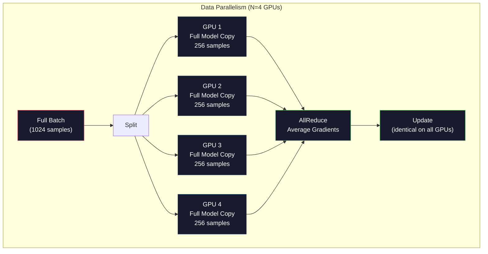
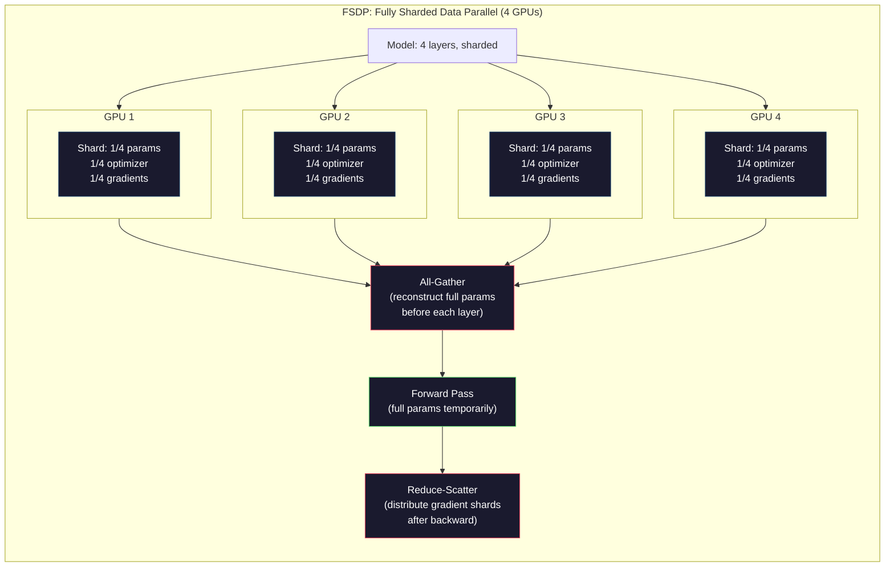
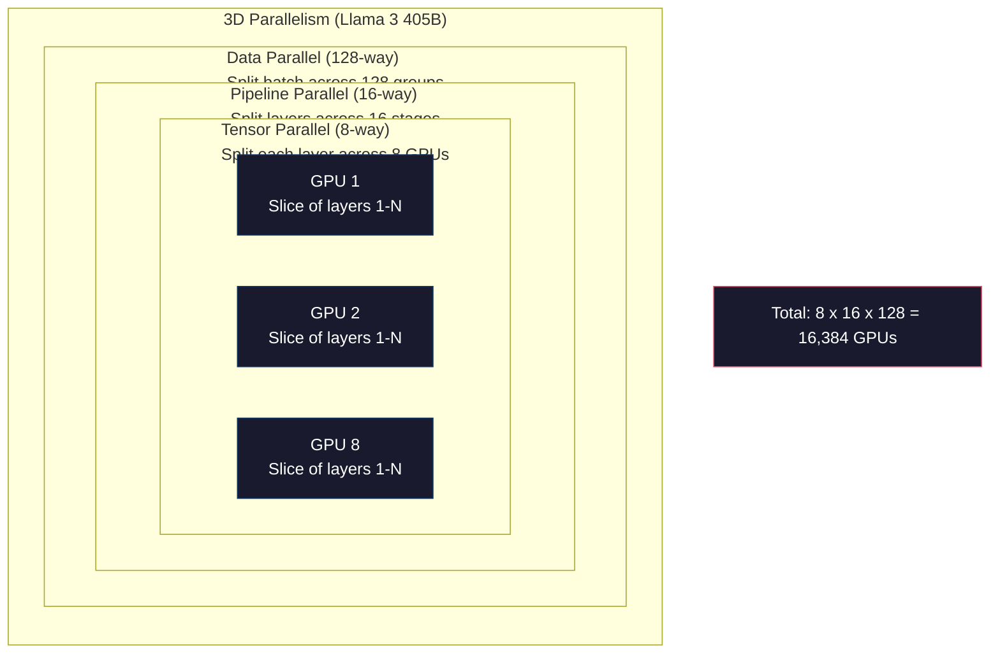

# Scaling：Distributed Training、FSDP、DeepSpeed

> 你的 124M 模型能在一张 GPU 上训练。现在试试 70 亿参数。模型放不进内存。数据在单机上要跑好几周。规模上来后，distributed training 不是可选项。它是唯一的路。

**类型：** 构建
**语言：** Python
**前置要求：** 阶段 10，第 04 课（Pre-Training a Mini GPT）
**时间：** ~120 分钟

## 学习目标

- 解释三种 parallelism（data、tensor、pipeline），以及根据模型大小和集群规模判断何时需要每一种
- 使用 PyTorch DDP 实现 data-parallel training，并在多 GPU 间同步 gradients
- 计算给定模型大小的 memory budget（weights + optimizer states + gradients + activations），从而确定最低硬件需求
- 配置 FSDP 或 DeepSpeed ZeRO stages，把 model states shard 到多个 GPU 上，以容纳超过单卡内存的模型

## 问题

一个 7B 参数模型用 FP16 仅权重就需要 14GB。Adam optimizer 会为每个参数存储两个额外副本（first 和 second moment estimates）。这又是 28GB。backpropagation 期间的 gradients 再加 14GB。在存储任何 activation 之前，你已经用掉 56GB。

一张 NVIDIA A100 有 80GB 显存。

80GB 中的 56GB 已经被占用。剩下 24GB 给 activations，也就是 forward pass 中计算出来、必须保留给 backpropagation 的中间值。对于 2048-token 序列和 4096 维模型，单层 activations 大约用 64MB。32 层就需要每个 sample 2GB。batch size 8 需要 16GB。你有 24GB。batch size 12 就炸。

现在试试 70B 参数。仅权重：FP16 下 140GB。单张 GPU 放不下。至少需要 2 张 A100（2 x 80GB = 160GB）才能放下权重。加上 optimizer states 和 gradients 后需要更多：最低 3+ GPU，现实中取决于 sharding strategy，通常是 8-16 张。

Llama 3 405B 在 16,384 张 NVIDIA H100 GPU 上训练。据估算，这次训练花费了 1 亿美元计算成本。DeepSeek V3 通过更聪明的架构（Mixture of Experts 表示每个 token 只激活一部分参数）和训练效率，以大约 560 万美元训练出可比模型。

本课覆盖让大规模训练成为可能的四种策略：data parallelism、tensor parallelism、pipeline parallelism 和 fully sharded data parallelism。你会先用纯 Python 模拟每一种机制，在接触 distributed training framework 之前理解它们的内部工作方式。

## 概念

### 为什么必须分布式

下面是真实模型的内存数学。每个数字都是计算得出，不是估计。

| Model | Params | Weights (FP16) | Adam States | Gradients (FP16) | Total (no activations) |
|-------|--------|----------------|-------------|------------------|----------------------|
| GPT-2 Small | 124M | 248 MB | 992 MB | 248 MB | 1.5 GB |
| Llama 3 8B | 8B | 16 GB | 64 GB | 16 GB | 96 GB |
| Llama 3 70B | 70B | 140 GB | 560 GB | 140 GB | 840 GB |
| Llama 3 405B | 405B | 810 GB | 3,240 GB | 810 GB | 4,860 GB |

“Adam States” 这一列才是杀手。Adam 为每个参数保存 running mean（m）和 running variance（v），两者都是 FP32。对于 70B 模型，就是 70B x 4 bytes x 2 = 560GB。光 optimizer 就需要七张 A100。

单张 H100 有 80GB。Llama 3 405B 至少需要 61 张 H100 才能容纳 weights、optimizer 和 gradients。再加 activations，数量还会继续增长。Meta 使用 16,384 张 GPU 不是因为他们想，而是因为必须。

### Data Parallelism

最简单的分布式策略。把完整模型复制到 N 张 GPU。把每个训练 batch 分成 N 等份。每张 GPU 在自己的 data shard 上运行 forward 和 backward pass。backward 后，把所有 GPU 上的 gradients 求平均。每张 GPU 用同样的 averaged gradients 更新自己的权重副本，让所有副本保持同步。

**优点：** throughput 近似线性扩展。N 张 GPU 每步处理 N 倍数据。通信只限于 gradient averaging，并且可以与计算重叠。

**缺点：** 每张 GPU 都保存完整模型、optimizer states 和 gradients。对于 70B 模型，每张 GPU 需要 840GB。Data parallelism 不会减少 per-GPU memory，只会缩短训练时间。

**数学：** Effective batch size = per_gpu_batch_size x N。N=64 GPU、per-GPU batch 16 时，effective batch 是 1,024。Llama 3 使用的 effective batch size 是每步 1600 万 token。



### Tensor Parallelism

把单个 layer 切分到多张 GPU。一次矩阵乘法被拆给多张 GPU，每张计算结果的一部分。

考虑 feedforward layer 中 shape 为 (8192, 8192) 的 weight matrix。使用 4-way tensor parallelism 时，每张 GPU 保存一个 (8192, 2048) shard。每张 GPU 用输入乘自己的 shard，产生 partial result。partial results 通过 all-reduce 或 all-gather 合并，得到完整输出。

**优点：** 减少每张 GPU 的 model weights 内存。把 70B 模型切到 8 张 GPU 上，每张 GPU 大约保存 8.75B 参数的权重。

**缺点：** 每层之后都需要快速 inter-GPU communication。每次 matmul 后的 all-reduce 会增加延迟。这在 NVLink 上效果很好（同节点 GPU 间 900 GB/s），但跨节点 InfiniBand 效果差（400 Gb/s，约 50 GB/s）。Tensor parallelism 几乎总是限制在单节点内（8 张 GPU）。

**真实使用：** Megatron-LM 开创了 tensor parallelism。Llama 3 405B 在每个节点内使用 8-way tensor parallelism。

### Pipeline Parallelism

按层切分模型。GPU 1 跑 layers 1-8。GPU 2 跑 layers 9-16。GPU 3 跑 layers 17-24。GPU 4 跑 layers 25-32。数据流过 pipeline：GPU 1 计算自己的层并把 activations 发送给 GPU 2，GPU 2 继续计算并发送给 GPU 3，依此类推。

**优点：** GPU 间通信很少，只传 layer boundary 的 activations；它们相对于 gradients 或 weights 很小。因为 bandwidth 需求低，所以可以跨节点工作。

**缺点：** Pipeline bubbles。当 GPU 4 正在对 micro-batch 1 做 forward pass 时，GPU 1、2、3 是空闲的（它们已经 forward 完自己的部分）。backward pass 时模式反转。朴素 pipelining 中，N 个 pipeline stages 的 GPU utilization 只有 1/N。

**GPipe 和 PipeDream** 通过把 batch 切成 micro-batches 解决 bubble 问题。GPU 1 一完成 micro-batch 1 的 forward，就开始 micro-batch 2。这会让 pipeline stages 之间的计算重叠。M 个 micro-batches 和 N 个 stages 时，bubble fraction 降到 (N-1)/M。N=4 stages、M=16 micro-batches 时，bubble 是 3/16 = 18.75% idle time。

### FSDP：Fully Sharded Data Parallel

FSDP 结合了 data parallelism 的可扩展性和 sharding 的内存效率。每张 GPU 不再保存完整模型，而是只保存 parameters、gradients 和 optimizer states 的 1/N。

某层 forward pass 之前，FSDP 运行 **all-gather**，把所有 GPU 上的参数 shard 收集起来，在每张 GPU 的内存中重建完整参数。forward pass 后，每张 GPU 丢弃非本地参数。backward 时，all-gather 再次运行，为 gradient computation 重建参数。backward 后，**reduce-scatter** 分发 gradient shards，让每张 GPU 只保存 1/N gradients。

**70B 模型在 8 张 GPU 上的数学：**

| Component | Without FSDP | With FSDP |
|-----------|-------------|-----------|
| Weights (FP16) | 140 GB per GPU | 17.5 GB per GPU |
| Adam States (FP32) | 560 GB per GPU | 70 GB per GPU |
| Gradients (FP16) | 140 GB per GPU | 17.5 GB per GPU |
| **Total** | **840 GB per GPU** | **105 GB per GPU** |

没有 FSDP，你无法把 70B 模型放进单张 80GB GPU。使用 8 张 GPU 的 FSDP，每张 GPU 用 105GB，等等，这仍然放不下。你至少需要 16 张 GPU 才能降到每张低于 80GB，或者把 FSDP 与 activation checkpointing 结合（backward 时重算 activations，而不是存储它们）。

通信成本高于普通 data parallelism，因为每层前都需要 all-gather。但内存节省让原本不可能的训练运行变得可能。



### DeepSpeed ZeRO

DeepSpeed 的 ZeRO（Zero Redundancy Optimizer）在概念上与 FSDP 相同，但由 Microsoft 独立开发。它定义了三个 stages，每个 stage 都更激进地 shard：

| Stage | Shards | Memory Savings | Communication |
|-------|--------|---------------|---------------|
| ZeRO-1 | Optimizer states only | ~4x reduction | Same as data parallel |
| ZeRO-2 | + Gradients | ~8x reduction | Slightly more |
| ZeRO-3 | + Parameters | ~Nx reduction (N GPUs) | All-gather per layer |

ZeRO-3 等价于 FSDP。名称不同，机制相同。DeepSpeed 证明概念后，PyTorch 添加了原生 FSDP 实现。

DeepSpeed 还引入了 ZeRO-Offload（把 optimizer states offload 到更便宜、更大的 CPU RAM）和 ZeRO-Infinity（offload 到 NVMe SSD）。这些方法用计算速度换内存容量：offloaded operations 更慢，但释放 GPU memory。

### Mixed Precision Training

现代训练会同时使用多种 floating-point formats：

- **Forward pass**：FP16 或 BF16（16-bit）。内存是 FP32 的一半。matmuls 在 tensor cores 上快 2 倍。
- **Master weights**：FP32（32-bit）。optimizer 用它们在 weight update 时保持数值精度。
- **Loss scaling**：backward pass 前把 loss 乘以大常数，防止 FP16 gradients underflow 到零。optimizer step 前再除回去。

BF16（Brain Float 16）有与 FP32 相同的 exponent range（8 exponent bits），但精度更低（7 mantissa bits vs FP32 的 23）。它很少需要 loss scaling，因为能表示同样范围的值。FP16 有 5 exponent bits 和 10 mantissa bits，可以表示更细粒度的值，但在极端数量级上更容易 overflow/underflow。

Google TPU 原生使用 BF16。NVIDIA A100 和 H100 同时支持 FP16 和 BF16。行业基本转向 BF16，因为它消除了 loss scaling 的麻烦。

**7B 模型的内存比较：**

| Precision | Weights | Optimizer | Gradients | Total |
|-----------|---------|-----------|-----------|-------|
| FP32 everywhere | 28 GB | 56 GB | 28 GB | 112 GB |
| Mixed (BF16 + FP32 master) | 14 GB | 56 GB | 14 GB | 84 GB |

Mixed precision 在这个模型上节省 28GB。optimizer states 无论如何都保持 FP32，这是大部分内存所在。

### Megatron-LM 与 3D Parallelism

真实大规模训练会组合三种 parallelism：

- **Data parallelism** 跨节点组（扩大 batch size）
- **Tensor parallelism** 在节点内（把 layers 切到 8 张 GPU 上）
- **Pipeline parallelism** 跨节点（把 layer groups 切到多台机器）

Llama 3 405B 在 16,384 张 H100 上：

- 每个节点内 8-way tensor parallelism（每节点 8 张 GPU）
- 跨节点 16-way pipeline parallelism（16 个 pipeline stages）
- 剩余维度上 128-way data parallelism（16,384 / 8 / 16 = 128）

这个 3D decomposition（8 x 16 x 128 = 16,384）就是扩展到数千张 GPU 的方式。每张 GPU 看到不同 data shard（data parallel），保存每层的一片（tensor parallel），并计算不同的一组 layers（pipeline parallel）。

DeepSeek V3 走了不同路线。它的 Mixture of Experts 架构每个 token 只激活 671B 参数中的 37B。这意味着每张 GPU 只需要计算（并为其存储 activations）active parameters。他们在 2,048 张 H800 GPU 上训练，GPU 数不到 Meta 的 1/8，成本为 560 万美元，而 Meta 估计约 1 亿美元。



## 构建它

### 第 1 步：模拟 Data Parallelism

把 batch 切到模拟 GPU 上。每张 GPU 在自己的 shard 上计算 forward pass。平均“gradients”（这里用 loss values 模拟）。

```python
import numpy as np

def simulate_data_parallelism(data, num_gpus, model_fn):
    batch_size = len(data)
    shard_size = batch_size // num_gpus
    remainder = batch_size % num_gpus

    gpu_losses = []
    gpu_gradients = []

    offset = 0
    for gpu_id in range(num_gpus):
        extra = 1 if gpu_id < remainder else 0
        shard = data[offset:offset + shard_size + extra]
        offset += shard_size + extra

        loss, grad = model_fn(shard)
        gpu_losses.append(loss)
        gpu_gradients.append(grad)

    avg_loss = np.mean(gpu_losses)
    avg_gradient = np.mean(gpu_gradients, axis=0)

    return avg_loss, avg_gradient
```

all-reduce 操作（平均 gradients）是 data parallelism 中唯一的通信。实践中，NVIDIA GPU 使用 NCCL library，它实现 ring all-reduce：每张 GPU 把自己 gradients 的 1/N 发送给邻居，从另一个邻居接收 1/N，经过 N-1 步后每张 GPU 都拥有完整平均值。总通信量：2 x gradient_size x (N-1)/N，N 很大时接近 gradient size 的 2 倍。

### 第 2 步：模拟 Tensor Parallelism

把 weight matrix 切到多张 GPU。每张 GPU 计算 partial matrix multiplication。合并结果。

```python
def simulate_tensor_parallelism(input_data, weight_matrix, num_gpus):
    d_in, d_out = weight_matrix.shape
    assert d_out % num_gpus == 0, f"d_out {d_out} not divisible by num_gpus {num_gpus}"
    shard_size = d_out // num_gpus

    partial_results = []
    for gpu_id in range(num_gpus):
        start = gpu_id * shard_size
        end = start + shard_size
        weight_shard = weight_matrix[:, start:end]

        partial = input_data @ weight_shard
        partial_results.append(partial)

    full_output = np.concatenate(partial_results, axis=-1)

    direct_output = input_data @ weight_matrix
    error = np.abs(full_output - direct_output).max()

    return full_output, error
```

error 应该正好为零（或 machine epsilon）。Tensor parallelism 在数学上是精确的，结果与在单张 GPU 上计算完整 matmul 相同。这里沿输出维度切分，所以每张 GPU 产生不同列 chunk，concatenation 重建完整结果。

对于 column-parallel linear layers（切输出维度），你 concatenate。对于 row-parallel（切输入维度），你 sum。在 transformer FFN 中，第一个 linear（expand）使用 column-parallel，第二个 linear（contract）使用 row-parallel。这样可以避免两个 layer 之间的 all-reduce。

### 第 3 步：模拟 Pipeline Parallelism

把模型 layers 切到虚拟 GPU 上。展示 bubble 问题：早期 stages 在后期 stages 计算时会空闲。

```python
def simulate_pipeline_parallelism(num_layers, num_stages, num_microbatches):
    layers_per_stage = num_layers // num_stages

    timeline = {}
    clock = 0

    for mb in range(num_microbatches):
        for stage in range(num_stages):
            start_time = max(
                timeline.get((stage, mb - 1, "fwd"), (0, 0))[1] if mb > 0 else 0,
                timeline.get((stage - 1, mb, "fwd"), (0, 0))[1] if stage > 0 else 0,
            )
            end_time = start_time + layers_per_stage
            timeline[(stage, mb, "fwd")] = (start_time, end_time)

    last_fwd_end = max(v[1] for v in timeline.values())

    for mb in range(num_microbatches - 1, -1, -1):
        for stage in range(num_stages - 1, -1, -1):
            deps = [last_fwd_end]
            if mb < num_microbatches - 1 and (stage, mb + 1, "bwd") in timeline:
                deps.append(timeline[(stage, mb + 1, "bwd")][1])
            if stage < num_stages - 1 and (stage + 1, mb, "bwd") in timeline:
                deps.append(timeline[(stage + 1, mb, "bwd")][1])
            start_time = max(deps)
            end_time = start_time + layers_per_stage
            timeline[(stage, mb, "bwd")] = (start_time, end_time)

    total_time = max(v[1] for v in timeline.values())
    compute_time = num_microbatches * num_stages * layers_per_stage * 2
    bubble_fraction = 1.0 - compute_time / (total_time * num_stages)

    return timeline, total_time, bubble_fraction
```

4 个 stages、1 个 micro-batch 时，bubble fraction 是 75%，也就是任意时刻四张 GPU 中有三张空闲。16 个 micro-batches 时，它会降到约 19%。消除 bubbles 的代价是内存：你必须同时存储所有 in-flight micro-batches 的 activations。

### 第 4 步：内存计算器

计算训练任意模型大小的精确内存需求。

```python
def memory_calculator(
    params_billions,
    precision_bytes=2,
    optimizer="adam",
    num_gpus=1,
    sharding="none",
    sequence_length=2048,
    batch_size_per_gpu=1,
    hidden_dim=None,
    num_layers=None,
):
    params = params_billions * 1e9

    weight_memory = params * precision_bytes

    if optimizer == "adam":
        optimizer_memory = params * 4 * 2
    elif optimizer == "sgd":
        optimizer_memory = params * 4
    else:
        optimizer_memory = 0

    gradient_memory = params * precision_bytes

    total_no_activation = weight_memory + optimizer_memory + gradient_memory

    if hidden_dim and num_layers:
        activation_per_layer = (
            sequence_length * batch_size_per_gpu * hidden_dim * precision_bytes * 4
        )
        activation_memory = activation_per_layer * num_layers
    else:
        activation_memory = params * precision_bytes * 0.5

    if sharding == "fsdp" or sharding == "zero3":
        weight_memory /= num_gpus
        optimizer_memory /= num_gpus
        gradient_memory /= num_gpus
    elif sharding == "zero2":
        optimizer_memory /= num_gpus
        gradient_memory /= num_gpus
    elif sharding == "zero1":
        optimizer_memory /= num_gpus

    per_gpu_total = weight_memory + optimizer_memory + gradient_memory + activation_memory

    return {
        "params_billions": params_billions,
        "weights_gb": weight_memory / 1e9,
        "optimizer_gb": optimizer_memory / 1e9,
        "gradients_gb": gradient_memory / 1e9,
        "activations_gb": activation_memory / 1e9,
        "per_gpu_total_gb": per_gpu_total / 1e9,
        "total_across_gpus_gb": per_gpu_total * num_gpus / 1e9,
        "fits_on_80gb": per_gpu_total / 1e9 <= 80,
        "num_gpus": num_gpus,
        "sharding": sharding,
    }
```

这个计算器回答每个 ML engineer 都会问的问题：“我需要多少张 GPU？”输入模型大小，看它是否放得下。调整 sharding strategy，直到 per-GPU total 低于 80GB。

### 第 5 步：Mixed Precision Simulation

比较 FP32、FP16 和 mixed precision training 的内存使用。

```python
def mixed_precision_comparison(params_billions):
    params = params_billions * 1e9

    fp32_weights = params * 4
    fp32_optimizer = params * 4 * 2
    fp32_gradients = params * 4
    fp32_total = fp32_weights + fp32_optimizer + fp32_gradients

    fp16_weights = params * 2
    fp16_master = params * 4
    fp16_optimizer = params * 4 * 2
    fp16_gradients = params * 2
    fp16_total = fp16_weights + fp16_master + fp16_optimizer + fp16_gradients

    mixed_weights = params * 2
    mixed_optimizer = params * 4 * 2
    mixed_gradients = params * 2
    mixed_total = mixed_weights + mixed_optimizer + mixed_gradients

    return {
        "fp32_total_gb": fp32_total / 1e9,
        "fp16_with_master_gb": fp16_total / 1e9,
        "mixed_bf16_gb": mixed_total / 1e9,
        "savings_vs_fp32": 1 - mixed_total / fp32_total,
    }
```

对多数人来说最大的意外是：mixed precision 不会把内存减半。optimizer states（Adam 的 m 和 v）无论精度如何都保持 FP32。7B 模型中，FP32 训练使用 112GB。Mixed precision 使用 84GB。这是 25% reduction，不是 50%。optimizer 占主导。

## 使用它

### 运行所有模拟

```python
def run_all_demos():
    print("=" * 70)
    print("DATA PARALLELISM SIMULATION")
    print("=" * 70)

    np.random.seed(42)
    data = np.random.randn(64, 32)
    weight = np.random.randn(32, 16)

    def model_fn(batch):
        output = batch @ weight
        loss = np.mean(output ** 2)
        grad = 2 * batch.T @ (batch @ weight) / len(batch)
        return loss, grad

    for n_gpus in [1, 2, 4, 8]:
        loss, grad = simulate_data_parallelism(data, n_gpus, model_fn)
        print(f"  {n_gpus} GPUs: loss={loss:.4f}, grad_norm={np.linalg.norm(grad):.4f}")

    print()
    print("=" * 70)
    print("TENSOR PARALLELISM SIMULATION")
    print("=" * 70)

    x = np.random.randn(4, 8192)
    W = np.random.randn(8192, 8192)

    for n_gpus in [1, 2, 4, 8]:
        output, error = simulate_tensor_parallelism(x, W, n_gpus)
        print(f"  {n_gpus} GPUs: output_shape={output.shape}, max_error={error:.2e}")

    print()
    print("=" * 70)
    print("PIPELINE PARALLELISM SIMULATION")
    print("=" * 70)

    for n_mb in [1, 4, 8, 16, 32]:
        _, total_t, bubble = simulate_pipeline_parallelism(32, 4, n_mb)
        print(f"  {n_mb:2d} micro-batches: total_time={total_t:4d}, bubble={bubble:.1%}")

    print()
    print("=" * 70)
    print("MEMORY CALCULATOR")
    print("=" * 70)

    configs = [
        (7, "none", 1),
        (7, "fsdp", 8),
        (70, "none", 1),
        (70, "fsdp", 8),
        (70, "fsdp", 16),
        (405, "fsdp", 64),
        (405, "fsdp", 128),
    ]

    print(f"  {'Model':>8} {'Sharding':>8} {'GPUs':>5} {'Per-GPU':>10} {'Fits 80GB':>10}")
    print("  " + "-" * 50)
    for params, shard, gpus in configs:
        result = memory_calculator(params, num_gpus=gpus, sharding=shard)
        fits = "Yes" if result["fits_on_80gb"] else "No"
        print(f"  {params:>6}B {shard:>8} {gpus:>5} {result['per_gpu_total_gb']:>8.1f}GB {fits:>10}")

    print()
    print("=" * 70)
    print("MIXED PRECISION COMPARISON")
    print("=" * 70)

    for params_b in [7, 13, 70, 405]:
        result = mixed_precision_comparison(params_b)
        print(f"  {params_b}B: FP32={result['fp32_total_gb']:.0f}GB, "
              f"Mixed BF16={result['mixed_bf16_gb']:.0f}GB, "
              f"Savings={result['savings_vs_fp32']:.0%}")
```

## 交付它

本课会产出 `outputs/prompt-distributed-training-planner.md`，这是一个 prompt：输入模型大小和可用硬件，它会生成完整 distributed training plan，包括 parallelism strategy、memory budget、communication overhead 和 expected throughput。

## 练习

1. 修改 memory calculator，加入 activation checkpointing。使用 checkpointing 时，只在每 K 层存储 activations（典型 K=1，表示全部重算）。展示 memory-compute tradeoff：checkpointing 能省多少内存，又会让训练慢多少（full checkpointing 大约多 33% compute）？

2. 扩展 pipeline parallelism simulation，实现 PipeDream 使用的 1F1B（one forward, one backward）schedule。对 4 stages 和 8 micro-batches，将 bubble fraction 与 naive schedule 比较。1F1B schedule 应该因为更早开始 backward pass 而有更小的 peak memory。

3. 实现 gradient accumulation simulator。不要在每个 micro-batch 后 all-reduce，而是本地累积 K 步 gradients，然后 all-reduce。展示这如何把通信减少 K 倍，同时产生相同的最终 gradients（因此训练相同）。

4. 构建 cost estimator。给定模型大小、目标 token 数、GPU 类型（A100 每小时 $2，H100 每小时 $3.50）和 parallelism strategy，估算总训练成本。用已知成本验证：Llama 3 405B 据称约 $100M，DeepSeek V3 约 $5.6M。

5. 给 memory calculator 添加 ZeRO-Offload。假设每节点 CPU RAM 为 512GB、NVMe 为 2TB。展示把 optimizer states offload 到 CPU 如何让 70B 模型在 4 张 GPU 而不是 16 张上训练，代价是 optimizer steps 慢 30-50%。

## 关键词

| Term | What people say | What it actually means |
|------|----------------|----------------------|
| Data parallelism | “把模型复制到每张 GPU” | 每张 GPU 处理不同 data shard；每步后通过 all-reduce 平均 gradients |
| Tensor parallelism | “把一个 layer 切到多张 GPU” | 切分 weight matrices，让每张 GPU 计算 matmul 的一部分；需要高速 NVLink interconnect |
| Pipeline parallelism | “把 layers 切到多张 GPU” | 每张 GPU 运行不同 layer group；数据通过 pipeline 流动，用 micro-batches 减少 bubbles |
| FSDP | “Shard everything” | Fully Sharded Data Parallel：每张 GPU 保存 weights、gradients 和 optimizer states 的 1/N；计算前 all-gather |
| ZeRO | “DeepSpeed 版 FSDP” | Zero Redundancy Optimizer，有 3 个 stages：shard optimizer（Stage 1）、+ gradients（Stage 2）、+ parameters（Stage 3） |
| All-reduce | “跨 GPU 求平均” | collective operation，让每张 GPU 最终得到所有 GPU 输入的和（或平均）；通常实现为 ring all-reduce |
| All-gather | “从所有 GPU 收集” | collective operation，让每张 GPU 最终得到所有 GPU 数据的拼接；FSDP 中用于重建完整参数 |
| Reduce-scatter | “求和并分发” | collective operation，对数据做 reduce（求和）并把不同 chunk scatter 给不同 GPU；FSDP 中用于 gradient sharding |
| Mixed precision | “半精度训练” | forward/backward 使用 FP16/BF16，optimizer states 使用 FP32；因为 optimizer 占主导，省约 25% 内存，不是 50% |
| Pipeline bubble | “pipeline 中的空闲时间” | GPU 等待前一 stage 数据而空闲的时间比例；可通过更多 micro-batches 降低 |

## 延伸阅读

- [Rajbhandari et al., 2020 -- "ZeRO: Memory Optimizations Toward Training Trillion Parameter Models"](https://arxiv.org/abs/1910.02054) -- 定义三个 sharding stages 的 DeepSpeed ZeRO 论文
- [Shoeybi et al., 2020 -- "Megatron-LM: Training Multi-Billion Parameter Language Models Using Model Parallelism"](https://arxiv.org/abs/1909.08053) -- NVIDIA 用于 transformers 的 tensor parallelism
- [Narayanan et al., 2021 -- "Efficient Large-Scale Language Model Training on GPU Clusters Using Megatron-LM"](https://arxiv.org/abs/2104.04473) -- 结合 data、tensor 和 pipeline 的 3D parallelism
- [Zhao et al., 2023 -- "PyTorch FSDP: Experiences on Scaling Fully Sharded Data Parallel"](https://arxiv.org/abs/2304.11277) -- PyTorch 原生 FSDP 实现
- [Llama 3 Technical Report](https://arxiv.org/abs/2407.21783) -- 使用 3D parallelism 和 16,384 GPU 的训练细节
- [DeepSeek-V3 Technical Report](https://arxiv.org/abs/2412.19437) -- MoE 架构如何把训练成本降低一个数量级
