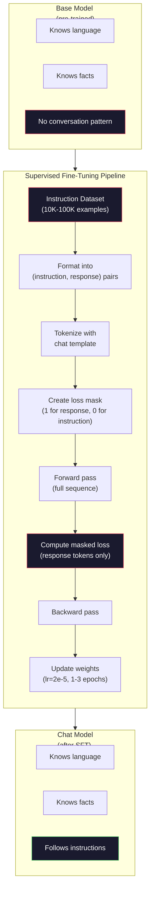

# Instruction Tuning（SFT）

> base model 只预测下一个 token。仅此而已。它不会遵循指令、回答问题，也不会拒绝有害请求。SFT 是 token predictor 和有用 assistant 之间的桥梁。你聊过的每个模型，Claude、GPT、Llama Chat，都经过了这一步。

**类型：** 构建
**语言：** Python（with numpy）
**前置要求：** 阶段 10，第 04 课（Pre-Training a Mini GPT）
**时间：** ~90 分钟

## 学习目标

- 实现 supervised fine-tuning（SFT），把 base language model 转换成 instruction-following assistant
- 使用包含 system、user 和 assistant roles 的 chat templates 格式化训练数据，并 mask 掉非 assistant tokens 的 loss
- 解释为什么 SFT 必要：base models 会继续文本，而不是回答问题
- 在 held-out instruction set 上比较 base model 和 fine-tuned model responses，评估 SFT 质量

## 问题

你在第 04 课训练了一个模型。它能在给定序列时预测下一个 token。给它 `"The transformer architecture"`，它可能接着生成 `"has revolutionized natural language processing."`。这对 next-token predictor 来说很厉害。

现在试试这个：给它 `"What is the capital of France?"`。base model 不会回答 `"Paris."`。它会继续这个模式。它可能生成 `"What is the capital of Germany? What is the capital of Spain?"`，因为它从包含问题列表的文档中学到了这种模式。或者它可能生成 `"is a question that many people ask"`，因为这是一个合理的 next-token continuation。模型没有 *answering* 的概念。它只知道 *continuing*。

这就是 GPT-3（base model，2020 年 6 月发布）和 ChatGPT（instruction-tuned，2022 年 11 月发布）之间的差距。相同架构。相同 pre-training。差别在于 20,000 到 100,000 个精心构造的（instruction, response）pairs，它们教会模型遵循对话模式。

Stanford Alpaca 证明你不需要百万级示例。2023 年 3 月，他们只用 GPT-3.5 生成的 52,000 个 instruction-response pairs fine-tune 了 Llama 7B。总成本：600 美元。结果是一个能遵循指令、回答问题并进行对话的 chatbot。虽然不如 ChatGPT，但以 600 美元和几个小时训练时间来说，已经令人震惊地接近。

Meta 的 Llama 2 Chat 在初始 SFT 阶段只使用了约 27,000 个高质量示例。关键洞见是：质量比数量更重要。由熟练 annotators 编写的 27,000 个示例，胜过从互联网抓取的 100 万个嘈杂示例。

## 概念

### SFT 实际做了什么

Supervised Fine-Tuning 延续 pre-training 中同样的训练循环：forward pass、compute loss、backward pass、update weights，但数据类型不同。你不再训练原始文本，而是训练结构化对话：

```json
{
  "system": "You are a helpful assistant.",
  "user": "What is the capital of France?",
  "assistant": "The capital of France is Paris."
}
```

模型已经知道巴黎是法国首都。它在 Wikipedia、教材和网页上的 pre-training 中学过这个事实。SFT 不教模型新事实。它教模型一种新 *行为*：看到问题，就产生答案。看到指令，就产生完成。看到有害请求，就产生拒绝。

可以这样理解：Pre-training 给模型知识。SFT 给模型礼貌。

### 数据格式

行业中主导的是三种格式。它们编码的是同一类信息：谁说了什么，只是 delimiter 不同。

**Alpaca Format**（Stanford，2023 年 3 月）：

```json
{
  "instruction": "Summarize the following article in 3 sentences.",
  "input": "The European Central Bank raised interest rates...",
  "output": "The ECB increased rates by 25 basis points..."
}
```

简单且使用广泛。`input` 字段是可选的，许多 instruction 不需要额外上下文。Stanford 发布了 52,000 个这种格式的示例，由 GPT-3.5 生成，成本 600 美元。这开启了 open-source instruction tuning 运动。

**ShareGPT Format**（社区，2023）：

```json
{
  "conversations": [
    {"from": "system", "value": "You are a helpful assistant."},
    {"from": "human", "value": "What causes tides?"},
    {"from": "gpt", "value": "Tides are caused by the gravitational pull of the Moon..."},
    {"from": "human", "value": "How often do they occur?"},
    {"from": "gpt", "value": "Most coastal areas experience two high tides and two low tides per day..."}
  ]
}
```

支持 multi-turn conversations。`from` 字段按惯例使用 `"human"` 和 `"gpt"`，无论实际模型是什么。Vicuna 在 70,000 条 ShareGPT conversations 上训练，这些数据来自用户分享的 ChatGPT transcripts。

**ChatML Format**（OpenAI，许多开源模型也使用）：

```
<|im_start|>system
You are a helpful assistant.<|im_end|>
<|im_start|>user
What is the capital of France?<|im_end|>
<|im_start|>assistant
The capital of France is Paris.<|im_end|>
```

使用 special tokens（`<|im_start|>`、`<|im_end|>`）分隔 roles。这些 token 会在 fine-tuning 期间添加到 tokenizer 的词表中。Qwen、Yi 和许多其他模型使用 ChatML。

三种格式完成同一件事：告诉模型“这是 instruction，这是 response，学习这个模式。”

### 为什么它有效

模型已经从 pre-training 中学会语言。它见过数十亿个问题后接答案、指令后接完成、人与人对话的示例。这些模式已经编码在 weights 中。

SFT 会集中这种潜在能力。模型不再需要从上下文中猜测它应该回答问题还是继续文档，SFT 明确在对话模式上训练。几千个示例之后，模型学会：看到 assistant role marker，就生成有帮助的回答。

这就是 27,000 个示例足够的原因。你不是在教模型英语。你不是在教它世界知识。你在教一个简单行为：响应指令。知识已经在那里。

### Masked Loss

这是 SFT 中最重要的技术细节，而大多数教程会跳过它。

pre-training 期间，你对每个 token 计算 loss。模型学习预测序列中的每个 next token。SFT 期间，你只对 *response* tokens 计算 loss。instruction tokens 作为上下文存在，但模型不会因为“预测”它们错误而受到惩罚。

为什么？因为你不希望模型学会 *生成* 指令。你希望它学会 *响应* 指令。如果你对 instruction tokens 计算 loss，你就在训练模型预测 `"What is the capital of France?"`，仿佛它才是提问者。这会浪费 gradient signal，并可能混淆模型角色。

实践中，你创建一个 loss mask：response tokens 为 1，instruction tokens 为 0。把 per-token loss 乘以这个 mask 后再平均。

```
Tokens:    [SYS] You are helpful [USER] What is the capital? [ASST] Paris is the capital [EOS]
Loss mask:   0    0    0     0      0     0   0  0     0       1     1    1   1     1      1
```

只有 `[ASST]` 之后的 tokens 对 loss 有贡献。forward pass 时模型看到完整对话（它需要 instruction 才能产生正确 response），但只有根据它预测 response 的好坏来更新 weights。

### 训练超参数

SFT 使用的 hyperparameters 与 pre-training 截然不同。你不是从零训练。你是在微调一个已经工作的模型。

| Parameter | Pre-Training (Llama 2 7B) | SFT (Llama 2 Chat) |
|-----------|---------------------------|---------------------|
| Learning rate | 3e-4 (peak) | 2e-5 |
| Epochs | 1 (single pass over data) | 2 |
| Batch size | 4M tokens | 64 examples |
| Warmup steps | 2,000 | 0-100 |
| Weight decay | 0.1 | 0.0-0.1 |
| Data size | 2T tokens | 27,000 examples |

SFT 的 learning rate 低 15 倍。这很关键。fine-tuning 时使用高 learning rate 会破坏 pre-trained knowledge。模型会“忘记”学过的东西，并 overfit 到很小的 fine-tuning dataset。这就是 catastrophic forgetting。

两个 epochs 表示模型看到每个训练示例两次。在小 dataset 上超过 3 个 epochs 会导致 memorization，模型开始逐字复现训练示例，而不是泛化。

### Catastrophic Forgetting

Fine-tuning 可能摧毁通用能力。你在 instruction-following data 上训练太久，模型会失去写代码、做数学或创作文本的能力。它会非常擅长训练数据的特定格式，但对其他事情都很糟。

三种缓解方法：

1. **Low learning rate。** 1e-5 到 5e-5。更小更新意味着更少破坏 pre-trained features。

2. **Short training。** 1-3 epochs。在模型 overfit 前停止。

3. **Mix in pre-training data。** Llama 2 Chat 在 SFT dataset 中混入少量（2-5%）原始 pre-training data。这会在学习新 instruction-following 行为的同时，“提醒”模型保持通用能力。

### 真实数字

在 10,000 个高质量 instruction pairs 上 fine-tune 一个 7B 模型，在单张 NVIDIA A100 80GB GPU 上大约需要 1 小时。数学如下：

- 10,000 examples x 平均 512 tokens = 5.12M tokens
- 2 epochs = 总计 10.24M tokens
- A100 上 7B model fine-tuning throughput：~3,000 tokens/second
- 10.24M / 3,000 = ~3,400 seconds = ~57 minutes

对于我们的 mini GPT（4 layers、128 dims），训练几乎瞬间完成。重点是理解机制，而不是规模。



## 构建它

### 第 1 步：Instruction Dataset

创建一个 synthetic instruction dataset。生产中，Scale AI 和 Anthropic 这类公司会雇用人工 annotators 编写这些数据。我们会用程序生成它们来演示格式。

```python
import numpy as np

INSTRUCTION_DATA = [
    {
        "instruction": "What is the capital of France?",
        "response": "The capital of France is Paris."
    },
    {
        "instruction": "Explain gravity in one sentence.",
        "response": "Gravity is the force that attracts objects with mass toward each other."
    },
    {
        "instruction": "Write a haiku about the ocean.",
        "response": "Waves crash on the shore, salt and foam beneath the sun, endless blue expanse."
    },
    {
        "instruction": "What is 15 multiplied by 7?",
        "response": "15 multiplied by 7 is 105."
    },
    {
        "instruction": "Name three programming languages.",
        "response": "Three programming languages are Python, Rust, and TypeScript."
    },
    {
        "instruction": "Summarize photosynthesis.",
        "response": "Photosynthesis converts sunlight, water, and carbon dioxide into glucose and oxygen."
    },
    {
        "instruction": "What year did World War II end?",
        "response": "World War II ended in 1945."
    },
    {
        "instruction": "Define machine learning.",
        "response": "Machine learning is a field where algorithms learn patterns from data to make predictions."
    },
]
```

8 个示例很小。Stanford Alpaca 用了 52,000 个。但无论你有 8 个还是 52,000 个，机制都相同：tokenize、mask、只在 responses 上计算 loss。

### 第 2 步：使用 Chat Template Tokenize

把 instruction-response pairs 转换成带 special role markers 的 token sequences。markers 告诉模型 instruction 在哪里结束，response 从哪里开始。

```python
SPECIAL_TOKENS = {
    "INST_START": 253,
    "INST_END": 254,
    "RESP_START": 255,
}


def tokenize_instruction_pair(instruction, response, vocab_size=256):
    inst_tokens = list(instruction.encode("utf-8"))
    resp_tokens = list(response.encode("utf-8"))

    inst_tokens = [min(t, vocab_size - 4) for t in inst_tokens]
    resp_tokens = [min(t, vocab_size - 4) for t in resp_tokens]

    tokens = (
        [SPECIAL_TOKENS["INST_START"]]
        + inst_tokens
        + [SPECIAL_TOKENS["INST_END"]]
        + [SPECIAL_TOKENS["RESP_START"]]
        + resp_tokens
    )

    return tokens


def create_loss_mask(tokens):
    mask = np.zeros(len(tokens), dtype=np.float32)
    in_response = False

    for i, token in enumerate(tokens):
        if token == SPECIAL_TOKENS["RESP_START"]:
            in_response = True
            continue
        if in_response:
            mask[i] = 1.0

    return mask
```

loss mask 对 instruction tokens 全是 0，对 response tokens 全是 1。`RESP_START` token 本身 mask 为 0，因为它是 delimiter，不是 response 内容的一部分。

### 第 3 步：Masked Cross-Entropy Loss

标准 cross-entropy，但乘以 loss mask。只有 response tokens 对 gradient 有贡献。

```python
def masked_cross_entropy_loss(logits, targets, loss_mask):
    batch, seq_len, vocab_size = logits.shape
    logits_flat = logits.reshape(-1, vocab_size)
    targets_flat = targets.reshape(-1)
    mask_flat = loss_mask.reshape(-1)

    max_logits = logits_flat.max(axis=-1, keepdims=True)
    log_softmax = logits_flat - max_logits - np.log(
        np.exp(logits_flat - max_logits).sum(axis=-1, keepdims=True)
    )

    per_token_loss = -log_softmax[np.arange(len(targets_flat)), targets_flat]

    masked_loss = per_token_loss * mask_flat
    num_response_tokens = mask_flat.sum()
    if num_response_tokens == 0:
        return 0.0
    loss = masked_loss.sum() / num_response_tokens

    return loss
```

分母是 `num_response_tokens`，不是 `seq_len`。如果除以总序列长度，更长 instruction 会稀释 gradient signal。除以 response token count 可以保证每个 response token 的权重相同，不受 instruction 长度影响。

### 第 4 步：SFT Training Loop

复用第 04 课的 MiniGPT。training loop 看起来几乎和 pre-training 一样，但增加了 instruction formatting 和 masked loss。

```python
import sys
import os
sys.path.insert(0, os.path.join(os.path.dirname(__file__), "..", "..", "04-pre-training-mini-gpt", "code"))
from main import MiniGPT, LayerNorm, FeedForward, MultiHeadAttention, TransformerBlock, Embedding


def sft_train(model, dataset, num_epochs=2, lr=2e-5, seq_len=64):
    formatted_data = []
    for example in dataset:
        tokens = tokenize_instruction_pair(example["instruction"], example["response"])
        mask = create_loss_mask(tokens)
        formatted_data.append((tokens, mask))

    print(f"SFT Training: {len(formatted_data)} examples, {num_epochs} epochs, lr={lr}")
    print(f"Total tokens: {sum(len(t) for t, _ in formatted_data):,}")
    print()

    losses = []

    for epoch in range(num_epochs):
        epoch_loss = 0.0
        num_batches = 0

        indices = np.random.permutation(len(formatted_data))

        for idx in indices:
            tokens, mask = formatted_data[idx]

            if len(tokens) < 3:
                continue
            if len(tokens) > seq_len:
                tokens = tokens[:seq_len]
                mask = mask[:seq_len]

            input_ids = np.array(tokens[:-1]).reshape(1, -1)
            target_ids = np.array(tokens[1:]).reshape(1, -1)
            loss_mask = np.array(mask[1:]).reshape(1, -1)

            logits = model.forward(input_ids)
            loss = masked_cross_entropy_loss(logits, target_ids, loss_mask)

            batch_size, s_len, v_size = logits.shape
            probs = np.exp(logits - logits.max(axis=-1, keepdims=True))
            probs = probs / probs.sum(axis=-1, keepdims=True)
            dlogits = probs.copy()
            dlogits[np.arange(batch_size)[:, None], np.arange(s_len), target_ids] -= 1.0

            mask_expanded = loss_mask[:, :, np.newaxis]
            num_resp = loss_mask.sum()
            if num_resp > 0:
                dlogits = dlogits * mask_expanded / num_resp

            for block in model.blocks:
                block.ffn.W1 -= lr * np.random.randn(*block.ffn.W1.shape) * 0.01
                block.ffn.W2 -= lr * np.random.randn(*block.ffn.W2.shape) * 0.01
                block.ffn.b1 -= lr * np.random.randn(*block.ffn.b1.shape) * 0.01
                block.ffn.b2 -= lr * np.random.randn(*block.ffn.b2.shape) * 0.01

            epoch_loss += loss
            num_batches += 1
            losses.append(loss)

        avg_loss = epoch_loss / max(num_batches, 1)
        print(f"Epoch {epoch + 1}/{num_epochs} | Avg Loss: {avg_loss:.4f}")

    return model, losses
```

learning rate 是 2e-5，与 Llama 2 Chat 匹配。把它与 pre-training 中的 3e-4 比较，低 15 倍。gradient 被 masked：instruction tokens 产生零 gradient。只有 response tokens 推动 weights。

### 第 5 步：比较 Base 与 SFT Model

SFT 的核心目的就是改变行为。我们通过检查模型如何响应 instruction-formatted inputs 与 raw text continuations 来测量它。

```python
def generate_response(model, prompt_tokens, max_new_tokens=50, temperature=0.8):
    tokens = list(prompt_tokens)
    seq_len = model.embedding.pos_embed.shape[0]

    for _ in range(max_new_tokens):
        context = np.array(tokens[-seq_len:]).reshape(1, -1)
        logits = model.forward(context)
        next_logits = logits[0, -1, :]

        next_logits = next_logits / max(temperature, 1e-8)
        probs = np.exp(next_logits - next_logits.max())
        probs = probs / probs.sum()
        probs = np.clip(probs, 1e-10, 1.0)
        probs = probs / probs.sum()

        next_token = np.random.choice(len(probs), p=probs)
        tokens.append(int(next_token))

    return tokens


def evaluate_instruction_following(model, instructions):
    print("Evaluating instruction following:")
    print("-" * 50)

    for instruction in instructions:
        tokens = (
            [SPECIAL_TOKENS["INST_START"]]
            + [min(t, 252) for t in list(instruction.encode("utf-8"))]
            + [SPECIAL_TOKENS["INST_END"]]
            + [SPECIAL_TOKENS["RESP_START"]]
        )

        output = generate_response(model, tokens, max_new_tokens=30, temperature=0.6)
        response_start = len(tokens)
        response_tokens = output[response_start:]
        response_bytes = bytes([t for t in response_tokens if t < 128])
        response_text = response_bytes.decode("utf-8", errors="replace")

        print(f"  Q: {instruction}")
        print(f"  A: {response_text[:80]}")
        print()
```

在只有 8 个示例的 tiny model 上，responses 不会有实际意义。这是预期内的。重要的是 *结构*：模型会学习在 response marker 之后生成输出，而不是继续生成更多 instructions。

### 第 6 步：测量 Catastrophic Forgetting

比较 SFT 前后模型的 next-token prediction 能力。如果 SFT 损害了通用能力，raw text 上的 loss 会升高。

```python
def measure_forgetting(model, test_text, seq_len=64):
    tokens = np.array(list(test_text.encode("utf-8")[:512]))

    total_loss = 0.0
    num_windows = 0

    for start in range(0, len(tokens) - seq_len - 1, seq_len):
        input_ids = tokens[start:start + seq_len].reshape(1, -1)
        target_ids = tokens[start + 1:start + seq_len + 1].reshape(1, -1)

        logits = model.forward(input_ids)

        batch, s_len, vocab_size = logits.shape
        logits_flat = logits.reshape(-1, vocab_size)
        targets_flat = target_ids.reshape(-1)

        max_logits = logits_flat.max(axis=-1, keepdims=True)
        log_softmax = logits_flat - max_logits - np.log(
            np.exp(logits_flat - max_logits).sum(axis=-1, keepdims=True)
        )

        loss = -log_softmax[np.arange(len(targets_flat)), targets_flat].mean()
        total_loss += loss
        num_windows += 1

    return total_loss / max(num_windows, 1)
```

真实 fine-tuning 中，你会在整个训练过程中跟踪这个指标。如果 raw text loss 上升超过 10-15%，说明 SFT 太激进。降低 learning rate 或减少 epochs。

## 使用它

### 完整 SFT Pipeline Demo

```python
if __name__ == "__main__":
    np.random.seed(42)

    test_text = """The transformer architecture processes sequences through self-attention.
Each layer applies multi-head attention followed by a feedforward network.
Residual connections and layer normalization stabilize deep networks.
The model learns to predict the next token given all previous tokens."""

    print("=" * 70)
    print("INSTRUCTION TUNING (SFT) DEMO")
    print("=" * 70)
    print()

    model = MiniGPT(
        vocab_size=256, embed_dim=128, num_heads=4,
        num_layers=4, max_seq_len=128, ff_dim=512
    )
    print(f"Model: {model.count_parameters():,} parameters")
    print(f"Config: 4 layers, 4 heads, 128 dims (mini GPT from Lesson 04)")
    print()

    print("PRE-SFT: Measuring base model loss on raw text")
    base_loss = measure_forgetting(model, test_text)
    print(f"  Base model loss: {base_loss:.4f}")
    print()

    print("=" * 70)
    print("SFT TRAINING")
    print("=" * 70)

    model, losses = sft_train(
        model, INSTRUCTION_DATA, num_epochs=3, lr=2e-5, seq_len=128
    )

    print()
    print("POST-SFT: Measuring fine-tuned model loss on raw text")
    sft_loss = measure_forgetting(model, test_text)
    print(f"  SFT model loss: {sft_loss:.4f}")
    print(f"  Change: {((sft_loss - base_loss) / base_loss * 100):+.1f}%")
    if abs(sft_loss - base_loss) / base_loss < 0.15:
        print("  Minimal forgetting (< 15% change)")
    else:
        print("  Significant forgetting detected")
    print()

    print("=" * 70)
    print("INSTRUCTION FOLLOWING EVALUATION")
    print("=" * 70)
    print()

    test_instructions = [
        "What is the capital of France?",
        "Name a programming language.",
        "Define gravity.",
    ]
    evaluate_instruction_following(model, test_instructions)

    print("=" * 70)
    print("DATA FORMAT EXAMPLES")
    print("=" * 70)
    print()

    for i, example in enumerate(INSTRUCTION_DATA[:3]):
        tokens = tokenize_instruction_pair(example["instruction"], example["response"])
        mask = create_loss_mask(tokens)
        resp_count = int(mask.sum())
        total_count = len(tokens)
        print(f"  Example {i + 1}: {total_count} tokens, {resp_count} response tokens ({resp_count/total_count:.0%} of sequence)")
        print(f"    Instruction: {example['instruction']}")
        print(f"    Response: {example['response']}")
        print()

    print("=" * 70)
    print("TRAINING LOSS CURVE")
    print("=" * 70)
    print()

    if losses:
        window = max(1, len(losses) // 5)
        for i in range(0, len(losses), window):
            chunk = losses[i:i + window]
            avg = sum(chunk) / len(chunk)
            print(f"  Steps {i:3d}-{i + len(chunk) - 1:3d}: avg loss = {avg:.4f}")
```

## 交付它

本课会产出 `outputs/prompt-sft-data-curator.md`，这是一个帮助你设计和整理 SFT instruction datasets 的 prompt。给定目标能力（code generation、math、conversation），它会产出包含 format specifications、quality criteria 和 diversity requirements 的 data collection plan。

## 练习

1. 添加 system prompt support。修改 `tokenize_instruction_pair`，让它接受 system message 并把它放在 instruction 前。创建 5 个带不同 system prompts 的示例（`"You are a poet"`、`"You are a math tutor"`），并验证模型在训练时看到了不同 system prompts。

2. 实现 data mixing。创建一个函数，接收 SFT dataset 和 raw text corpus，然后产生 training batches，其中 5% examples 是 raw text（不 masking），95% 是 instruction pairs（masked）。运行 3 epochs，并与纯 SFT training 比较 forgetting metrics。

3. 构建 data quality scorer。对每个 instruction-response pair 计算：(a) response length in tokens，(b) instruction-to-response ratio，(c) vocabulary diversity（unique tokens / total tokens）。过滤掉 response length < 10 tokens 或 diversity < 0.3 的示例。展示 filtering 如何影响 final loss。

4. 实现 multi-turn conversation training。扩展 tokenization，以处理 3-turn conversations（user-assistant-user-assistant-user-assistant）。loss mask 应覆盖全部三个 assistant turns。通过打印一个示例的 token-mask alignment 验证 mask 正确。

5. 比较 learning rates。用 lr=1e-4、lr=2e-5、lr=1e-6 分别训练同一模型。绘制 loss curves。1e-4 应表现为初期快速下降但最终 loss 更高（overfitting）。1e-6 应几乎不动。2e-5 应是 sweet spot。

## 关键词

| Term | What people say | What it actually means |
|------|----------------|----------------------|
| SFT | “在对话上 fine-tune” | Supervised Fine-Tuning：在 (instruction, response) pairs 上继续训练，且只在 response tokens 上计算 loss |
| Instruction tuning | “教模型遵循指令” | 在显式 instruction-response pairs 上训练，让 base model 学会 conversation pattern，而不是新知识 |
| Loss masking | “忽略 prompt” | 把 instruction tokens 的 loss 设为零，让 gradients 只来自 response token predictions |
| ChatML | “Chat Markup Language” | 使用 `<\|im_start\|>` 和 `<\|im_end\|>` delimiters 标记 conversation data 中 speaker roles 的 token 格式 |
| Alpaca format | “Stanford 的格式” | 带 instruction/input/output 字段的 JSON 格式，用于 52K 个 GPT-3.5 生成、成本 $600 的示例 |
| Catastrophic forgetting | “模型变笨了” | Fine-tuning 破坏 pre-trained capabilities，因为 gradient updates 用 task-specific patterns 覆盖 general knowledge |
| Weight tying | “共享 embeddings” | 输入 token embeddings 和输出 prediction head 使用同一矩阵，节省参数并提升连贯性 |
| Chat template | “prompt 格式化方式” | 为模型组织 conversation 的具体 token sequence（role markers、delimiters） |

## 延伸阅读

- [Ouyang et al., 2022 -- "Training language models to follow instructions with human feedback" (InstructGPT)](https://arxiv.org/abs/2203.02155) -- OpenAI 引入 instruction tuning + RLHF 的论文
- [Taori et al., 2023 -- "Stanford Alpaca: An Instruction-following LLaMA Model"](https://github.com/tatsu-lab/stanford_alpaca) -- 600 美元生成 52K instruction examples，证明 SFT 可用小数据集完成
- [Touvron et al., 2023 -- "Llama 2: Open Foundation and Fine-Tuned Chat Models"](https://arxiv.org/abs/2307.09288) -- Meta 的 SFT + RLHF pipeline，使用 27K 高质量示例
- [Chiang et al., 2023 -- "Vicuna: An Open-Source Chatbot Impressing GPT-4"](https://lmsys.org/blog/2023-03-30-vicuna/) -- 在 70K ShareGPT conversations 上训练
- [Zhou et al., 2023 -- "LIMA: Less Is More for Alignment"](https://arxiv.org/abs/2305.11206) -- 证明 1,000 个精心整理示例可以在 SFT 上匹配更大数据集
