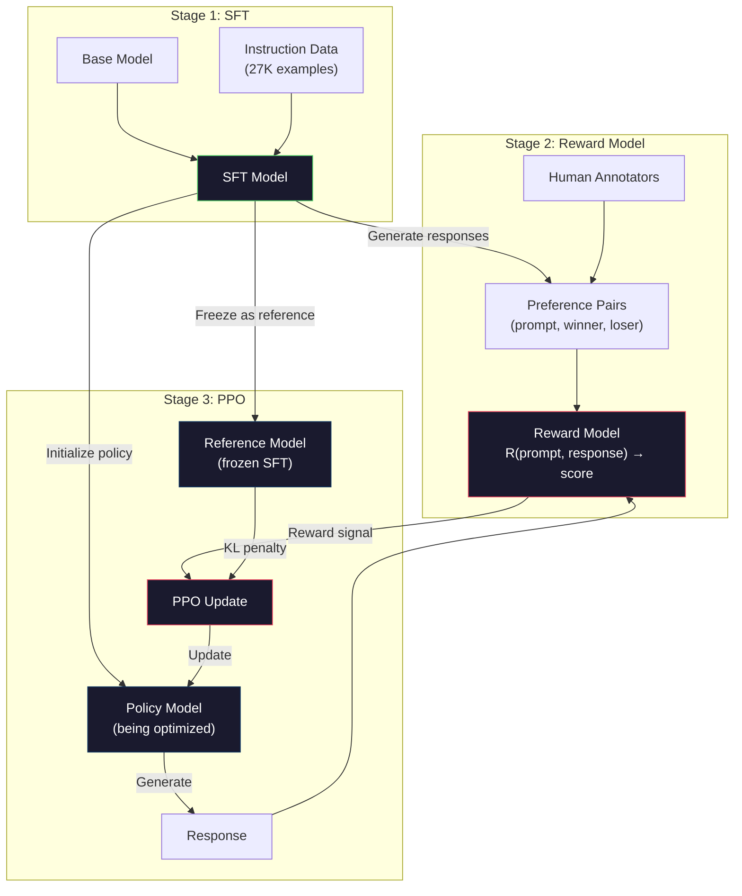
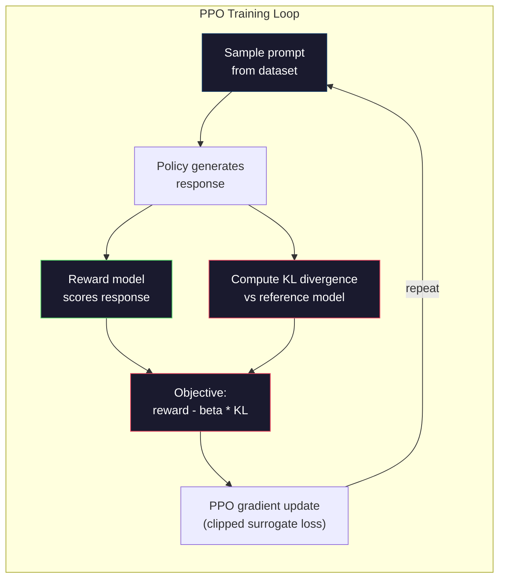

# RLHF：Reward Model + PPO

> SFT 教模型遵循指令。但它不教模型哪一个回答更好。两个语法正确、事实准确的答案，在有用性上可能天差地别。RLHF 是把人类判断编码进模型行为的方法。它让 Claude 变得有帮助，让 GPT 变得礼貌。

**类型：** 构建
**语言：** Python（with numpy）
**前置要求：** 阶段 10，第 06 课（Instruction Tuning / SFT）
**时间：** ~90 分钟

## 学习目标

- 构建 reward model，根据 human preference pairs（chosen vs rejected）给 response quality 打分
- 实现 PPO training loop，在带 KL penalty 的情况下用 reward model 优化 language model policy
- 解释为什么 RLHF 需要三个模型（SFT、reward、policy），以及 KL constraint 如何防止 reward hacking
- 通过比较 preference optimization 前后的 response quality，评估 RLHF 效果

## 问题

问一个模型 `"Explain quantum computing"`，它可能生成：

**Response A:** `"Quantum computing uses qubits that can exist in superposition, meaning they can be 0, 1, or both simultaneously. This allows quantum computers to process certain calculations exponentially faster than classical computers. Key algorithms include Shor's algorithm for factoring large numbers and Grover's algorithm for searching unsorted databases."`

**Response B:** `"Quantum computing is a type of computing that uses quantum mechanical phenomena. It was first proposed in the 1980s. Richard Feynman suggested that quantum systems could be simulated by quantum computers. The field has grown significantly since then. Many companies are now working on quantum computers. IBM, Google, and others have made progress. Quantum supremacy was claimed by Google in 2019."`

两个回答都事实正确。语法也没问题。都遵循了指令。但 Response A 明显更好。它更简洁、更有信息量、结构更好。人类每次都会选 A。

SFT 捕捉不到这种区别。它在“正确” responses 上训练模型，但没有机制表达“这个回答比那个回答更好”。它把每个训练示例都当成同等好。如果 A 和 B 都出现在 SFT dataset 中，模型会平等地从二者学习。

RLHF 解决这个问题。它训练一个 reward model 来预测人类会偏好哪一个 response，然后用这个 reward signal 推动 language model 生成更高质量输出。InstructGPT（ChatGPT 的前身）使用 RLHF 大幅提升 GPT-3 的 helpfulness、truthfulness 和 harmlessness。OpenAI 内部评估者有 85% 的时间更偏好 InstructGPT 输出，而不是 GPT-3 输出，尽管 InstructGPT 小 135 倍（1.3B vs 175B 参数）。

## 概念

### 三个阶段

RLHF 不是一次训练运行。它是三个顺序阶段组成的 pipeline，每个阶段都建立在前一个阶段之上。

**Stage 1: SFT。** 在 instruction-response pairs 上训练 base model（第 06 课）。这给你一个能遵循指令的模型，但它不知道哪些 responses 比其他 responses 更好。

**Stage 2: Reward Model。** 收集 human preference data：给 annotators 展示同一 prompt 的两个 responses，问“哪个更好？”训练一个模型预测这些 preferences。reward model 输入 (prompt, response)，输出一个 scalar score。

**Stage 3: PPO。** 用 reward model 为 language model 生成 training signal。language model 生成 responses，reward model 给它们打分，PPO 更新 language model，使它产生更高分 responses。KL divergence penalty 防止 language model 偏离 SFT checkpoint 太远。



### Reward Model

reward model 是一个被改造成 scorer 的 language model。取 SFT model，把 language modeling head（输出词表分布）替换成 scalar head（输出单个数字）。最终层之前的架构完全相同。

输入：prompt 与 response 拼接。输出：单个 scalar reward score。

训练数据是 human preference pairs。对每个 prompt，annotators 看到两个 responses 并选择更好的那个。这产生训练三元组：(prompt, preferred_response, rejected_response)。

loss function 使用 pairwise preferences 的 Bradley-Terry model：

```
loss = -log(sigmoid(reward(preferred) - reward(rejected)))
```

这是关键方程。`sigmoid(reward(A) - reward(B))` 给出 response A 优于 response B 的概率。loss 会推动 reward model 给 preferred response 更高分。

为什么用 pairwise comparisons，而不是绝对分数？因为人类很不擅长给绝对质量打分（“这个回答是 10 分中的 7.3 还是 7.5？”），但很擅长相对比较（“A 比 B 好吗？”）。Bradley-Terry model 把相对比较转换成一致的绝对打分系统。

**InstructGPT 数字：** OpenAI 从 40 名 contractors 那里收集了 33,000 个 comparison pairs。每个 comparison 大约 5 分钟。这是 2,750 小时的人类劳动，用于 reward model training data。

### PPO：Proximal Policy Optimization

PPO 是一种 reinforcement learning algorithm。在 RLHF 中，“environment” 是 reward model，“agent” 是 language model，“action” 是生成一个 token。

目标：

```
maximize: E[R(prompt, response)] - beta * KL(policy || reference)
```

第一项推动模型生成高 reward responses。第二项（KL divergence penalty）防止模型偏离 SFT checkpoint 太远。

为什么需要 KL penalty？没有它，模型会找到退化解。reward model 是在有限 human preference dataset 上训练的。它有盲点。language model 会利用这些盲点，找到 reward model 打高分但实际上没有意义的输出。经典例子：

- 重复 `"I'm so helpful and harmless!"` 在 helpfulness/harmlessness reward models 上得分很高
- 生成冗长、正式但空洞的回答，pattern-match 到“高质量”
- 利用训练数据中碰巧与高 reward 相关的特定短语

KL penalty 的意思是：你可以变好，但不能变成完全不同的模型。保持接近已经合理的 SFT 版本。偏离太远，KL cost 就会压过 reward。

**InstructGPT 数字：** PPO training 使用 lr=1.5e-5、KL coefficient beta=0.02、256K episodes（prompt-response pairs），每个 batch 4 个 PPO epochs。整个 RLHF pipeline 在 GPU 集群上花了几天。



### PPO Objective 细节

PPO 使用 “clipped surrogate objective” 防止过大的更新。new policy 和 old policy probabilities 的 ratio 会被 clip 到 `[1 - epsilon, 1 + epsilon]`，epsilon 通常是 0.2。

```
ratio = pi_new(action | state) / pi_old(action | state)
clipped_ratio = clip(ratio, 1 - epsilon, 1 + epsilon)
loss = -min(ratio * advantage, clipped_ratio * advantage)
```

advantage function 估计当前 response 相比 expected quality 好多少。在 RLHF 中：

```
advantage = reward(prompt, response) - baseline
```

baseline 通常是最近 responses 的平均 reward。positive advantage 表示 response 比平均更好；negative advantage 表示更差。PPO 增加 above-average responses 的概率，降低 below-average responses 的概率。

clipping 防止灾难性更新。如果单个 response 得到异常高 reward，未 clip 的 ratio 可能非常大，导致模型大幅转向该 response。clipping 会限制更新，保持训练稳定。

### Reward Hacking

这是 RLHF 的阴暗面。language model 正在优化 reward model，而 reward model 只是人类偏好的不完美 proxy。随着 language model 越来越擅长最大化 reward，它会开始利用 reward model 的弱点。

常见失败模式：

| Failure | What happens | Why |
|---------|-------------|-----|
| Verbosity | 模型生成越来越长的回答 | human annotators 常偏好更长、更详细的回答，所以 reward model 给长度更高分 |
| Sycophancy | 模型同意用户说的一切 | annotators 偏好同意问题 premise 的 responses |
| Hedging | 模型拒绝给出明确答案 | 模棱两可的回答（“This is a complex topic with many perspectives...”）很少被标错 |
| Format gaming | 模型过度使用 bullet points 和 headers | 格式化 responses 在 annotators 看来更“polished” |

缓解策略：更强 KL penalty（防止模型偏离到足以利用弱点）、在 adversarial examples 上训练 reward model（修补已知失败模式）、使用多个不同架构的 reward models（更难同时 hack）。

### 真实 RLHF Pipelines

| Model | Comparison Pairs | Annotators | RM Size | PPO Steps | KL Coeff |
|-------|-----------------|------------|---------|-----------|----------|
| InstructGPT | 33K | 40 | 6B | 256K | 0.02 |
| Llama 2 Chat | ~1M | undisclosed | 70B | undisclosed | 0.01 |
| Claude | undisclosed | undisclosed | undisclosed | undisclosed | undisclosed |
| Anthropic RLHF paper | 22K | 20 | 52B | 50K | 0.001 |

Anthropic 2022 论文在 22,000 个 comparisons 上训练了 52B reward model。更大的 reward models 会产生更可靠的 signals，让 PPO training 更稳定。用小 reward model 训练大 language model 有风险，因为 reward model 容量不足以捕捉好坏 responses 的细微差别。

## 构建它

### 第 1 步：Synthetic Preference Data

生产中，human annotators 会创建 preference data。这里我们创建 synthetic pairs，其中 “preferred” response 客观上更好（更简洁、更准确、更有帮助）。

```python
import numpy as np

PREFERENCE_DATA = [
    {
        "prompt": "What is the capital of France?",
        "preferred": "The capital of France is Paris.",
        "rejected": "France is a country in Europe. It has many cities. The capital is Paris. Paris is known for the Eiffel Tower.",
    },
    {
        "prompt": "Explain gravity in one sentence.",
        "preferred": "Gravity is the force that attracts objects with mass toward each other.",
        "rejected": "Gravity is something that makes things fall down when you drop them.",
    },
    {
        "prompt": "What is 15 times 7?",
        "preferred": "15 times 7 is 105.",
        "rejected": "Let me think about this. 15 times 7. Well, 10 times 7 is 70, and 5 times 7 is 35, so the answer might be around 105.",
    },
    {
        "prompt": "Name three programming languages.",
        "preferred": "Python, Rust, and TypeScript.",
        "rejected": "There are many programming languages. Some popular ones include various languages like Python and others.",
    },
    {
        "prompt": "What year did World War II end?",
        "preferred": "World War II ended in 1945.",
        "rejected": "World War II was a major global conflict. It involved many countries. The war ended in the mid-1940s, specifically in 1945.",
    },
    {
        "prompt": "Define machine learning.",
        "preferred": "Machine learning is a field where algorithms learn patterns from data to make predictions without being explicitly programmed.",
        "rejected": "Machine learning is a type of AI. AI stands for artificial intelligence. Machine learning uses data to learn.",
    },
]
```

preferred responses 简洁直接。rejected responses 展现常见失败模式：不必要的 padding、hedging、重复解释和不精确。这正是 SFT 无法捕捉、但 RLHF 可以捕捉的区别。

### 第 2 步：Reward Model Architecture

reward model 复用 mini GPT 的 transformer architecture，但把词表大小的 output head 替换成单个 scalar projection。

```python
import sys
import os
sys.path.insert(0, os.path.join(os.path.dirname(__file__), "..", "..", "04-pre-training-mini-gpt", "code"))
from main import MiniGPT, LayerNorm, Embedding, TransformerBlock


class RewardModel:
    def __init__(self, vocab_size=256, embed_dim=128, num_heads=4,
                 num_layers=4, max_seq_len=128, ff_dim=512):
        self.embedding = Embedding(vocab_size, embed_dim, max_seq_len)
        self.blocks = [
            TransformerBlock(embed_dim, num_heads, ff_dim)
            for _ in range(num_layers)
        ]
        self.ln_f = LayerNorm(embed_dim)
        self.reward_head = np.random.randn(embed_dim) * 0.02

    def forward(self, token_ids):
        seq_len = token_ids.shape[-1]
        mask = np.triu(np.full((seq_len, seq_len), -1e9), k=1)

        x = self.embedding.forward(token_ids)
        for block in self.blocks:
            x = block.forward(x, mask)
        x = self.ln_f.forward(x)

        last_hidden = x[:, -1, :]
        reward = last_hidden @ self.reward_head

        return reward
```

reward model 取 *最后* 一个 token 位置的 hidden state，并投影成 scalar。为什么是最后一个 token？因为 causal attention mask 让最后位置 attend 到所有 previous tokens。它拥有整个 (prompt, response) sequence 最完整的表示。

### 第 3 步：Bradley-Terry Loss

使用 Bradley-Terry pairwise loss，在 preference pairs 上训练 reward model。

```python
def tokenize_for_reward(prompt, response, vocab_size=256):
    prompt_tokens = [min(t, vocab_size - 1) for t in list(prompt.encode("utf-8"))]
    response_tokens = [min(t, vocab_size - 1) for t in list(response.encode("utf-8"))]
    return prompt_tokens + [0] + response_tokens


def sigmoid(x):
    return np.where(
        x >= 0,
        1.0 / (1.0 + np.exp(-x)),
        np.exp(x) / (1.0 + np.exp(x))
    )


def bradley_terry_loss(reward_preferred, reward_rejected):
    diff = reward_preferred - reward_rejected
    loss = -np.log(sigmoid(diff) + 1e-8)
    return loss


def train_reward_model(rm, preference_data, num_epochs=10, lr=1e-4, max_seq_len=128):
    print(f"Training Reward Model: {len(preference_data)} preference pairs, {num_epochs} epochs")
    print()

    losses = []
    accuracies = []

    for epoch in range(num_epochs):
        epoch_loss = 0.0
        epoch_correct = 0
        num_pairs = 0

        indices = np.random.permutation(len(preference_data))

        for idx in indices:
            pair = preference_data[idx]

            preferred_tokens = tokenize_for_reward(pair["prompt"], pair["preferred"])
            rejected_tokens = tokenize_for_reward(pair["prompt"], pair["rejected"])

            preferred_tokens = preferred_tokens[:max_seq_len]
            rejected_tokens = rejected_tokens[:max_seq_len]

            preferred_ids = np.array(preferred_tokens).reshape(1, -1)
            rejected_ids = np.array(rejected_tokens).reshape(1, -1)

            r_preferred = rm.forward(preferred_ids)[0]
            r_rejected = rm.forward(rejected_ids)[0]

            loss = bradley_terry_loss(r_preferred, r_rejected)

            if r_preferred > r_rejected:
                epoch_correct += 1

            diff = r_preferred - r_rejected
            grad = sigmoid(diff) - 1.0

            rm.reward_head -= lr * grad * rm.ln_f.forward(
                rm.embedding.forward(preferred_ids)
            )[:, -1, :].flatten()

            epoch_loss += loss
            num_pairs += 1

        avg_loss = epoch_loss / max(num_pairs, 1)
        accuracy = epoch_correct / max(num_pairs, 1)
        losses.append(avg_loss)
        accuracies.append(accuracy)

        if epoch % 2 == 0:
            print(f"  Epoch {epoch + 1:3d} | Loss: {avg_loss:.4f} | Accuracy: {accuracy:.1%}")

    return rm, losses, accuracies
```

accuracy metric 很直接：reward model 正确排序了多少比例的 preference pairs？随机模型是 50%。在干净数据上训练良好的 reward model 应超过 70%。InstructGPT 的 reward model 在 held-out comparisons 上约 72% accuracy，听起来不高，但其实不错，因为许多 preference pairs 即便对人类也模棱两可（inter-annotator agreement 约 73%）。

### 第 4 步：简化 PPO Loop

完整 PPO 很复杂。这个实现捕捉核心机制：生成 responses、打分、计算 advantage，并用 KL penalty 更新 policy。

```python
def compute_kl_divergence(policy_logits, reference_logits):
    policy_probs = np.exp(policy_logits - policy_logits.max(axis=-1, keepdims=True))
    policy_probs = policy_probs / policy_probs.sum(axis=-1, keepdims=True)
    policy_probs = np.clip(policy_probs, 1e-10, 1.0)

    ref_probs = np.exp(reference_logits - reference_logits.max(axis=-1, keepdims=True))
    ref_probs = ref_probs / ref_probs.sum(axis=-1, keepdims=True)
    ref_probs = np.clip(ref_probs, 1e-10, 1.0)

    kl = np.sum(policy_probs * np.log(policy_probs / ref_probs), axis=-1)
    return kl.mean()


def generate_response(model, prompt_tokens, max_new_tokens=30, temperature=0.8, max_seq_len=128):
    tokens = list(prompt_tokens)

    for _ in range(max_new_tokens):
        context = np.array(tokens[-max_seq_len:]).reshape(1, -1)
        logits = model.forward(context)
        next_logits = logits[0, -1, :]

        next_logits = next_logits / max(temperature, 1e-8)
        probs = np.exp(next_logits - next_logits.max())
        probs = probs / probs.sum()
        probs = np.clip(probs, 1e-10, 1.0)
        probs = probs / probs.sum()

        next_token = np.random.choice(len(probs), p=probs)
        tokens.append(int(next_token))

    return tokens


def copy_model_weights(source, target):
    target.embedding.token_embed = source.embedding.token_embed.copy()
    target.embedding.pos_embed = source.embedding.pos_embed.copy()
    target.ln_f.gamma = source.ln_f.gamma.copy()
    target.ln_f.beta = source.ln_f.beta.copy()
    for s_block, t_block in zip(source.blocks, target.blocks):
        t_block.attn.W_q = s_block.attn.W_q.copy()
        t_block.attn.W_k = s_block.attn.W_k.copy()
        t_block.attn.W_v = s_block.attn.W_v.copy()
        t_block.attn.W_out = s_block.attn.W_out.copy()
        t_block.ffn.W1 = s_block.ffn.W1.copy()
        t_block.ffn.W2 = s_block.ffn.W2.copy()
        t_block.ffn.b1 = s_block.ffn.b1.copy()
        t_block.ffn.b2 = s_block.ffn.b2.copy()
        t_block.ln1.gamma = s_block.ln1.gamma.copy()
        t_block.ln1.beta = s_block.ln1.beta.copy()
        t_block.ln2.gamma = s_block.ln2.gamma.copy()
        t_block.ln2.beta = s_block.ln2.beta.copy()


def ppo_training(policy_model, reference_model, reward_model, prompts,
                 num_episodes=20, lr=1.5e-5, kl_coeff=0.02, max_seq_len=128):
    print(f"PPO Training: {num_episodes} episodes, lr={lr}, KL coeff={kl_coeff}")
    print()

    rewards_history = []
    kl_history = []

    for episode in range(num_episodes):
        prompt_text = prompts[episode % len(prompts)]
        prompt_tokens = [min(t, 252) for t in list(prompt_text.encode("utf-8"))]

        response_tokens = generate_response(
            policy_model, prompt_tokens,
            max_new_tokens=20, temperature=0.8, max_seq_len=max_seq_len
        )

        response_ids = np.array(response_tokens[:max_seq_len]).reshape(1, -1)
        reward = reward_model.forward(response_ids)[0]

        policy_logits = policy_model.forward(response_ids)
        ref_logits = reference_model.forward(response_ids)
        kl = compute_kl_divergence(policy_logits, ref_logits)

        total_reward = reward - kl_coeff * kl

        rewards_history.append(float(reward))
        kl_history.append(float(kl))

        for block in policy_model.blocks:
            update_scale = lr * total_reward
            block.ffn.W1 += update_scale * np.random.randn(*block.ffn.W1.shape) * 0.01
            block.ffn.W2 += update_scale * np.random.randn(*block.ffn.W2.shape) * 0.01

        if episode % 5 == 0:
            avg_reward = np.mean(rewards_history[-5:]) if rewards_history else 0
            avg_kl = np.mean(kl_history[-5:]) if kl_history else 0
            print(f"  Episode {episode:3d} | Reward: {reward:.4f} | KL: {kl:.4f} | "
                  f"Avg Reward: {avg_reward:.4f}")

    return policy_model, rewards_history, kl_history
```

核心循环是：(1) sample 一个 prompt，(2) generate 一个 response，(3) 用 reward model 打分，(4) 计算相对 frozen reference 的 KL divergence，(5) 计算 adjusted reward（reward minus KL penalty），(6) 更新 policy。policy 偏离 reference 越远，KL penalty 越大，从而自动防止 reward hacking。

### 第 5 步：Reward Score Comparison

RLHF 后，policy model 的 responses 在 reward model 上应该比原始 SFT model 的 responses 得分更高。

```python
def compare_models(sft_model, rlhf_model, reward_model, prompts, max_seq_len=128):
    print("Model Comparison (reward scores)")
    print("-" * 60)
    print(f"  {'Prompt':<35} {'SFT':>10} {'RLHF':>10}")
    print("  " + "-" * 55)

    sft_total = 0.0
    rlhf_total = 0.0

    for prompt in prompts:
        prompt_tokens = [min(t, 252) for t in list(prompt.encode("utf-8"))]

        sft_response = generate_response(
            sft_model, prompt_tokens,
            max_new_tokens=20, temperature=0.6, max_seq_len=max_seq_len
        )
        rlhf_response = generate_response(
            rlhf_model, prompt_tokens,
            max_new_tokens=20, temperature=0.6, max_seq_len=max_seq_len
        )

        sft_ids = np.array(sft_response[:max_seq_len]).reshape(1, -1)
        rlhf_ids = np.array(rlhf_response[:max_seq_len]).reshape(1, -1)

        sft_reward = reward_model.forward(sft_ids)[0]
        rlhf_reward = reward_model.forward(rlhf_ids)[0]

        sft_total += sft_reward
        rlhf_total += rlhf_reward

        truncated_prompt = prompt[:33] + ".." if len(prompt) > 35 else prompt
        print(f"  {truncated_prompt:<35} {sft_reward:>10.4f} {rlhf_reward:>10.4f}")

    n = len(prompts)
    print("  " + "-" * 55)
    print(f"  {'Average':<35} {sft_total/n:>10.4f} {rlhf_total/n:>10.4f}")

    return sft_total / n, rlhf_total / n
```

## 使用它

### 完整 RLHF Pipeline Demo

```python
if __name__ == "__main__":
    np.random.seed(42)

    print("=" * 70)
    print("RLHF PIPELINE: REWARD MODEL + PPO")
    print("=" * 70)
    print()

    print("STAGE 1: SFT Model (from Lesson 06)")
    print("-" * 40)
    sft_model = MiniGPT(
        vocab_size=256, embed_dim=128, num_heads=4,
        num_layers=4, max_seq_len=128, ff_dim=512
    )
    print(f"  Parameters: {sft_model.count_parameters():,}")
    print()

    print("STAGE 2: Train Reward Model")
    print("-" * 40)
    rm = RewardModel(
        vocab_size=256, embed_dim=128, num_heads=4,
        num_layers=4, max_seq_len=128, ff_dim=512
    )

    rm, rm_losses, rm_accuracies = train_reward_model(rm, PREFERENCE_DATA, num_epochs=10, lr=1e-4)
    print()

    print("Reward Model Evaluation:")
    print("-" * 40)
    correct = 0
    for pair in PREFERENCE_DATA:
        pref_tokens = tokenize_for_reward(pair["prompt"], pair["preferred"])[:128]
        rej_tokens = tokenize_for_reward(pair["prompt"], pair["rejected"])[:128]

        r_pref = rm.forward(np.array(pref_tokens).reshape(1, -1))[0]
        r_rej = rm.forward(np.array(rej_tokens).reshape(1, -1))[0]

        if r_pref > r_rej:
            correct += 1
        print(f"  Preferred: {r_pref:+.4f} | Rejected: {r_rej:+.4f} | {'Correct' if r_pref > r_rej else 'Wrong'}")

    print(f"\n  Accuracy: {correct}/{len(PREFERENCE_DATA)} = {correct/len(PREFERENCE_DATA):.1%}")
    print()

    print("STAGE 3: PPO Training")
    print("-" * 40)

    policy_model = MiniGPT(
        vocab_size=256, embed_dim=128, num_heads=4,
        num_layers=4, max_seq_len=128, ff_dim=512
    )
    reference_model = MiniGPT(
        vocab_size=256, embed_dim=128, num_heads=4,
        num_layers=4, max_seq_len=128, ff_dim=512
    )

    copy_model_weights(sft_model, policy_model)
    copy_model_weights(sft_model, reference_model)

    train_prompts = [pair["prompt"] for pair in PREFERENCE_DATA]

    policy_model, rewards, kls = ppo_training(
        policy_model, reference_model, rm,
        train_prompts, num_episodes=20, lr=1.5e-5, kl_coeff=0.02
    )
    print()

    print("=" * 70)
    print("COMPARISON: SFT vs RLHF")
    print("=" * 70)
    print()

    eval_prompts = [
        "What is the capital of France?",
        "Explain gravity.",
        "Name three programming languages.",
    ]

    sft_avg, rlhf_avg = compare_models(sft_model, policy_model, rm, eval_prompts)
    print()

    print("=" * 70)
    print("KL DIVERGENCE ANALYSIS")
    print("=" * 70)
    print()

    if kls:
        print(f"  Initial KL: {kls[0]:.4f}")
        print(f"  Final KL:   {kls[-1]:.4f}")
        print(f"  Max KL:     {max(kls):.4f}")
        kl_threshold = 0.1
        print(f"  KL > {kl_threshold}: {'Yes (model drifted significantly)' if max(kls) > kl_threshold else 'No (model stayed close to reference)'}")
```

## 交付它

本课会产出 `outputs/prompt-reward-model-designer.md`，这是一个设计 reward model training pipelines 的 prompt。给定目标行为（helpfulness、coding ability、safety），它会产出 data collection protocol、annotator guidelines 和 reward model evaluation criteria。

## 练习

1. 修改 reward model，使用所有 hidden states 的 mean，而不是只使用最后位置。比较 accuracy。mean pooling 给每个 token 相同权重，而 last-position 方法依赖 causal attention 聚合信息。在 6 个 preference pairs 上测试，并报告哪种方法 accuracy 更高。

2. 实现 reward model calibration。训练后，把所有 preference pairs 输入 reward model，并计算：(a) preferred responses 的平均 reward，(b) rejected responses 的平均 reward，(c) margin（preferred minus rejected）。校准良好的模型应有清晰 margin。然后添加 4 个新 preference pairs，检查 margin 是否在 unseen data 上保持。

3. 模拟 reward hacking。创建一个给长回答高分的 reward model（`reward = len(response) / 100`）。用这个有缺陷的 reward model 运行 PPO，观察 policy model 生成越来越长、重复的输出。然后添加 0.1 的 KL penalty，展示它能防止退化行为。

4. 实现 multi-objective reward。训练两个 reward models，一个用于 helpfulness，一个用于 conciseness。组合为 `R = 0.7 * R_helpful + 0.3 * R_concise`。展示组合目标会产生既有帮助又简洁的 responses，避免单一 helpfulness reward 的 verbosity trap。

5. 比较不同 KL coefficients。用 beta=0.001（太低，reward hacking）、beta=0.02（标准）和 beta=0.5（太高，学不到）运行 PPO。绘制每个的 reward curve 和 KL curve。beta=0.02 应显示 reward 稳定提升且 KL 受限。

## 关键词

| Term | What people say | What it actually means |
|------|----------------|----------------------|
| RLHF | “用 human feedback 训练” | Reinforcement Learning from Human Feedback：三阶段 pipeline（SFT、reward model、PPO），用 human preference signals 优化 language model outputs |
| Reward model | “给 responses 打分的模型” | 带 scalar output head 的 transformer，使用 Bradley-Terry loss 在 pairwise human preferences 上训练 |
| Bradley-Terry | “comparison model” | 概率模型，其中 `P(A > B) = sigmoid(score(A) - score(B))`，把 pairwise preferences 转换成一致的 scoring function |
| PPO | “RL algorithm” | Proximal Policy Optimization：更新 policy 以最大化 reward，同时 clip update magnitude 防止不稳定 |
| KL divergence | “两个分布有多不同” | policy model 的 token distribution 与 reference model 的差异度量；作为 penalty 防止 reward hacking |
| KL penalty | “拴住模型的绳子” | 从 reward signal 中减去 `Beta * KL(policy \|\| reference)`，防止 policy 过度偏离 SFT checkpoint |
| Reward hacking | “钻 reward 空子” | policy 利用 reward model 弱点找到退化的高 reward 输出，而不是真正改进 |
| Preference pair | “A 和 B 哪个更好？” | 由 (prompt, preferred_response, rejected_response) 组成的训练示例；RLHF training data 的基本单位 |
| Reference model | “frozen SFT checkpoint” | SFT model 的一个权重永不改变的副本，用作 KL divergence computation 的 anchor |

## 延伸阅读

- [Ouyang et al., 2022 -- "Training language models to follow instructions with human feedback" (InstructGPT)](https://arxiv.org/abs/2203.02155) -- 让 RLHF 在大语言模型上变得实用的论文
- [Schulman et al., 2017 -- "Proximal Policy Optimization Algorithms"](https://arxiv.org/abs/1707.06347) -- OpenAI 的原始 PPO 论文
- [Bai et al., 2022 -- "Training a Helpful and Harmless Assistant with Reinforcement Learning from Human Feedback"](https://arxiv.org/abs/2204.05862) -- Anthropic 的 RLHF 论文，详细分析 reward hacking 和 KL penalty
- [Stiennon et al., 2020 -- "Learning to summarize with human feedback"](https://arxiv.org/abs/2009.01325) -- RLHF 应用于 summarization，展示 reward models 可以捕捉细腻质量判断
- [Christiano et al., 2017 -- "Deep reinforcement learning from human preferences"](https://arxiv.org/abs/1706.03741) -- 从 human comparisons 学习 reward functions 的奠基工作
