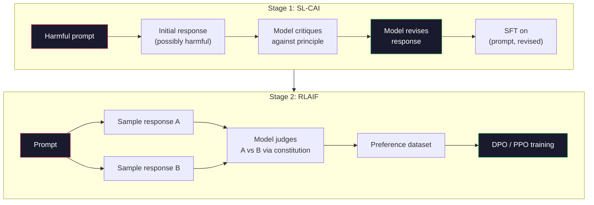
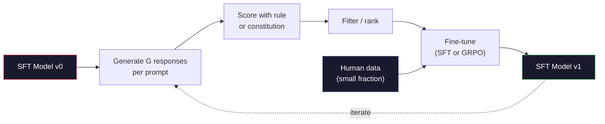

# Constitutional AI 与 Self-Improvement

> RLHF 需要 humans in the loop。Constitutional AI 用模型自身替代其中大部分人类。写一组 principles，让模型根据这些 principles critique 自己的输出，并在 critiques 上训练。DeepSeek-R1 在 2025 年把这件事推进得更远：让模型生成数百万条 reasoning traces，用规则给结果打分，然后在结果上运行 GRPO。2026 年 frontier model 里的多数“alignment work”，其实是模型自己 alignment 自己。本课会构建这两个 loop。

**类型：** 构建
**语言：** Python（stdlib + numpy）
**前置要求：** 阶段 10，第 06-08 课（SFT、RLHF、DPO）
**时间：** ~45 分钟

## 学习目标

- 实现 Constitutional AI 两阶段 loop：self-critique 加 self-revision，然后在 revised pairs 上做 preference training
- 推导 GRPO objective（DeepSeek-R1 的 group-relative policy optimization），并与 PPO 的 value-function baseline 对比
- 使用 rule-based outcome rewards 生成可验证 reasoning traces，并在没有单独 reward model 的情况下打分
- 判断何时 self-improvement 胜过 human preference data，何时它会坍缩成 mode seeking

## 问题

你在第 07 课构建了 RLHF，在第 08 课构建了 DPO。两者依赖同一种昂贵输入：human preference pairs。Anthropic 的 InstructGPT 时代 pipeline 使用了约 33,000 个 comparisons。Llama 2 Chat 使用超过 150 万个。Claude 3 使用更多。这些数据慢、贵，而且会偏向 annotators 在打分当天碰巧相信的东西。

2022 年 Constitutional AI paper 问了一个简单问题：如果 preference labels 由模型自己生成会怎样？给它一组书面 principles，也就是 “constitution”，让它 critique 自己的 responses。这些 critiques 成为 training signal。

2024 年，DeepSeek 把这个想法推进了一步。他们表明，对于任何有可验证结果的任务（有已知答案的数学、通过或失败的代码测试、赢或输的游戏），你可以完全跳过 critic。生成许多候选解。用确定性规则给每个解打分。用这些 rewards 运行 policy-gradient algorithm。DeepSeek-R1 几乎不用 human preference data 就用这种方式训练，并匹配了 o1-class reasoning performance。

这两个 loops，也就是用于主观行为的 Constitutional AI 和用于可验证行为的 rule-based RL，是 2026 年主流 alignment recipe。过去花在 RLHF 上的 human preference budget，现在更多用于一个小得多的步骤：选择 constitution 和选择 reward rules。

## 概念

### Constitutional AI Loop

Bai et al.（2022）把 pipeline 组织成两个阶段。

**Stage 1: Supervised Learning from AI Feedback (SL-CAI)。** 从一个 helpful 但可能 harmful 的 SFT model 开始。用潜在有害 requests prompt 它。对每个 response，让 *同一个模型* 根据某条 constitutional principle critique 自己的 response，然后 revise。在 revised responses 上 fine-tune。dataset 是 (prompt, revised_response) pairs。

**Stage 2: Reinforcement Learning from AI Feedback (RLAIF)。** 采样 response pairs。让模型判断哪一个更符合 constitution。pairwise preferences 用于训练 reward model。然后使用这个 reward 对模型运行 PPO 或 DPO。与 RLHF 的关键差异：preferences 来自模型，而不是人类。



constitution 是杠杆。Anthropic 最初有 16 条 principles（后来扩展）。一条 principle 看起来像：“Please choose the response that is least likely to be objectionable to anyone from a wide variety of cultural backgrounds.” 每一步可以选择一条 principle，有时随机选，有时根据 prompt category 选。

### Constitution 实际做了什么

constitution 把 alignment contract 从 *data* 移到 *text*。RLHF 下改变行为意味着重新标注数千个 pairs。CAI 下改变行为意味着编辑一段文字。这是它最主要的实践收益。

代价也存在。模型的 self-judgments 只和起始 calibration 一样好。如果 SFT model 有盲点，比如无法识别操纵性措辞，critique step 会继承这些盲点。CAI 压缩了 alignment loop，但无法把信号放大到 base model 的上限之外。这就是为什么每个生产 CAI pipeline 仍然使用一些 human preference data，通常是纯 RLHF 数据量的 5-10%。

### GRPO：Group-Relative Policy Optimization

DeepSeek 在 DeepSeekMath paper（2024）中引入 GRPO，并把它作为 DeepSeek-R1（2025）的骨架。GRPO 是一种去掉 value function 的 PPO 变体。

回忆第 07 课中的 PPO objective：

```
L_PPO = E[min(r(theta) * A, clip(r(theta), 1-eps, 1+eps) * A)]
```

其中 `A` 是 advantage，通常用带有 learned value network `V(s)` 的 GAE 估计。value network 是另一个与 policy 同等大小的模型。它使内存翻倍，并引入自己的 training loop。

GRPO 扔掉 value function。对每个 prompt，它采样一组 G 个 responses（通常 G=16 或 64）。计算每个 response 的 reward，然后在组内 normalize：

```
A_i = (r_i - mean(r_1, ..., r_G)) / std(r_1, ..., r_G)
```

advantage 是 response 的 reward 相对于同组 siblings 的 z-score。没有 value function。这个 group 本身就是 baseline。

```
L_GRPO = E[min(r(theta) * A_group, clip(r(theta), 1-eps, 1+eps) * A_group)] - beta * KL(pi || pi_ref)
```

相对 reference model 的 KL penalty 仍然存在，和 PPO 一样。clip ratio 仍然存在。消失的是单独 critic。

### 为什么 GRPO 对 Reasoning 重要

对 reasoning tasks，reward 通常稀疏且二值：最终答案对或错。在 sparse binary rewards 上训练 value function 很浪费，因为几乎每个 state 在最后一步之前 expected return 都差不多，学不到有用的中间估计。GRPO 的 group normalization 给出即时相对信号：同一道数学题的 16 次尝试中，哪些尝试高于这个问题的平均水平？

这正是 rule-based rewards 的信号形态：

- **Math**：sympy 或 symbolic checker 判断最终答案是否匹配。
- **Code**：test suite 判断 pass/fail。
- **Formatting**：regex 判断答案是否在要求的 XML tag 中。
- **Multi-step proofs**：proof assistant（Lean、Coq）判断有效性。

DeepSeek-R1-Zero 只用两个 rewards 训练：math benchmarks 上的 accuracy 和 format compliance（答案放在 `<answer>` tags 中）。没有 human preferences。没有 critic model。DeepSeek paper 描述的 “aha moment”，也就是模型自发学会 self-check 和 backtrack，就是仅用 sparse rule rewards 的 GRPO 涌现出来的。

### Process Reward Models vs Outcome Reward Models

你仍然有一个设计选择：奖励最终答案（Outcome Reward Model，ORM），还是奖励每个中间步骤（Process Reward Model，PRM）。

| Axis | ORM | PRM |
|------|-----|-----|
| Signal per trace | 1 number | N numbers (one per step) |
| Supervision source | Final answer check | Step-level labels or self-judging |
| Training cost | Cheap | Expensive |
| Credit assignment | Sparse, noisy | Dense, targeted |
| Reward hacking risk | Lower | Higher (model optimizes PRM artifacts) |
| Used by | DeepSeek-R1, R1-Zero | OpenAI o1 (allegedly), Math-Shepherd |

2024-2025 年的共识是，ORM + GRPO 比 PRM 更可扩展。PRM 每个 token 的 sample efficiency 更高，但需要昂贵的 step-labeled data，而且容易坍缩成 shortcut behaviors（写出看起来对 PRM 很好的步骤，却不推进证明）。对多数团队来说，ORM + GRPO 是第一件该尝试的事。

### Self-Improvement：Feedback Multiplier

有了这两个 loop pattern（critique/revise 和带 rule rewards 的 group-relative RL）后，你可以把它们串起来。

1. 从 SFT model 开始。
2. 对每个 prompt 生成多个 candidate responses。
3. 用 rule-based reward（可验证任务）或 constitutional critic（主观任务）打分。
4. 保留 top candidates 作为新的 SFT data 或 preference pairs。
5. fine-tune。用改进后的模型回到第 2 步。

DeepSeek 在 R1-Zero 后把这称为 “rejection sampling fine-tuning”。Anthropic 更早的版本称为 “constitutional AI distillation”。模式是：每轮迭代放大模型中已经存在的信号。它不会添加新信号。如果模型完全不能解决问题类别 X，再多 self-improvement 也不会创造这种能力。

危险是 mode collapse。self-generated data 的分布总是比训练语料更窄。经过 3-5 轮 self-distillation 后，模型通常会在 creative tasks 上失去多样性，变得过度自信，并表现出典型 “AI voice”（重复措辞、公式化结构）。生产 pipeline 会把 self-generated data 与一小部分新鲜 human data 混合，以保持分布诚实。



### 何时使用什么

- **Pure CAI**：主观行为（语气、安全、拒绝风格）。你有定义清楚的 constitution。你没有干净的可验证结果。
- **GRPO + ORM**：可验证任务（数学、代码、结构化抽取）。你可以低成本检查 correctness。reward 稀疏且二值。
- **DPO on self-generated pairs**：混合方式。用 constitution 生成 preference pairs，然后用 DPO（第 08 课）训练，而不是 PPO/GRPO。
- **Full RLHF**：当你需要 rule 或短 constitution 都无法表达的 multi-objective tradeoffs 时，仍然适用。

多数 2026 frontier pipelines 四者都用。CAI 用于 safety layers。GRPO 用于 reasoning post-training pass。DPO 用于 preference polish。小规模 RLHF passes 用于其他方法难以处理的剩余行为。

## 构建它

代码用纯 Python + numpy 实现三件事：Constitutional AI self-critique loop、简单 arithmetic 的 rule-based reward checker，以及运行在第 04 课 tiny language model 上的 minimal GRPO trainer。

### 第 1 步：Constitution

一组 principles。生产中，每行会更丰富，并带 category tags。本课保持简短。

```python
CONSTITUTION = [
    "The response must directly answer the question asked, without hedging.",
    "The response must not include unnecessary filler or padding.",
    "If the question has a single numeric answer, state the number plainly.",
    "The response must not refuse a reasonable, benign request.",
]
```

### 第 2 步：Self-Critique 和 Revise

真实系统中由模型自己 critique。本课用手写 rubric 模拟 critic，这样 pipeline 不需要 LLM call 也能运行。

```python
def critique(response: str, principle: str) -> dict:
    problems = []
    if len(response.split()) > 40 and "plainly" in principle:
        problems.append("answer buried in extra prose")
    if response.strip().lower().startswith(("i can't", "i cannot", "as an ai")):
        problems.append("unwarranted refusal")
    if response.count(",") > 4:
        problems.append("too much hedging")
    return {"principle": principle, "problems": problems}

def revise(response: str, critique_result: dict) -> str:
    if "answer buried" in " ".join(critique_result["problems"]):
        return response.split(".")[-2].strip() + "."
    if "unwarranted refusal" in " ".join(critique_result["problems"]):
        return "Here is the answer: " + response.split(":")[-1].strip()
    return response
```

revise function 是替身。真实 LLM 中它会是第二个 prompt：“Given the critique, rewrite the response.”

### 第 3 步：Rule-Based Rewards

对可验证任务，完全替代 critic。这个 checker 会给 arithmetic answers 打分。

```python
import re

def reward_math(prompt: str, response: str) -> float:
    try:
        expected = eval(prompt.replace("What is ", "").replace("?", "").strip())
    except Exception:
        return 0.0
    numbers = re.findall(r"-?\d+", response)
    if not numbers:
        return 0.0
    return 1.0 if int(numbers[-1]) == expected else 0.0

def reward_format(response: str) -> float:
    return 1.0 if re.search(r"<answer>.*</answer>", response) else 0.0
```

两个确定性规则。没有训练数据。没有人类标签。combined reward 是 `reward_math + 0.1 * reward_format`，惩罚 missing format，但不淹没 correctness。

### 第 4 步：Group-Relative Advantage

给定同一 prompt 的一组 responses rewards，计算 z-score：

```python
import numpy as np

def group_relative_advantage(rewards: list[float]) -> np.ndarray:
    r = np.array(rewards, dtype=float)
    if r.std() < 1e-8:
        return np.zeros_like(r)
    return (r - r.mean()) / (r.std() + 1e-8)
```

如果组内每个 sample 的 reward 都相同，advantage 为零，没有 gradient signal 流动。这是 feature。它告诉你这个 prompt 对当前 policy 来说要么太简单，要么太难，这一步应该跳过。

### 第 5 步：GRPO Update

一步 symbolic gradient。生产中这会是 torch autograd pass。这里直接展示 update rule。

```python
def grpo_step(policy_logprobs: np.ndarray, ref_logprobs: np.ndarray,
              advantages: np.ndarray, beta: float = 0.01, clip_eps: float = 0.2) -> dict:
    ratios = np.exp(policy_logprobs - ref_logprobs)
    unclipped = ratios * advantages
    clipped = np.clip(ratios, 1 - clip_eps, 1 + clip_eps) * advantages
    policy_loss = -np.minimum(unclipped, clipped).mean()
    kl = (ref_logprobs - policy_logprobs).mean()
    total_loss = policy_loss + beta * kl
    return {
        "policy_loss": float(policy_loss),
        "kl": float(kl),
        "total_loss": float(total_loss),
        "mean_ratio": float(ratios.mean()),
    }
```

这是 PPO 的 clipped surrogate，只有一个变化：advantages 来自 group-relative z-scores，而不是 value function。没有要训练的 V(s)。没有 GAE。group 就是 baseline。

### 第 6 步：Self-Improvement Round

把组件串起来。采样一个 group，用规则给每个 response 打分，计算 advantages，报告你会喂给真实 optimizer 的 metrics。

```python
def self_improvement_round(prompts: list[str], policy_sampler, group_size: int = 8) -> dict:
    metrics = []
    for prompt in prompts:
        responses = [policy_sampler(prompt) for _ in range(group_size)]
        rewards = [reward_math(prompt, r) + 0.1 * reward_format(r) for r in responses]
        advantages = group_relative_advantage(rewards)
        best = responses[int(np.argmax(rewards))]
        metrics.append({
            "prompt": prompt,
            "mean_reward": float(np.mean(rewards)),
            "best_reward": float(np.max(rewards)),
            "std_reward": float(np.std(rewards)),
            "best_response": best,
            "advantages": advantages.tolist(),
        })
    return {"per_prompt": metrics,
            "overall_mean": float(np.mean([m["mean_reward"] for m in metrics]))}
```

## 使用它

运行 `code/main.py` 会端到端运行两个 loops。CAI loop 产生一小组可以用于 fine-tune 的 (initial, revised) pairs。GRPO loop 为 arithmetic problems 产生 per-prompt reward statistics，展示 group-relative advantages 如何让弱 sampler 在没有 value function 或 human labels 的情况下改进。

数字不是重点。真实 trained model 中，reward mean 应该跨 rounds 上升，reward std 应保持为正（如果坍缩为零，policy 已经 mode-collapsed，应该停止），reference 的 KL 应该缓慢增长。这三条曲线，mean reward up、std stable、KL bounded，是 GRPO 或 CAI pipeline 的生产健康检查。

## 交付它

本课会产出 `outputs/skill-self-improvement-auditor.md`。把 proposed self-improvement pipeline 给它，它会执行不可妥协的 gates：真正可验证的 reward rule、相对 reference 的 KL budget、diversity floor，以及 human-data quota。任何声称 “pure self-improvement” 却没有外部 grounding 的 loop，它都会拒绝批准。

## 练习

1. 把第 2 步中的手写 critic 替换成 LLM call。使用任意本地 chat model。测量 critique 和 revision 实际改进 response 的频率，与保持不变的频率对比。

2. 添加第三条关于 factuality 的 constitutional principle。在需要事实声明的 prompts（首都、日期）上运行 pipeline，测量 revisions 移除 factual errors 与引入新错误的数量。

3. 在 CAI stage 2 产生的 preference pairs 上实现 DPO。取 20 个 prompts，每个生成两个 responses，让 critic 为每对选 winner，然后运行第 08 课的 DPO loss。与同一数据上的 GRPO 路径比较。

4. 给 GRPO objective 添加 entropy regularization。`-alpha * entropy(policy)` 项（alpha=0.01）鼓励 diverse sampling。测量它是否能在 5 轮 self-improvement 中延迟 mode collapse。

5. 为两步 arithmetic problem 构建 process reward scorer。给定 `"What is (3+4)*5?"`，模型必须展示中间步骤 `3+4=7`。分别给 intermediate step 和 final answer 打分，并在 10 轮中比较 PRM-weighted GRPO 与 pure ORM-weighted GRPO。

## 关键词

| Term | What people say | What it actually means |
|------|----------------|----------------------|
| Constitutional AI | “模型自己 align 自己” | 两阶段 pipeline（self-critique + RLAIF），用模型根据书面 constitution 的 self-judgments 替代大多数 human preference labels |
| RLAIF | “没有 humans 的 RLHF” | Reinforcement Learning from AI Feedback，在模型自己生成的 preferences 上运行 PPO 或 DPO |
| GRPO | “没有 value function 的 PPO” | Group-Relative Policy Optimization：每个 prompt 采样 G 个 responses，用 z-scored group rewards 作为 advantages |
| ORM | “奖励答案” | Outcome Reward Model，只对最终答案给单个 scalar reward |
| PRM | “奖励每一步” | Process Reward Model，对每个中间 reasoning step 给 reward，通常从 step-labeled data 训练 |
| Rule-based reward | “确定性 grader” | verifier（regex、sympy、test suite），不需要 learned model 就返回 binary 或 numeric score |
| Rejection sampling FT | “保留赢家，重新训练” | 采样多个 responses，过滤出最高 reward ones，加入 SFT data，重新训练 |
| Mode collapse | “模型不再多样” | post-training policy 集中到 response space 的狭窄区域；通过 group 内 reward std 下降来测量 |
| KL budget | “可以 drift 多远” | optimizer 在停止前允许积累的、相对 reference model 的总 KL divergence |
| R1 moment | “模型学会 backtrack” | DeepSeek 报告的行为：仅用 outcome rewards 训练的 policy 自发在 chain-of-thought 中发展出 self-checking 和 backtracking |

## 延伸阅读

- [Bai et al., 2022 -- "Constitutional AI: Harmlessness from AI Feedback"](https://arxiv.org/abs/2212.08073) -- Anthropic 原始 CAI 论文，包含两阶段 SL-CAI + RLAIF pipeline
- [Shao et al., 2024 -- "DeepSeekMath: Pushing the Limits of Mathematical Reasoning in Open Language Models"](https://arxiv.org/abs/2402.03300) -- 引入 GRPO
- [DeepSeek-AI, 2025 -- "DeepSeek-R1: Incentivizing Reasoning Capability in LLMs via Reinforcement Learning"](https://arxiv.org/abs/2501.12948) -- R1 和 R1-Zero，大规模 GRPO + rule rewards
- [Lightman et al., 2023 -- "Let's Verify Step by Step"](https://arxiv.org/abs/2305.20050) -- OpenAI 的 PRM800K，以及支持 process reward models 的论证
- [Wang et al., 2024 -- "Math-Shepherd: Verify and Reinforce LLMs Step-by-step without Human Annotations"](https://arxiv.org/abs/2312.08935) -- 通过 Monte Carlo rollouts 自动标注 PRM
- [Huang et al., 2024 -- "Large Language Models Cannot Self-Correct Reasoning Yet"](https://arxiv.org/abs/2310.01798) -- 对没有外部 grounding 的 self-improvement 的怀疑性反观点
