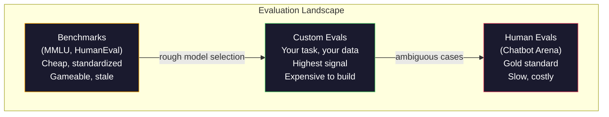
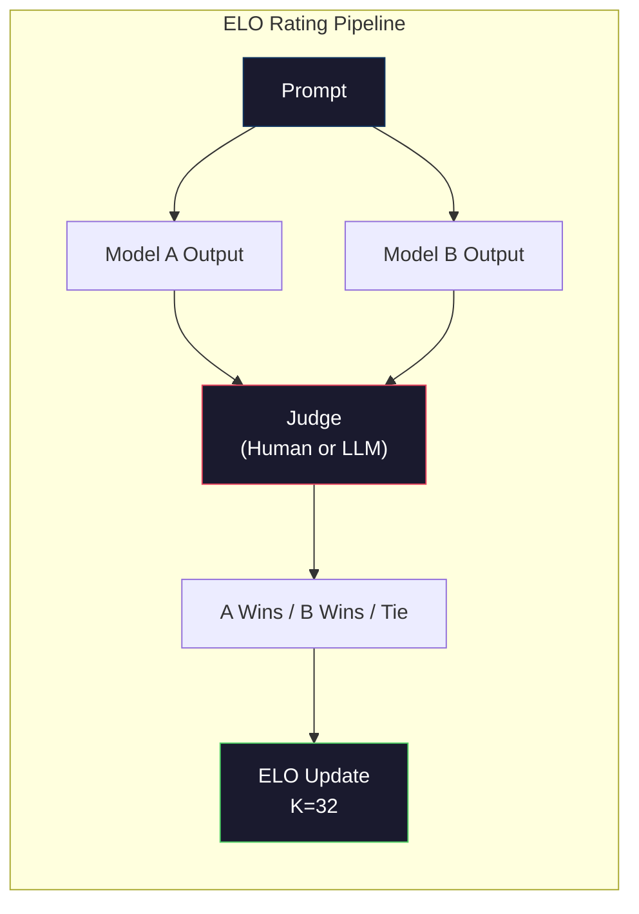

# Evaluation：Benchmarks、Evals、LM Harness

> Goodhart's Law：当一个 measure 变成 target，它就不再是好 measure。每个 frontier lab 都会 game benchmarks。MMLU 分数上升，但模型仍然不能可靠地数出 `"strawberry"` 里有几个 R。唯一真正重要的 eval 是你的 eval：在你的任务上，用你的数据。

**类型：** 构建
**语言：** Python
**前置要求：** 阶段 10，第 01-05 课（LLMs from Scratch）
**时间：** ~90 分钟

## 学习目标

- 构建 custom evaluation harness，对 language model 运行 multiple-choice 和 open-ended benchmarks
- 解释为什么标准 benchmarks（MMLU、HumanEval）会饱和，并无法区分 frontier models
- 使用 proper metrics 实现 task-specific evals：exact match、F1、BLEU 和 LLM-as-judge scoring
- 面向你的具体用例设计 custom evaluation suite，而不是只依赖 public leaderboards

## 问题

MMLU 在 2020 年发布，包含 57 个学科的 15,908 个问题。三年内，frontier models 就把它刷到饱和。GPT-4 得分 86.4%。Claude 3 Opus 得分 86.8%。Llama 3 405B 得分 88.6%。leaderboard 被压缩到 3 个点的范围里，差异更像统计噪声，而不是真实能力差距。

与此同时，同样这些模型会在 10 岁孩子不费力完成的任务上失败。Claude 3.5 Sonnet 在 MMLU 得分 88.7%，最初却数不清 `"strawberry"` 里的字母数量。这项任务不需要世界知识，也不需要推理，只需要 character-level iteration。HumanEval 用 164 个问题测试 code generation。模型在上面得分 90%+，但仍会生成 junior developer 一眼能发现 edge case 崩溃的代码。

benchmark performance 与 real-world reliability 之间的差距，是 LLM evaluation 的核心问题。Benchmarks 告诉你模型在 benchmark 上表现如何。它们几乎不告诉你这个模型在你的特定任务、你的特定数据、你的特定 failure modes 下会怎样。如果你在构建 customer support bot，MMLU 无关紧要。如果你在构建 code assistant，HumanEval 只覆盖 function-level generation，并不说明 debugging、refactoring 或跨文件解释代码的能力。

你需要 custom evals。不是因为 benchmarks 没用，它们对粗略 model selection 很有用，而是因为最终评估必须精确匹配 deployment conditions。

## 概念

### Eval Landscape

evaluation 有三类，每类成本和信号质量不同。

**Benchmarks** 是标准化 test suites。MMLU、HumanEval、SWE-bench、MATH、ARC、HellaSwag。你让模型跑 benchmark，得到一个分数。优点：大家使用同一测试，可以比较模型。缺点：模型和训练数据越来越污染这些 benchmarks。Labs 在包含 benchmark questions 的数据上训练。分数上升。能力不一定上升。

**Custom evals** 是为你的具体用例构建的 test suites。你定义 inputs、expected outputs 和 scoring function。legal document summarizer 就在 legal documents 上评估。SQL generator 就在你的 database schema 上评估。它们创建成本高，但只有它们能预测 production performance。

**Human evals** 使用 paid annotators 根据 helpfulness、correctness、fluency 和 safety 等标准评判 model outputs。对于自动评分失败的 open-ended tasks，这是 gold standard。Chatbot Arena 已在 100+ models 上收集超过 200 万条 human preference votes。缺点：成本（每个 judgment $0.10-$2.00）和速度（数小时到数天）。



### 为什么 Benchmarks 会失效

三个机制会让 benchmark scores 不再反映真实能力。

**Data contamination。** 训练语料从互联网抓取。benchmark questions 也在互联网上。模型在训练时看到了答案。这不一定是传统意义上的作弊，labs 未必有意包含 benchmark data。但 web-scale scraping 几乎不可能完全排除。

**Teaching to the test。** Labs 会优化 training mixtures 以提升 benchmark performance。如果训练混合中 5% 是 MMLU-style multiple choice，模型会学到格式和答案分布。MMLU 是 4-way multiple choice。模型会学到 A/B/C/D 的答案分布大致均匀，即使不知道答案也有帮助。

**Saturation。** 当每个 frontier model 在某 benchmark 上得分 85-90%，benchmark 就停止区分能力。剩余 10-15% 的问题可能模糊、标错，或需要冷门领域知识。MMLU 从 87% 提升到 89%，可能只是模型又记住了两道冷门题，而不是变聪明了。

### Perplexity：快速健康检查

Perplexity 衡量模型对 token 序列有多惊讶。形式上，它是平均 negative log-likelihood 的指数：

```
PPL = exp(-1/N * sum(log P(token_i | context)))
```

perplexity 为 10 表示模型平均每个 token 位置上的不确定性，相当于在 10 个选项中均匀选择。越低越好。GPT-2 在 WikiText-103 上 perplexity 约 30。GPT-3 约 20。Llama 3 8B 约 7。

Perplexity 对同一 test set 上比较模型有用，但有盲点。模型可以通过擅长预测常见模式获得低 perplexity，同时非常不擅长 rare but important patterns。它也完全不说明 instruction following、reasoning 或 factual accuracy。把它当 sanity check，而不是最终结论。

### LLM-as-Judge

用强模型评估弱模型输出。想法很简单：让 GPT-4o 或 Claude Sonnet 按 1-5 分评价 response 的 correctness、helpfulness 和 safety。使用 GPT-4o-mini 时，每个 judgment 大约 $0.01，并且与 human judgments 的相关性出奇地好，在多数任务上约 80% agreement。

scoring prompt 比模型本身更重要。模糊 prompt（“Rate this response”）会产生 noisy scores。带 rubric 的 structured prompt（“如果答案事实正确并引用来源得 5 分，正确但无来源得 4 分，部分正确得 3 分...”）会产生一致、可复现分数。

failure modes：judge models 有 position bias（pairwise comparisons 中偏好第一个 response）、verbosity bias（偏好更长 responses）和 self-preference（GPT-4 会给 GPT-4 outputs 比等价 Claude outputs 更高分）。缓解：随机化顺序、按长度 normalize、使用不同于被评估模型的 judge。

### Pairwise Comparisons 的 ELO Ratings

Chatbot Arena 的方法。给同一 prompt 展示来自不同模型的两个 responses。人类（或 LLM judge）选择更好的。从数千次 comparisons 中计算每个模型的 ELO rating，也就是国际象棋使用的系统。

ELO 优点：相对 ranking 比绝对打分更可靠，能自然处理 ties，并且比独立给每个 output 打分需要更少 comparisons 就能收敛。截至 2026 年初，Chatbot Arena 排名显示 GPT-4o、Claude 3.5 Sonnet 和 Gemini 1.5 Pro 在顶部相差不到 20 ELO points。



### Eval Frameworks

**lm-evaluation-harness**（EleutherAI）：标准开源 eval framework。支持 200+ benchmarks。用一条命令让任何 Hugging Face model 跑 MMLU、HellaSwag、ARC 等。Open LLM Leaderboard 使用它。

**RAGAS**：专门面向 RAG pipelines 的 evaluation framework。衡量 faithfulness（答案是否匹配 retrieved context？）、relevance（retrieved context 是否与问题相关？）和 answer correctness。

**promptfoo**：面向 prompt engineering 的 config-driven eval。在 YAML 中定义 test cases，对多个模型运行，得到 pass/fail report。适合 prompt regression testing，确保 prompt 改动不会破坏已有 test cases。

### 构建 Custom Evals

生产中唯一真正重要的 eval。流程：

1. **定义任务。** 模型到底应该做什么？要精确。“Answer questions” 太模糊。“给定 customer complaint email，抽取 product name、issue category 和 sentiment” 才是可评估任务。

2. **创建 test cases。** prototype eval 至少 50 个，production 需要 200+。每个 test case 是 (input, expected_output) pair。包含 edge cases：空输入、adversarial inputs、ambiguous inputs、其他语言输入。

3. **定义 scoring。** structured outputs 用 exact match。文本相似度用 BLEU/ROUGE。open-ended quality 用 LLM-as-judge。extraction tasks 用 F1。用 weights 组合多个 metrics。

4. **自动化。** 每个 eval 一条命令运行。没有手工步骤。以支持随时间比较的格式存储 results。

5. **随时间跟踪。** 单个 eval score 没意义。你需要 trendline。上次 prompt change 后分数提高了吗？切换模型后退化了吗？把 eval 与 prompts 一起 version。

| Eval Type | Cost per judgment | Agreement with humans | Best for |
|-----------|------------------|----------------------|----------|
| Exact match | ~$0 | 100% (when applicable) | Structured output, classification |
| BLEU/ROUGE | ~$0 | ~60% | Translation, summarization |
| LLM-as-judge | ~$0.01 | ~80% | Open-ended generation |
| Human eval | $0.10-$2.00 | N/A (is the ground truth) | Ambiguous, high-stakes tasks |

## 构建它

### 第 1 步：Minimal Eval Framework

定义核心抽象。eval case 有 input、expected output 和可选 metadata dict。scorer 接收 prediction 和 reference，返回 0 到 1 之间的 score。

```python
import json
from collections import Counter

class EvalCase:
    def __init__(self, input_text, expected, metadata=None):
        self.input_text = input_text
        self.expected = expected
        self.metadata = metadata or {}

class EvalSuite:
    def __init__(self, name, cases, scorers):
        self.name = name
        self.cases = cases
        self.scorers = scorers

    def run(self, model_fn):
        results = []
        for case in self.cases:
            prediction = model_fn(case.input_text)
            scores = {}
            for scorer_name, scorer_fn in self.scorers.items():
                scores[scorer_name] = scorer_fn(prediction, case.expected)
            results.append({
                "input": case.input_text,
                "expected": case.expected,
                "prediction": prediction,
                "scores": scores,
            })
        return results
```

### 第 2 步：Scoring Functions

构建 exact match、token F1 和模拟的 LLM-as-judge scorer。

```python
def exact_match(prediction, expected):
    return 1.0 if prediction.strip().lower() == expected.strip().lower() else 0.0

def token_f1(prediction, expected):
    pred_tokens = set(prediction.lower().split())
    exp_tokens = set(expected.lower().split())
    if not pred_tokens or not exp_tokens:
        return 0.0
    common = pred_tokens & exp_tokens
    precision = len(common) / len(pred_tokens)
    recall = len(common) / len(exp_tokens)
    if precision + recall == 0:
        return 0.0
    return 2 * (precision * recall) / (precision + recall)

def llm_judge_simulated(prediction, expected):
    pred_words = set(prediction.lower().split())
    exp_words = set(expected.lower().split())
    if not exp_words:
        return 0.0
    overlap = len(pred_words & exp_words) / len(exp_words)
    length_penalty = min(1.0, len(prediction) / max(len(expected), 1))
    return round(overlap * 0.7 + length_penalty * 0.3, 3)
```

### 第 3 步：ELO Rating System

实现带 ELO updates 的 pairwise comparisons。这正是 Chatbot Arena 用来排名模型的系统。

```python
class ELOTracker:
    def __init__(self, k=32, initial_rating=1500):
        self.ratings = {}
        self.k = k
        self.initial_rating = initial_rating
        self.history = []

    def _ensure_player(self, name):
        if name not in self.ratings:
            self.ratings[name] = self.initial_rating

    def expected_score(self, rating_a, rating_b):
        return 1 / (1 + 10 ** ((rating_b - rating_a) / 400))

    def record_match(self, player_a, player_b, outcome):
        self._ensure_player(player_a)
        self._ensure_player(player_b)

        ea = self.expected_score(self.ratings[player_a], self.ratings[player_b])
        eb = 1 - ea

        if outcome == "a":
            sa, sb = 1.0, 0.0
        elif outcome == "b":
            sa, sb = 0.0, 1.0
        else:
            sa, sb = 0.5, 0.5

        self.ratings[player_a] += self.k * (sa - ea)
        self.ratings[player_b] += self.k * (sb - eb)

        self.history.append({
            "a": player_a, "b": player_b,
            "outcome": outcome,
            "rating_a": round(self.ratings[player_a], 1),
            "rating_b": round(self.ratings[player_b], 1),
        })

    def leaderboard(self):
        return sorted(self.ratings.items(), key=lambda x: -x[1])
```

### 第 4 步：Perplexity Calculation

使用 token probabilities 计算 perplexity。实践中这些来自模型 logits。这里用概率分布模拟。

```python
import numpy as np

def perplexity(log_probs):
    if not log_probs:
        return float("inf")
    avg_neg_log_prob = -np.mean(log_probs)
    return float(np.exp(avg_neg_log_prob))

def token_log_probs_simulated(text, model_quality=0.8):
    np.random.seed(hash(text) % 2**31)
    tokens = text.split()
    log_probs = []
    for i, token in enumerate(tokens):
        base_prob = model_quality
        if len(token) > 8:
            base_prob *= 0.6
        if i == 0:
            base_prob *= 0.7
        prob = np.clip(base_prob + np.random.normal(0, 0.1), 0.01, 0.99)
        log_probs.append(float(np.log(prob)))
    return log_probs
```

### 第 5 步：Aggregate Results

计算一次 eval run 的 summary statistics：mean、median、threshold 下的 pass rate，以及每个 metric 的 breakdown。

```python
def summarize_results(results, threshold=0.8):
    all_scores = {}
    for r in results:
        for metric, score in r["scores"].items():
            all_scores.setdefault(metric, []).append(score)

    summary = {}
    for metric, scores in all_scores.items():
        arr = np.array(scores)
        summary[metric] = {
            "mean": round(float(np.mean(arr)), 3),
            "median": round(float(np.median(arr)), 3),
            "std": round(float(np.std(arr)), 3),
            "min": round(float(np.min(arr)), 3),
            "max": round(float(np.max(arr)), 3),
            "pass_rate": round(float(np.mean(arr >= threshold)), 3),
            "n": len(scores),
        }
    return summary

def print_summary(summary, suite_name="Eval"):
    print(f"\n{'=' * 60}")
    print(f"  {suite_name} Summary")
    print(f"{'=' * 60}")
    for metric, stats in summary.items():
        print(f"\n  {metric}:")
        print(f"    Mean:      {stats['mean']:.3f}")
        print(f"    Median:    {stats['median']:.3f}")
        print(f"    Std:       {stats['std']:.3f}")
        print(f"    Range:     [{stats['min']:.3f}, {stats['max']:.3f}]")
        print(f"    Pass rate: {stats['pass_rate']:.1%} (threshold >= 0.8)")
        print(f"    N:         {stats['n']}")
```

### 第 6 步：运行完整 Pipeline

把所有内容接起来。定义任务，创建 test cases，模拟两个模型，运行 evals，从 pairwise comparisons 计算 ELO，并打印 leaderboard。

```python
def demo_model_good(prompt):
    responses = {
        "What is the capital of France?": "Paris",
        "What is 2 + 2?": "4",
        "Who wrote Hamlet?": "William Shakespeare",
        "What language is PyTorch written in?": "Python and C++",
        "What is the boiling point of water?": "100 degrees Celsius",
    }
    return responses.get(prompt, "I don't know")

def demo_model_bad(prompt):
    responses = {
        "What is the capital of France?": "Paris is the capital city of France",
        "What is 2 + 2?": "The answer is four",
        "Who wrote Hamlet?": "Shakespeare",
        "What language is PyTorch written in?": "Python",
        "What is the boiling point of water?": "212 Fahrenheit",
    }
    return responses.get(prompt, "Unknown")

cases = [
    EvalCase("What is the capital of France?", "Paris"),
    EvalCase("What is 2 + 2?", "4"),
    EvalCase("Who wrote Hamlet?", "William Shakespeare"),
    EvalCase("What language is PyTorch written in?", "Python and C++"),
    EvalCase("What is the boiling point of water?", "100 degrees Celsius"),
]

suite = EvalSuite(
    name="General Knowledge",
    cases=cases,
    scorers={
        "exact_match": exact_match,
        "token_f1": token_f1,
        "llm_judge": llm_judge_simulated,
    },
)

results_good = suite.run(demo_model_good)
results_bad = suite.run(demo_model_bad)

print_summary(summarize_results(results_good), "Model A (concise)")
print_summary(summarize_results(results_bad), "Model B (verbose)")
```

“good” model 给出精确答案。“bad” model 给出 verbose paraphrases。exact match 会严厉惩罚 verbose model。Token F1 和 LLM-as-judge 更宽容。这说明 metric choice 很重要：同一个模型在不同评分方式下看起来可能很好，也可能很糟。

### 第 7 步：ELO Tournament

在多轮中运行模型间 pairwise comparisons。

```python
elo = ELOTracker(k=32)

for case in cases:
    pred_a = demo_model_good(case.input_text)
    pred_b = demo_model_bad(case.input_text)

    score_a = token_f1(pred_a, case.expected)
    score_b = token_f1(pred_b, case.expected)

    if score_a > score_b:
        outcome = "a"
    elif score_b > score_a:
        outcome = "b"
    else:
        outcome = "tie"

    elo.record_match("model_a_concise", "model_b_verbose", outcome)

print("\nELO Leaderboard:")
for name, rating in elo.leaderboard():
    print(f"  {name}: {rating:.0f}")
```

### 第 8 步：Perplexity Comparison

比较不同“模型质量”等级的 perplexity。

```python
test_text = "The quick brown fox jumps over the lazy dog in the garden"

for quality, label in [(0.9, "Strong model"), (0.7, "Medium model"), (0.4, "Weak model")]:
    log_probs = token_log_probs_simulated(test_text, model_quality=quality)
    ppl = perplexity(log_probs)
    print(f"  {label} (quality={quality}): perplexity = {ppl:.2f}")
```

## 使用它

### lm-evaluation-harness（EleutherAI）

在任意模型上运行 benchmarks 的标准工具。

```python
# pip install lm-eval
# Command line:
# lm_eval --model hf --model_args pretrained=meta-llama/Llama-3.1-8B --tasks mmlu --batch_size 8

# Python API:
# import lm_eval
# results = lm_eval.simple_evaluate(
#     model="hf",
#     model_args="pretrained=meta-llama/Llama-3.1-8B",
#     tasks=["mmlu", "hellaswag", "arc_easy"],
#     batch_size=8,
# )
# print(results["results"])
```

### promptfoo

用于 prompt engineering 的 config-driven eval。在 YAML 中定义 tests，并对多个 providers 运行。

```yaml
# promptfoo.yaml
providers:
  - openai:gpt-4o-mini
  - anthropic:claude-3-haiku

prompts:
  - "Answer in one word: {{question}}"

tests:
  - vars:
      question: "What is the capital of France?"
    assert:
      - type: contains
        value: "Paris"
  - vars:
      question: "What is 2 + 2?"
    assert:
      - type: equals
        value: "4"
```

### RAGAS for RAG evaluation

```python
# pip install ragas
# from ragas import evaluate
# from ragas.metrics import faithfulness, answer_relevancy, context_precision
#
# result = evaluate(
#     dataset,
#     metrics=[faithfulness, answer_relevancy, context_precision],
# )
# print(result)
```

RAGAS 衡量 generic evals 漏掉的东西：模型答案是否 grounded in retrieved context，而不只是抽象意义上是否“正确”。

## 交付它

本课会产出 `outputs/prompt-eval-designer.md`，这是一个可复用 prompt，用于为任意任务设计 custom eval suites。给它任务描述，它会生成 test cases、scoring functions 和 pass/fail threshold 建议。

它还会产出 `outputs/skill-llm-evaluation.md`，这是一个根据 task type、budget 和 latency requirements 选择正确 evaluation strategy 的决策框架。

## 练习

1. 添加 “consistency” scorer：让同一 input 通过模型 5 次，测量 outputs 匹配频率。deterministic inputs 上不一致的答案会暴露 fragile prompts 或过高 temperature settings。

2. 扩展 ELO tracker，支持多个 judge functions（exact match、F1、LLM-as-judge）并加权。比较重权 exact match 与重权 F1 时 leaderboard 如何变化。

3. 为特定任务构建 eval suite：把 email 分类到 5 个类别。创建 100 个 test cases，包含 diverse examples 和 edge cases（可归属多个类别的邮件、空邮件、其他语言邮件）。测量不同“模型”（rule-based、keyword matching、simulated LLM）的表现。

4. 实现 contamination detection：给定 eval questions 和 training corpus，检查 eval questions（或近似 paraphrases）有多少比例出现在训练数据中。这是研究者审计 benchmark validity 的方式。

5. 构建 “model diff” tool。给定两个模型版本的 eval results，突出哪些 test cases improved、哪些 regressed、哪些 unchanged。这是 eval 版 code diff，是理解一个改动到底有益还是有害的必要工具。

## 关键词

| Term | What people say | What it actually means |
|------|----------------|----------------------|
| MMLU | “那个 benchmark” | Massive Multitask Language Understanding：57 个学科、15,908 个 multiple choice questions，到 2025 年在 88% 以上饱和 |
| HumanEval | “code eval” | OpenAI 的 164 个 Python function-completion problems，只测试 isolated function generation |
| SWE-bench | “真实 coding eval” | 来自 12 个 Python repos 的 2,294 个 GitHub issues，衡量包含 test generation 的端到端 bug fixing |
| Perplexity | “模型有多困惑” | `exp(-avg(log P(token_i given context)))`；越低表示模型给真实 tokens 分配的概率越高 |
| ELO rating | “模型的国际象棋排名” | 从 pairwise win/loss records 计算的相对 skill rating，Chatbot Arena 用它排名 100+ models |
| LLM-as-judge | “用 AI 给 AI 打分” | 强模型根据 rubric 给弱模型 outputs 打分，与 human judges 约 80% agreement，成本约 $0.01/judgment |
| Data contamination | “模型看过测试题” | 训练数据包含 benchmark questions，导致分数膨胀但真实能力未提升 |
| Eval suite | “一堆测试” | versioned collection，由 (input, expected_output, scorer) triples 组成，衡量特定能力 |
| Pass rate | “答对多少比例” | eval cases 中得分超过阈值的比例；比 mean score 更 actionable，因为它衡量 reliability |
| Chatbot Arena | “模型排名网站” | LMSYS 平台，拥有 2M+ human preference votes，通过 ELO ratings 生成最受信任的 LLM leaderboard |

## 延伸阅读

- [Hendrycks et al., 2021 -- "Measuring Massive Multitask Language Understanding"](https://arxiv.org/abs/2009.03300) -- MMLU 论文，尽管已饱和，仍是被引用最多的 LLM benchmark
- [Chen et al., 2021 -- "Evaluating Large Language Models Trained on Code"](https://arxiv.org/abs/2107.03374) -- OpenAI 的 HumanEval 论文，建立 code generation evaluation 方法
- [Zheng et al., 2023 -- "Judging LLM-as-a-Judge"](https://arxiv.org/abs/2306.05685) -- 系统分析用 LLM 评估 LLM，包括 position bias 和 verbosity bias 发现
- [LMSYS Chatbot Arena](https://chat.lmsys.org/) -- crowd-sourced model comparison 平台，拥有 2M+ votes，是最受信任的 real-world LLM ranking
