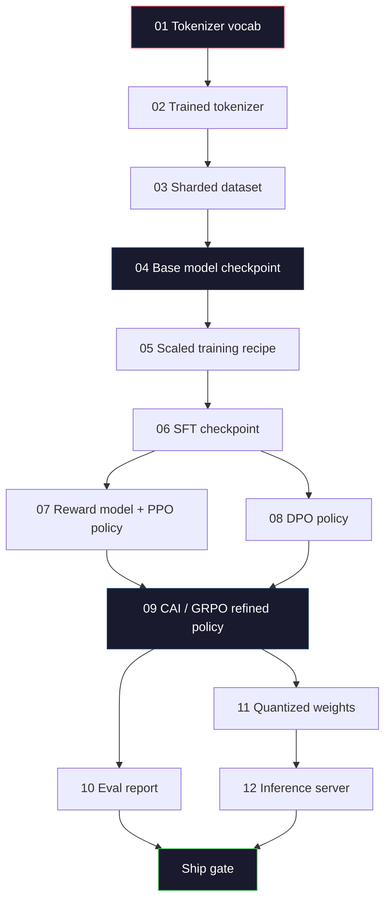
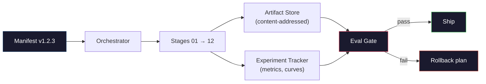

# 构建完整 LLM Pipeline

> 第 01 到第 12 课的一切，都是同一个 pipeline 的一个阶段。本课是把这些阶段变成单次端到端运行的脚手架：tokenize、pre-train、scale、SFT、align、evaluate、quantize、serve。你不会在 laptop 上训练 70B 模型。你会产出 orchestration layer、manifest、eval gate 和 rollback plan，也就是 2026 年 frontier team 用来决定什么可以 ship 的东西。这是 capstone。

**类型：** 构建
**语言：** Python（stdlib）
**前置要求：** 阶段 10 全部第 01-12 课
**时间：** ~120 分钟

## 学习目标

- 把前 11 课（tokenizer、data、pre-training、scaling、SFT、RLHF、DPO、CAI、eval、quantization、inference）组合成一个可复现的 pipeline spec
- 定义 stages 之间的 artifact contract：每个阶段消费什么、产出什么，以及下一阶段如何验证输入
- 构建 orchestrator，跟踪 experiments、hash artifacts，并用 eval thresholds gate ship decisions
- 设计 rollback plan：哪些 artifacts 重跑便宜，哪些昂贵，以及 corrupted checkpoint 的代价是什么

## 问题

前面的课程各自都能工作。Tokenizer 训练好了。Tiny GPT pre-trained 了。SFT dataset 组好了。Reward model 训练了。DPO 跑了。Evals 测了。Quantized weights export 了。Inference server 启动了。每个都是 notebook。每个都有自己的约定、自己的 output paths、自己的 seed。

frontier training run 不是 notebook。Llama 3 405B 花了约 54 天、3000 万 H100 hours。DeepSeek-V3 使用约 280 万 H800 hours。在这段时间里，一个 corrupted checkpoint、一次 data contamination、一次 eval regression，都可能让团队损失一周 wall-clock 和一个月 GPU budget。团队靠 pipeline hygiene 活下来：每个 stage 都有 deterministic input、deterministic output、manifest、hash 和 gate。

这是 capstone。你不会在 laptop 上端到端运行 pipeline。你会写协调 stages 的 orchestrator、描述 run 的 manifest、gate ship decisions 的 verifier，以及让第三方能从单个文件重跑你工作的 replay plan。代码很小，纪律很大。

这个 pattern 从 100M 到 1T 参数都不变。同样四个组件，manifest、orchestrator、eval gate、artifact store，可以运行 Llama 3，也可以运行你的 hobby GPT。区别只是每个 stage config 里的数字大小，而不是 pipeline 形状。

## 概念

### 十二个阶段

每个 Phase 10 lesson 都是一个 stage。完整 dependency graph 如下。



Stages 07 和 08 可以并行运行。其他都是硬依赖。stage 02（tokenizer）的改变会让所有 downstream artifacts 失效。stage 10（eval）的改变只会让 ship decision 失效。

### Manifest

manifest 是单个文件，足够完整地描述一次 run，使其可以 replay。pipeline 产生的任何内容都不应该依赖 manifest 之外的 state。字段很无聊，但必须有。

```
pipeline_version: 1.2.3
seed: 42
git_commit: a1b2c3d4
stages:
  01_tokenizer:
    recipe: bpe_32k
    input_hash: sha256:...
    output_hash: sha256:...
    wall_clock_sec: 3600
    cost_usd: 12
```

stage N 的 output hash 是 stage N+1 的 input hash。任何偏差，pipeline 都会 halt。这是早期捕捉 data corruption 的方式。也是另一个大陆的 teammate 验证自己 replay 产物与你相同的方式。

实践中，团队会使用一个小 YAML schema 加 manifest checker，与上一次 successful run 做 diff。expected fields（cost、wall clock）之外的任何 delta 都是 red flag。

### Artifact Typing

每个 stage 的 output 都是 typed artifact。不是目录 blob，不是 pickle，而是带已知 schema 的命名类型。

| Stage | Artifact Type | Key Fields |
|-------|--------------|-----------|
| 01-02 | Tokenizer | vocab.json, merges.txt, config.json, hash |
| 03 | Dataset | shards[], row count, token count, dedup stats |
| 04-05 | Checkpoint | weights.safetensors, config.json, optimizer state, step count |
| 06 | SFT Model | checkpoint + SFT recipe + data mix |
| 07 | Reward Model | RM checkpoint + preference data hash |
| 08-09 | Policy | checkpoint + reference hash + beta + KL budget consumed |
| 10 | Eval Report | benchmark scores + regression diffs + eval data hash |
| 11 | Quantized Model | quantized weights + calibration data + accuracy delta vs FP16 |
| 12 | Server Spec | endpoint + model hash + config + observability hooks |

typing 防止最常见 failure mode：把 stage 08 output 当 stage 06 input，用 SFT path ship 了一个 DPO-trained model。Typed artifacts 和 typed stage signatures 让这些错误成为 compile-time failures，而不是第五天才发生的 failures。

### Eval Gate

Shipping 不是“training finished”。Shipping 是“training finished 且 eval gate passed”。gate 在 run 开始前定义。

```
gates:
  mmlu:      >= baseline + 0.5   # no regression
  humaneval: >= baseline + 1.0
  truthfulqa: >= baseline         # no drop
  safety_refusal_rate: <= 0.05
  kl_from_reference: <= 25.0
  cost_total_usd: <= 50000
```

每个 gate 都是 numeric threshold。没有 “looks good” gates。没有 subjective sign-offs。如果所有 gate 通过，artifact 被标记为 shippable。如果任一 gate 失败，run 被 hold，等待 named reviewer 明确 override，而 override 本身也记录在 manifest 中。

两个 gates 能抓住多数灾难。*regression* gate（新模型在核心 benchmarks 上至少不差于旧模型）抓 training bugs。*KL budget* gate（aligned policy 不应比 reference drift 超过 X）抓 alignment overcooking。每个 production pipeline 都有二者。

### Orchestrator

一小段代码，读取 manifest、dispatch stages、跟踪 artifacts，并在任何 contract violation 时 halt。这不是 Airflow。不是 Kubeflow。为了 pipeline hygiene，你需要自己写的无聊东西。

orchestrator 的工作很窄：

1. 从 manifest resolve DAG。
2. 对每个 stage，检查 expected output 是否已经以正确 hash 存在（存在就跳过）。
3. 运行 stage，捕获 stdout/stderr，测量 wall clock 和 cost。
4. 根据 downstream stage expected input hash 验证 output hash。
5. 失败时，写出 partial manifest，记录 exact failing stage，并以 nonzero 退出。

这大约 200 行 Python。它会像本课的 `code/main.py`。真实 pipeline 底层用 `torchrun` 或 `ray` 在 clusters 上执行 individual stages，但 orchestrator 本身运行在单机上。

### Experiment Tracking 与 Artifact Storage

两个外部系统锚定 pipeline。

**Experiment tracker（wandb、neptune、mlflow）。** 记录每个 stage 的 loss curves、eval metrics、system telemetry。当三周后需要比较 run A 和 run B 时，你会去 tracker。团队几乎总是使用 hosted tracker，自己写会浪费本该用于训练的时间。

**Artifact store（S3、R2、GCS）。** checkpoints、datasets、tokenizers、eval reports 的 immutable object store。artifacts 按 hash 寻址，而不是 filename。`latest.pt` 这种 filename 是 foot-gun；`ckpt-7b-step-20000-sha256:abc123.safetensors` 才是 contract。

orchestrator 会写入二者。tracker 给人看 charts。artifact store 给下一阶段查 inputs。

### Costing

frontier run 都有美元数字。budget discipline 发生在两个地方。

**Pre-run estimate。** 从 manifest 计算 expected FLOPs（pre-training: 6 x params x tokens）、expected GPU hours（FLOPs / peak throughput / utilization）和当前 rental rate 下的 dollar cost。如果 estimate 超过 budget gate，pipeline 拒绝启动。

**In-run tracking。** stage-by-stage wall clock 和 cost 记录到 manifest。每个 stage 后检查 remaining budget。如果某 stage 超支，下一 stage 的 gate 使用新的 remaining budget 评估。你不会在 VC 打电话时才发现钱没了。

Llama 3 报告成本为 $61M。DeepSeek-V3 报告 main pre-training run 为 $5.6M。比例主要来自 hardware efficiency 加 mixture-of-experts，但具体 cost 可见，是因为两队都按 stage 跟踪，而不是只按 run 跟踪。

### Reproducibility vs Determinism

二者不同。*Reproducible* 表示同一 manifest 加同一 code 加同一 infrastructure 会产生 downstream metrics 等价的 checkpoint。*Deterministic* 表示 bit-identical output。

现代 LLM training 可复现，但不 deterministic。Distributed training 的 reduce-order、GPU kernel non-determinism（cuBLAS、flash-attn）和 mixed precision rounding 共同导致 runs 之间 floats 在 1e-5 层面不同。这对 final metrics 没问题，因为它们不会变化。若你想用 bit-level diffs 调试，这会致命。解决方法是记录每个 stage 的 input hash、output hash 和 headline metrics。如果这些匹配，即使 weights 不是 bit-identical，也认为 run 被“reproduced”。



### Rollback Plan

run 开始前，写清每个 stage 失败时怎么办。三类：

- **重跑便宜**（小时）：tokenizer、eval、quantization、inference server。直接重跑。
- **中等**（天）：SFT、DPO、CAI。保留 base model，只重跑 alignment stages。
- **昂贵**（周和数百万美元）：pre-training。这里的 rollback plan 不是“重跑”，而是“使用最后一个 good checkpoint，并用 revised data 重跑更便宜的 downstream stages”。

因为 stage dependencies 都 typed 且 hashed，orchestrator 可以自动计算 rollback set：failed stage 加所有 descendants。stage 06（SFT）失败会 invalidate 06、07、08、09、10、11、12。stage 11（quantization）失败只 invalidate 11 和 12。提前命名这些，避免团队凌晨 4 点筋疲力尽时临场发挥。

### 2026 生产 Recipes

多数 frontier teams 收敛到同一 skeleton。

- Tokenizer：带 byte fallback 的 128k BPE。在小而均衡的 multilingual slice 上训练。
- Pre-training：10-20T tokens，主要是 web、code、synthetic。Muon 或 AdamW optimizer。FSDP2 或 DeepSpeed ZeRO-3。Gradient checkpointing。BF16 weights，FP32 master。
- SFT：500k-2M instruction pairs，human 与 synthetic 混合，并严格与 eval set 去重。
- Alignment：DPO 或 CAI + GRPO。只有 preference signal 对 DPO 来说过于 multidimensional 时才用 RLHF。
- Eval：MMLU-Pro、MATH、HumanEval+、GPQA、SWE-Bench Verified、LiveBench，加上不公开的 private held-out set。
- Quantization：serving 用 4-bit GPTQ 或 AWQ，accuracy deltas 重要的 safety evals 用 8-bit。
- Serving：vLLM、TensorRT-LLM 或 in-house。Continuous batching。Speculative decoding。KV cache eviction。

数字每六个月变一次。skeleton 不变。

## 构建它

本课代码是 orchestrator 和 manifest checker，而不是十二个 training scripts。每个 stage 用 placeholder 模拟，产出形状和 hash 正确的 output artifact。在真实 GPU 训练前，端到端运行 orchestrator 可以证明 pipeline plumbing 正常。

完整实现见 `code/main.py`。关键部分：

- `Manifest` dataclass：pipeline version、seed、git commit、stages、gates。
- `Stage` dataclass：name、type、inputs（hashes）、output（hash）、wall clock、cost。
- `Orchestrator.run()`：resolve DAG、dispatch stages、verify hashes、update manifest。
- `EvalGate.check()`：读取 thresholds，与最新 eval report 比较，返回 pass/fail。
- `ArtifactStore`（in-memory stub）：按 hash put/get，模拟 S3。
- `CostTracker`：按 stage 与 cumulative 计费，超 cap 时 halt。

`main.py` 中的 pipeline 运行十二个 placeholder stages，产生 manifest，并触发一个失败 eval gate，展示 held run 长什么样。把每个 placeholder 换成对应 lesson 的真实 training script，你就得到了真实 frontier pipeline 使用的 skeleton。

## 使用它

canonical workflow 有三条命令。

```
python code/main.py plan    # validate manifest, compute cost estimate, print DAG
python code/main.py run     # execute stages, writing to manifest.out.yaml
python code/main.py gate    # read manifest.out.yaml, apply eval gates, ship-or-hold
```

每次都先运行 `plan`。多数 pipeline bugs 会在 plan time 暴露：missing gate thresholds、stale hashes、budget overruns。运行 `plan` 免费。运行 `run` 昂贵。把 bug 抓在便宜的一侧可以省钱。

`gate` 的输出要么是 `SHIP`，要么是 `HOLD: <reason>`。held run 不是 failure，而是 decision point。named reviewer 要么 override（且 override 被记录），要么批准 rollback。

## 交付它

本课会产出 `outputs/skill-llm-pipeline-reviewer.md`。把 proposed pipeline manifest 给它，它会检查所有 contracts：stage typing、hash chain、gates、rollback plan、cost estimate。缺失 eval gate、KL budget 无上限、或混用 eval 和 training data 的 manifest，它都会拒绝批准。

## 练习

1. 扩展 orchestrator，支持 stage 07 和 08 并行执行。使用 stdlib `concurrent.futures` module。确认 final manifest 记录两个 stage 的 outputs，且 stage 09 的 input hash 是二者的 deterministic combination。

2. 添加 “contamination check” gate。给定 eval dataset hash 和 training dataset shards，计算 overlap（exact string match 或 13-gram match）。如果 overlap 超过 0.1%，gate 失败。喂入 contaminated training set，确认 gate hold 住 run。

3. 从 first principles 实现 cost estimator。对 stage 04（pre-training），估计 FLOPs 为 6 x params x tokens，假设 H100 BF16 989 TFLOPs 上 40% MFU（model FLOPs utilization），价格 $2.50/GPU-hour。报告 7B 模型在 2T tokens 上训练的估计成本。与已发布 Llama 2 数字比较。

4. 构建 partial rollback。模拟 stage 09（CAI）失败，然后只重跑 stages 09 到 12，保持 01-08 cached。orchestrator 应根据 hash 检测 cached artifacts 并跳过它们。测量相对 full re-run 节省的 wall-clock。

5. 添加 observability。为每个 stage emit OpenTelemetry spans，attributes 包含 params、tokens seen、loss 和 cost。把 spans 发送到本地 collector。重点不是 dashboards，而是每个 stage 的健康状态都可以从单个 trace ID 追踪。

## 关键词

| Term | What people say | What it actually means |
|------|----------------|----------------------|
| Manifest | “recipe file” | 描述 pipeline version、seed、per-stage config 和 gate thresholds 的 YAML 或 JSON，足以 replay 一次 run |
| Content-addressed | “按 hash 而不是名字” | artifacts 按内容 SHA-256 存储，永远不会把 version A 和 version B 混淆 |
| Eval gate | “ship criteria” | benchmark metrics 与 safety scores 的 numeric thresholds，必须通过后 artifact 才标记为 shippable |
| KL budget | “alignment drift 了多远” | alignment stages 中 cumulative KL(policy \|\| reference) 的上限，作为 gate 强制执行 |
| MFU | “GPU 用了多少” | Model FLOPs Utilization，achieved FLOPs 除以 theoretical peak。70B 规模典型 40%，7B 约 55% |
| Rollback plan | “出问题时怎么办” | failure 时每个 stage 的预先写好的 actions：re-run、fall back、用 revised inputs retrain |
| Orchestrator | “conductor” | 读取 manifest、dispatch stages、verify hashes，并在任何 contract violation 时 halt 的过程 |
| Artifact store | “weights 的 versioned S3” | immutable content-addressed object store，是 checkpoints、datasets、eval reports 的 single source of truth |
| Reproducible | “replay 后 metrics 相同” | bit-level weights 可不同，但 downstream metrics 等价，这是 distributed LLM training 的现实目标 |
| Cost gate | “不能超过 X” | pre-run cost estimate 加 in-run tracker；如果 estimate 超预算，pipeline 拒绝启动 |

## 延伸阅读

- [Dubey et al., 2024 -- "The Llama 3 Herd of Models"](https://arxiv.org/abs/2407.21783) -- frontier pipeline 最详细公开描述之一，覆盖 data、training、alignment、eval
- [DeepSeek-AI, 2024 -- "DeepSeek-V3 Technical Report"](https://arxiv.org/abs/2412.19437) -- efficiency-first pipeline，成本约为 Llama 3 级训练的 1/10
- [Kaplan et al., 2020 -- "Scaling Laws for Neural Language Models"](https://arxiv.org/abs/2001.08361) -- 原始 compute-data-params scaling relationship
- [Hoffmann et al., 2022 -- "Training Compute-Optimal Large Language Models (Chinchilla)"](https://arxiv.org/abs/2203.15556) -- 修正 Kaplan、重新校准现代 data budgets 的论文
- [PyTorch FSDP2 documentation](https://pytorch.org/docs/stable/fsdp.html) -- PyTorch 2.4+ 中替代 FSDP1 的 distributed training primitive
- [Weights & Biases LLM Reports](https://wandb.ai/site/llms) -- 开源 LLM runs 的真实 manifests 和 experiment tracker output，可作为模板参考
