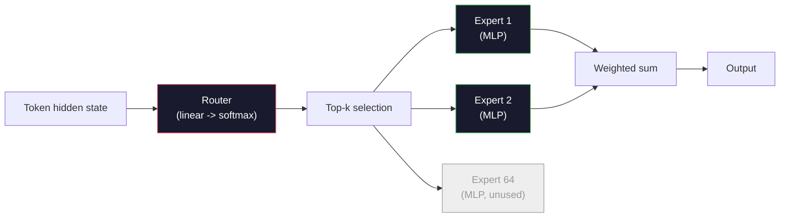

# Open Models：Architecture Walkthroughs

> 你在第 04 课从零构建了 GPT-2 Small。2026 年的 frontier open models 与它同属一个家族，只是有五六个具体变化。RMSNorm 替代 LayerNorm。SwiGLU 替代 GELU。RoPE 替代 learned positions。GQA 或 MLA 替代 full MHA。大规模 Mixture-of-Experts。你已经知道的数学覆盖其中 95%。本课并排阅读 Llama 3、DeepSeek-V3、Mixtral、Qwen 和 Gemma，并指出每个 architecture 在哪一行发生分歧。

**类型：** 学习
**语言：** Python（stdlib）
**前置要求：** 阶段 10，第 04、05、12 课（Pre-training、Scaling、Inference）
**时间：** ~45 分钟

## 学习目标

- 阅读 Llama 3、Mistral、Mixtral、Gemma 2、Qwen 2.5 和 DeepSeek-V3 的 config.json，并解释每个字段
- 说出每个模型相对 GPT-2 Small 做出的具体 architecture change，并从 first principles 说明原因
- 只根据 config 计算任意 open model 的 parameter count、KV cache size 和 activation memory
- 在给定 latency、memory 和 capability constraints 下，为部署目标选择合适 open model

## 问题

第 04 课中，你写了 350 行 numpy，得到了一个 GPT-2-shaped model。Llama 3 405B 有 200 页 technical report。你的直觉可能是二者完全不同。不是。那 200 页描述的是同一个对象，只是加了五六个动机明确的修改，再加上一千个 scaling implementation details。骨架，也就是 embedding、transformer blocks、attention、MLP、norm、head，没有改变。

本课是一个 diff。对每个主要 open model family，我们列出它相对 GPT-2 精确改变了什么、为什么改变、代价是什么。完成后，你能阅读一个新的 model card，并在脑中把它翻译回 GPT-2 baseline。

实际收益是，当 Meta 发布 Llama 5 或 DeepSeek 发布 V4 时，你不需要新的 mental model。你会看 config，看到哪些 well-known knobs 被移动，并知道 downstream implications。2026 年 architectures 是一个有限工具箱。每个新模型只是选择不同子集。

## 概念

### 不变核心

所有 autoregressive open models 都共享：

- Token embedding matrix（vocab_size x hidden_dim）。
- N 个 decoder blocks 的 stack：norm、self-attention、residual、norm、MLP、residual。
- Final norm 和投影到 vocab_size 的 linear head（通常与 embeddings weight-tied）。
- Causal mask，next-token cross-entropy loss。

这就是形状。其余都是 knobs。

### 真正移动的六个 Knobs

在 2024-2026 年的 frontier open models 中，反复被选择的是同六个设计项：

1. **Normalization。** LayerNorm -> RMSNorm。
2. **Positional encoding。** Learned absolute -> RoPE（以及 variants：YaRN、NTK）。
3. **Activation。** GELU -> SwiGLU（或 GeGLU）。
4. **Attention head sharing。** MHA -> GQA -> MQA -> MLA。
5. **Dense vs sparse MLP。** Dense -> Mixture-of-Experts。
6. **Pre-norm placement。** Pre-norm 保留。Post-norm 已经消失。

其他内容（learning rate schedule、data mix、batch size、context length）属于 training config，不属于 architecture。六个 knobs。

### Knob 1：RMSNorm

LayerNorm 减均值、除以 std、scale、shift。RMSNorm 只保留 scale：

```
RMSNorm(x) = x / sqrt(mean(x^2) + eps) * gamma
```

没有 mean subtraction。没有 bias。每个 token 少一个 matmul。Zhang and Sennrich（2019）证明它在 machine translation 上匹配 LayerNorm，同时快 10%。每个现代 open model 都用它。

代价：无。收益：小 throughput 提升，代码更简单。

### Knob 2：RoPE

GPT-2 中的 learned position embeddings 是一个 1024-slot lookup table。context 1025 超出表尾。模型无法 extrapolate 到 training length 之外。

Rotary Position Embedding（RoPE，Su et al. 2021）通过在 attention dot product 前成对旋转每个 Q 和 K vector 来注入 position。旋转角是 position 的确定性函数，所以没有 learned 内容，也不会用完。配合 scaling tricks（NTK-aware interpolation、YaRN），一个在 8k context 训练的模型可以在 inference 时拉伸到 128k，accuracy loss modest。

```
q_rotated = rotate(q, angle(pos))
k_rotated = rotate(k, angle(pos))
score = q_rotated . k_rotated
```

每个 Llama、Mistral、Qwen、DeepSeek 和 Gemma 都使用 RoPE。Gemma 2 使用 hybrid（多数 layers 用 RoPE，其他 layers 用 local sliding-window attention）。

### Knob 3：SwiGLU

GPT-2 的 MLP 是 `x -> gelu(xW1 + b1) -> (...)W2 + b2`。SwiGLU（Shazeer 2020）把 activation 替换成 gated product：

```
SwiGLU(x) = (xW1) * sigmoid(xW1) * xV
```

两个 projections 并行，而不是一个，并由 Swish activation gate。经验上它在每参数 perplexity 上更强。Llama 2 采用后，大家都跟随。MLP hidden size 通常设置成让总参数数匹配原 dense MLP：如果 GPT-2 使用 `ff_dim = 4 * hidden`，SwiGLU 使用 `ff_dim = (2/3) * 4 * hidden = 8/3 * hidden`。

### Knob 4：Attention Head Sharing

GPT-2 使用 **Multi-Head Attention (MHA)**：每个 head 都有自己的 Q、K、V projection。

**Multi-Query Attention (MQA, Shazeer 2019)** 让所有 heads 共享一个 K 和一个 V。把 KV cache 减少 num_heads 倍，对典型模型是 12x 到 32x reduction。hard benchmarks 上 accuracy 略降。

**Grouped-Query Attention (GQA, Ainslie et al. 2023)** 是中间地带：G 组 Q heads 共享一个 K 和一个 V。Llama 3 8B 使用 32 Q heads 和 8 KV heads 的 GQA（G=8），所以 KV cache 相对 full MHA 缩小 4 倍。

**Multi-Head Latent Attention (MLA, DeepSeek 2024)** 把 K 和 V 压缩成 shared low-rank latent，再按 head 投影回来。在保留 per-head expressiveness 的同时进一步减少 KV cache。DeepSeek-V2 和 V3 的 long-context performance 依赖它。

| Scheme | KV Heads | KV Cache | Accuracy |
|--------|----------|----------|----------|
| MHA    | num_heads | full | best |
| GQA    | num_groups (G < num_heads) | num_heads / G reduction | near-MHA |
| MQA    | 1 | num_heads reduction | small hit |
| MLA    | latent, per-head decompression | smaller than MQA | near-MHA |

对任何超过约 13B 参数的模型，GQA 或 MLA 基本是 mandatory。大规模 full MHA 是 KV cache disaster。

### Knob 5：Mixture of Experts

dense MLP 每个 token 都激活全部参数。MoE MLP 每个 block 有 K 个 experts 和一个 router，router 为每个 token 选择 top-k experts（通常 top-2）。这个 token 只 forward 那些 experts 的 weights。

```
router_logits = xW_r
indices, weights = top_k(router_logits, k=2)
output = sum_i weights[i] * expert[indices[i]](x)
```

吸引力在于：你可以有 64 个 7B 大小的 experts（所以 total param count 巨大），但每个 token 只运行其中 2 个（所以 per-token compute 匹配 dense 7B 模型）。Mixtral 8x7B 有 47B total parameters，但每个 token 只激活 13B。DeepSeek-V3 有 671B total parameters，但每个 token 只激活 37B。



优点：相同 compute，更多参数，更强容量。缺点：expert memory 仍然必须放在某处（所以 serving 需要比 dense equivalent 更多 VRAM），router load-balancing 很难，alignment 期间 fine-tune router 本身也是研究问题。

### Knob 6：Pre-norm 保留

原始 transformer 在每个 sublayer 后应用 layer norm。GPT-2 以来每个 open model 都把它放在每个 sublayer 前。Pre-norm 在深层训练上明显更容易。没什么可争的。

### Model-by-Model Diff

下面的表让所有内容具体化。

| Model | Year | Total Params | Active Params | Norm | Activation | Position | Attention | MoE | Context |
|-------|------|-------------|---------------|------|-----------|----------|-----------|-----|---------|
| GPT-2 Small | 2019 | 124M | 124M | LayerNorm | GELU | Learned | MHA (12 heads) | no | 1k |
| Llama 3 8B | 2024 | 8B | 8B | RMSNorm | SwiGLU | RoPE | GQA (32/8) | no | 128k |
| Llama 3 70B | 2024 | 70B | 70B | RMSNorm | SwiGLU | RoPE | GQA (64/8) | no | 128k |
| Llama 3 405B | 2024 | 405B | 405B | RMSNorm | SwiGLU | RoPE | GQA (128/16) | no | 128k |
| Mistral 7B | 2023 | 7.2B | 7.2B | RMSNorm | SwiGLU | RoPE | GQA | no | 32k |
| Mixtral 8x7B | 2023 | 47B | 13B | RMSNorm | SwiGLU | RoPE | GQA | yes (8 experts, top-2) | 32k |
| Gemma 2 9B | 2024 | 9B | 9B | RMSNorm (pre+post) | GeGLU | RoPE + sliding | GQA | no | 8k |
| Qwen 2.5 72B | 2024 | 72B | 72B | RMSNorm | SwiGLU | RoPE (YaRN) | GQA (64/8) | no | 128k |
| DeepSeek V2 236B | 2024 | 236B | 21B | RMSNorm | SwiGLU | RoPE | MLA | yes (160 experts, top-6) | 128k |
| DeepSeek V3 | 2024 | 671B | 37B | RMSNorm | SwiGLU | RoPE | MLA | yes (256 experts, top-8) | 128k |

扫一眼列。RMSNorm 普遍存在。SwiGLU 或它的 GeGLU 表亲普遍存在。RoPE 普遍存在。7B 以上 GQA 普遍存在，除非被 MLA 替代。MoE 是顶端模型的区分项。

### 阅读 config.json

Llama 3 8B config：

```
{
  "hidden_size": 4096,
  "intermediate_size": 14336,
  "num_hidden_layers": 32,
  "num_attention_heads": 32,
  "num_key_value_heads": 8,
  "max_position_embeddings": 131072,
  "rope_theta": 500000.0,
  "rms_norm_eps": 1e-5,
  "vocab_size": 128256
}
```

每个字段都对应你已经实现过的东西。

- `hidden_size`：embedding dimension。
- `intermediate_size`：MLP hidden size（3.5x hidden，SwiGLU math）。
- `num_hidden_layers`：stack depth。
- `num_attention_heads`：Q heads。
- `num_key_value_heads`：KV heads（GQA）。
- `max_position_embeddings`：training context length。
- `rope_theta`：RoPE base frequency。Meta 为 long-context extrapolation 把默认 10k 扩大到 500k。
- `rms_norm_eps`：数值稳定性。
- `vocab_size`：tokens。

只根据这些，你就能计算 total parameters、KV cache 和 peak activation memory。精确公式见 `code/main.py`。

### Activation memory budget

几 billion 参数以上，activations 主导训练内存。pre-training 经验公式（带 gradient checkpointing）：

```
activation_mem ~ batch_size * seq_len * hidden_size * num_layers * bytes_per_element
```

Llama 3 8B 在 batch 1、seq 8192、BF16、32 layers、hidden 4096 下，仅 activations 用 checkpointing 也约 8GB，不用 checkpointing 约 40GB。这就是 flash-attention 和 ring-attention 重要的原因：它们重写 attention computation，让 activations 放得下。

### KV Cache budget

max context 下 inference：

```
kv_cache = 2 * num_layers * num_kv_heads * head_dim * max_seq_len * bytes_per_element
```

Llama 3 8B 在 128k context、BF16、head_dim = hidden / num_heads = 128 时：
`2 * 32 * 8 * 128 * 131072 * 2 = 17.2 GB` per sequence。

8B weights 在 BF16 中是 16GB。单个 128k sequence 的 KV cache 比 weights 还大。这就是推动 GQA、MLA 和 KV cache quantization research 的内存压力。

### 每个模型什么时候赢

- **单张 80GB GPU，无 MoE**：Llama 3 8B、Mistral 7B、Gemma 2 9B。容易 serving，tooling 广。
- **单节点（8x80GB），大容量**：Llama 3 70B、Qwen 2.5 72B。最高 dense open capability。
- **最大 open capability，接受 MoE complexity**：DeepSeek V3、Mixtral 8x22B。每 active FLOP capability 最好。
- **Long-context needs**：Llama 3（128k with RoPE scaling）、DeepSeek（MLA advantage）。
- **Low-latency serving**：Gemma 2 9B（sliding window 削减 long-context compute）。

## 构建它

本课代码是 calculator。给定任意 config.json，它会打印按 component 的 parameter count、max context 下 KV cache、SwiGLU MLP ratio，以及 architecture 的简短 verdict（dense / GQA / MLA / MoE）。

```python
config = {
    "hidden_size": 4096, "intermediate_size": 14336,
    "num_hidden_layers": 32, "num_attention_heads": 32,
    "num_key_value_heads": 8, "vocab_size": 128256,
    "max_position_embeddings": 131072,
}
```

脚本逐字段遍历 architecture，计算 embedding、attention（含 GQA reduction）、MLP（含 SwiGLU expansion）、layernorms 和 head 的 param counts。然后计算给定 context length 下的 KV cache，并打印 summary。

实现见 `code/main.py`。

## 使用它

在脚本内置的 Llama 3 8B、Mistral 7B、Mixtral 8x7B 和 DeepSeek V3 configs 上运行 calculator。比较 parameter breakdowns。注意 MoE models 的 total param count 远大于 dense models，但 active param count 往往更小。注意 DeepSeek V3 的 KV cache 尽管 total parameters 更多，却比 Llama 3 405B 小，这就是 MLA 的作用。

然后填入你本地任意模型的 config，阅读 summary，并判断它是否适合你的 GPU。

## 交付它

本课会产出 `outputs/skill-open-model-picker.md`。给定 deployment target（GPU type、VRAM、context length、latency budget）和 task profile（chat、code、reasoning、long-context），它会推荐 open model、第 11 课中的 quantization scheme、第 12 课中的 inference stack，并明确解释六个 architectural knobs。

## 练习

1. 从 HuggingFace 读取 Qwen 2.5 72B config。从零计算 total parameters。与 HF 报告值比较，并识别任何 delta 来自哪里（head dim rounding、KV sharing factor 等）。

2. DeepSeek V3 使用 256 experts 和 top-8 routing。计算 activated experts 与 total experts 的比例，并与 Mixtral 8x7B 的 top-2 of 8 比较。从 sparse（25%）到更稠密的 sparse（3%）意味着什么 capacity per FLOP？

3. 计算 Llama 3 405B 在 128k context 下 FP8 和 BF16 的 KV cache。FP8 是 BF16 的一半。在单个 8xH100 节点（每张 80GB，总 640GB，减去 weight memory）上能服务多少 parallel sequences？

4. Gemma 2 交替使用 full-attention 和 sliding-window-attention layers。当一半 layers 使用 4096-token sliding window 而不是 full context 时，写出 KV cache 的数学。在 8k total context 下能省多少内存？

5. 找一个本课写完后发布的近期 frontier open model。识别它选择了六个 knobs 中的哪些，以及是否引入第七个 knob。课程会在新 architecture 发布的一刻显得过时，目标是你能更新表格，而不重建 mental model。

## 关键词

| Term | What people say | What it actually means |
|------|----------------|----------------------|
| RMSNorm | “没有 mean 的 LayerNorm” | 只用 root mean square 归一化，带 learned scale；更便宜且可比 LayerNorm |
| RoPE | “Rotary positions” | 根据位置相关角度，把每个 Q 和 K vector 按 2D pairs 旋转；通过 scaling tricks 可 extrapolate 超过训练长度 |
| SwiGLU | “新的 MLP activation” | 带 Swish 的 gated linear unit：`(xW1) * sigmoid(xW1) * xV`，是每个 2024+ open model 的标准 |
| GQA | “中间地带 attention” | Grouped-Query Attention：G 组 Q heads 共享一个 K 和 V head，缩小 KV cache 且避免 MQA accuracy hit |
| MLA | “DeepSeek 的 attention” | Multi-Head Latent Attention：把 K/V 压缩到 shared low-rank latent，再按 head 解压；大型模型中 KV cache 最小 |
| MoE | “Sparse experts” | Mixture of Experts：每个 block 有 N 个 MLP，router 为每个 token 选 top-k；total params 巨大，active params 小 |
| Top-k routing | “每个 token 选 k 个 experts” | router 为每个 expert 计算 score 并激活最高的 k 个；典型 k 是 2（Mixtral）到 8（DeepSeek） |
| YaRN | “拉伸 RoPE” | Yet another RoPE extension：插值 rotary angles，把 context 从 8k 扩展到 128k+ inference |
| Sliding-window attention | “不 attend 所有东西” | 每个 token 只 attend 最近 W 个 tokens，把 attention cost 限制在每 token O(W)，Gemma 2 和早期 Mistral 使用 |
| Active params | “每个 token 实际运行的参数” | 对 MoE models，每个 token forward pass 经过的 parameter count（远小于 total params），决定 per-token FLOPs |

## 延伸阅读

- [Dubey et al., 2024 -- "The Llama 3 Herd of Models"](https://arxiv.org/abs/2407.21783) -- dense Llama 3 family 的 architecture 和 training reference
- [DeepSeek-AI, 2024 -- "DeepSeek-V3 Technical Report"](https://arxiv.org/abs/2412.19437) -- MLA、auxiliary-loss-free load balancing 加 671B MoE
- [Jiang et al., 2024 -- "Mixtral of Experts"](https://arxiv.org/abs/2401.04088) -- canonical MoE open model paper
- [Su et al., 2021 -- "RoFormer: Enhanced Transformer with Rotary Position Embedding"](https://arxiv.org/abs/2104.09864) -- RoPE paper
- [Shazeer, 2020 -- "GLU Variants Improve Transformer"](https://arxiv.org/abs/2002.05202) -- SwiGLU、GeGLU 等
- [Ainslie et al., 2023 -- "GQA: Training Generalized Multi-Query Transformer Models"](https://arxiv.org/abs/2305.13245) -- GQA paper
- [Gemma 2 Team, 2024 -- "Gemma 2: Improving Open Language Models at a Practical Size"](https://arxiv.org/abs/2408.00118) -- hybrid full+sliding attention、pre+post-norm
- [Qwen Team, 2024 -- "Qwen 2.5 Technical Report"](https://arxiv.org/abs/2412.15115) -- YaRN context extension 和 long-context training recipes
