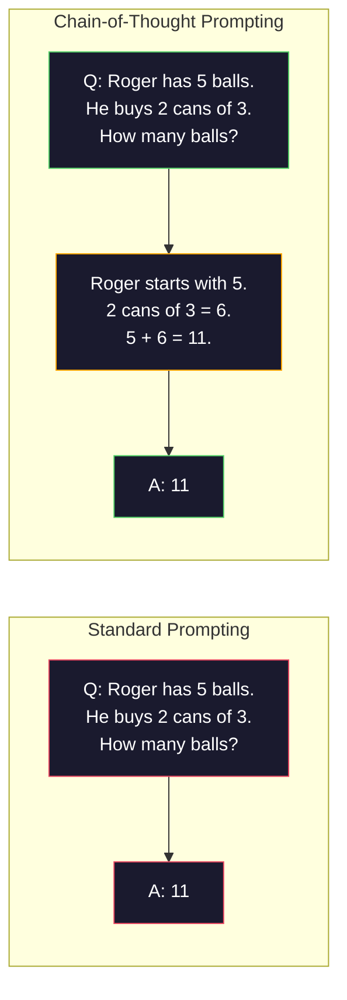
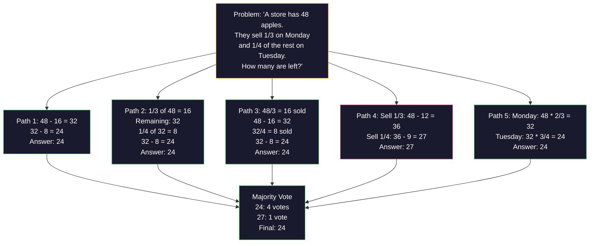
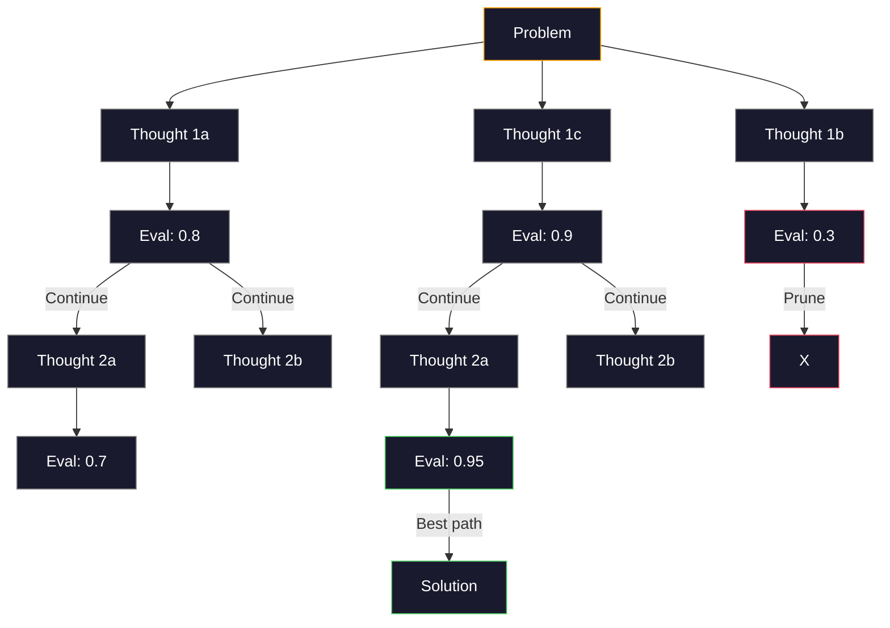

# Few-Shot、Chain-of-Thought、Tree-of-Thought

> 告诉模型做什么，是 prompting。向它展示如何思考，才是 engineering。同一个模型、同一个任务、同一批数据，准确率从 78% 到 91% 的差距，靠的不是更好的模型，而是更好的推理策略。

**类型：** 构建
**语言：** Python
**前置要求：** Lesson 11.01（Prompt Engineering）
**时间：** 约 45 分钟

## 学习目标

- 通过选择和格式化示例演示，实现能够最大化任务准确率的 few-shot prompting
- 应用 chain-of-thought（CoT）推理，提升数学应用题等多步问题的准确率
- 构建 tree-of-thought prompt，探索多条推理路径并选择最佳路径
- 在标准 benchmark 上衡量 zero-shot、few-shot 与 CoT 的准确率提升

## 问题

你在构建一个数学辅导应用。prompt 写的是：“Solve this word problem.” GPT-5 在 GSM8K 这个标准小学数学 benchmark 上 94% 的时候答对。你以为已经到顶了。其实还没有，chain-of-thought 仍然能再加 3 到 4 个点。

加上五个词：“Let's think step by step”，准确率跃升到 91%。再加几个带完整解法的示例，它达到 95%。同一个模型。同一个 temperature。同样的 API 成本。唯一的区别是，你给了模型草稿纸。

这不是 hack，而是推理本来的工作方式。人类不会一口气在脑中跳完多步问题，transformer 也不会。当你强制模型生成中间 token 时，这些 token 会成为下一个 token 的上下文。每一步推理都会喂给下一步。模型是真的在一步步算出答案。

但“think step by step”只是起点，不是终点。如果你采样五条推理路径并做多数投票呢？如果你让模型探索一棵可能性树，评估并剪枝分支呢？如果你把推理和工具调用交织起来呢？这些不是假设，而是已经发表并有实测提升的技术。本课会把它们都构建出来。

## 概念

### Zero-Shot vs Few-Shot：示例何时胜过指令

Zero-shot prompting 只给模型一个任务，不给其他东西。Few-shot prompting 会先给它示例。

Wei 等人（2022）在 8 个 benchmark 上测量了这一点。对于情感分类这类简单任务，zero-shot 和 few-shot 的表现差距在 2% 以内。对于多步算术和符号推理这类复杂任务，few-shot 能让准确率提升 10% 到 25%。

直觉是：示例是压缩过的指令。与其描述输出格式，不如直接展示格式。与其解释推理过程，不如演示推理过程。相比解释抽象指令，模型更可靠地对示例做 pattern matching。


**few-shot 获胜的场景：** 对格式敏感的任务、分类、结构化抽取、领域术语、以及模型需要匹配特定模式的任何任务。

**zero-shot 获胜的场景：** 简单事实问题、示例会限制创造力的创意任务、以及找到好示例比写好指令更难的任务。

### 示例选择：相似胜过随机

并不是所有示例都一样。选择与目标输入相似的示例，在分类任务上比随机选择高出 5% 到 15%（Liu et al., 2022）。三个原则：

1. **语义相似度**：选择 embedding 空间中最接近输入的示例
2. **标签多样性**：示例要覆盖所有输出类别
3. **难度匹配**：匹配目标问题的复杂度水平

多数任务的最佳示例数量是 3 到 5 个。少于 3 个，模型没有足够信号抽取模式。多于 5 个，就会进入收益递减，并浪费 context window token。对于多标签分类，每个标签使用一个示例。

### Chain-of-Thought：给模型草稿纸

Chain-of-Thought（CoT）prompting 由 Google Brain 的 Wei 等人（2022）提出。想法很简单：不要只向模型索要答案，而是要求它先展示推理步骤。



它在机制上为什么有效？Transformer 生成的每个 token 都会成为下一个 token 的上下文。没有 CoT 时，模型必须把所有推理压缩到一次 forward pass 的 hidden state 里。有 CoT 时，模型把中间计算外化为 token。每个推理 token 都扩展了有效计算深度。

**GSM8K benchmark（小学数学，8.5K 个问题）：**

| 模型 | Zero-Shot | Zero-Shot CoT | Few-Shot CoT |
|-------|-----------|---------------|--------------|
| GPT-4o | 78% | 91% | 95% |
| GPT-5 | 94% | 97% | 98% |
| o4-mini（reasoning） | 97% | — | — |
| Claude Opus 4.7 | 93% | 97% | 98% |
| Gemini 3 Pro | 92% | 96% | 98% |
| Llama 4 70B | 80% | 89% | 94% |
| DeepSeek-V3.1 | 89% | 94% | 96% |

**关于 reasoning model 的说明。** OpenAI o-series（o3、o4-mini）和 DeepSeek-R1 这类模型会在输出答案前内部运行 chain-of-thought。给 reasoning model 再加“Let's think step by step”是重复的，有时甚至适得其反，因为它们已经做过了。

CoT 有两种形式：

**Zero-shot CoT**：在 prompt 末尾追加“Let's think step by step”。不需要示例。Kojima 等人（2022）表明，这一句话就能提升算术、常识和符号推理任务的准确率。

**Few-shot CoT**：提供包含推理步骤的示例。它比 zero-shot CoT 更有效，因为模型能看到你期望的具体推理格式。

**CoT 会伤害的场景**：简单事实回忆（“What is the capital of France?”）、单步分类、速度比准确率更重要的任务。CoT 会给每次查询增加 50 到 200 个推理 token 的开销。对于高吞吐、低复杂度任务，这就是浪费成本。

### Self-Consistency：多次采样，一次投票

Wang 等人（2023）提出了 self-consistency。洞察是：单条 CoT 路径可能包含推理错误。但如果你采样 N 条独立推理路径（使用 temperature > 0），并对最终答案做多数投票，错误会相互抵消。



在最初的 PaLM 540B 实验中，self-consistency 使用 N=40，把 GSM8K 准确率从 56.5%（单条 CoT）提升到 74.4%。在 GPT-5 上提升很小（97% 到 98%），因为基础准确率已经接近饱和。这个技术最适合基础 CoT 准确率在 60% 到 85% 的模型，也就是单路径错误频繁但不系统性的甜点区间。对于 reasoning model（o-series、R1），self-consistency 往往被内置的内部采样吸收了。

权衡是：N 次采样意味着 N 倍 API 成本和延迟。实践中，N=5 能拿到大部分收益。N=3 是形成有意义投票的最低值。N > 10 对多数任务收益递减。

### Tree-of-Thought：分支式探索

Yao 等人（2023）提出了 Tree-of-Thought（ToT）。CoT 沿着一条线性推理路径前进，而 ToT 会探索多个分支，并在继续之前评估哪些分支最有希望。



ToT 有三个组件：

1. **Thought generation**：产生多个候选下一步
2. **State evaluation**：为每个候选打分（可以让 LLM 自己充当 evaluator）
3. **Search algorithm**：用 BFS 或 DFS 遍历树，并剪掉低分分支

在 Game of 24 任务中（用四个数字和算术运算凑出 24），GPT-4 使用标准 prompting 只能解出 7.3% 的问题。使用 CoT 是 4.0%（CoT 在这里反而有害，因为搜索空间很宽）。使用 ToT 是 74%。

ToT 很贵。树中的每个节点都需要一次 LLM 调用。一棵分支因子为 3、深度为 3 的树，最多需要 39 次 LLM 调用。只在搜索空间很大但可评估的问题上使用它，比如规划、解谜、带约束的创意问题求解。

### ReAct：思考 + 行动

Yao 等人（2022）把推理轨迹和动作结合起来。模型在思考（生成推理）和行动（调用工具、搜索、计算）之间交替。

```mermaid
graph LR
    Q["Question:\nWhat is the\npopulation of the\ncountry where\nthe Eiffel Tower\nis located?"]
    T1["Thought: I need to\nfind which country\nhas the Eiffel Tower"]
    A1["Action: search\n'Eiffel Tower location'"]
    O1["Observation:\nParis, France"]
    T2["Thought: Now I need\nFrance's population"]
    A2["Action: search\n'France population 2024'"]
    O2["Observation:\n68.4 million"]
    T3["Thought: I have\nthe answer"]
    F["Answer:\n68.4 million"]

    Q --> T1 --> A1 --> O1 --> T2 --> A2 --> O2 --> T3 --> F

    style Q fill:#1a1a2e,stroke:#ffa500,color:#fff
    style T1 fill:#1a1a2e,stroke:#51cf66,color:#fff
    style A1 fill:#1a1a2e,stroke:#e94560,color:#fff
    style O1 fill:#1a1a2e,stroke:#808080,color:#fff
    style T2 fill:#1a1a2e,stroke:#51cf66,color:#fff
    style A2 fill:#1a1a2e,stroke:#e94560,color:#fff
    style O2 fill:#1a1a2e,stroke:#808080,color:#fff
    style T3 fill:#1a1a2e,stroke:#51cf66,color:#fff
    style F fill:#1a1a2e,stroke:#51cf66,color:#fff
```



在知识密集型任务上，ReAct 胜过纯 CoT，因为它能把推理落到真实数据上。在 HotpotQA（多跳问答）上，使用 GPT-4 的 ReAct 达到 35.1% exact match，而单独 CoT 是 29.4%。真正的威力在于，推理错误会被 observation 校正，模型可以在执行中途更新计划。

ReAct 是现代 AI agent 的基础。每个 agent 框架（LangChain、CrewAI、AutoGen）都会实现 Thought-Action-Observation 循环的某种变体。Phase 14 会构建完整 agent。本课覆盖 prompting pattern。

### 结构化 Prompting：XML 标签、分隔符、标题

随着 prompt 变复杂，结构可以防止模型混淆不同部分。三种方法：

**XML tags**（对 Claude 最有效，其他模型也稳定）：
```
<context>
You are reviewing a pull request.
The codebase uses TypeScript and React.
</context>

<task>
Review the following diff for bugs, security issues, and style violations.
</task>

<diff>
{diff_content}
</diff>

<output_format>
List each issue with: file, line, severity (critical/warning/info), description.
</output_format>
```

**Markdown headers**（通用）：
```
## Role
Senior security engineer at a fintech company.

## Task
Analyze this API endpoint for vulnerabilities.

## Input
{api_code}

## Rules
- Focus on OWASP Top 10
- Rate each finding: critical, high, medium, low
- Include remediation steps
```

**Delimiters**（极简但有效）：
```
---INPUT---
{user_text}
---END INPUT---

---INSTRUCTIONS---
Summarize the above in 3 bullet points.
---END INSTRUCTIONS---
```

### Prompt Chaining：顺序分解

有些任务对单个 prompt 来说太复杂。Prompt chaining 会把任务拆成多个步骤，其中一个 prompt 的输出成为下一个 prompt 的输入。


Chaining 胜过 single-prompt 有三个原因：

1. **每一步更简单**：模型处理一个聚焦任务，而不是同时兼顾所有东西
2. **中间输出可检查**：你可以在步骤之间验证和纠正
3. **不同步骤可以使用不同模型**：用便宜模型做抽取，用昂贵模型做推理

### 性能对比

| 技术 | 最适合 | GSM8K 准确率（GPT-5） | API 调用 | Token 开销 | 复杂度 |
|-----------|----------|------------------------|-----------|----------------|------------|
| Zero-Shot | 简单任务 | 94% | 1 | 无 | 极低 |
| Few-Shot | 格式匹配 | 96% | 1 | 200-500 tokens | 低 |
| Zero-Shot CoT | 快速提升推理 | 97% | 1 | 50-200 tokens | 极低 |
| Few-Shot CoT | 最高单次调用准确率 | 98% | 1 | 300-600 tokens | 低 |
| Self-Consistency (N=5) | 高风险推理 | 98.5% | 5 | 5x token cost | 中 |
| Reasoning model (o4-mini) | CoT 的即插即用替代 | 97% | 1 | hidden (2-10x internal) | 极低 |
| Tree-of-Thought | 搜索/规划问题 | N/A（Game of 24 上 74%） | 10-40+ | 10-40x token cost | 高 |
| ReAct | 基于知识的推理 | N/A（HotpotQA 上 35.1%） | 3-10+ | 可变 | 高 |
| Prompt Chaining | 复杂多步任务 | 96%（pipeline） | 2-5 | 2-5x token cost | 中 |

正确技术取决于三个因素：准确率要求、延迟预算和成本容忍度。对于多数生产系统，few-shot CoT 加上 3-sample self-consistency fallback 可以覆盖 90% 的用例。

## 构建

我们会构建一个数学题求解器，把 few-shot prompting、chain-of-thought 推理和 self-consistency 投票组合成一条 pipeline。然后为困难问题加入 tree-of-thought。

完整实现在 `code/advanced_prompting.py`。下面是关键组件。

### Step 1：Few-Shot 示例库

第一个组件管理 few-shot 示例，并为给定问题选择最相关的示例。

```python
GSM8K_EXAMPLES = [
    {
        "question": "Janet's ducks lay 16 eggs per day. She eats three for breakfast every morning and bakes muffins for her friends every day with four. She sells every egg at the farmers' market for $2. How much does she make every day at the farmers' market?",
        "reasoning": "Janet's ducks lay 16 eggs per day. She eats 3 and bakes 4, using 3 + 4 = 7 eggs. So she has 16 - 7 = 9 eggs left. She sells each for $2, so she makes 9 * 2 = $18 per day.",
        "answer": "18"
    },
    ...
]
```

每个示例有三部分：问题、推理链和最终答案。推理链会把普通 few-shot 示例变成 CoT few-shot 示例。

### Step 2：Chain-of-Thought Prompt Builder

Prompt builder 会把 system message、带推理链的 few-shot 示例和目标问题组装成一个 prompt。

```python
def build_cot_prompt(question, examples, num_examples=3):
    system = (
        "You are a math problem solver. "
        "For each problem, show your step-by-step reasoning, "
        "then give the final numerical answer on the last line "
        "in the format: 'The answer is [number]'."
    )

    example_text = ""
    for ex in examples[:num_examples]:
        example_text += f"Q: {ex['question']}\n"
        example_text += f"A: {ex['reasoning']} The answer is {ex['answer']}.\n\n"

    user = f"{example_text}Q: {question}\nA:"
    return system, user
```

格式约束（“The answer is [number]”）非常关键。没有它，self-consistency 就无法跨多个样本抽取和比较答案。

### Step 3：Self-Consistency 投票

采样 N 条推理路径，并选择多数答案。

```python
def self_consistency_solve(question, examples, client, model, n_samples=5):
    system, user = build_cot_prompt(question, examples)

    answers = []
    reasonings = []
    for _ in range(n_samples):
        response = client.chat.completions.create(
            model=model,
            messages=[
                {"role": "system", "content": system},
                {"role": "user", "content": user}
            ],
            temperature=0.7
        )
        text = response.choices[0].message.content
        reasonings.append(text)
        answer = extract_answer(text)
        if answer is not None:
            answers.append(answer)

    vote_counts = Counter(answers)
    best_answer = vote_counts.most_common(1)[0][0] if vote_counts else None
    confidence = vote_counts[best_answer] / len(answers) if best_answer else 0

    return best_answer, confidence, reasonings, vote_counts
```

Temperature 0.7 很重要。在 temperature 0.0 下，N 个样本会完全相同，失去意义。你需要足够随机性来得到多样的推理路径，但不能随机到模型输出胡言乱语。

### Step 4：Tree-of-Thought Solver

对于线性推理失败的问题，ToT 会探索多种方法，并评估哪个方向最有希望。

```python
def tree_of_thought_solve(question, client, model, breadth=3, depth=3):
    thoughts = generate_initial_thoughts(question, client, model, breadth)
    scored = [(t, evaluate_thought(t, question, client, model)) for t in thoughts]
    scored.sort(key=lambda x: x[1], reverse=True)

    for current_depth in range(1, depth):
        next_thoughts = []
        for thought, score in scored[:2]:
            extensions = extend_thought(thought, question, client, model, breadth)
            for ext in extensions:
                ext_score = evaluate_thought(ext, question, client, model)
                next_thoughts.append((ext, ext_score))
        scored = sorted(next_thoughts, key=lambda x: x[1], reverse=True)

    best_thought = scored[0][0] if scored else ""
    return extract_answer(best_thought), best_thought
```

Evaluator 本身也是一次 LLM 调用。你会问模型：“On a scale of 0.0 to 1.0, how promising is this reasoning path for solving the problem?” 这正是 ToT 的关键洞察：模型评估自己的部分解。

### Step 5：完整 Pipeline

Pipeline 用升级策略组合所有技术。

```python
def solve_with_escalation(question, examples, client, model):
    system, user = build_cot_prompt(question, examples)
    single_response = call_llm(client, model, system, user, temperature=0.0)
    single_answer = extract_answer(single_response)

    sc_answer, confidence, _, _ = self_consistency_solve(
        question, examples, client, model, n_samples=5
    )

    if confidence >= 0.8:
        return sc_answer, "self_consistency", confidence

    tot_answer, _ = tree_of_thought_solve(question, client, model)
    return tot_answer, "tree_of_thought", None
```

升级逻辑：先尝试便宜的单次 CoT。如果 self-consistency confidence 低于 0.8（5 个样本中少于 4 个同意），就升级到 ToT。这能平衡成本和准确率，多数问题便宜解决，难题获得更多计算。

## 使用

### 使用 LangChain

LangChain 内置支持 prompt templates 和 output parsing，可以简化 few-shot 与 CoT pattern：

```python
from langchain_core.prompts import FewShotPromptTemplate, PromptTemplate
from langchain_openai import ChatOpenAI

example_prompt = PromptTemplate(
    input_variables=["question", "reasoning", "answer"],
    template="Q: {question}\nA: {reasoning} The answer is {answer}."
)

few_shot_prompt = FewShotPromptTemplate(
    examples=examples,
    example_prompt=example_prompt,
    suffix="Q: {input}\nA: Let's think step by step.",
    input_variables=["input"]
)

llm = ChatOpenAI(model="gpt-4o", temperature=0.7)
chain = few_shot_prompt | llm
result = chain.invoke({"input": "If a train travels 120 km in 2 hours..."})
```

LangChain 也有用于语义相似度选择的 `ExampleSelector` 类：

```python
from langchain_core.example_selectors import SemanticSimilarityExampleSelector
from langchain_openai import OpenAIEmbeddings

selector = SemanticSimilarityExampleSelector.from_examples(
    examples,
    OpenAIEmbeddings(),
    k=3
)
```

### 使用 DSPy

DSPy 把 prompting strategy 当成可优化模块处理。你不需要手工制作 CoT prompt，而是定义一个 signature，让 DSPy 优化 prompt：

```python
import dspy

dspy.configure(lm=dspy.LM("openai/gpt-4o", temperature=0.7))

class MathSolver(dspy.Module):
    def __init__(self):
        self.solve = dspy.ChainOfThought("question -> answer")

    def forward(self, question):
        return self.solve(question=question)

solver = MathSolver()
result = solver(question="Janet's ducks lay 16 eggs per day...")
```

DSPy 的 `ChainOfThought` 会自动加入 reasoning traces。`dspy.majority` 实现 self-consistency：

```python
result = dspy.majority(
    [solver(question=q) for _ in range(5)],
    field="answer"
)
```

### 对比：From-Scratch vs Frameworks

| 特性 | From-Scratch（本课） | LangChain | DSPy |
|---------|--------------------------|-----------|------|
| 对 prompt 格式的控制 | 完全控制 | 基于模板 | 自动 |
| Self-consistency | 手动投票 | 手动 | 内置（`dspy.majority`） |
| 示例选择 | 自定义逻辑 | `ExampleSelector` | `dspy.BootstrapFewShot` |
| Tree-of-Thought | 自定义树搜索 | 社区 chains | 未内置 |
| Prompt optimization | 手动迭代 | 手动 | 自动编译 |
| 最适合 | 学习、自定义 pipelines | 标准 workflow | 研究、优化 |

## 交付

本课会产出两个 artifact。

**1. Reasoning Chain Prompt**（`outputs/prompt-reasoning-chain.md`）：一个生产可用的 few-shot CoT + self-consistency prompt template。把你的示例和问题领域填进去即可。

**2. CoT Pattern Selection Skill**（`outputs/skill-cot-patterns.md`）：一个决策框架，用于根据任务类型、准确率要求和成本约束选择合适的推理技术。

## 练习

1. **测量差距**：取 10 个 GSM8K 问题。分别用 zero-shot、few-shot、zero-shot CoT 和 few-shot CoT 求解。记录每种方法的准确率。哪种技术在你的模型上提升最大？

2. **示例选择实验**：对同一批 10 个问题，比较随机示例选择和手工挑选相似示例。测量准确率差异。什么时候示例质量比示例数量更重要？

3. **Self-consistency 成本曲线**：在 20 个 GSM8K 问题上，用 N=1、3、5、7、10 运行 self-consistency。绘制准确率 vs 成本（总 token）。你的模型在曲线的哪个位置进入拐点？

4. **构建 ReAct loop**：给 pipeline 扩展一个 calculator tool。当模型生成数学表达式时，在 sandbox 中用 Python 的 `eval()` 执行，并把结果反馈回去。衡量 tool-grounded reasoning 是否胜过纯 CoT。

5. **面向创意任务的 ToT**：把 Tree-of-Thought solver 改造成创意写作任务：“Write a 6-word story that is both funny and sad.” 使用 LLM 作为 evaluator。分支探索是否比 single-shot generation 产生更好的创意输出？

## 关键术语

| 术语 | 人们常说 | 实际含义 |
|------|----------------|----------------------|
| Few-shot prompting | “给它几个例子” | 在 prompt 中包含输入-输出演示，用来锚定模型的输出格式和行为 |
| Chain-of-Thought | “让它一步步思考” | 引出中间推理 token，在产生最终答案前扩展模型的有效计算 |
| Self-Consistency | “多跑几次” | 在 temperature > 0 下采样 N 条多样推理路径，并通过多数投票选择最常见最终答案 |
| Tree-of-Thought | “让它探索选项” | 对推理分支进行结构化搜索，评估每个部分解，只扩展有希望的路径 |
| ReAct | “思考 + 工具使用” | 在 Thought-Action-Observation 循环中交织推理轨迹和外部动作（搜索、计算、API 调用） |
| Prompt chaining | “拆成步骤” | 把复杂任务分解为顺序 prompt，每一步输出都会输入下一步 |
| Zero-shot CoT | “只要加上 think step by step” | 在没有示例的情况下给 prompt 追加推理触发短语，依赖模型潜在推理能力 |

## 延伸阅读

- [Chain-of-Thought Prompting Elicits Reasoning in Large Language Models](https://arxiv.org/abs/2201.11903)：Wei et al. 2022。Google Brain 的原始 CoT 论文。阅读第 2 到 3 节理解核心结果。
- [Self-Consistency Improves Chain of Thought Reasoning in Language Models](https://arxiv.org/abs/2203.11171)：Wang et al. 2023。self-consistency 论文。表 1 包含你需要的全部数字。
- [Tree of Thoughts: Deliberate Problem Solving with Large Language Models](https://arxiv.org/abs/2305.10601)：Yao et al. 2023。ToT 论文。第 4 节的 Game of 24 结果是重点。
- [ReAct: Synergizing Reasoning and Acting in Language Models](https://arxiv.org/abs/2210.03629)：Yao et al. 2022。现代 AI agent 的基础。第 3 节解释 Thought-Action-Observation 循环。
- [Large Language Models are Zero-Shot Reasoners](https://arxiv.org/abs/2205.11916)：Kojima et al. 2022。“Let's think step by step”论文。简单得惊人，却很有效。
- [DSPy: Compiling Declarative Language Model Calls into Self-Improving Pipelines](https://arxiv.org/abs/2310.03714)：Khattab et al. 2023。把 prompting 当作编译问题。如果你想超越手工 prompt engineering，读这篇。
- [OpenAI — Reasoning models guide](https://platform.openai.com/docs/guides/reasoning)：vendor guidance，说明 chain-of-thought 何时从 prompt-level trick 变成内部的、按 token 计价的 reasoning mode。
- [Lightman et al., "Let's Verify Step by Step" (2023)](https://arxiv.org/abs/2305.20050)：process reward models（PRM），给链条中的每一步打分；这是优于只看结果奖励的 reasoning supervision signal。
- [Snell et al., "Scaling LLM Test-Time Compute Optimally" (2024)](https://arxiv.org/abs/2408.03314)：系统研究 CoT 长度、self-consistency sampling 和 MCTS；当准确率比延迟更重要时，“think step by step”会走向哪里。
