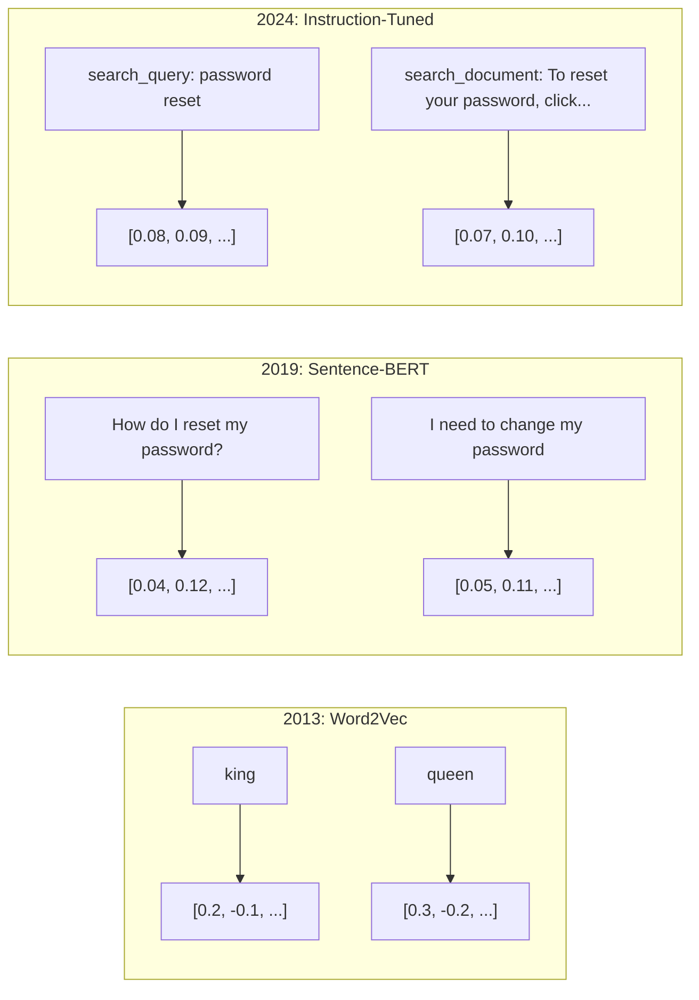
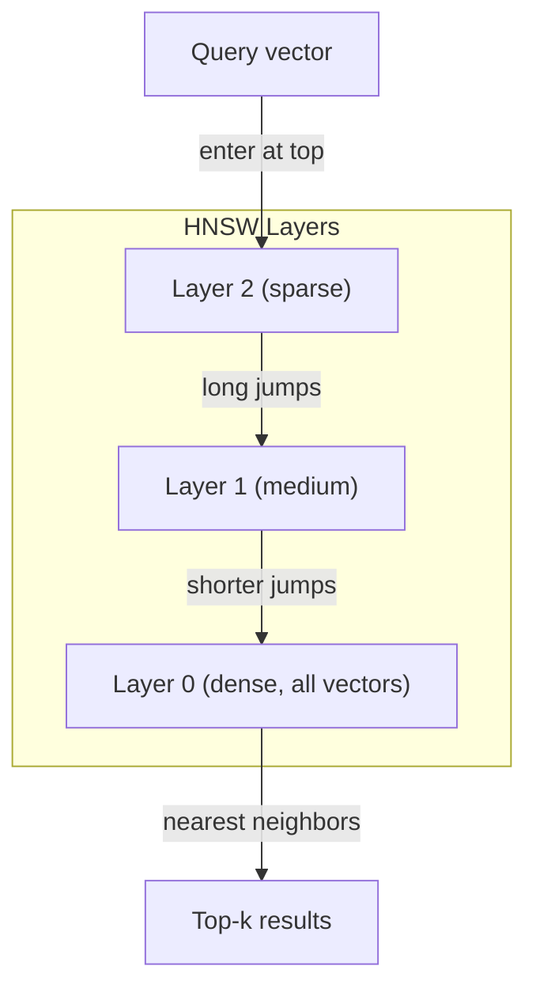
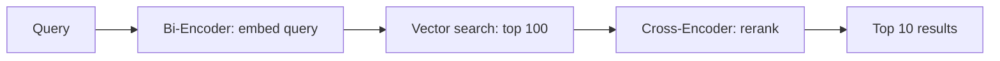

# Embeddings 与 Vector Representations

> 文本是离散的，数学是连续的。每当你要求 LLM 找“相似”文档、比较含义或超越关键词搜索时，你都依赖这两个世界之间的桥。那座桥就是 embedding。如果不理解 embeddings，就不理解现代 AI，只是在使用它。

**类型：** 构建
**语言：** Python
**前置要求：** 阶段 11，第 01 课（Prompt Engineering）
**时间：** ~75 分钟
**相关：** 阶段 5 · 22（Embedding Models Deep Dive）讲 dense vs sparse vs multi-vector、Matryoshka truncation 和 per-axis model selection。本课关注生产 pipeline（vector DBs、HNSW、similarity math）。选择模型前先读阶段 5 · 22。

## 学习目标

- 使用 API providers 和 open-source models 生成 text embeddings，并计算它们的 cosine similarity
- 解释 embeddings 如何解决 keyword search 无法处理的 vocabulary mismatch problem
- 构建 semantic search index，按 meaning 而不是 exact keyword match 检索 documents
- 用 retrieval benchmarks（precision@k、recall）评估 embedding quality，并为任务选择正确 embedding model

## 问题

你有 10,000 个 support tickets。客户写：“my payment didn't go through.” 你需要找到相似历史 tickets。Keyword search 找到包含 “payment” 和 “didn't go through” 的 tickets。它漏掉 “transaction failed”“charge was declined”“billing error”。这些 tickets 用完全不同的词描述同一个问题。

这就是 vocabulary mismatch problem。人类语言有几十种方式表达同一件事。Keyword search 把每个词视作没有 meaning 的独立符号。它无法知道 “declined” 和 “didn't go through” 指同一概念。

你需要一种文本 representation，让 meaning 而不是 spelling 决定 similarity。你需要把 “my payment didn't go through” 和 “transaction was declined” 放到某个数学空间中的近处，同时把 “my payment arrived on time” 推远，即使它也共享 “payment” 这个词。

这个 representation 就是 embedding。

## 概念

### 什么是 Embedding？

Embedding 是表示文本 meaning 的 dense vector of floating-point numbers。“Dense” 很重要：每个维度都携带信息，不像 sparse representations（bag-of-words、TF-IDF）那样大多数维度为零。

“The cat sat on the mat” 会变成类似 `[0.023, -0.041, 0.087, ..., 0.012]` 的东西，具体有 768 到 3072 个 numbers，取决于模型。这些 numbers 编码 meaning。你不会直接 inspect 它们，只会 compare 它们。

### Word2Vec 突破

2013 年，Google 的 Tomas Mikolov 和同事发布 Word2Vec。核心洞见：训练 neural network 通过邻居预测一个词（或通过一个词预测邻居），hidden layer weights 就会成为有意义的 vector representations。

著名结果：

```
king - man + woman = queen
```

Word embeddings 上的 vector arithmetic 捕捉 semantic relationships。从 “man” 到 “woman” 的方向，近似等于从 “king” 到 “queen” 的方向。这是领域意识到 geometry 可以 encode meaning 的时刻。

Word2Vec 产生 300-dimensional vectors。每个词无论 context 如何都只有一个 vector。“Bank” 在 “river bank” 和 “bank account” 中 embedding 相同。这个限制推动了之后十年的研究。

### 从 Words 到 Sentences

Word embeddings 表示单个 tokens。生产系统需要 embed 整个 sentences、paragraphs 或 documents。出现了四种方法：

**Averaging**：取句子中所有 word vectors 的平均值。便宜、有损，但短文本上出乎意料还行。完全丢失 word order，“dog bites man” 和 “man bites dog” 得到相同 embedding。

**CLS token**：Transformer models（BERT，2018）输出一个表示整个 input 的特殊 [CLS] token embedding。比 averaging 好，但 [CLS] token 是为 next-sentence prediction 训练的，不是 similarity。

**Contrastive learning**：显式训练模型把 similar pairs 推近，把 dissimilar pairs 拉远。Sentence-BERT（Reimers & Gurevych，2019）使用这种方法，并成为现代 embedding models 的基础。给定 “How do I reset my password?” 和 “I need to change my password”，模型学习它们应该有几乎相同的 vectors。

**Instruction-tuned embeddings**：最新方法。E5、GTE 等模型接受 task prefix（“search_query:”“search_document:”），告诉模型要生成什么类型的 embedding。这让一个模型服务多个 tasks。



### Modern Embedding Models

市场已收敛到少数 production-grade options（截至 2026 年初，MTEB v2 分数）：

| Model | Provider | Dimensions | MTEB | Context | Cost / 1M tokens |
|-------|----------|-----------|------|---------|------------------|
| Gemini Embedding 2 | Google | 3072 (Matryoshka) | 67.7 (retrieval) | 8192 | $0.15 |
| embed-v4 | Cohere | 1024 (Matryoshka) | 65.2 | 128K | $0.12 |
| voyage-4 | Voyage AI | 1024/2048 (Matryoshka) | 66.8 | 32K | $0.12 |
| text-embedding-3-large | OpenAI | 3072 (Matryoshka) | 64.6 | 8192 | $0.13 |
| text-embedding-3-small | OpenAI | 1536 (Matryoshka) | 62.3 | 8192 | $0.02 |
| BGE-M3 | BAAI | 1024 (dense+sparse+ColBERT) | 63.0 multilingual | 8192 | Open-weight |
| Qwen3-Embedding | Alibaba | 4096 (Matryoshka) | 66.9 | 32K | Open-weight |
| Nomic-embed-v2 | Nomic | 768 (Matryoshka) | 63.1 | 8192 | Open-weight |

MTEB（Massive Text Embedding Benchmark）v2 覆盖 retrieval、classification、clustering、reranking、summarization 等 100+ tasks。越高越好。到 2026 年，open-weight models（Qwen3-Embedding、BGE-M3）在多数轴上已经匹配或超过 hosted closed models。Gemini Embedding 2 领先 pure retrieval；Voyage/Cohere 领先特定 domains（finance、law、code）。提交前一定在自己的 queries 上 benchmark。

### Similarity Metrics

给定两个 embedding vectors，有三种衡量相似度的方法：

**Cosine similarity**：两个 vectors 夹角的 cosine。范围从 -1（opposite）到 1（identical direction）。忽略 magnitude；如果方向相同，10-word sentence 和 500-word document 可以得 1.0。90% use cases 的默认选择。

```
cosine_sim(a, b) = dot(a, b) / (||a|| * ||b||)
```

**Dot product**：两个 vectors 的原始 inner product。当 vectors 已 normalized（unit length）时，等同于 cosine similarity。计算更快。OpenAI embeddings 已 normalized，因此 dot product 和 cosine 给出相同 ranking。

```
dot(a, b) = sum(a_i * b_i)
```

**Euclidean（L2）distance**：vector space 中直线距离。更小 = 更相似。对 magnitude differences 敏感。适用于 absolute position in space 重要、而不只是 direction 重要的情况。

```
L2(a, b) = sqrt(sum((a_i - b_i)^2))
```

什么时候用哪个：

| Metric | Use when | Avoid when |
|--------|----------|------------|
| Cosine similarity | Comparing texts of different lengths; most retrieval tasks | Magnitude carries information |
| Dot product | Embeddings are already normalized; maximum speed | Vectors have varying magnitudes |
| Euclidean distance | Clustering; spatial nearest-neighbor problems | Comparing documents of wildly different lengths |

### Vector Databases 与 HNSW

Brute-force similarity search 会把 query 与每个 stored vector 比较。100 万个 vectors、1536 dimensions 时，每个 query 需要 15 亿次 multiply-add。太慢。

Vector databases 用 Approximate Nearest Neighbor（ANN）算法解决这个问题。主导算法是 HNSW（Hierarchical Navigable Small World）：

1. 构建多层 vectors graph
2. 顶层稀疏，负责 distant clusters 之间的 long-range connections
3. 底层密集，负责 nearby vectors 的 fine-grained connections
4. Search 从顶层开始，贪心下降 refine
5. 以 O(log n) 而不是 O(n) 返回 approximate top-k results

HNSW 用小的 accuracy loss（通常 95-99% recall）换巨大速度提升。1000 万 vectors 时 brute force 要几秒，HNSW 几毫秒。



生产选项：

| Database | Type | Best for | Max scale |
|----------|------|----------|-----------|
| Pinecone | Managed SaaS | Zero-ops production | Billions |
| Weaviate | Open source | Self-hosted, hybrid search | 100M+ |
| Qdrant | Open source | High performance, filtering | 100M+ |
| ChromaDB | Embedded | Prototyping, local dev | 1M |
| pgvector | Postgres extension | Already using Postgres | 10M |
| FAISS | Library | In-process, research | 1B+ |

### Chunking Strategies

Documents 太长，不能作为单个 vectors embed。50 页 PDF 覆盖几十个 topics，它的 embedding 会变成一切的平均值，对任何具体东西都不相似。你把 documents 切成 chunks，并分别 embed。

**Fixed-size chunking**：每 N tokens 切分，带 M-token overlap。简单、可预测。适合没有清晰结构的 documents。512-token chunk with 50-token overlap：chunk 1 是 tokens 0-511，chunk 2 是 tokens 462-973。

**Sentence-based chunking**：在 sentence boundaries 切分，把 sentences 合并到 token limit。每个 chunk 至少包含完整句子。优于 fixed-size，因为不会切断 thought。

**Recursive chunking**：先尝试最大边界（section headers），仍然太大再尝试 paragraph boundaries，再 sentence boundaries，最后 character limits。这是 LangChain 的 `RecursiveCharacterTextSplitter`，适合 mixed-format corpora。

**Semantic chunking**：embed 每个 sentence，然后把 embeddings 相似的连续 sentences 分组。Embedding similarity 低于 threshold 时开启新 chunk。昂贵（需要逐句 embed），但 chunks 最 coherent。

| Strategy | Complexity | Quality | Best for |
|----------|-----------|---------|----------|
| Fixed-size | Low | Decent | Unstructured text, logs |
| Sentence-based | Low | Good | Articles, emails |
| Recursive | Medium | Good | Markdown, HTML, mixed docs |
| Semantic | High | Best | Critical retrieval quality |

多数系统的甜点区：256-512 token chunks，带 50-token overlap。

### Bi-Encoders vs Cross-Encoders

Bi-encoder 独立 embed query 和 documents，然后比较 vectors。快，因为 query 只 embed 一次，documents embeddings 预计算。这是 retrieval 用法。

Cross-encoder 把 query 和 document 作为单个 input，并输出 relevance score。慢，因为每个 query-document pair 都要经过完整模型。但准确得多，因为它能同时 attend 到 query 和 document tokens。

生产模式：bi-encoder 取 top-100 candidates，cross-encoder rerank 到 top-10。这就是 retrieve-then-rerank pipeline。



Reranking models：Cohere Rerank 3.5（$2 per 1000 queries）、BGE-reranker-v2（free, open source）、Jina Reranker v2（free, open source）。

### Matryoshka Embeddings

传统 embeddings 是全或无。1536-dimensional vector 使用 1536 floats。你不能不 retrain 就截断到 256 dimensions。

Matryoshka Representation Learning（Kusupati 等人，2022）解决了这个问题。模型训练时让前 N 个 dimensions 捕捉最重要信息，像俄罗斯套娃。把 1536-d Matryoshka embedding 截断到 256 dimensions 会损失一些 accuracy，但仍然可用。

OpenAI 的 text-embedding-3-small 和 text-embedding-3-large 通过 `dimensions` 参数支持 Matryoshka truncation。请求 256 dimensions 而不是 1536，可以把 storage 降 6x，在 MTEB benchmarks 上 accuracy loss 约 3-5%。

### Binary Quantization

1536-dimensional embedding 存为 float32 需要 6,144 bytes。乘以 1000 万 documents，仅 vectors 就是 61 GB。

Binary quantization 把每个 float 转成一位：positive values 变 1，negative values 变 0。Storage 从 6,144 bytes 降到 192 bytes，减少 32x。Similarity 用 Hamming distance（计算不同 bits 数），CPU 可以用单条指令完成。

Retrieval recall accuracy hit 约 5-10%。常见模式：用 binary quantization 对数百万 vectors 做 first-pass search，再用 full-precision vectors rescore top-1000。这样用 32x 更少内存得到 95%+ full-precision accuracy。

## 构建它

我们从零构建 semantic search engine。不用 vector database，不用外部 embedding API。只用 Python 和 numpy 做数学。

### 第 1 步：Text Chunking

```python
def chunk_text(text, chunk_size=200, overlap=50):
    words = text.split()
    chunks = []
    start = 0
    while start < len(words):
        end = start + chunk_size
        chunk = " ".join(words[start:end])
        chunks.append(chunk)
        start += chunk_size - overlap
    return chunks


def chunk_by_sentences(text, max_chunk_tokens=200):
    sentences = text.replace("\n", " ").split(".")
    sentences = [s.strip() + "." for s in sentences if s.strip()]
    chunks = []
    current_chunk = []
    current_length = 0
    for sentence in sentences:
        sentence_length = len(sentence.split())
        if current_length + sentence_length > max_chunk_tokens and current_chunk:
            chunks.append(" ".join(current_chunk))
            current_chunk = []
            current_length = 0
        current_chunk.append(sentence)
        current_length += sentence_length
    if current_chunk:
        chunks.append(" ".join(current_chunk))
    return chunks
```

### 第 2 步：Building Embeddings from Scratch

我们使用 TF-IDF + L2 normalization 实现简单 dense embedding。它不是 neural embedding，但遵循相同 contract：文本进，固定大小 vector 出，相似文本产生相似 vectors。

```python
import math
import numpy as np
from collections import Counter

class SimpleEmbedder:
    def __init__(self):
        self.vocab = []
        self.idf = []
        self.word_to_idx = {}

    def fit(self, documents):
        vocab_set = set()
        for doc in documents:
            vocab_set.update(doc.lower().split())
        self.vocab = sorted(vocab_set)
        self.word_to_idx = {w: i for i, w in enumerate(self.vocab)}
        n = len(documents)
        self.idf = np.zeros(len(self.vocab))
        for i, word in enumerate(self.vocab):
            doc_count = sum(1 for doc in documents if word in doc.lower().split())
            self.idf[i] = math.log((n + 1) / (doc_count + 1)) + 1

    def embed(self, text):
        words = text.lower().split()
        count = Counter(words)
        total = len(words) if words else 1
        vec = np.zeros(len(self.vocab))
        for word, freq in count.items():
            if word in self.word_to_idx:
                tf = freq / total
                vec[self.word_to_idx[word]] = tf * self.idf[self.word_to_idx[word]]
        norm = np.linalg.norm(vec)
        if norm > 0:
            vec = vec / norm
        return vec
```

### 第 3 步：Similarity Functions

```python
def cosine_similarity(a, b):
    dot = np.dot(a, b)
    norm_a = np.linalg.norm(a)
    norm_b = np.linalg.norm(b)
    if norm_a == 0 or norm_b == 0:
        return 0.0
    return float(dot / (norm_a * norm_b))


def dot_product(a, b):
    return float(np.dot(a, b))


def euclidean_distance(a, b):
    return float(np.linalg.norm(a - b))
```

### 第 4 步：Vector Index with Brute-Force Search

```python
class VectorIndex:
    def __init__(self):
        self.vectors = []
        self.texts = []
        self.metadata = []

    def add(self, vector, text, meta=None):
        self.vectors.append(vector)
        self.texts.append(text)
        self.metadata.append(meta or {})

    def search(self, query_vector, top_k=5, metric="cosine"):
        scores = []
        for i, vec in enumerate(self.vectors):
            if metric == "cosine":
                score = cosine_similarity(query_vector, vec)
            elif metric == "dot":
                score = dot_product(query_vector, vec)
            elif metric == "euclidean":
                score = -euclidean_distance(query_vector, vec)
            else:
                raise ValueError(f"Unknown metric: {metric}")
            scores.append((i, score))
        scores.sort(key=lambda x: x[1], reverse=True)
        results = []
        for idx, score in scores[:top_k]:
            results.append({
                "text": self.texts[idx],
                "score": score,
                "metadata": self.metadata[idx],
                "index": idx
            })
        return results

    def size(self):
        return len(self.vectors)
```

### 第 5 步：Semantic Search Engine

```python
class SemanticSearchEngine:
    def __init__(self, chunk_size=200, overlap=50):
        self.embedder = SimpleEmbedder()
        self.index = VectorIndex()
        self.chunk_size = chunk_size
        self.overlap = overlap

    def index_documents(self, documents, source_names=None):
        all_chunks = []
        all_sources = []
        for i, doc in enumerate(documents):
            chunks = chunk_text(doc, self.chunk_size, self.overlap)
            all_chunks.extend(chunks)
            name = source_names[i] if source_names else f"doc_{i}"
            all_sources.extend([name] * len(chunks))
        self.embedder.fit(all_chunks)
        for chunk, source in zip(all_chunks, all_sources):
            vec = self.embedder.embed(chunk)
            self.index.add(vec, chunk, {"source": source})
        return len(all_chunks)

    def search(self, query, top_k=5, metric="cosine"):
        query_vec = self.embedder.embed(query)
        return self.index.search(query_vec, top_k, metric)

    def search_with_scores(self, query, top_k=5):
        results = self.search(query, top_k)
        return [
            {
                "text": r["text"][:200],
                "source": r["metadata"].get("source", "unknown"),
                "score": round(r["score"], 4)
            }
            for r in results
        ]
```

### 第 6 步：Comparing Similarity Metrics

```python
def compare_metrics(engine, query, top_k=3):
    results = {}
    for metric in ["cosine", "dot", "euclidean"]:
        hits = engine.search(query, top_k=top_k, metric=metric)
        results[metric] = [
            {"score": round(h["score"], 4), "preview": h["text"][:80]}
            for h in hits
        ]
    return results
```

## 使用它

使用 production embedding API 时，架构保持相同。只替换 embedder：

```python
from openai import OpenAI

client = OpenAI()

def openai_embed(texts, model="text-embedding-3-small", dimensions=None):
    kwargs = {"model": model, "input": texts}
    if dimensions:
        kwargs["dimensions"] = dimensions
    response = client.embeddings.create(**kwargs)
    return [item.embedding for item in response.data]
```

OpenAI 的 Matryoshka truncation：同一个模型，更少 dimensions，更低 storage：

```python
full = openai_embed(["semantic search query"], dimensions=1536)
compact = openai_embed(["semantic search query"], dimensions=256)
```

256-d vector 使用 6x 更少 storage。对于 1000 万 documents，这是 10 GB vs 61 GB。标准 benchmarks 上 accuracy loss 约 3-5%。

使用 Cohere 做 reranking：

```python
import cohere

co = cohere.ClientV2()

results = co.rerank(
    model="rerank-v3.5",
    query="What is the refund policy?",
    documents=["Full refund within 30 days...", "No refunds after 90 days..."],
    top_n=3
)
```

使用本地 embeddings、无 API dependency：

```python
from sentence_transformers import SentenceTransformer

model = SentenceTransformer("BAAI/bge-small-en-v1.5")
embeddings = model.encode(["semantic search query", "another document"])
```

我们构建的 VectorIndex class 可以配合任何这些 embeddings。替换 embedding function，保留 search logic。

## 交付它

本课产出：
- `outputs/prompt-embedding-advisor.md` -- 为特定 use cases 选择 embedding models 和 strategies 的 prompt
- `outputs/skill-embedding-patterns.md` -- 教 agents 在生产中有效使用 embeddings 的 skill

## 练习

1. **Metric comparison**：对 sample documents 使用 cosine similarity、dot product 和 euclidean distance 运行相同 5 个 queries。记录每种 top-3 results。哪些 queries 上 metrics 不一致？为什么？

2. **Chunk size experiment**：用 50、100、200、500 words 的 chunk sizes index sample documents。每个 size 运行 5 个 queries，并记录 top-1 similarity score。画出 chunk size 与 retrieval quality 的关系。找到更大 chunks 开始伤害质量的点。

3. **Matryoshka simulation**：构建产生 500-d vectors 的 SimpleEmbedder。截断到 50、100、200、500 dimensions。测量每个 truncation 下 retrieval recall 如何退化。这能模拟 Matryoshka 行为，而不需要真实训练技巧。

4. **Binary quantization**：取 search engine 的 embeddings，转换成 binary（positive 为 1，否则 0），并实现 Hamming distance search。与 full-precision cosine similarity 的 top-10 results 对比，测量 overlap percentage。

5. **Sentence-based chunking**：用 `chunk_by_sentences` 替换 fixed-size chunking。运行相同 queries 并比较 retrieval scores。尊重 sentence boundaries 是否改善结果？

## 关键术语

| Term | What people say | What it actually means |
|------|----------------|----------------------|
| Embedding | “Text to numbers” | 几何接近编码 semantic similarity 的 dense vector |
| Word2Vec | “The OG embedding” | 2013 年通过预测 context words 学习 word vectors 的模型；证明 vector arithmetic 编码 meaning |
| Cosine similarity | “How similar are two vectors” | Vectors 夹角的 cosine；1 = identical direction，0 = orthogonal，-1 = opposite |
| HNSW | “Fast vector search” | Hierarchical Navigable Small World graph；多层结构，实现 O(log n) approximate nearest neighbor search |
| Bi-encoder | “Embed separately, compare fast” | 独立把 query 和 document 编码为 vectors；支持 pre-computation 和快速 retrieval |
| Cross-encoder | “Slow but accurate reranker” | 让 query-document pair 共同经过完整模型；准确更高，但无法 pre-computation |
| Matryoshka embeddings | “Truncatable vectors” | 训练使前 N dimensions 捕捉最重要信息的 embeddings，支持 variable-size storage |
| Binary quantization | “1-bit embeddings” | 把 float vectors 转成 binary（只保留 sign bit），用 Hamming distance search 实现 32x storage reduction |
| Chunking | “Split docs for embedding” | 把 documents 切成 256-512 token segments，使每段能独立 embed 和 retrieve |
| Vector database | “Search engine for embeddings” | 针对存储 vectors 和规模化 approximate nearest neighbor search 优化的数据存储 |
| Contrastive learning | “Train by comparison” | 把 similar pair embeddings 推近、dissimilar pair embeddings 拉远的训练方法 |
| MTEB | “The embedding benchmark” | Massive Text Embedding Benchmark；跨 8 类任务的 56 个 datasets，用于比较 embedding models |

## 延伸阅读

- Mikolov et al., "Efficient Estimation of Word Representations in Vector Space" (2013) -- Word2Vec 论文，用 king-queen 类比开启 embedding revolution
- Reimers & Gurevych, "Sentence-BERT: Sentence Embeddings using Siamese BERT-Networks" (2019) -- 如何训练 sentence-level similarity 的 bi-encoders，是现代 embedding models 基础
- Kusupati et al., "Matryoshka Representation Learning" (2022) -- variable-dimension embeddings 背后的技术，OpenAI 在 text-embedding-3 中采用
- Malkov & Yashunin, "Efficient and Robust Approximate Nearest Neighbor using Hierarchical Navigable Small World Graphs" (2018) -- HNSW 论文，多数 production vector search 背后的算法
- OpenAI Embeddings Guide (platform.openai.com/docs/guides/embeddings) -- text-embedding-3 models 的实用参考，包括 Matryoshka dimension reduction
- MTEB Leaderboard (huggingface.co/spaces/mteb/leaderboard) -- 跨 tasks 和 languages 比较所有 embedding models 的 live benchmark
- [Muennighoff et al., "MTEB: Massive Text Embedding Benchmark" (EACL 2023)](https://arxiv.org/abs/2210.07316) -- 定义 leaderboard 报告的 8 个 task categories（classification、clustering、pair classification、reranking、retrieval、STS、summarization、bitext mining）；信任任何单一 MTEB score 前先读。
- [Sentence Transformers documentation](https://www.sbert.net/) -- bi-encoder vs cross-encoder、pooling strategies 和本课实现的 ingest-split-embed-store RAG pipeline 的 canonical reference。
