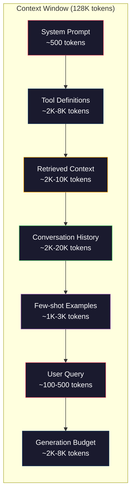
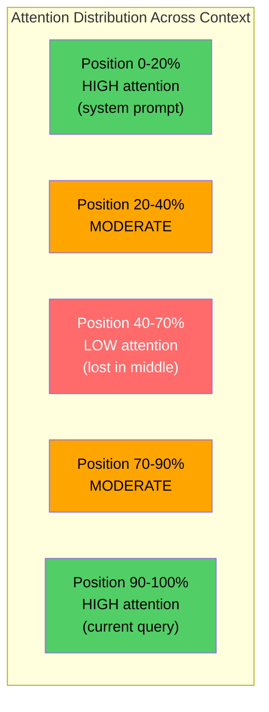
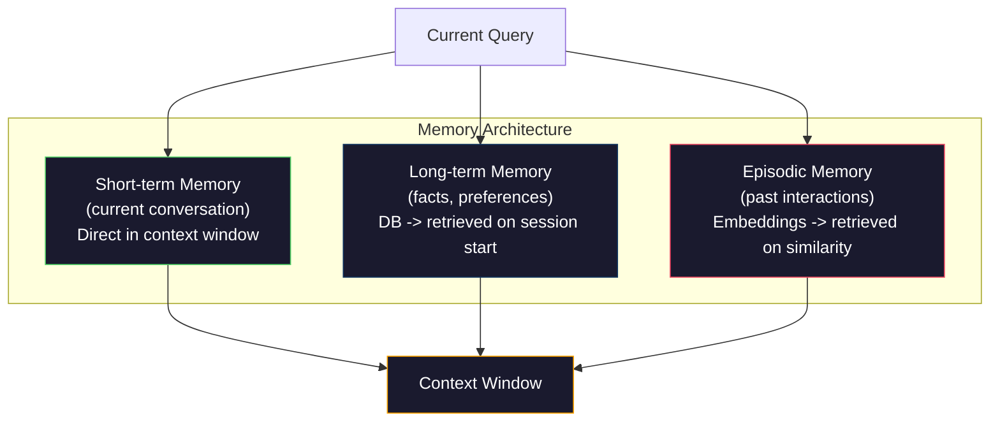

# Context Engineering：窗口、预算、记忆与检索

> Prompt engineering 只是子集。Context engineering 才是全局。Prompt 是你输入的一段字符串。Context 是进入模型窗口的一切：system instructions、检索到的文档、tool definitions、对话历史、few-shot examples，以及 prompt 本身。2026 年最好的 AI engineer 是 context engineer。他们决定什么进窗口、什么留在外面，以及以什么顺序进入。

**类型：** 构建
**语言：** Python
**前置要求：** Phase 10（LLMs from Scratch）、Phase 11 Lesson 01-02
**时间：** 约 90 分钟
**相关：** Phase 11 · 15（Prompt Caching），cache-friendly layout 是 context engineering 的延伸。Phase 5 · 28（Long-Context Evaluation）讲如何用 NIAH/RULER 衡量 lost-in-the-middle。

## 学习目标

- 计算 context window 各组件的 token budget（system prompt、tools、history、retrieved docs、generation headroom）
- 实现 context window 管理策略：truncation、summarization 和面向对话历史的 sliding window
- 对 context 组件排序和分配优先级，让模型注意力尽可能落在最相关信息上
- 构建 context assembler，根据查询类型和可用窗口空间动态分配 token

## 问题

Claude Opus 4.7 有 200K token window（beta 中为 1M）。GPT-5 有 400K。Gemini 3 Pro 有 2M。Llama 4 声称 10M。这些数字听起来巨大，直到你真正把它们填满。

下面是一个 coding assistant 的真实拆解。System prompt：500 tokens。50 个工具的 tool definitions：8,000 tokens。检索到的文档：4,000 tokens。对话历史（10 轮）：6,000 tokens。当前用户查询：200 tokens。Generation budget（max output）：4,000 tokens。总计：22,700 tokens。这只占 128K window 的 18%。

但 attention 不会随 context length 线性扩展。拥有 128K tokens context 的模型要支付二次 attention 成本（vanilla transformer 中是 O(n^2)，尽管多数生产模型使用高效 attention 变体）。更重要的是，检索准确率会下降。“Needle in a Haystack”测试显示，模型很难找到放在长上下文中间的信息。Liu 等人（2023）的研究表明，LLM 对长上下文开头和结尾的信息几乎能完美检索，但对放在中间的信息，准确率会下降 10% 到 20%（context 40% 到 70% 的位置）。这种“lost-in-the-middle”效应因模型而异，但会影响所有当前架构。

实践教训是：有 200K tokens 可用，不等于使用 200K tokens 就有效。精心筛选的 10K token context 往往胜过倾倒进去的 100K token context。Context engineering 是在 context window 内最大化信噪比的工程学。

你放入窗口的每个 token，都会挤掉一个本可以承载更相关信息的 token。每个无关 tool definition、每个陈旧对话轮次、每个不能回答问题的检索文本块，都会让模型在任务上稍微变差。

## 概念

### Context Window 是稀缺资源

把 context window 想成 RAM，而不是磁盘。它很快、可被直接访问，但有限。你无法放进所有东西。你必须选择。



每个组件都会争夺空间。增加 tool definitions，意味着 conversation history 的空间减少。增加 retrieved context，意味着 few-shot examples 的空间减少。Context engineering 是分配预算以最大化任务表现的艺术。

### Lost-in-the-Middle

这是 context engineering 中最重要的经验发现。模型更容易关注 context 开头和结尾的信息。中间的信息会得到更低 attention score，也更容易被忽略。

Liu 等人（2023）系统测试了这一点。他们把一个相关文档放在 20 个无关文档中的不同位置，并测量回答准确率。当相关文档在第一个或最后一个位置时，准确率为 85% 到 90%。当它在中间（20 个中的第 10 个位置）时，准确率降到 60% 到 70%。

这有直接的工程含义：

- 把最重要的信息放在最前面（system prompt、关键指令）
- 把当前查询和最相关上下文放在最后（recency bias 有帮助）
- 把 context 中间视为最低优先级区域
- 如果必须把信息放在中间，在末尾重复关键点



### Context 组件

**System prompt**：设置 persona、约束和行为规则。它放在最前面，并在多轮中保持稳定。Claude Code 的 system prompt 大约使用 6,000 tokens，包含 tool definitions 和行为指令。保持紧凑。System prompt 中的每个词都会在每次 API 调用中重复。

**Tool definitions**：每个工具增加 50 到 200 tokens（name、description、parameter schema）。50 个工具每个 150 tokens，在任何对话发生前就已经是 7,500 tokens。动态工具选择，只包含与当前查询相关的工具，可以减少 60% 到 80%。

**Retrieved context**：来自 vector database、search results、file contents 的文档。检索质量直接决定响应质量。糟糕检索比没有检索更差，因为它会用噪声填满窗口，并主动误导模型。

**Conversation history**：之前每条 user message 和 assistant response。它会随对话长度线性增长。50 轮对话，每轮 200 tokens，就是 10,000 tokens 历史。大多数都与当前查询无关。

**Few-shot examples**：展示期望行为的输入/输出对。两三个精心挑选的示例，往往比几千 token 的指令更能提升输出质量。但它们会占空间。

**Generation budget**：为模型响应预留的 token。如果你把窗口填满，模型就没有空间回答。至少为 generation 预留 2,000 到 4,000 tokens。

### Context 压缩策略

**History summarization**：不要逐字保留所有历史轮次，而是定期总结对话。用 100 tokens 表达“我们讨论了 X、决定了 Y、用户想要 Z”，可以替代 10 轮 2,000 tokens 的对话。当 history 超过阈值（例如 5,000 tokens）时运行 summarization。

**Relevance filtering**：根据当前查询给每个检索文档打分，丢掉低于阈值的文档。如果你检索到 10 个 chunk，但只有 3 个相关，就丢掉另外 7 个。3 个高度相关 chunk 胜过 10 个平庸 chunk。

**Tool pruning**：分类用户查询意图，只包含与该意图相关的工具。代码问题不需要日历工具。排期问题不需要文件系统工具。这可以把 tool definitions 从 8,000 tokens 降到 1,000。

**Recursive summarization**：对于很长的文档，分阶段总结。先总结每个 section，再总结这些 summaries。50 页文档会变成一个 500-token digest，同时保留关键点。

### 记忆系统

Context engineering 覆盖三个时间跨度。

**Short-term memory**：当前对话。直接存储在 context window 中。每一轮都会增长。通过 summarization 和 truncation 管理。

**Long-term memory**：跨对话持久存在的事实和偏好。“The user prefers TypeScript.” “The project uses PostgreSQL.” 存在数据库中，并在 session start 时检索。Claude Code 把它存储在 CLAUDE.md 文件中。ChatGPT 把它存储在 memory feature 中。

**Episodic memory**：可能相关的具体过去互动。“上周二，我们在 auth module 中调试过类似问题。” 以 embeddings 存储，并在当前对话匹配过去 episode 时检索。



### 动态 Context Assembly

关键洞察是：不同查询需要不同 context。静态 system prompt + 静态 tools + 静态 history 是浪费。最好的系统会按查询动态组装 context。

1. 分类查询意图
2. 选择相关工具（不是所有工具）
3. 检索相关文档（不是固定集合）
4. 包含相关历史轮次（不是全部历史）
5. 添加匹配任务类型的 few-shot examples
6. 按重要性排序所有内容：关键内容最前，重要内容最后，可选内容放中间

这就是优秀 AI application 和顶尖 AI application 的区别。模型相同，context 才是差异化因素。

## 构建

### Step 1：Token Counter

你无法为无法测量的东西做预算。构建一个简单 token counter（用空白切分近似，因为精确数量取决于 tokenizer）。

```python
import json
import numpy as np
from collections import OrderedDict

def count_tokens(text):
    if not text:
        return 0
    return int(len(text.split()) * 1.3)

def count_tokens_json(obj):
    return count_tokens(json.dumps(obj))
```

### Step 2：Context Budget Manager

核心抽象。Budget manager 会跟踪每个组件使用多少 token，并强制执行限制。

```python
class ContextBudget:
    def __init__(self, max_tokens=128000, generation_reserve=4000):
        self.max_tokens = max_tokens
        self.generation_reserve = generation_reserve
        self.available = max_tokens - generation_reserve
        self.allocations = OrderedDict()

    def allocate(self, component, content, max_tokens=None):
        tokens = count_tokens(content)
        if max_tokens and tokens > max_tokens:
            words = content.split()
            target_words = int(max_tokens / 1.3)
            content = " ".join(words[:target_words])
            tokens = count_tokens(content)

        used = sum(self.allocations.values())
        if used + tokens > self.available:
            allowed = self.available - used
            if allowed <= 0:
                return None, 0
            words = content.split()
            target_words = int(allowed / 1.3)
            content = " ".join(words[:target_words])
            tokens = count_tokens(content)

        self.allocations[component] = tokens
        return content, tokens

    def remaining(self):
        used = sum(self.allocations.values())
        return self.available - used

    def utilization(self):
        used = sum(self.allocations.values())
        return used / self.max_tokens

    def report(self):
        total_used = sum(self.allocations.values())
        lines = []
        lines.append(f"Context Budget Report ({self.max_tokens:,} token window)")
        lines.append("-" * 50)
        for component, tokens in self.allocations.items():
            pct = tokens / self.max_tokens * 100
            bar = "#" * int(pct / 2)
            lines.append(f"  {component:<25} {tokens:>6} tokens ({pct:>5.1f}%) {bar}")
        lines.append("-" * 50)
        lines.append(f"  {'Used':<25} {total_used:>6} tokens ({total_used/self.max_tokens*100:.1f}%)")
        lines.append(f"  {'Generation reserve':<25} {self.generation_reserve:>6} tokens")
        lines.append(f"  {'Remaining':<25} {self.remaining():>6} tokens")
        return "\n".join(lines)
```

### Step 3：Lost-in-the-Middle Reordering

实现重排策略：最重要的 item 放在开头和结尾，最不重要的放在中间。

```python
def reorder_lost_in_middle(items, scores):
    paired = sorted(zip(scores, items), reverse=True)
    sorted_items = [item for _, item in paired]

    if len(sorted_items) <= 2:
        return sorted_items

    first_half = sorted_items[::2]
    second_half = sorted_items[1::2]
    second_half.reverse()

    return first_half + second_half

def score_relevance(query, documents):
    query_words = set(query.lower().split())
    scores = []
    for doc in documents:
        doc_words = set(doc.lower().split())
        if not query_words:
            scores.append(0.0)
            continue
        overlap = len(query_words & doc_words) / len(query_words)
        scores.append(round(overlap, 3))
    return scores
```

### Step 4：Conversation History Compressor

总结旧对话轮次，回收 token budget。

```python
class ConversationManager:
    def __init__(self, max_history_tokens=5000):
        self.turns = []
        self.summaries = []
        self.max_history_tokens = max_history_tokens

    def add_turn(self, role, content):
        self.turns.append({"role": role, "content": content})
        self._compress_if_needed()

    def _compress_if_needed(self):
        total = sum(count_tokens(t["content"]) for t in self.turns)
        if total <= self.max_history_tokens:
            return

        while total > self.max_history_tokens and len(self.turns) > 4:
            old_turns = self.turns[:2]
            summary = self._summarize_turns(old_turns)
            self.summaries.append(summary)
            self.turns = self.turns[2:]
            total = sum(count_tokens(t["content"]) for t in self.turns)

    def _summarize_turns(self, turns):
        parts = []
        for t in turns:
            content = t["content"]
            if len(content) > 100:
                content = content[:100] + "..."
            parts.append(f"{t['role']}: {content}")
        return "Previous: " + " | ".join(parts)

    def get_context(self):
        parts = []
        if self.summaries:
            parts.append("[Conversation Summary]")
            for s in self.summaries:
                parts.append(s)
        parts.append("[Recent Conversation]")
        for t in self.turns:
            parts.append(f"{t['role']}: {t['content']}")
        return "\n".join(parts)

    def token_count(self):
        return count_tokens(self.get_context())
```

### Step 5：Dynamic Tool Selector

只包含与当前查询相关的工具。先分类 intent，再过滤。

```python
TOOL_REGISTRY = {
    "read_file": {
        "description": "Read contents of a file",
        "tokens": 120,
        "categories": ["code", "files"],
    },
    "write_file": {
        "description": "Write content to a file",
        "tokens": 150,
        "categories": ["code", "files"],
    },
    "search_code": {
        "description": "Search for patterns in codebase",
        "tokens": 130,
        "categories": ["code"],
    },
    "run_command": {
        "description": "Execute a shell command",
        "tokens": 140,
        "categories": ["code", "system"],
    },
    "create_calendar_event": {
        "description": "Create a new calendar event",
        "tokens": 180,
        "categories": ["calendar"],
    },
    "list_emails": {
        "description": "List recent emails",
        "tokens": 160,
        "categories": ["email"],
    },
    "send_email": {
        "description": "Send an email message",
        "tokens": 200,
        "categories": ["email"],
    },
    "web_search": {
        "description": "Search the web for information",
        "tokens": 140,
        "categories": ["research"],
    },
    "query_database": {
        "description": "Run a SQL query on the database",
        "tokens": 170,
        "categories": ["code", "data"],
    },
    "generate_chart": {
        "description": "Generate a chart from data",
        "tokens": 190,
        "categories": ["data", "visualization"],
    },
}

def classify_intent(query):
    query_lower = query.lower()

    intent_keywords = {
        "code": ["code", "function", "bug", "error", "file", "implement", "refactor", "debug", "test"],
        "calendar": ["meeting", "schedule", "calendar", "appointment", "event"],
        "email": ["email", "mail", "send", "inbox", "message"],
        "research": ["search", "find", "what is", "how does", "explain", "look up"],
        "data": ["data", "query", "database", "chart", "graph", "analytics", "sql"],
    }

    scores = {}
    for intent, keywords in intent_keywords.items():
        score = sum(1 for kw in keywords if kw in query_lower)
        if score > 0:
            scores[intent] = score

    if not scores:
        return ["code"]

    max_score = max(scores.values())
    return [intent for intent, score in scores.items() if score >= max_score * 0.5]

def select_tools(query, token_budget=2000):
    intents = classify_intent(query)
    relevant = {}
    total_tokens = 0

    for name, tool in TOOL_REGISTRY.items():
        if any(cat in intents for cat in tool["categories"]):
            if total_tokens + tool["tokens"] <= token_budget:
                relevant[name] = tool
                total_tokens += tool["tokens"]

    return relevant, total_tokens
```

### Step 6：完整 Context Assembly Pipeline

把所有组件接起来。给定一个查询，动态组装最佳 context。

```python
class ContextEngine:
    def __init__(self, max_tokens=128000, generation_reserve=4000):
        self.budget = ContextBudget(max_tokens, generation_reserve)
        self.conversation = ConversationManager(max_history_tokens=5000)
        self.system_prompt = (
            "You are a helpful AI assistant. You have access to tools for "
            "code editing, file management, web search, and data analysis. "
            "Use the appropriate tools for each task. Be concise and accurate."
        )
        self.knowledge_base = [
            "Python 3.12 introduced type parameter syntax for generic classes using bracket notation.",
            "The project uses PostgreSQL 16 with pgvector for embedding storage.",
            "Authentication is handled by Supabase Auth with JWT tokens.",
            "The frontend is built with Next.js 15 using the App Router.",
            "API rate limits are set to 100 requests per minute per user.",
            "The deployment pipeline uses GitHub Actions with Docker multi-stage builds.",
            "Test coverage must be above 80% for all new modules.",
            "The codebase follows the repository pattern for data access.",
        ]

    def assemble(self, query):
        self.budget = ContextBudget(self.budget.max_tokens, self.budget.generation_reserve)

        system_content, _ = self.budget.allocate("system_prompt", self.system_prompt, max_tokens=1000)

        tools, tool_tokens = select_tools(query, token_budget=2000)
        tool_text = json.dumps(list(tools.keys()))
        tool_content, _ = self.budget.allocate("tools", tool_text, max_tokens=2000)

        relevance = score_relevance(query, self.knowledge_base)
        threshold = 0.1
        relevant_docs = [
            doc for doc, score in zip(self.knowledge_base, relevance)
            if score >= threshold
        ]

        if relevant_docs:
            doc_scores = [s for s in relevance if s >= threshold]
            reordered = reorder_lost_in_middle(relevant_docs, doc_scores)
            doc_text = "\n".join(reordered)
            doc_content, _ = self.budget.allocate("retrieved_context", doc_text, max_tokens=3000)

        history_text = self.conversation.get_context()
        if history_text.strip():
            history_content, _ = self.budget.allocate("conversation_history", history_text, max_tokens=5000)

        query_content, _ = self.budget.allocate("user_query", query, max_tokens=500)

        return self.budget

    def chat(self, query):
        self.conversation.add_turn("user", query)
        budget = self.assemble(query)
        response = f"[Response to: {query[:50]}...]"
        self.conversation.add_turn("assistant", response)
        return budget


def run_demo():
    print("=" * 60)
    print("  Context Engineering Pipeline Demo")
    print("=" * 60)

    engine = ContextEngine(max_tokens=128000, generation_reserve=4000)

    print("\n--- Query 1: Code task ---")
    budget = engine.chat("Fix the bug in the authentication module where JWT tokens expire too early")
    print(budget.report())

    print("\n--- Query 2: Research task ---")
    budget = engine.chat("What is the best approach for implementing vector search in PostgreSQL?")
    print(budget.report())

    print("\n--- Query 3: After conversation history builds up ---")
    for i in range(8):
        engine.conversation.add_turn("user", f"Follow-up question number {i+1} about the implementation details of the system")
        engine.conversation.add_turn("assistant", f"Here is the response to follow-up {i+1} with technical details about the architecture")

    budget = engine.chat("Now implement the changes we discussed")
    print(budget.report())

    print("\n--- Tool Selection Examples ---")
    test_queries = [
        "Fix the bug in auth.py",
        "Schedule a meeting with the team for Tuesday",
        "Show me the database query performance stats",
        "Search for best practices on error handling",
    ]

    for q in test_queries:
        tools, tokens = select_tools(q)
        intents = classify_intent(q)
        print(f"\n  Query: {q}")
        print(f"  Intents: {intents}")
        print(f"  Tools: {list(tools.keys())} ({tokens} tokens)")

    print("\n--- Lost-in-the-Middle Reordering ---")
    docs = ["Doc A (most relevant)", "Doc B (somewhat relevant)", "Doc C (least relevant)",
            "Doc D (relevant)", "Doc E (moderately relevant)"]
    scores = [0.95, 0.60, 0.20, 0.80, 0.50]
    reordered = reorder_lost_in_middle(docs, scores)
    print(f"  Original order: {docs}")
    print(f"  Scores:         {scores}")
    print(f"  Reordered:      {reordered}")
    print(f"  (Most relevant at start and end, least relevant in middle)")
```

## 使用

### Claude Code 的 Context Strategy

Claude Code 用分层方法管理 context。System prompt 包含行为规则和 tool definitions（约 6K tokens）。当你打开文件时，它的内容会作为 context 注入。当你搜索时，结果会被加入。旧对话轮次会被总结。CLAUDE.md 提供跨 session 持久存在的 long-term memory。

关键工程决策是：Claude Code 不会把你的整个代码库倒进 context。它按需检索相关文件。这就是实践中的 context engineering。

### Cursor 的 Dynamic Context Loading

Cursor 会把你的整个代码库索引成 embeddings。当你输入查询时，它用 vector similarity 检索最相关的文件和代码块。只有这些片段进入 context window。一个 500K 行代码库会被压缩成 5 到 10 个最相关代码块。

模式就是：embed everything、retrieve on demand、只包含重要内容。

### ChatGPT Memory

ChatGPT 把用户偏好和事实存储为 long-term memory。每次对话开始时，相关 memory 会被检索并包含在 system prompt 中。“The user prefers Python”只花 5 tokens，却能在多次对话中节省几百 tokens 的重复指令。

### RAG as Context Engineering

Retrieval-Augmented Generation 是被形式化的 context engineering。不要把知识塞进模型权重（training）或 system prompt（static context），而是在查询时检索相关文档，并注入 context window。整个 RAG pipeline，包括 chunking、embedding、retrieval、reranking，都为了解决一个问题：把正确的信息放进 context window。

## 交付

本课会产出 `outputs/prompt-context-optimizer.md`，这是一个可复用 prompt，用于审计 context assembly strategy 并推荐优化。把你的 system prompt、工具数量、平均 history length 和 retrieval strategy 喂给它，它会识别 token waste 并建议改进。

它还会产出 `outputs/skill-context-engineering.md`，这是一个根据任务类型、context window size 和 latency budget 设计 context assembly pipelines 的决策框架。

## 练习

1. 给 ContextBudget class 增加一个“token waste detector”。它应该标记使用超过 30% 预算的组件，并针对每种组件类型建议压缩策略（summarize history、prune tools、re-rank documents）。

2. 为 retrieved context 实现 semantic deduplication。如果两个检索文档超过 80% 相似（按词重叠或 embedding cosine similarity），只保留分数更高的那个。测量这能回收多少 token budget。

3. 构建一个“context replay”工具。给定一段 conversation transcript，让它通过 ContextEngine 重放，并可视化 budget allocation 如何逐轮变化。绘制每个组件随时间的 token usage。找出 context 开始被压缩的那一轮。

4. 实现一个基于优先级的 tool selector。不要二元 include/exclude，而是给每个工具分配一个与当前查询相关的 relevance score。按 relevance 降序包含工具，直到 tool budget 耗尽。比较包含 5、10、20 和 50 个工具时的任务表现。

5. 构建一个 multi-strategy context compressor。实现三种压缩策略（truncation、summarization、key sentences extraction），并在 20 个文档上 benchmark。衡量 compression ratio 和 information retention 之间的权衡（压缩版本是否仍然包含查询答案？）。

## 关键术语

| 术语 | 人们常说 | 实际含义 |
|------|----------------|----------------------|
| Context window | “模型能读多少” | 模型在单次 forward pass 中处理的最大 token 数（input + output），例如 GPT-5 的 400K、Claude Opus 4.7 的 200K（1M beta）、Gemini 3 Pro 的 2M |
| Context engineering | “高级 prompt engineering” | 决定什么进入 context window、以什么顺序进入、优先级如何的工程学，包含 retrieval、compression、tool selection 和 memory management |
| Lost-in-the-middle | “模型会忘掉中间的东西” | 一个经验发现：LLM 更关注 context 开头和结尾，放在中间的信息准确率会下降 10% 到 20% |
| Token budget | “你还剩多少 token” | 对 context window 容量在各组件之间的显式分配（system prompt、tools、history、retrieval、generation），并带有每组件限制 |
| Dynamic context | “按需加载东西” | 根据 intent classification、相关工具选择和 retrieval results，为每个查询以不同方式组装 context window |
| History summarization | “压缩对话” | 用简洁 summary 替代逐字旧对话轮次，在保留关键信息的同时降低 token 成本 |
| Tool pruning | “只包含相关工具” | 分类查询意图，只包含匹配的 tool definitions，将工具 token 成本降低 60% 到 80% |
| Long-term memory | “跨 session 记住” | 存储在数据库中并在 session start 检索的事实和偏好，例如 CLAUDE.md、ChatGPT Memory 以及类似系统 |
| Episodic memory | “记住具体过去事件” | 以 embeddings 存储过去互动，并在当前查询与过去对话相似时检索 |
| Generation budget | “留给答案的空间” | 为模型输出预留的 token。如果 context 完全填满窗口，模型就没有空间响应 |

## 延伸阅读

- [Liu et al., 2023 -- "Lost in the Middle: How Language Models Use Long Contexts"](https://arxiv.org/abs/2307.03172)：关于位置依赖 attention 的权威研究，展示模型会难以处理长 context 中间的信息。
- [Anthropic's Contextual Retrieval blog post](https://www.anthropic.com/news/contextual-retrieval)：Anthropic 如何处理 context-aware chunk retrieval，把 retrieval failure 降低 49%。
- [Simon Willison's "Context Engineering"](https://simonwillison.net/2025/Jun/27/context-engineering/)：给这个学科命名并把它与 prompt engineering 区分开的博客文章。
- [LangChain documentation on RAG](https://python.langchain.com/docs/tutorials/rag/)：把 retrieval-augmented generation 作为 context engineering pattern 的实践实现。
- [Greg Kamradt's Needle in a Haystack test](https://github.com/gkamradt/LLMTest_NeedleInAHaystack)：揭示所有主流模型中位置依赖检索失败的 benchmark。
- [Pope et al., "Efficiently Scaling Transformer Inference" (2022)](https://arxiv.org/abs/2211.05102)：为什么 context length 会驱动 memory 和 latency，以及 KV cache、MQA、GQA 如何改变预算计算。
- [Agrawal et al., "SARATHI: Efficient LLM Inference by Piggybacking Decodes with Chunked Prefills" (2023)](https://arxiv.org/abs/2308.16369)：inference 的两个阶段，说明长 prompt 为什么让 TTFT 变贵但对 TPOT 便宜，是 context-packing tradeoff 背后的事实基础。
- [Ainslie et al., "GQA: Training Generalized Multi-Query Transformer Models from Multi-Head Checkpoints" (EMNLP 2023)](https://arxiv.org/abs/2305.13245)：grouped-query attention 论文，在生产 decoder 中把 KV memory 降低 8 倍且不损失质量。
