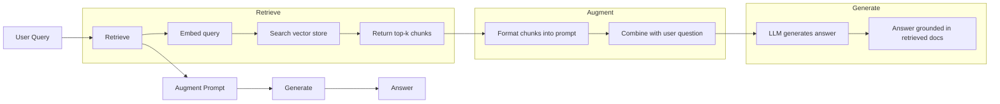
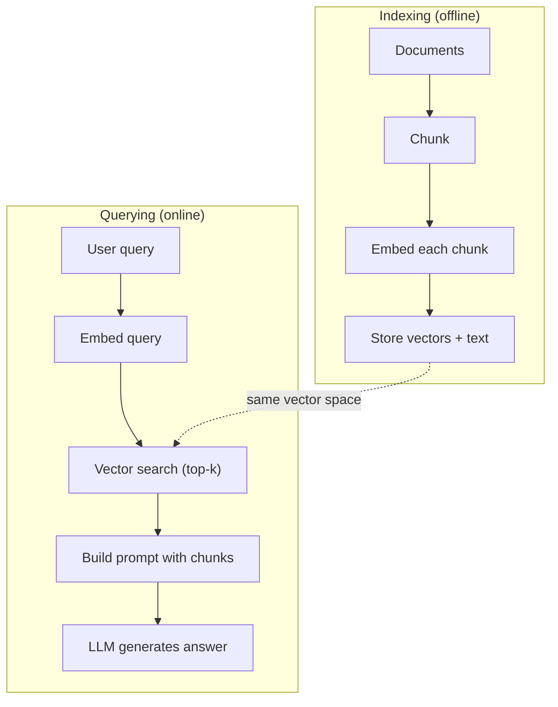

# RAG（Retrieval-Augmented Generation）

> 你的 LLM 只知道训练截止日期之前的东西。它不知道你公司的文档、你的代码库，也不知道上周的会议记录。RAG 通过检索相关文档并把它们塞进 prompt 来解决这个问题。它是生产 AI 中部署最多的模式。如果你只从本课程构建一件东西，就构建一个 RAG pipeline。

**类型：** 构建
**语言：** Python
**前置要求：** 阶段 10（LLMs from Scratch），阶段 11 第 01-05 课
**时间：** ~90 分钟
**相关：** 阶段 5 · 23（Chunking Strategies for RAG）讲六种 chunking algorithms 及各自胜出场景。阶段 5 · 22（Embedding Models Deep Dive）讲如何选择 embedder。阶段 11 · 07（Advanced RAG）讲 hybrid search、reranking 和 query transformation。

## 学习目标

- 构建完整 RAG pipeline：document loading、chunking、embedding、vector storage、retrieval 和 generation
- 使用 vector database（ChromaDB、FAISS 或 Pinecone）和合适 indexing 实现 semantic search
- 解释为什么在 knowledge-grounded applications 中 RAG 通常优于 fine-tuning（cost、freshness、attribution）
- 用 retrieval metrics（precision、recall）和 generation metrics（faithfulness、relevance）评估 RAG 质量

## 问题

你为公司构建了一个 chatbot。客户问：“enterprise plans 的 refund policy 是什么？”LLM 给出一个关于典型 SaaS refund policies 的泛泛回答。但实际政策藏在 200 页内部 wiki 中：enterprise customers 有 60 天窗口，并按比例退款。LLM 从没见过这份文档。它不可能知道自己没被训练过的内容。

Fine-tuning 是一种解法。拿 LLM 在内部文档上训练，部署更新后的模型。这能工作，但问题严重。Fine-tuning 会花费数千美元 compute。文档一变，模型立刻 stale。你无法知道模型答案来自哪个 source。如果公司下个月收购一条新产品线，你还得再 fine-tune。

RAG 是另一种解法。不改模型。当问题到来时，在 document store 中搜索相关 passages，把它们放进问题前面的 prompt，让模型用这些 passages 作为 context 回答。Document store 可以几分钟内更新。你能准确看到检索了哪些 documents。模型本身从不改变。这就是 RAG 在生产中占主导的原因：更便宜、更新鲜、更可审计，并且能与任何 LLM 配合。

## 概念

### RAG Pattern

整个模式四步就能装下：



Query -> Retrieve -> Augment prompt -> Generate。每个 RAG 系统都遵循这个模式。生产 RAG 系统之间的差异在每一步的细节：如何 chunk、如何 embed、如何 search、如何构造 prompt。

### 为什么 RAG 胜过 Fine-Tuning

| Concern | Fine-tuning | RAG |
|---------|------------|-----|
| Cost | $1,000-$100,000+ per training run | $0.01-$0.10 per query (embedding + LLM) |
| Freshness | Stale until retrained | Updated in minutes by re-indexing docs |
| Auditability | Cannot trace answer to source | Can show exact retrieved passages |
| Hallucination | Still hallucinates freely | Grounded in retrieved documents |
| Data privacy | Training data baked into weights | Documents stay in your vector store |

Fine-tuning 会永久改变模型权重。RAG 只是临时改变模型 context。对于多数应用，你想要的正是临时 context。

Fine-tuning 胜出的一个场景是：你需要模型采用特定 style、tone 或 reasoning pattern，而这些无法仅通过 prompting 实现。对于 factual knowledge retrieval，RAG 总是胜出。

### Embedding Models

Embedding model 会把文本转换为 dense vector。相似文本会在这个高维空间中彼此接近。“How do I reset my password?” 和 “I need to change my password” 几乎没有共享词，却会产生几乎相同的 vectors。“The cat sat on the mat” 则产生非常不同的 vector。

常见 embedding models（2026 lineup，完整分析见阶段 5 · 22）：

| Model | Dimensions | Provider | Notes |
|-------|-----------|----------|-------|
| text-embedding-3-small | 1536 (Matryoshka) | OpenAI | Best price/performance for most use cases |
| text-embedding-3-large | 3072 (Matryoshka) | OpenAI | Higher accuracy, truncatable to 256/512/1024 |
| Gemini Embedding 2 | 3072 (Matryoshka) | Google | Top MTEB retrieval; 8K context |
| voyage-4 | 1024/2048 (Matryoshka) | Voyage AI | Domain variants (code, finance, law) |
| Cohere embed-v4 | 1024 (Matryoshka) | Cohere | Strong multilingual, 128K context |
| BGE-M3 | 1024 (dense + sparse + ColBERT) | BAAI (open-weight) | Three views from one model |
| Qwen3-Embedding | 4096 (Matryoshka) | Alibaba (open-weight) | Top open-weight retrieval score |
| all-MiniLM-L6-v2 | 384 | Open-weight (Sentence Transformers) | Prototyping baseline |

本课会用 TF-IDF 构建自己的简单 embedding。不是因为 TF-IDF 是生产系统该用的，而是因为它能让概念具体化：文本进去，vector 出来，相似文本产生相似 vectors。

### Vector Similarity

给定两个 vectors，如何衡量 similarity？三种选择：

**Cosine similarity**：两个 vectors 夹角的 cosine。范围从 -1（相反）到 1（相同）。忽略 magnitude，只关心方向。这是 RAG 默认选择。

```
cosine_sim(a, b) = dot(a, b) / (||a|| * ||b||)
```

**Dot product**：原始 inner product。更大的 vectors 得分更高。当 magnitude 携带信息时有用（更长 documents 可能更相关）。

```
dot(a, b) = sum(a_i * b_i)
```

**L2（Euclidean）distance**：vector space 中的直线距离。距离更小 = 更相似。对 magnitude differences 敏感。

```
L2(a, b) = sqrt(sum((a_i - b_i)^2))
```

Cosine similarity 是标准。它会按 magnitude normalize，因此能优雅处理不同长度 documents。别人说 “vector search” 时，几乎总是指 cosine similarity。

### Chunking Strategies

Documents 太长，不能作为单个 vector embed。50 页 PDF 可能产生一个很差的 embedding，因为它包含几十个 topics。相反，你把 documents 切成 chunks，并单独 embed 每个 chunk。

**Fixed-size chunking**：每 N tokens 切一段。简单、可预测。512-token chunk 带 50-token overlap，意味着 chunk 1 是 tokens 0-511，chunk 2 是 tokens 462-973，以此类推。Overlap 确保不会在倒霉边界切断句子。

**Semantic chunking**：在自然边界切分。Paragraphs、sections 或 markdown headers。每个 chunk 是 coherent unit of meaning。实现更复杂，但 retrieval 更好。

**Recursive chunking**：先尝试最大边界（section headers）。如果 section 仍过大，再按 paragraph boundaries 切。如果 paragraph 仍过大，再按 sentence boundaries 切。这是 LangChain RecursiveCharacterTextSplitter 的做法，实践中很好用。

Chunk size 比很多人想象得更重要：

- 太小（64-128 tokens）：每个 chunk 缺上下文。“It increased 15% last quarter” 如果不知道 “it” 指什么就没有意义。
- 太大（2048+ tokens）：每个 chunk 覆盖多个 topics，稀释 relevance。搜索 revenue data 时，你拿到的 chunk 只有 10% 关于 revenue，90% 关于 headcount。
- 甜点区（256-512 tokens）：足够 self-contained，且足够聚焦。

多数生产 RAG 系统使用 256-512 token chunks，带 50-token overlap。Anthropic 的 RAG guidelines 推荐这个范围。

### Vector Databases

有了 embeddings 之后，你需要地方存储并搜索它们。选项：

| Database | Type | Best for |
|----------|------|----------|
| FAISS | Library (in-process) | Prototyping, small to medium datasets |
| Chroma | Lightweight DB | Local development, small deployments |
| Pinecone | Managed service | Production without ops overhead |
| Weaviate | Open source DB | Self-hosted production |
| pgvector | Postgres extension | Already using Postgres |
| Qdrant | Open source DB | High-performance self-hosted |

本课构建一个简单 in-memory vector store。它把 vectors 存在 list 中，并用 brute-force cosine similarity search。这等价于 FAISS 的 flat index。大约扩展到 100,000 vectors 后会变慢。生产系统用 HNSW 这样的 approximate nearest neighbor（ANN）算法，在 milliseconds 内搜索数百万 vectors。

### Full Pipeline



Indexing phase 每个 document 跑一次（或文档更新时跑）。Querying phase 每个用户请求都跑。生产中，indexing 可能花数小时处理数百万 documents。Querying 必须在一秒内响应。

### Real Numbers

多数生产 RAG 系统使用这些参数：

- **k = 5 到 10** 个 retrieved chunks per query
- **Chunk size = 256 到 512 tokens**，带 50-token overlap
- **Context budget**：每个 query 2,500-5,000 tokens retrieved content
- **Total prompt**：约 8,000-16,000 tokens（system prompt + retrieved chunks + conversation history + user query）
- **Embedding dimension**：取决于 model，384-3072
- **Indexing throughput**：使用 API embeddings 时每秒 100-1,000 documents
- **Query latency**：retrieval 50-200ms，generation 500-3000ms

## 构建它

### 第 1 步：Document Chunking

```python
def chunk_text(text, chunk_size=200, overlap=50):
    words = text.split()
    chunks = []
    start = 0
    while start < len(words):
        end = start + chunk_size
        chunk = " ".join(words[start:end])
        chunks.append(chunk)
        start += chunk_size - overlap
    return chunks
```

### 第 2 步：TF-IDF Embeddings

我们构建一个简单 embedding function。TF-IDF（Term Frequency-Inverse Document Frequency）不是 neural embedding，但它能把文本转换成 vectors，并捕捉 word importance。文档中频繁出现的词 TF 更高。语料中罕见的词 IDF 更高。两者乘积得到一个 vector，其中重要且有区分度的词有高值。

```python
import math
from collections import Counter

def build_vocabulary(documents):
    vocab = set()
    for doc in documents:
        vocab.update(doc.lower().split())
    return sorted(vocab)

def compute_tf(text, vocab):
    words = text.lower().split()
    count = Counter(words)
    total = len(words)
    return [count.get(word, 0) / total for word in vocab]

def compute_idf(documents, vocab):
    n = len(documents)
    idf = []
    for word in vocab:
        doc_count = sum(1 for doc in documents if word in doc.lower().split())
        idf.append(math.log((n + 1) / (doc_count + 1)) + 1)
    return idf

def tfidf_embed(text, vocab, idf):
    tf = compute_tf(text, vocab)
    return [t * i for t, i in zip(tf, idf)]
```

### 第 3 步：Cosine Similarity Search

```python
def cosine_similarity(a, b):
    dot = sum(x * y for x, y in zip(a, b))
    norm_a = math.sqrt(sum(x * x for x in a))
    norm_b = math.sqrt(sum(x * x for x in b))
    if norm_a == 0 or norm_b == 0:
        return 0.0
    return dot / (norm_a * norm_b)

def search(query_embedding, stored_embeddings, top_k=5):
    scores = []
    for i, emb in enumerate(stored_embeddings):
        sim = cosine_similarity(query_embedding, emb)
        scores.append((i, sim))
    scores.sort(key=lambda x: x[1], reverse=True)
    return scores[:top_k]
```

### 第 4 步：Prompt Construction

这是 RAG 中 “augmented” 发生的地方。拿 retrieved chunks，把它们格式化进 prompt，再要求 LLM 基于给定 context 回答。

```python
def build_rag_prompt(query, retrieved_chunks):
    context = "\n\n---\n\n".join(
        f"[Source {i+1}]\n{chunk}"
        for i, chunk in enumerate(retrieved_chunks)
    )
    return f"""Answer the question based ONLY on the following context.
If the context doesn't contain enough information, say "I don't have enough information to answer that."

Context:
{context}

Question: {query}

Answer:"""
```

### 第 5 步：完整 RAG Pipeline

```python
class RAGPipeline:
    def __init__(self):
        self.chunks = []
        self.embeddings = []
        self.vocab = []
        self.idf = []

    def index(self, documents):
        all_chunks = []
        for doc in documents:
            all_chunks.extend(chunk_text(doc))
        self.chunks = all_chunks
        self.vocab = build_vocabulary(all_chunks)
        self.idf = compute_idf(all_chunks, self.vocab)
        self.embeddings = [
            tfidf_embed(chunk, self.vocab, self.idf)
            for chunk in all_chunks
        ]

    def query(self, question, top_k=5):
        query_emb = tfidf_embed(question, self.vocab, self.idf)
        results = search(query_emb, self.embeddings, top_k)
        retrieved = [(self.chunks[i], score) for i, score in results]
        prompt = build_rag_prompt(
            question, [chunk for chunk, _ in retrieved]
        )
        return prompt, retrieved
```

### 第 6 步：Generation（simulated）

生产中这里会调用 LLM API。本课通过从 retrieved context 中提取最相关 sentence 来模拟 generation。

```python
def simple_generate(prompt, retrieved_chunks):
    query_words = set(prompt.lower().split("question:")[-1].split())
    best_sentence = ""
    best_score = 0
    for chunk in retrieved_chunks:
        for sentence in chunk.split("."):
            sentence = sentence.strip()
            if not sentence:
                continue
            words = set(sentence.lower().split())
            overlap = len(query_words & words)
            if overlap > best_score:
                best_score = overlap
                best_sentence = sentence
    return best_sentence if best_sentence else "I don't have enough information."
```

## 使用它

换成真实 embedding model 和 LLM 后，代码几乎不变：

```python
from openai import OpenAI

client = OpenAI()

def embed(text):
    response = client.embeddings.create(
        model="text-embedding-3-small",
        input=text
    )
    return response.data[0].embedding

def generate(prompt):
    response = client.chat.completions.create(
        model="gpt-4o-mini",
        messages=[{"role": "user", "content": prompt}],
        temperature=0
    )
    return response.choices[0].message.content
```

或使用 Anthropic：

```python
import anthropic

client = anthropic.Anthropic()

def generate(prompt):
    response = client.messages.create(
        model="claude-sonnet-4-20250514",
        max_tokens=1024,
        messages=[{"role": "user", "content": prompt}]
    )
    return response.content[0].text
```

Pipeline 相同。替换 embedding function。替换 generation function。Retrieval logic、chunking、prompt construction 都不随模型提供商改变。

要规模化 vector storage，把 brute-force search 替换成真正的 vector database：

```python
import chromadb

client = chromadb.Client()
collection = client.create_collection("my_docs")

collection.add(
    documents=chunks,
    ids=[f"chunk_{i}" for i in range(len(chunks))]
)

results = collection.query(
    query_texts=["What is the refund policy?"],
    n_results=5
)
```

Chroma 内部处理 embedding（默认使用 all-MiniLM-L6-v2），并把 vectors 存在 local database 中。同一个模式，不同 plumbing。

## 交付它

本课产出：
- `outputs/prompt-rag-architect.md` -- 为特定 use cases 设计 RAG systems 的 prompt
- `outputs/skill-rag-pipeline.md` -- 教 agents 构建和 debug RAG pipelines 的 skill

## 练习

1. 用简单 bag-of-words 方法替换 TF-IDF embeddings（二值：word present 为 1，否则 0）。在 sample documents 上比较 retrieval quality。TF-IDF 应该更好，因为它给 rare words 更高权重。

2. 试验 chunk sizes：在同一 document set 上尝试 50、100、200、500 words。对每个 size，运行相同 5 个 queries，并统计 top-3 中返回 relevant chunk 的次数。找到 retrieval quality 峰值的 sweet spot。

3. 为每个 chunk 添加 metadata（source document name、chunk position）。修改 prompt template 以包含 source attribution，让 LLM cite its sources。

4. 实现一个简单 evaluation：给定 10 个 question-answer pairs，对每个 question 运行 RAG pipeline，并测量 retrieved chunks 中包含 answer 的比例。这就是 retrieval recall at k。

5. 构建 conversation-aware RAG pipeline：维护最近 3 次 exchanges 的 history，并与 retrieved chunks 一起放进 prompt。用 follow-up questions 测试，例如先问 pricing 后再问 “What about enterprise?”。

## 关键术语

| Term | What people say | What it actually means |
|------|----------------|----------------------|
| RAG | “AI that reads your docs” | 检索相关 documents，把它们放进 prompt，并生成 grounded in those documents 的答案 |
| Embedding | “Convert text to numbers” | 文本的 dense vector representation，相似含义产生相似 vectors |
| Vector database | “Search engine for AI” | 针对存储 vectors 和按 similarity 找 nearest neighbors 优化的数据存储 |
| Chunking | “Split docs into pieces” | 把 documents 切成较小 segments（通常 256-512 tokens），让每段能独立 embed 和 retrieve |
| Cosine similarity | “How similar are two vectors” | 两个 vectors 夹角的 cosine；1 = identical direction，0 = orthogonal，-1 = opposite |
| Top-k retrieval | “Get the k best matches” | 从 vector store 返回与 query 最相似的 k 个 chunks |
| Context window | “How much text the LLM can see” | LLM 单次 request 能处理的最大 tokens 数；retrieved chunks 必须放得进去 |
| Augmented generation | “Answer using given context” | 使用 retrieved documents 作为 context 生成，而不是只依赖训练知识 |
| TF-IDF | “Word importance scoring” | Term Frequency 乘以 Inverse Document Frequency；按词在 corpus 中的区分度加权 |
| Indexing | “Preparing docs for search” | 离线 chunk、embed、store documents，以便 query time 搜索 |

## 延伸阅读

- Lewis et al., "Retrieval-Augmented Generation for Knowledge-Intensive NLP Tasks" (2020) -- Facebook AI Research 的原始 RAG 论文，形式化 retrieve-then-generate pattern
- Anthropic's RAG documentation (docs.anthropic.com) -- chunk sizes、prompt construction 和 evaluation 的实践指南
- Pinecone Learning Center, "What is RAG?" -- 带 production considerations 的 RAG pipeline 清晰可视化解释
- Sentence-BERT: Reimers & Gurevych (2019) -- all-MiniLM embedding models 背后的论文，展示如何训练 semantic similarity 的 bi-encoders
- [Karpukhin et al., "Dense Passage Retrieval for Open-Domain Question Answering" (EMNLP 2020)](https://arxiv.org/abs/2004.04906) -- DPR 论文，证明 dense bi-encoder retrieval 在 open-domain QA 上超过 BM25，并建立现代 RAG retrievers 模式。
- [LlamaIndex High-Level Concepts](https://docs.llamaindex.ai/en/stable/getting_started/concepts.html) -- 构建 RAG pipelines 时需要知道的主要概念：data loaders、node parsers、indices、retrievers、response synthesizers。
- [LangChain RAG tutorial](https://python.langchain.com/docs/tutorials/rag/) -- 另一种 orchestrator 风格；chain-of-runnables 视角下的同一个 retrieve-then-generate pattern。
