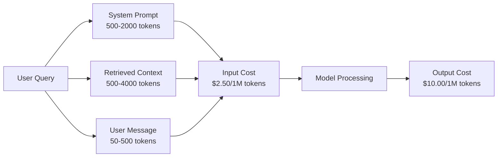
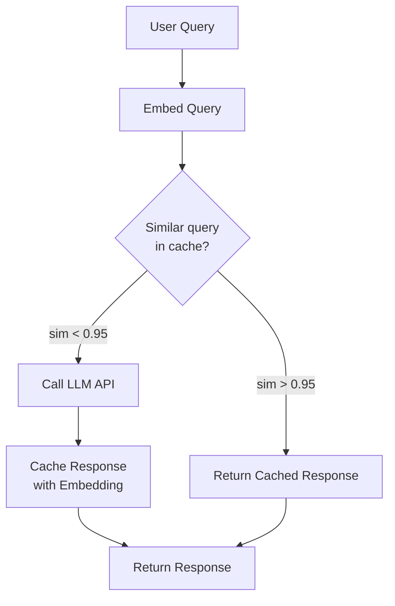
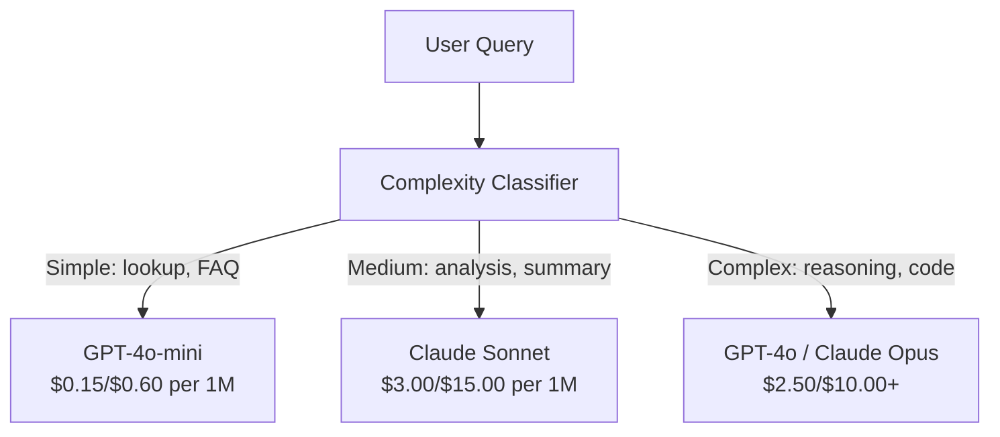

# Caching、Rate Limiting 与 Cost Optimization

> 大多数 AI startup 不是死于模型差，而是死于糟糕的 unit economics。单次 GPT-4o 调用只要几分之一美分。1 万用户每天调用 10 次，仅 input tokens 就要 $250，还没收一分钱。能活下来的公司，会把每次 API call 当作一笔财务交易，而不是一次 function call。

**类型：** 构建
**语言：** Python
**前置要求：** Phase 11 Lesson 09（Function Calling）
**时间：** 约 45 分钟
**相关：** Phase 11 · 15（Prompt Caching）覆盖 application-layer caching（semantic cache、exact hash cache、model routing）。Lesson 15 覆盖 provider-layer prompt caching（Anthropic cache_control、OpenAI automatic、Gemini CachedContent）。两者结合可降低 50% 到 95% 成本。

## 学习目标

- 实现 semantic caching，让重复或相似 queries 从 cache 返回，而不是发起新的 API call
- 计算跨 providers 的 per-request costs，并实现 token-aware rate limiting 与 budget alerts
- 构建 cost optimization layer，包含 prompt compression、model routing（expensive vs cheap）和 response caching
- 为不同 query types 设计分层 caching strategy，使用 exact match、semantic similarity 和 prefix caching

## 问题

你构建了一个 RAG chatbot。它效果很好。用户很喜欢。

然后账单来了。

GPT-5 每百万 input tokens $5，每百万 output tokens $15。Claude Opus 4.7 是 $15 input / $75 output。Gemini 3 Pro 是 $1.25 input / $5 output。GPT-5-mini 是 $0.25/$2。下面价格仅作示例，始终检查 provider 当前 pricing page。

让 startup 死掉的数学如下：

- 10,000 daily active users
- 每个用户每天 10 次 queries
- 每个 query 1,000 input tokens（system prompt + context + user message）
- 每个 response 500 output tokens

**Daily input cost:** 10,000 x 10 x 1,000 / 1,000,000 x $2.50 = **$250/day**
**Daily output cost:** 10,000 x 10 x 500 / 1,000,000 x $10.00 = **$500/day**
**Monthly total:** **$22,500/month**

这还只是 LLM。再加 embeddings、vector database hosting、infrastructure。一个 chatbot 每月可能要 $30,000。

残酷之处在于：40% 到 60% 的 queries 都是近似重复。用户用稍微不同的词问同样问题。你的 system prompt 在每个 request 中都相同，却每次都被计费。RAG 检索到的 context documents，会在询问同一主题的用户之间重复。

你在为冗余计算支付全价。

## 概念

### LLM Call 的成本结构

每次 API call 有五个成本组件。



System prompts 是沉默的杀手。一个 1,500-token system prompt 随每个 request 发送，仅这个 prefix 在每百万 requests 中就要 $3.75。每天 100K requests 时，就是 $375/day，也就是 $11,250/month，只为了永远不变的文本。

### Provider Caching：内置折扣

到 2026 年，三大 provider 都提供 provider-side prompt caching，但机制不同。深入讲解见 Phase 11 · 15。

| Provider | Mechanism | Discount | Minimum | Cache Duration |
|----------|-----------|----------|---------|----------------|
| Anthropic | Explicit cache_control markers | cache hits 90% 折扣（write 多付 25%） | 1,024 tokens（Sonnet/Opus），2,048（Haiku） | 默认 5 min；1h extended（2x write premium） |
| OpenAI | Automatic prefix matching | cache hits 50% 折扣 | 1,024 tokens | Best-effort up to 1 hour |
| Google Gemini | Explicit CachedContent API | ~75% reduction（另加 storage） | 4,096（Flash）/ 32,768（Pro） | User-configurable TTL |

**Anthropic 的方式** 是显式的。你用 `cache_control: {"type": "ephemeral"}` 标记 prompt 的 sections。第一次 request 支付 25% write premium。之后相同 prefix 的 requests 获得 90% 折扣。一个正常成本 $0.005 的 2,000-token system prompt，在 cache hits 上只要 $0.000625。100K requests 下每天节省 $437.50。

**OpenAI 的方式** 是自动的。任何与之前 request 匹配的 prompt prefix 都会获得 50% 折扣。不需要 marker。权衡是折扣更少、控制更少，但实现成本为零。

### Semantic Caching：你的自定义层

Provider caching 只对相同 prefix 有效。Semantic caching 处理更难的情况：含义相同但 query 不同。

“What is the return policy?” 和 “How do I return an item?” 是不同字符串，但意图相同。Semantic cache 会 embedding 两个 queries，计算 cosine similarity，并在 similarity 超过阈值（通常 0.92-0.95）时返回 cached response。



Embedding 成本可以忽略。OpenAI text-embedding-3-small 每百万 tokens $0.02。检查 cache 的成本相比完整 LLM call 几乎为零。

### Exact Caching：Hash and Match

对于 deterministic calls（temperature=0、same model、same prompt），exact caching 更简单且更快。对完整 prompt 做 hash，检查 cache，命中则返回。

它完美适用于：
- System prompt + fixed context + identical user queries
- 带相同 tool definitions 的 function calling
- 同一 document 被多次处理的 batch processing

### Rate Limiting：保护预算

Rate limiting 不只是为了公平。它是为了生存。

**Token bucket algorithm：** 每个用户有一个容量为 N 的 bucket，并以每秒 R 的速度 refill。一个 request 从 bucket 中消耗 tokens。如果 bucket 为空，request 被拒绝。它允许 burst（一次性用完整 bucket），同时强制平均速率。

**Per-user quotas：** 按 user tier 设置每日/月 token limits。

| Tier | Daily Token Limit | Max Requests/min | Model Access |
|------|------------------|------------------|-------------|
| Free | 50,000 | 10 | GPT-4o-mini only |
| Pro | 500,000 | 60 | GPT-4o, Claude Sonnet |
| Enterprise | 5,000,000 | 300 | All models |

### Model Routing：为任务选择合适模型

不是每个 query 都需要 GPT-4o。

“What time does the store close?” 不需要 $10/M-output model。GPT-4o-mini 以 $0.60/M output 就能完美处理。Claude Haiku 以 $1.25/M output 也能处理。一个简单 classifier 可以把便宜 queries 路由到便宜模型，把复杂 queries 路由到昂贵模型。



调好的 router 单靠 model costs 就能节省 40% 到 70%。

### Cost Tracking：知道钱去了哪里

你无法优化无法测量的东西。记录每次 API call：

- Timestamp
- Model name
- Input tokens
- Output tokens
- Latency (ms)
- Computed cost ($)
- User ID
- Cache hit/miss
- Request category

这些数据会揭示哪些 features 昂贵、哪些 users 消耗重、哪里 caching 影响最大。

### Batching：批量折扣

OpenAI Batch API 以 50% 折扣异步处理 requests。你提交最多 50,000 个 requests，结果在 24 小时内返回。

适用于：
- Nightly document processing
- Bulk classification
- Evaluation runs
- Data enrichment pipelines

不适用于：实时面向用户 queries（latency matters）。

### Budget Alerts 与 Circuit Breakers

Circuit breaker 会在达到限制时停止花钱。没有它，一个 bug 或 abuse 可以在几小时内烧完整月预算。

设置三个阈值：
1. **Warning**（预算 70%）：发送 alert
2. **Throttle**（预算 85%）：只切到 cheaper models
3. **Stop**（预算 95%）：拒绝新 requests，只返回 cached responses

### Optimization Stack

按顺序应用这些技术。每一层都会叠加前一层收益。

| Layer | Technique | Typical Savings | Implementation Effort |
|-------|-----------|----------------|----------------------|
| 1 | Provider prompt caching | 30-50% | Low（添加 cache markers） |
| 2 | Exact caching | 10-20% | Low（hash + dict） |
| 3 | Semantic caching | 15-30% | Medium（embeddings + similarity） |
| 4 | Model routing | 40-70% | Medium（classifier） |
| 5 | Rate limiting | Budget protection | Low（token bucket） |
| 6 | Prompt compression | 10-30% | Medium（rewrite prompts） |
| 7 | Batching | eligible 部分 50% | Low（batch API） |

一个应用 layers 1-5 的 RAG app，通常能把成本从 $22,500/month 降到 $4,000-6,000/month。这就是烧 runway 和做成 business 的差别。

### 真实节省：Before and After

下面是一个服务 10,000 DAU 的 RAG chatbot 的真实拆解。

| Metric | Before Optimization | After Optimization | Savings |
|--------|--------------------|--------------------|---------|
| Monthly LLM cost | $22,500 | $5,200 | 77% |
| Avg cost per query | $0.0075 | $0.0017 | 77% |
| Cache hit rate | 0% | 52% | -- |
| Queries routed to mini | 0% | 65% | -- |
| P95 latency | 2,800ms | 900ms（cache hits: 50ms） | 68% |
| Monthly embedding cost | $0 | $180 | (new cost) |
| Total monthly cost | $22,500 | $5,380 | 76% |

Semantic caching 的 embedding cost（$180/month）会在第一小时 cache hits 内回本。

## 构建

### Step 1：Cost Calculator

构建一个知道主流模型当前定价的 token cost calculator。

```python
import hashlib
import time
import json
import math
from dataclasses import dataclass, field


MODEL_PRICING = {
    "gpt-4o": {"input": 2.50, "output": 10.00, "cached_input": 1.25},
    "gpt-4o-mini": {"input": 0.15, "output": 0.60, "cached_input": 0.075},
    "gpt-4.1": {"input": 2.00, "output": 8.00, "cached_input": 0.50},
    "gpt-4.1-mini": {"input": 0.40, "output": 1.60, "cached_input": 0.10},
    "gpt-4.1-nano": {"input": 0.10, "output": 0.40, "cached_input": 0.025},
    "o3": {"input": 2.00, "output": 8.00, "cached_input": 0.50},
    "o3-mini": {"input": 1.10, "output": 4.40, "cached_input": 0.55},
    "o4-mini": {"input": 1.10, "output": 4.40, "cached_input": 0.275},
    "claude-opus-4": {"input": 15.00, "output": 75.00, "cached_input": 1.50},
    "claude-sonnet-4": {"input": 3.00, "output": 15.00, "cached_input": 0.30},
    "claude-haiku-3.5": {"input": 0.80, "output": 4.00, "cached_input": 0.08},
    "gemini-2.5-pro": {"input": 1.25, "output": 10.00, "cached_input": 0.3125},
    "gemini-2.5-flash": {"input": 0.15, "output": 0.60, "cached_input": 0.0375},
}


def calculate_cost(model, input_tokens, output_tokens, cached_input_tokens=0):
    if model not in MODEL_PRICING:
        return {"error": f"Unknown model: {model}"}
    pricing = MODEL_PRICING[model]
    non_cached = input_tokens - cached_input_tokens
    input_cost = (non_cached / 1_000_000) * pricing["input"]
    cached_cost = (cached_input_tokens / 1_000_000) * pricing["cached_input"]
    output_cost = (output_tokens / 1_000_000) * pricing["output"]
    total = input_cost + cached_cost + output_cost
    return {
        "model": model,
        "input_tokens": input_tokens,
        "output_tokens": output_tokens,
        "cached_input_tokens": cached_input_tokens,
        "input_cost": round(input_cost, 6),
        "cached_input_cost": round(cached_cost, 6),
        "output_cost": round(output_cost, 6),
        "total_cost": round(total, 6),
    }
```

### Step 2：Exact Cache

Hash 完整 prompt，为 identical requests 返回 cached responses。

```python
class ExactCache:
    def __init__(self, max_size=1000, ttl_seconds=3600):
        self.cache = {}
        self.max_size = max_size
        self.ttl = ttl_seconds
        self.hits = 0
        self.misses = 0

    def _hash(self, model, messages, temperature):
        key_data = json.dumps({"model": model, "messages": messages, "temperature": temperature}, sort_keys=True)
        return hashlib.sha256(key_data.encode()).hexdigest()

    def get(self, model, messages, temperature=0.0):
        if temperature > 0:
            self.misses += 1
            return None
        key = self._hash(model, messages, temperature)
        if key in self.cache:
            entry = self.cache[key]
            if time.time() - entry["timestamp"] < self.ttl:
                self.hits += 1
                entry["access_count"] += 1
                return entry["response"]
            del self.cache[key]
        self.misses += 1
        return None

    def put(self, model, messages, temperature, response):
        if temperature > 0:
            return
        if len(self.cache) >= self.max_size:
            oldest_key = min(self.cache, key=lambda k: self.cache[k]["timestamp"])
            del self.cache[oldest_key]
        key = self._hash(model, messages, temperature)
        self.cache[key] = {
            "response": response,
            "timestamp": time.time(),
            "access_count": 1,
        }

    def stats(self):
        total = self.hits + self.misses
        return {
            "hits": self.hits,
            "misses": self.misses,
            "hit_rate": round(self.hits / total, 4) if total > 0 else 0,
            "cache_size": len(self.cache),
        }
```

### Step 3：Semantic Cache

Embedding queries，并在 similarity 超过阈值时返回 cached responses。

```python
def simple_embed(text):
    words = text.lower().split()
    vocab = {}
    for w in words:
        vocab[w] = vocab.get(w, 0) + 1
    norm = math.sqrt(sum(v * v for v in vocab.values()))
    if norm == 0:
        return {}
    return {k: v / norm for k, v in vocab.items()}


def cosine_similarity(a, b):
    if not a or not b:
        return 0.0
    all_keys = set(a) | set(b)
    dot = sum(a.get(k, 0) * b.get(k, 0) for k in all_keys)
    return dot


class SemanticCache:
    def __init__(self, similarity_threshold=0.85, max_size=500, ttl_seconds=3600):
        self.entries = []
        self.threshold = similarity_threshold
        self.max_size = max_size
        self.ttl = ttl_seconds
        self.hits = 0
        self.misses = 0

    def get(self, query):
        query_embedding = simple_embed(query)
        now = time.time()
        best_match = None
        best_sim = 0.0
        for entry in self.entries:
            if now - entry["timestamp"] > self.ttl:
                continue
            sim = cosine_similarity(query_embedding, entry["embedding"])
            if sim > best_sim:
                best_sim = sim
                best_match = entry
        if best_match and best_sim >= self.threshold:
            self.hits += 1
            best_match["access_count"] += 1
            return {"response": best_match["response"], "similarity": round(best_sim, 4), "original_query": best_match["query"]}
        self.misses += 1
        return None

    def put(self, query, response):
        if len(self.entries) >= self.max_size:
            self.entries.sort(key=lambda e: e["timestamp"])
            self.entries.pop(0)
        self.entries.append({
            "query": query,
            "embedding": simple_embed(query),
            "response": response,
            "timestamp": time.time(),
            "access_count": 1,
        })

    def stats(self):
        total = self.hits + self.misses
        return {
            "hits": self.hits,
            "misses": self.misses,
            "hit_rate": round(self.hits / total, 4) if total > 0 else 0,
            "cache_size": len(self.entries),
        }
```

### Step 4：Rate Limiter

带 per-user quotas 的 token bucket rate limiter。

```python
class TokenBucketRateLimiter:
    def __init__(self):
        self.buckets = {}
        self.tiers = {
            "free": {"capacity": 50_000, "refill_rate": 500, "max_requests_per_min": 10},
            "pro": {"capacity": 500_000, "refill_rate": 5_000, "max_requests_per_min": 60},
            "enterprise": {"capacity": 5_000_000, "refill_rate": 50_000, "max_requests_per_min": 300},
        }

    def _get_bucket(self, user_id, tier="free"):
        if user_id not in self.buckets:
            tier_config = self.tiers.get(tier, self.tiers["free"])
            self.buckets[user_id] = {
                "tokens": tier_config["capacity"],
                "capacity": tier_config["capacity"],
                "refill_rate": tier_config["refill_rate"],
                "last_refill": time.time(),
                "request_timestamps": [],
                "max_rpm": tier_config["max_requests_per_min"],
                "tier": tier,
                "total_tokens_used": 0,
            }
        return self.buckets[user_id]

    def _refill(self, bucket):
        now = time.time()
        elapsed = now - bucket["last_refill"]
        refill = int(elapsed * bucket["refill_rate"])
        if refill > 0:
            bucket["tokens"] = min(bucket["capacity"], bucket["tokens"] + refill)
            bucket["last_refill"] = now

    def check(self, user_id, tokens_needed, tier="free"):
        bucket = self._get_bucket(user_id, tier)
        self._refill(bucket)
        now = time.time()
        bucket["request_timestamps"] = [t for t in bucket["request_timestamps"] if now - t < 60]
        if len(bucket["request_timestamps"]) >= bucket["max_rpm"]:
            return {"allowed": False, "reason": "rate_limit", "retry_after_seconds": 60 - (now - bucket["request_timestamps"][0])}
        if bucket["tokens"] < tokens_needed:
            deficit = tokens_needed - bucket["tokens"]
            wait = deficit / bucket["refill_rate"]
            return {"allowed": False, "reason": "token_limit", "tokens_available": bucket["tokens"], "retry_after_seconds": round(wait, 1)}
        return {"allowed": True, "tokens_available": bucket["tokens"]}

    def consume(self, user_id, tokens_used, tier="free"):
        bucket = self._get_bucket(user_id, tier)
        bucket["tokens"] -= tokens_used
        bucket["request_timestamps"].append(time.time())
        bucket["total_tokens_used"] += tokens_used

    def get_usage(self, user_id):
        if user_id not in self.buckets:
            return {"error": "User not found"}
        b = self.buckets[user_id]
        return {
            "user_id": user_id,
            "tier": b["tier"],
            "tokens_remaining": b["tokens"],
            "capacity": b["capacity"],
            "total_tokens_used": b["total_tokens_used"],
            "utilization": round(b["total_tokens_used"] / b["capacity"], 4) if b["capacity"] else 0,
        }
```

### Step 5：Cost Tracker

记录每次 call 并计算 running totals。

```python
class CostTracker:
    def __init__(self, monthly_budget=1000.0):
        self.logs = []
        self.monthly_budget = monthly_budget
        self.alerts = []

    def log_call(self, model, input_tokens, output_tokens, cached_input_tokens=0, latency_ms=0, user_id="anonymous", cache_status="miss"):
        cost = calculate_cost(model, input_tokens, output_tokens, cached_input_tokens)
        entry = {
            "timestamp": time.time(),
            "model": model,
            "input_tokens": input_tokens,
            "output_tokens": output_tokens,
            "cached_input_tokens": cached_input_tokens,
            "latency_ms": latency_ms,
            "cost": cost["total_cost"],
            "user_id": user_id,
            "cache_status": cache_status,
        }
        self.logs.append(entry)
        self._check_budget()
        return entry

    def _check_budget(self):
        total = self.total_cost()
        pct = total / self.monthly_budget if self.monthly_budget > 0 else 0
        if pct >= 0.95 and not any(a["level"] == "stop" for a in self.alerts):
            self.alerts.append({"level": "stop", "message": f"Budget 95% consumed: ${total:.2f}/${self.monthly_budget:.2f}", "timestamp": time.time()})
        elif pct >= 0.85 and not any(a["level"] == "throttle" for a in self.alerts):
            self.alerts.append({"level": "throttle", "message": f"Budget 85% consumed: ${total:.2f}/${self.monthly_budget:.2f}", "timestamp": time.time()})
        elif pct >= 0.70 and not any(a["level"] == "warning" for a in self.alerts):
            self.alerts.append({"level": "warning", "message": f"Budget 70% consumed: ${total:.2f}/${self.monthly_budget:.2f}", "timestamp": time.time()})

    def total_cost(self):
        return round(sum(e["cost"] for e in self.logs), 6)

    def cost_by_model(self):
        by_model = {}
        for e in self.logs:
            m = e["model"]
            if m not in by_model:
                by_model[m] = {"calls": 0, "cost": 0, "input_tokens": 0, "output_tokens": 0}
            by_model[m]["calls"] += 1
            by_model[m]["cost"] = round(by_model[m]["cost"] + e["cost"], 6)
            by_model[m]["input_tokens"] += e["input_tokens"]
            by_model[m]["output_tokens"] += e["output_tokens"]
        return by_model

    def cache_savings(self):
        cache_hits = [e for e in self.logs if e["cache_status"] == "hit"]
        if not cache_hits:
            return {"saved": 0, "cache_hits": 0}
        saved = 0
        for e in cache_hits:
            full_cost = calculate_cost(e["model"], e["input_tokens"], e["output_tokens"])
            saved += full_cost["total_cost"]
        return {"saved": round(saved, 4), "cache_hits": len(cache_hits)}

    def summary(self):
        if not self.logs:
            return {"total_calls": 0, "total_cost": 0}
        total_latency = sum(e["latency_ms"] for e in self.logs)
        cache_hits = sum(1 for e in self.logs if e["cache_status"] == "hit")
        return {
            "total_calls": len(self.logs),
            "total_cost": self.total_cost(),
            "avg_cost_per_call": round(self.total_cost() / len(self.logs), 6),
            "avg_latency_ms": round(total_latency / len(self.logs), 1),
            "cache_hit_rate": round(cache_hits / len(self.logs), 4),
            "cost_by_model": self.cost_by_model(),
            "cache_savings": self.cache_savings(),
            "budget_remaining": round(self.monthly_budget - self.total_cost(), 2),
            "budget_utilization": round(self.total_cost() / self.monthly_budget, 4) if self.monthly_budget > 0 else 0,
            "alerts": self.alerts,
        }
```

### Step 6：Model Router

把 queries 路由到能够处理它们的最便宜模型。

```python
SIMPLE_KEYWORDS = ["what time", "hours", "address", "phone", "price", "return policy", "hello", "hi", "thanks", "yes", "no"]
COMPLEX_KEYWORDS = ["analyze", "compare", "explain why", "write code", "debug", "architect", "design", "trade-off", "evaluate"]


def classify_complexity(query):
    q = query.lower()
    if len(q.split()) <= 5 or any(kw in q for kw in SIMPLE_KEYWORDS):
        return "simple"
    if any(kw in q for kw in COMPLEX_KEYWORDS):
        return "complex"
    return "medium"


def route_model(query, tier="pro"):
    complexity = classify_complexity(query)
    routing_table = {
        "simple": {"free": "gpt-4.1-nano", "pro": "gpt-4o-mini", "enterprise": "gpt-4o-mini"},
        "medium": {"free": "gpt-4o-mini", "pro": "claude-sonnet-4", "enterprise": "claude-sonnet-4"},
        "complex": {"free": "gpt-4o-mini", "pro": "gpt-4o", "enterprise": "claude-opus-4"},
    }
    model = routing_table[complexity].get(tier, "gpt-4o-mini")
    return {"query": query, "complexity": complexity, "model": model, "tier": tier}
```

### Step 7：运行 Demo

```python
def simulate_llm_call(model, query):
    input_tokens = len(query.split()) * 4 + 500
    output_tokens = 150 + (len(query.split()) * 2)
    latency = 200 + (output_tokens * 2)
    return {
        "model": model,
        "response": f"[Simulated {model} response to: {query[:50]}...]",
        "input_tokens": input_tokens,
        "output_tokens": output_tokens,
        "latency_ms": latency,
    }


def run_demo():
    print("=" * 60)
    print("  Caching, Rate Limiting & Cost Optimization Demo")
    print("=" * 60)

    print("\n--- Model Pricing ---")
    for model, pricing in list(MODEL_PRICING.items())[:6]:
        cost_1k = calculate_cost(model, 1000, 500)
        print(f"  {model}: ${cost_1k['total_cost']:.6f} per 1K in + 500 out")

    print("\n--- Cost Comparison: 100K Requests ---")
    for model in ["gpt-4o", "gpt-4o-mini", "claude-sonnet-4", "claude-haiku-3.5"]:
        cost = calculate_cost(model, 1000 * 100_000, 500 * 100_000)
        print(f"  {model}: ${cost['total_cost']:.2f}")

    print("\n--- Anthropic Cache Savings ---")
    no_cache = calculate_cost("claude-sonnet-4", 2000, 500, 0)
    with_cache = calculate_cost("claude-sonnet-4", 2000, 500, 1500)
    saving = no_cache["total_cost"] - with_cache["total_cost"]
    print(f"  Without cache: ${no_cache['total_cost']:.6f}")
    print(f"  With 1500 cached tokens: ${with_cache['total_cost']:.6f}")
    print(f"  Savings per call: ${saving:.6f} ({saving/no_cache['total_cost']*100:.1f}%)")

    exact_cache = ExactCache(max_size=100, ttl_seconds=300)
    semantic_cache = SemanticCache(similarity_threshold=0.75, max_size=100)
    rate_limiter = TokenBucketRateLimiter()
    tracker = CostTracker(monthly_budget=100.0)

    print("\n--- Exact Cache ---")
    messages_1 = [{"role": "user", "content": "What is the return policy?"}]
    result = exact_cache.get("gpt-4o-mini", messages_1, 0.0)
    print(f"  First lookup: {'HIT' if result else 'MISS'}")
    exact_cache.put("gpt-4o-mini", messages_1, 0.0, "You can return items within 30 days.")
    result = exact_cache.get("gpt-4o-mini", messages_1, 0.0)
    print(f"  Second lookup: {'HIT' if result else 'MISS'} -> {result}")
    result = exact_cache.get("gpt-4o-mini", messages_1, 0.7)
    print(f"  With temp=0.7: {'HIT' if result else 'MISS (non-deterministic, skip cache)'}")
    print(f"  Stats: {exact_cache.stats()}")

    print("\n--- Semantic Cache ---")
    test_queries = [
        ("What is the return policy?", "Items can be returned within 30 days with receipt."),
        ("How do I return an item?", None),
        ("What are your store hours?", "We are open 9am-9pm Monday through Saturday."),
        ("When does the store open?", None),
        ("Tell me about quantum computing", "Quantum computers use qubits..."),
        ("Explain quantum mechanics", None),
    ]
    for query, response in test_queries:
        cached = semantic_cache.get(query)
        if cached:
            print(f"  '{query[:40]}' -> CACHE HIT (sim={cached['similarity']}, original='{cached['original_query'][:40]}')")
        elif response:
            semantic_cache.put(query, response)
            print(f"  '{query[:40]}' -> MISS (stored)")
        else:
            print(f"  '{query[:40]}' -> MISS (no match)")
    print(f"  Stats: {semantic_cache.stats()}")

    print("\n--- Rate Limiting ---")
    for i in range(12):
        check = rate_limiter.check("user_1", 1000, "free")
        if check["allowed"]:
            rate_limiter.consume("user_1", 1000, "free")
        status = "OK" if check["allowed"] else f"BLOCKED ({check['reason']})"
        if i < 5 or not check["allowed"]:
            print(f"  Request {i+1}: {status}")
    print(f"  Usage: {rate_limiter.get_usage('user_1')}")

    print("\n--- Model Routing ---")
    routing_queries = [
        "What time do you close?",
        "Summarize this quarterly earnings report",
        "Analyze the trade-offs between microservices and monoliths",
        "Hello",
        "Write code for a binary search tree with deletion",
    ]
    for q in routing_queries:
        route = route_model(q, "pro")
        print(f"  '{q[:50]}' -> {route['model']} ({route['complexity']})")

    print("\n--- Full Pipeline: Before vs After Optimization ---")
    queries = [
        "What is the return policy?",
        "How do I return something?",
        "What are your hours?",
        "When do you open?",
        "Explain the difference between TCP and UDP",
        "Compare TCP vs UDP protocols",
        "Hello",
        "What is your phone number?",
        "Write a Python function to sort a list",
        "Analyze the pros and cons of serverless architecture",
    ]

    print("\n  [Before: no caching, single model (gpt-4o)]")
    tracker_before = CostTracker(monthly_budget=1000.0)
    for q in queries:
        result = simulate_llm_call("gpt-4o", q)
        tracker_before.log_call("gpt-4o", result["input_tokens"], result["output_tokens"], latency_ms=result["latency_ms"], cache_status="miss")
    before = tracker_before.summary()
    print(f"  Total cost: ${before['total_cost']:.6f}")
    print(f"  Avg cost/call: ${before['avg_cost_per_call']:.6f}")
    print(f"  Avg latency: {before['avg_latency_ms']}ms")

    print("\n  [After: caching + routing + rate limiting]")
    exact_c = ExactCache()
    semantic_c = SemanticCache(similarity_threshold=0.75)
    tracker_after = CostTracker(monthly_budget=1000.0)

    for q in queries:
        messages = [{"role": "user", "content": q}]
        cached = exact_c.get("gpt-4o", messages, 0.0)
        if cached:
            tracker_after.log_call("gpt-4o-mini", 0, 0, latency_ms=5, cache_status="hit")
            continue
        sem_cached = semantic_c.get(q)
        if sem_cached:
            tracker_after.log_call("gpt-4o-mini", 0, 0, latency_ms=15, cache_status="hit")
            continue
        route = route_model(q)
        result = simulate_llm_call(route["model"], q)
        tracker_after.log_call(route["model"], result["input_tokens"], result["output_tokens"], latency_ms=result["latency_ms"], cache_status="miss")
        exact_c.put(route["model"], messages, 0.0, result["response"])
        semantic_c.put(q, result["response"])

    after = tracker_after.summary()
    print(f"  Total cost: ${after['total_cost']:.6f}")
    print(f"  Avg cost/call: ${after['avg_cost_per_call']:.6f}")
    print(f"  Avg latency: {after['avg_latency_ms']}ms")
    print(f"  Cache hit rate: {after['cache_hit_rate']:.0%}")

    if before["total_cost"] > 0:
        savings_pct = (1 - after["total_cost"] / before["total_cost"]) * 100
        print(f"\n  SAVINGS: {savings_pct:.1f}% cost reduction")
        print(f"  Latency improvement: {(1 - after['avg_latency_ms'] / before['avg_latency_ms']) * 100:.1f}% faster")

    print("\n--- Budget Alerts Demo ---")
    alert_tracker = CostTracker(monthly_budget=0.01)
    for i in range(5):
        alert_tracker.log_call("gpt-4o", 5000, 2000, latency_ms=500)
    print(f"  Total spent: ${alert_tracker.total_cost():.6f} / ${alert_tracker.monthly_budget}")
    for alert in alert_tracker.alerts:
        print(f"  ALERT [{alert['level'].upper()}]: {alert['message']}")

    print("\n--- Cost Breakdown by Model ---")
    multi_tracker = CostTracker(monthly_budget=500.0)
    for _ in range(50):
        multi_tracker.log_call("gpt-4o-mini", 800, 200, latency_ms=150)
    for _ in range(30):
        multi_tracker.log_call("claude-sonnet-4", 1500, 500, latency_ms=400)
    for _ in range(10):
        multi_tracker.log_call("gpt-4o", 2000, 800, latency_ms=600)
    for _ in range(10):
        multi_tracker.log_call("claude-opus-4", 3000, 1000, latency_ms=1200)
    breakdown = multi_tracker.cost_by_model()
    for model, data in sorted(breakdown.items(), key=lambda x: x[1]["cost"], reverse=True):
        print(f"  {model}: {data['calls']} calls, ${data['cost']:.6f}, {data['input_tokens']:,} in / {data['output_tokens']:,} out")
    print(f"  Total: ${multi_tracker.total_cost():.6f}")

    print("\n" + "=" * 60)
    print("  Demo complete.")
    print("=" * 60)


if __name__ == "__main__":
    run_demo()
```

## 使用

### Anthropic Prompt Caching

```python
# import anthropic
#
# client = anthropic.Anthropic()
#
# response = client.messages.create(
#     model="claude-sonnet-4-20250514",
#     max_tokens=1024,
#     system=[
#         {
#             "type": "text",
#             "text": "You are a helpful customer support agent for Acme Corp...",
#             "cache_control": {"type": "ephemeral"},
#         }
#     ],
#     messages=[{"role": "user", "content": "What is the return policy?"}],
# )
#
# print(f"Input tokens: {response.usage.input_tokens}")
# print(f"Cache creation tokens: {response.usage.cache_creation_input_tokens}")
# print(f"Cache read tokens: {response.usage.cache_read_input_tokens}")
```

第一次 call 写入 cache（25% premium）。之后每个带相同 system prompt prefix 的 call 都从 cache 读取（90% 折扣）。Cache 持续 5 分钟，并在每次 hit 时重置计时器。

### OpenAI Automatic Caching

```python
# from openai import OpenAI
#
# client = OpenAI()
#
# response = client.chat.completions.create(
#     model="gpt-4o",
#     messages=[
#         {"role": "system", "content": "You are a helpful customer support agent..."},
#         {"role": "user", "content": "What is the return policy?"},
#     ],
# )
#
# print(f"Prompt tokens: {response.usage.prompt_tokens}")
# print(f"Cached tokens: {response.usage.prompt_tokens_details.cached_tokens}")
# print(f"Completion tokens: {response.usage.completion_tokens}")
```

OpenAI 自动缓存。任何 1,024+ tokens 的 prompt prefix，只要匹配近期 request，就会获得 50% 折扣。不需要改代码，只需要检查 response 中的 `prompt_tokens_details.cached_tokens` 来验证是否生效。

### OpenAI Batch API

```python
# import json
# from openai import OpenAI
#
# client = OpenAI()
#
# requests = []
# for i, query in enumerate(queries):
#     requests.append({
#         "custom_id": f"request-{i}",
#         "method": "POST",
#         "url": "/v1/chat/completions",
#         "body": {
#             "model": "gpt-4o-mini",
#             "messages": [{"role": "user", "content": query}],
#         },
#     })
#
# with open("batch_input.jsonl", "w") as f:
#     for r in requests:
#         f.write(json.dumps(r) + "\n")
#
# batch_file = client.files.create(file=open("batch_input.jsonl", "rb"), purpose="batch")
# batch = client.batches.create(input_file_id=batch_file.id, endpoint="/v1/chat/completions", completion_window="24h")
# print(f"Batch ID: {batch.id}, Status: {batch.status}")
```

Batch API 对所有 tokens 给固定 50% 折扣。结果在 24 小时内返回。非常适合 non-real-time workloads：evaluations、data labeling、bulk summarization。

### 使用 Redis 的 Production Semantic Cache

```python
# import redis
# import numpy as np
# from openai import OpenAI
#
# r = redis.Redis()
# client = OpenAI()
#
# def get_embedding(text):
#     response = client.embeddings.create(model="text-embedding-3-small", input=text)
#     return response.data[0].embedding
#
# def semantic_cache_lookup(query, threshold=0.95):
#     query_emb = np.array(get_embedding(query))
#     keys = r.keys("cache:emb:*")
#     best_sim, best_key = 0, None
#     for key in keys:
#         stored_emb = np.frombuffer(r.get(key), dtype=np.float32)
#         sim = np.dot(query_emb, stored_emb) / (np.linalg.norm(query_emb) * np.linalg.norm(stored_emb))
#         if sim > best_sim:
#             best_sim, best_key = sim, key
#     if best_sim >= threshold and best_key:
#         response_key = best_key.decode().replace("cache:emb:", "cache:resp:")
#         return r.get(response_key).decode()
#     return None
```

生产中，用 vector index 替换 linear scan（Redis Vector Search、Pinecone 或 pgvector）。Linear scan 对 <1,000 entries 可用。超过这个规模后，用 ANN（approximate nearest neighbor）做 O(log n) lookup。

## 交付

本课会产出 `outputs/prompt-cost-optimizer.md`，这是一个可复用 prompt，用于分析你的 LLM application，并给出具体 cost optimizations 与 projected savings。

它还会产出 `outputs/skill-cost-patterns.md`，这是一个针对你的 use case 选择正确 caching strategy、rate limiting configuration 和 model routing rules 的决策框架。

## 练习

1. **为 semantic cache 实现 LRU eviction。** 用 least-recently-used 替换 oldest-first eviction。为每个 entry 跟踪 last access time，在 cache 满时淘汰 access time 最旧的 entry。在 100 个 queries 上比较两种策略的 hit rates。

2. **构建 cost projection tool。** 给定 API call logs（CostTracker logs），基于 trailing 7-day average 预测月成本。考虑 weekday/weekend patterns。如果 projected monthly cost 超出 budget 20% 以上，触发 alert。

3. **实现 tiered semantic caching。** 使用两个 similarity thresholds：0.98 用于 high-confidence hits（立即返回），0.90 用于 medium-confidence hits（带 disclaimer 返回：“Based on a similar previous question...”）。跟踪每次 hit 来自哪个 tier，并衡量 user satisfaction 差异。

4. **构建 model routing classifier。** 用 embedding-based classifier 替换 keyword-based classifier。Embedding 50 个 labeled queries（simple/medium/complex），然后通过寻找最近 labeled example 来分类新 queries。在 20 个 query 的 test set 上测量 classification accuracy。

5. **实现带 degradation levels 的 circuit breaker。** 预算 70% 时 log warning。85% 时自动把所有 routing 切到最便宜模型（gpt-4o-mini）。95% 时只服务 cached responses 并拒绝新 queries。通过对 $1.00 budget 模拟 1,000 requests 测试，并验证每个阈值都正确触发。

## 关键术语

| 术语 | 人们常说 | 实际含义 |
|------|----------------|----------------------|
| Prompt caching | “Cache the system prompt” | Provider-level caching，重复 prompt prefixes 获得折扣（Anthropic 90%、OpenAI 50%）；OpenAI 不需改代码，Anthropic 需要显式 markers |
| Semantic caching | “Smart caching” | Embedding query、计算与过去 queries 的 similarity，并在超过阈值时返回 cached response；能捕获 exact matching 漏掉的 paraphrases |
| Exact caching | “Hash caching” | 对完整 prompt（model + messages + temperature）做 hash，并为相同 inputs 返回 cached response；只适用于 temperature=0 deterministic calls |
| Token bucket | “Rate limiter” | 每个用户有一个 N tokens bucket，以每秒 R 速度 refill；允许最多 N 的 burst，同时强制平均速率 R |
| Model routing | “Cheapskate routing” | 用 classifier 把简单 queries 发给便宜模型（GPT-4o-mini、Haiku），复杂 queries 发给昂贵模型（GPT-4o、Opus），可节省 40-70% model costs |
| Cost tracking | “Metering” | 记录每次 API call 的 model、tokens、latency、cost 和 user ID，让你知道钱去了哪里、哪些 features 昂贵 |
| Circuit breaker | “Kill switch” | 当 spending 接近 budget limit 时，自动降级服务（便宜模型、cached-only）或完全停止 requests |
| Batch API | “Bulk discount” | OpenAI 的异步处理，50% 折扣；最多提交 50,000 requests，24 小时内得到结果 |
| Prompt compression | “Token diet” | 重写 system prompts 和 context，用更少 tokens 保留含义；更短 prompts 成本更低，且往往表现更好 |
| Cache hit rate | “Cache efficiency” | 从 cache 服务而不是调用 LLM 的 requests 百分比；生产 chatbots 常见 40-60%，成本按比例节省 |

## 延伸阅读

- [Anthropic Prompt Caching Guide](https://docs.anthropic.com/en/docs/build-with-claude/prompt-caching)：Anthropic 显式 cache_control markers、pricing 和 cache lifetime behavior 的官方文档。
- [OpenAI Prompt Caching](https://platform.openai.com/docs/guides/prompt-caching)：OpenAI automatic caching、如何通过 usage fields 验证 cache hits，以及 minimum prefix lengths。
- [OpenAI Batch API](https://platform.openai.com/docs/guides/batch)：异步处理 50% 折扣、JSONL format、24-hour completion window 和 50K request limits。
- [GPTCache](https://github.com/zilliztech/GPTCache)：open-source semantic caching library，支持多种 embedding backends、vector stores 和 eviction policies。
- [Martian Model Router](https://docs.withmartian.com)：production model routing，自动选择能处理每个 query 的最便宜模型。
- [Not Diamond](https://www.notdiamond.ai)：ML-based model router，从你的 traffic patterns 学习，以优化 providers 之间的 cost/quality tradeoffs。
- [Helicone](https://www.helicone.ai)：LLM observability platform，作为 proxy layer 提供 cost tracking、caching、rate limiting 和 budget alerts。
- [Dean & Barroso, "The Tail at Scale" (CACM 2013)](https://research.google/pubs/the-tail-at-scale/)：latency、throughput、TTFT/TPOT percentiles 和 hedged requests；“选择仍满足 P95 的最便宜模型”背后的成本模型。
- [Kwon et al., "Efficient Memory Management for Large Language Model Serving with PagedAttention" (SOSP 2023)](https://arxiv.org/abs/2309.06180)：vLLM 论文；说明 paged KV-cache + continuous batching 为什么在吞吐上比 naive servers 高 24 倍，是“caching and cost”下面的 infra layer。
- [Dao et al., "FlashAttention-2: Faster Attention with Better Parallelism and Work Partitioning" (ICLR 2024)](https://arxiv.org/abs/2307.08691)：与 prompt caching 正交的 kernel-level cost reduction；与 speculative decoding 和 GQA 一起读，能看清完整 cost curve。
