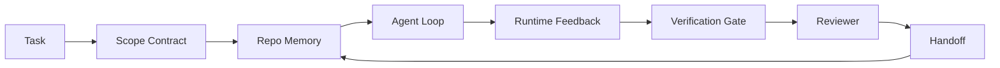

# Agent Workbench Engineering：为什么能力强的模型仍然会失败

> 能力强的 model 还不够。可靠 agents 需要一个 workbench：instructions、state、scope、feedback、verification、review、handoff。拿掉这些，即使 frontier model 也会产出不适合发布的工作。

**类型：** 学习 + 构建
**语言：** Python (stdlib)
**前置要求：** 阶段 14 · 01（Agent Loop），阶段 14 · 26（Failure Modes）
**时间：** ~45 分钟

## 学习目标

- 区分 model capability 和 execution reliability。
- 说出决定 agent 是否能 ship 的七个 workbench surfaces。
- 在一个小型 repo task 上，对比 prompt-only run 和 workbench-guided run。
- 生成 failure-mode report，把每个缺失 surface 映射到它造成的 symptom。

## 问题

你把 frontier model 放进真实 repo，要求它添加 input validation。它打开四个文件，写出看起来合理的代码，宣布成功，然后停下。你运行 tests。两个失败。第三个被修改的文件和 validation 没有关系。没有记录说明 agent 假设了什么、它先试了什么、还剩什么要做。

Model 对 Python 并没有错。它对 work 的理解错了。它不知道什么算 done，不知道允许写哪里，不知道哪些 tests 有权威，也不知道下一个 session 应该如何接手。

这不是 model bug。这是 workbench bug。Agent 周围缺失了把一次 one-shot generation 变成可靠、可恢复工程工作的那些 surface。

## 概念

Workbench 是 task 期间包裹 model 的 operating environment。它有七个 surfaces：

| Surface | What it carries | Failure when missing |
|---------|-----------------|----------------------|
| Instructions | Startup rules, forbidden actions, definition of done | Agent 猜测什么叫 shipping |
| State | Current task, touched files, blockers, next action | 每个 session 都从零开始 |
| Scope | Allowed files, forbidden files, acceptance criteria | Edits 泄漏到无关代码 |
| Feedback | Real command output captured into the loop | Agent 在 400 上宣布成功 |
| Verification | Tests, lint, smoke run, scope check | “Looks good” 进入 main |
| Review | A second pass with a different role | Builder 给自己的作业打分 |
| Handoff | What changed, why, what is left | 下个 session 重新发现一切 |

Workbench 独立于 model。你可以换 model，同时保留 surfaces。你不能换掉 surfaces，还期待 reliability 保持不变。



Loop 闭合在 state file 上，而不是 chat history 上。Chat 是 volatile 的。Repo 才是 system of record。

### Workbench versus prompt engineering

Prompting 告诉 model 这一 turn 你想要什么。Workbench 告诉 model 如何跨 turns、跨 sessions 做工作。大多数 agent failure stories 其实是披着 prompt-engineering 外衣的 workbench failures。

### Workbench versus framework

Framework 给你 runtime（LangGraph、AutoGen、Agents SDK）。Workbench 给 agent 一个在 runtime 里工作的地方。两者都需要。这个 mini-track 讲的是第二件事。

### 从 primitives 推理，而不是从 vendor taxonomies 推理

现在有大量关于 “harness engineering” 的文章。Addy Osmani、OpenAI、Anthropic、LangChain、Martin Fowler、MongoDB、HumanLayer、Augment Code、Thoughtworks、walkinglabs awesome list，以及 Medium 和 Hacker News 上源源不断的文章都在谈它。它们对 harness 的边界、scope、vocabulary 各有分歧。我们不需要选边。七个 surfaces 是 UX layer；每个 workbench 底下，都是一套支撑任何可靠 backend 的 distributed-systems primitives。

先暂时拿掉 agent 标签。一次 agent run 是跨越时间、进程、机器的 computation。要让它可靠，你需要任何 production system 都需要的同一组 primitives。

| Primitive | What it is | What it carries for an agent |
|-----------|------------|------------------------------|
| Function | Typed handler. Pure where possible. Owns its inputs and outputs. | Tool call、rule check、verification step、model invocation |
| Worker | Long-lived process that owns one or more functions and a lifecycle | Builder、reviewer、verifier、MCP server |
| Trigger | Event source that invokes a function | Agent loop tick、HTTP request、queue message、cron、file change、hook |
| Runtime | The boundary that decides what runs where, with what timeouts and resources | Claude Code 的 process、LangGraph 的 runtime、worker container |
| HTTP / RPC | The wire between caller and worker | Tool-call protocol、MCP request、model API |
| Queue | Durable buffer between trigger and worker; back-pressure, retry, idempotency | Task board、feedback log、review inbox |
| Session persistence | State that survives crashes, restarts, model swaps | `agent_state.json`、checkpoints、KV stores、repo 本身 |
| Authorization policy | Who can call what function with which scope | Allowed/forbidden files、approval boundaries、MCP capability lists |

现在把七个 workbench surfaces 映射到这些 primitives 上。

- **Instructions** — policy + function metadata。Rules 是 checks（functions）。Router（`AGENTS.md`）是挂在 runtime startup 上的 policy。
- **State** — session persistence。Runtime 每一步都会读取的 keyed store。可以是 file、KV 或 DB；重要的是 persistence semantics，而不是 storage backend。
- **Scope** — 每个 task 的 authorization policy。Allowed/forbidden globs 是 ACL。Approvals required 是 permission lattice。
- **Feedback** — 写入 queue 的 invocation log。每个 shell call 都是一条 durable、replayable record。
- **Verification** — 一个 function。对 inputs deterministic。在 task close 时触发。Fails closed。
- **Review** — 一个独立 worker，对 builder artifacts 有 read-only authz，对 review reports 有 write-only authz。
- **Handoff** — session-end trigger 发出的 durable record。下一个 session 的 startup trigger 会读取它。

Agent loop 本身是一个 worker：它消费 events（user message、tool result、timer tick），调用 functions（先 model，再调用 model 选择的 tools），写 records（state、feedback），并发出 triggers（verify、review、handoff）。没有神秘感；形状和 job processor 一样。

### 流行 patterns，翻译成 primitives

每个流行 harness pattern 都可以归约为八个 primitives。Translation table：

| Vendor or community pattern | What it actually is |
|------------------------------|--------------------|
| Ralph Loop（Claude Code、Codex、agentic_harness book）— 当 agent 过早尝试停止时，把原始 intent 重新注入 fresh context window | 重新 enqueue task 的 trigger；session persistence 携带 goal |
| Plan / Execute / Verify (PEV) | 三个 workers，每个 role 一个，通过 state 和 queue 在 phases 之间通信 |
| Harness-compute separation（OpenAI Agents SDK, April 2026）— 分离 control plane 和 execution plane | 重新表述 control-plane / data-plane；早于 agent 标签几十年 |
| Open Agent Passport（OAP, March 2026）— 每个 tool call 在执行前按 declarative policy 签名和审计 | 由 pre-action worker 执行的 authorization policy，带 signed audit queue |
| Guides and Sensors（Birgitta Böckeler / Thoughtworks）— feedforward rules + feedback observability | Authorization policy + verification functions + observability traces |
| Progressive compaction, 5-stage（Claude Code reverse engineering, April 2026） | 一个 state-management worker，像 cron 一样在 session persistence 上运行，使其保持在 budget 内 |
| Hooks / middleware（LangChain、Claude Code）— intercept model and tool calls | 包在 runtime invocation path 周围的 triggers + functions |
| Skills as Markdown with progressive disclosure（Anthropic、Flue） | Function registry，其中 function metadata 会 just-in-time 载入 context |
| Sandbox agents（Codex、Sandcastle、Vercel Sandbox） | Compute plane：带隔离 filesystem、network、lifecycle 的 runtime |
| MCP servers | 通过 stable RPC 暴露 functions 的 workers，并用 capability lists 做 authorization |

表中每一项都是 agent community 重新抵达一个在 distributed systems 中早有名字的 primitive，然后给了它一个新名字。营销上有用；工程词汇上没那么有用。

### Receipts 实际说明了什么

harness-over-model 这个主张现在有数字支撑。值得知道，因为它们也是反驳 “just wait for a smarter model” 的唯一诚实论据。

- Terminal Bench 2.0 — 同一个 model，harness change 让一个 coding agent 从 top 30 之外升到第五名（LangChain, *Anatomy of an Agent Harness*）。
- Vercel — 删除了 agent 80% 的 tools；success rate 从 80% 跳到 100%（MongoDB）。
- Harvey — legal agents 仅靠 harness optimization 就把 accuracy 提升超过一倍（MongoDB）。
- 88% enterprise AI agent projects 未能进入 production。Failures 聚集在 runtime，而不是 reasoning（preprints.org, *Harness Engineering for Language Agents*, March 2026）。
- 2025 年一项跨三个热门 open-source frameworks 的 benchmark study 报告约 50% task completion；long-context WebAgent 在 long-context conditions 下从 40-50% 掉到 10% 以下，主要因为 infinite loops 和 goal loss（2026 年初多篇文章广泛讨论）。

Takeaway 不是 “harness 永远赢”。Models 会随时间吸收 harness tricks。Takeaway 是：今天，承重工程在 model 周围，而不是 model 内部；承载这份重量的 primitives，正是每个 production system 一直需要的 primitives。

### Vendor writeups 止步在哪里

这部分不需要太客气。

- LangChain 的 *Anatomy of an Agent Harness* 列出十一个 components — prompts、tools、hooks、sandboxes、orchestration、memory、skills、subagents，以及一个 runtime “dumb loop”。它没有命名 queues、作为 deployment unit 的 workers、trigger semantics、session persistence 作为单独 concern、或 authorization policy。它把 harness 当成一个你配置的 object，而不是一个你部署的 system。
- Addy Osmani 的 *Agent Harness Engineering* 提出了 `Agent = Model + Harness` 和 ratchet pattern，但没有进一步说明 harness 是由什么构成的。它读起来像 stance，而不是 spec。
- Anthropic 和 OpenAI 在 surfaces 上讲得最深，但仍留在自己的 runtimes 内。2026 年 4 月 Agents SDK 的 “harness-compute separation” announcement，是第一个明确认可 control-plane / data-plane split 的 vendor 文章。那是一个 primitive idea，不是新 idea。
- agentic_harness book 把 harness 当作 config object（Jaymin West 的 *Agentic Engineering* 第 6 章），里面最强的一句话是 “the harness is the primary security boundary in an agentic system.” 那只是 authorization policy 的重新表述。
- Hacker News threads 不断走向同一个地方。2026 年 4 月 thread *The agent harness belongs outside the sandbox* 认为 harness 应该更像 “a hypervisor that sits outside everything and authorises access based on context and user.” 这再次是 authorization policy as a separate plane。

你不需要不同意这些文章，也能看到 gap。它们在写一个已经存在系统的 UX descriptions。我们是在写这个系统。当系统构建正确时，七个 surfaces 会从 primitives 中自然出现。当系统构建错误时，再漂亮的 `AGENTS.md` 也修不好缺失的 queue。

所以当你在别处听到 “harness engineering”，把它翻译成 primitives。Prompts 和 rules 是 policy 与 functions。Scaffolding 是 runtime。Guardrails 是 authorization + verification。Hooks 是 triggers。Memory 是 session persistence。Ralph Loop 是 requeue。Subagents 是 workers。Sandboxes 是 compute planes。词汇会变；工程不变。Workbench 是面向 agent 的 UX；而能熬过下一次 vendor reframe 的 harness，是 functions、workers、triggers、runtimes、queues、persistence 和 policy 被正确连在一起。

## 构建它

`code/main.py` 会把一个 tiny repo task 跑两次。第一次是 prompt only，第二次接入七个 surfaces。相同 model，相同 task。脚本会统计失败 run 中缺失哪些 surfaces，并打印 failure-mode report。

Repo task 故意很小：给一个单文件 FastAPI-style handler 添加 input validation，并写一个 passing test。

运行它：

```
python3 code/main.py
```

输出：两次 run 的 side-by-side log，一个总结 prompt-only run 的 `failure_modes.json`，以及 workbench run 的 one-line verdict。

Agent 是一个 tiny rule-based stub；重点是 surfaces，不是 model。接下来这个 mini-track 的其余课程会把每个 surface 重建成真实、可复用的 artifact。

## 使用它

Workbench surfaces 在真实世界中已经存在于三个地方，哪怕没人这么称呼它们：

- **Claude Code、Codex、Cursor。** `AGENTS.md` 和 `CLAUDE.md` 是 instructions surface。Slash commands 是 scope。Hooks 是 verification。
- **LangGraph、OpenAI Agents SDK。** Checkpoints 和 session stores 是 state surface。Handoffs 是 handoff surface。
- **真实 repo 上的 CI。** Tests、lint、type-check 是 verification。PR template 是 handoff。CODEOWNERS 是 review。

Workbench engineering 是把这些 surfaces 显式化、可复用化的 discipline，而不是让每个团队重新发现它们。

## 发布它

`outputs/skill-workbench-audit.md` 是一个 portable skill，用来审计现有 repo 的七个 workbench surfaces，并报告哪些缺失、哪些部分完成、哪些健康。把它放到任何 agent setup 旁边，它会告诉你先修什么。

## 练习

1. 选一个你已经运行 agent 的 repo。用 0（missing）到 2（healthy）给七个 surfaces 打分。你最弱的 surface 是什么？
2. 扩展 `main.py`，让 prompt-only run 也产出一个假的 “success” claim。验证 verification gate 会抓住它。
3. 为你自己的产品添加第八个 surface。说明它为什么不能折叠进现有七个。
4. 用另一个会 hallucinate extra file write 的 stub agent 重新运行脚本。哪个 surface 最先抓住它？
5. 把 Phase 14 · 26 的五个 industry-recurring failure modes 映射到七个 surfaces。每个 surface 设计用来吸收哪种 mode？

## 关键术语

| 术语 | 人们常说 | 实际含义 |
|------|----------------|------------------------|
| Workbench | "The setup" | 围绕 model 的 engineered surfaces，使工作可靠 |
| Surface | "A doc" or "a script" | Agent 每 turn 读取或写入的具名、machine-readable input |
| System of record | "The notes" | 当 chat history 消失时，agent 视为真相的文件 |
| Definition of done | "Acceptance" | 一个 objective、file-backed、agent 无法伪造的 checklist |
| Workbench audit | "Repo readiness check" | 对七个 surfaces 做一次 pass，在工作开始前标记缺失部分 |

## 延伸阅读

把这些当作 data points，而不是 authorities。每篇都是 partial taxonomy。采用之前，先把每个概念翻译回 primitive（function、worker、trigger、runtime、HTTP/RPC、queue、persistence、policy）。

Vendor framings：

- [Addy Osmani, Agent Harness Engineering](https://addyosmani.com/blog/agent-harness-engineering/) — `Agent = Model + Harness` 和 ratchet pattern；infrastructure 较薄
- [LangChain, The Anatomy of an Agent Harness](https://blog.langchain.com/the-anatomy-of-an-agent-harness/) — 十一个 components：prompts、tools、hooks、orchestration、sandboxes、memory、skills、subagents、runtime；遗漏 queues、deployment、authz
- [OpenAI, Harness engineering: leveraging Codex in an agent-first world](https://openai.com/index/harness-engineering/) — Codex team 对 runtime 周围 surfaces 的看法
- [OpenAI, Unrolling the Codex agent loop](https://openai.com/index/unrolling-the-codex-agent-loop/) — 把 agent loop 还原成 function calls 上的 `while`
- [Anthropic, Effective harnesses for long-running agents](https://www.anthropic.com/engineering/effective-harnesses-for-long-running-agents) — specific runtime 内的 long-horizon surfaces
- [Anthropic, Harness design for long-running application development](https://www.anthropic.com/engineering/harness-design-long-running-apps) — applied design notes
- [LangChain Deep Agents harness capabilities](https://docs.langchain.com/oss/python/deepagents/harness) — runtime config surface

Practitioner pieces with usable detail：

- [Martin Fowler / Birgitta Böckeler, Harness engineering for coding agent users](https://martinfowler.com/articles/harness-engineering.html) — guides（feedforward）+ sensors（feedback）；最干净的 control-theory framing
- [HumanLayer, Skill Issue: Harness Engineering for Coding Agents](https://www.humanlayer.dev/blog/skill-issue-harness-engineering-for-coding-agents) — “it's not a model problem, it's a configuration problem”
- [MongoDB, The Agent Harness: Why the LLM Is the Smallest Part of Your Agent System](https://www.mongodb.com/company/blog/technical/agent-harness-why-llm-is-smallest-part-of-your-agent-system) — receipts：Vercel 80% 到 100%，Harvey 2x accuracy，Terminal Bench Top 30 到 Top 5
- [Augment Code, Harness Engineering for AI Coding Agents](https://www.augmentcode.com/guides/harness-engineering-ai-coding-agents) — constraint-first walkthrough
- [Sequoia podcast, Harrison Chase on Context Engineering Long-Horizon Agents](https://sequoiacap.com/podcast/context-engineering-our-way-to-long-horizon-agents-langchains-harrison-chase/) — runtime concerns over model concerns

Books、papers 和 reference implementations：

- [Jaymin West, Agentic Engineering — Chapter 6: Harnesses](https://www.jayminwest.com/agentic-engineering-book/6-harnesses) — book-length treatment，把 harness 当作 agentic system 的 primary security boundary
- [preprints.org, Harness Engineering for Language Agents (March 2026)](https://www.preprints.org/manuscript/202603.1756) — 作为 control / agency / runtime 的 academic framing
- [walkinglabs/awesome-harness-engineering](https://github.com/walkinglabs/awesome-harness-engineering) — 覆盖 context、evaluation、observability、orchestration 的 curated reading list
- [ai-boost/awesome-harness-engineering](https://github.com/ai-boost/awesome-harness-engineering) — alternate curated list（tools、evals、memory、MCP、permissions）
- [andrewgarst/agentic_harness](https://github.com/andrewgarst/agentic_harness) — production-ready reference implementation，带 Redis-backed memory 和 eval suite
- [HKUDS/OpenHarness](https://github.com/HKUDS/OpenHarness) — open agent harness，带 built-in personal agent

Hacker News threads 值得读 disagreements，而不是 consensus：

- [HN: Effective harnesses for long-running agents](https://news.ycombinator.com/item?id=46081704)
- [HN: Improving 15 LLMs at Coding in One Afternoon. Only the Harness Changed](https://news.ycombinator.com/item?id=46988596)
- [HN: The agent harness belongs outside the sandbox](https://news.ycombinator.com/item?id=47990675) — argues for authorization as a separate plane

本课程内 cross-references：

- Phase 14 · 23 — OpenTelemetry GenAI conventions：sensors literature 指向的 observability layer
- Phase 14 · 26 — Failure modes catalog，七个 surfaces 设计用来吸收这些 failures
- Phase 14 · 27 — Prompt injection defenses，位于 authorization-policy primitive 上
- Phase 14 · 29 — Production runtimes（queue、event、cron）：本课 primitives 在 deployment 中的位置
