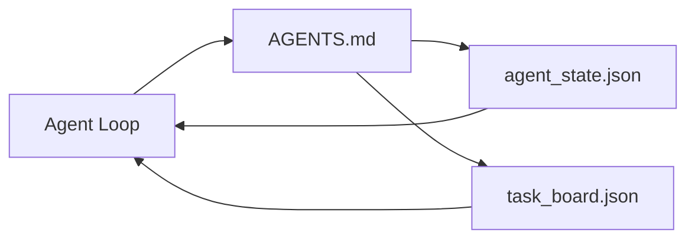

# Minimal Agent Workbench

> 最小可用 workbench 是三个文件：root instructions router、state file、task board。其他所有东西都叠在上面。如果一个 repo 承载不了这三个文件，没有任何 model 能救它。

**类型：** 构建
**语言：** Python (stdlib)
**前置要求：** 阶段 14 · 31（Why Capable Models Still Fail）
**时间：** ~45 分钟

## 学习目标

- 定义组成 minimum viable workbench 的三个文件。
- 解释为什么短 root router 优于长 monolithic `AGENTS.md`。
- 构建一个 agent 每 turn 都能读取、结束时能写回的 state file。
- 构建一个不依赖 chat history、能跨多 session 工作的 task board。

## 问题

多数团队通过写一个 3000 行 `AGENTS.md` 来搭 workbench，然后认为完成了。Model 加载它，忽略自己无法总结的部分，然后仍然在同样的 surfaces 上失败。

你需要的是相反方向。一个很小的 root file，只在相关时把 agent route 到更深文件。Agent 行动前读取、行动后写回的 durable state。一个说明 in flight、blocked、up next 的 task board。

三个文件。每个都有一个工作。每个都足够 machine-readable，未来可以演化成真正的 system。

## 概念



### AGENTS.md 是 router，不是 manual

好的 `AGENTS.md` 很短。它把 agent 指向：

- State file（你在哪里）。
- Task board（剩下什么）。
- Deeper rules（位于 `docs/agent-rules.md`）。
- Verification command（怎么知道它工作）。

更长的内容放在 deeper docs 中，只在需要时加载。Long manuals 会被忽略。Short routers 会被遵守。

### agent_state.json 是 system of record

State 承载：active task id、touched files、assumptions made、blockers、next action。Agent 每 turn 都读取它。下一个 session 读取它，而不是 replay chat。

State 放在文件中，因为 chat history 不可靠。Sessions 会死。Conversations 会被 trim。文件不会。

### task_board.json 是 queue

Task board 承载每个 task，status 为 `todo | in_progress | done | blocked`。当 state 为空时，agent 从这个 queue 拉取任务；当你想知道 agent 是否在正轨上时，你也读这个 queue。

Board 上的 task 有 id、goal、owner（`builder`、`reviewer` 或 `human`）、acceptance criteria。Board 故意很小：如果它大到超过一屏，你的问题是 planning problem，不是 board problem。

### 三个文件是地板，不是天花板

后续 lessons 会添加 scope contracts、feedback runners、verification gates、reviewer checklists、handoff packets。本课的三个文件是它们共同假设的基础。

## 构建它

`code/main.py` 会把 minimal workbench 写入一个空 repo，并演示一个 agent turn：

1. 读取 `agent_state.json`。
2. 如果 state 为空，从 `task_board.json` 拉取下一个 task。
3. 在 scope 内触碰单个文件。
4. 写回 updated state。

运行它：

```
python3 code/main.py
```

脚本会在自身旁边创建 `workdir/`，放下三个文件，运行一 turn，并打印 diff。重新运行它，观察第二 turn 如何接上第一 turn。

## 使用它

在 production agent products 中，同样三个文件会以不同名字出现：

- **Claude Code：** `AGENTS.md` 或 `CLAUDE.md` 作为 router，`.claude/state.json` 风格 stores 作为 state，hooks 作为 board。
- **Codex / Cursor：** workspace rules 作为 router，session memory 作为 state，chat sidebar 中的 queued tasks 作为 board。
- **Custom Python agent：** 就是你刚写的同样文件。

名字会变。形状不会。

## Production patterns in the wild

Minimum workbench 接触真实 monorepos 后，仍能通过叠加三种 patterns 存活。它们彼此独立；只选你的 repo 真正需要的。

**Nested `AGENTS.md` with nearest-wins precedence。** OpenAI 在主 repo 中放了 88 个 `AGENTS.md` 文件，每个 subcomponent 一个。Codex、Cursor、Claude Code 和 Copilot 都会从当前工作文件向 repo root 行走，并拼接路径上找到的每个 `AGENTS.md`。Sub-directory files 扩展 root file。Codex 添加了 `AGENTS.override.md` 用于 replace 而不是 extend；override 机制是 Codex-specific，跨工具工作时避免使用。Augment Code 的测量是关键：最好的 `AGENTS.md` 带来的 quality jump 相当于从 Haiku 升级到 Opus；最差的会让 output 比没有文件还差。

**Anti-patterns to refuse, even when they look like coverage。** Conflicting instructions 会悄悄把 agent 从 interactive 降到 greedy mode（ICLR 2026 AMBIG-SWE：48.8% → 28% resolve rate）；用编号 priorities，而不是把它们平铺堆叠。不可验证的 style rules（“follow the Google Python Style Guide”）没有 enforcement command 时会让 agent 发明 compliance；每条 style rule 都配 exact lint command。以 style 而不是 commands 开头会埋掉 verification path；commands first，style last。为 humans 而不是 agents 写，会浪费 context budget；terse 是 feature。

**Cross-tool symlinks。** 一个 root file 加 symlinks（`ln -s AGENTS.md CLAUDE.md`、`ln -s AGENTS.md .github/copilot-instructions.md`、`ln -s AGENTS.md .cursorrules`）能让每个 coding agent 使用同一个 source of truth。Nx 的 `nx ai-setup` 会从一个 config 自动为 Claude Code、Cursor、Copilot、Gemini、Codex、OpenCode 生成这些内容。

## 发布它

`outputs/skill-minimal-workbench.md` 会为任意新 repo 生成三文件 workbench：一个按项目调优的 `AGENTS.md` router，一个带正确 keys 的 `agent_state.json`，以及一个用当前 backlog seed 的 `task_board.json`。

## 练习

1. 给 `agent_state.json` 添加 `last_run` timestamp。如果文件超过 24 小时，除非 operator 确认，否则拒绝运行。
2. 给 task board 添加 `priority` field，并把 puller 改成总是选择最高 priority 的 `todo`。
3. 把 `task_board.json` 迁移到 JSON Lines，让每个 task 一行，使 version control 中的 diffs 干净。
4. 写一个 `lint_workbench.py`：如果 `AGENTS.md` 超过 80 行，或引用了不存在的文件，就 fail。
5. 判断这三个文件中丢失哪个伤害最大。为你的选择辩护。

## 关键术语

| 术语 | 人们常说 | 实际含义 |
|------|----------------|------------------------|
| Router | `AGENTS.md` | 指向 deeper docs 和 files 的短 root file |
| State file | "The notes" | 记录 agent 所在位置的 machine-readable file，每 turn 写入 |
| Task board | "The backlog" | 带 status、owner、acceptance 的 JSON work queue |
| System of record | "Source of truth" | Chat 消失时 workbench 视为权威的文件 |

## 延伸阅读

- [agents.md — the open spec](https://agents.md/) — 被 Cursor、Codex、Claude Code、Copilot、Gemini、OpenCode 采用
- [Augment Code, A good AGENTS.md is a model upgrade. A bad one is worse than no docs at all](https://www.augmentcode.com/blog/how-to-write-good-agents-dot-md-files) — measured quality jumps
- [Blake Crosley, AGENTS.md Patterns: What Actually Changes Agent Behavior](https://blakecrosley.com/blog/agents-md-patterns) — empirically 有效和无效的模式
- [Datadog Frontend, Steering AI Agents in Monorepos with AGENTS.md](https://dev.to/datadog-frontend-dev/steering-ai-agents-in-monorepos-with-agentsmd-13g0) — nested precedence in practice
- [Nx Blog, Teach Your AI Agent How to Work in a Monorepo](https://nx.dev/blog/nx-ai-agent-skills) — 跨六种工具的 single-source generation
- [The Prompt Shelf, AGENTS.md Best Practices: Structure, Scope, and Real Examples](https://thepromptshelf.dev/blog/agents-md-best-practices/) — 能经受 review 的 section ordering
- [Anthropic, Claude Code subagents and session store](https://docs.anthropic.com/en/docs/agents-and-tools/claude-code/sub-agents)
- Phase 14 · 31 — 这个 minimum 吸收的 failure modes
- Phase 14 · 34 — 本课预览的 durable state schema
