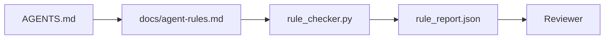

# Agent Instructions as Executable Constraints

> 写成 prose 的 instructions 是愿望。写成 constraints 的 instructions 是 tests。Workbench 会把每条 rule 变成 agent 能在 runtime 检查、reviewer 能事后验证的东西。

**类型：** 构建
**语言：** Python (stdlib)
**前置要求：** 阶段 14 · 32（Minimal Workbench）
**时间：** ~50 分钟

## 学习目标

- 区分 routing prose 和 operational rules。
- 把 startup rules、forbidden actions、definition of done、uncertainty handling、approval boundaries 表达成 machine-checkable constraints。
- 实现一个 rule checker，按 rule set 给一次 run 打分。
- 让 rule set 便于 diff，这样 review 能看出什么变了。

## 问题

典型 `AGENTS.md` 读起来像 onboarding documentation。它告诉 agent “be careful”、“test thoroughly”、“ask if unsure”。三天后，agent 发布了没有 tests 的 change，写入 forbidden directory，也从没 ask，因为它根本不知道边界在哪里。

Instructions 在 operational 时强大，在 aspirational 时脆弱。修复方式是写出 workbench 能解释、reviewer 能打分的 rules。

## 概念

Rules 应该放在 `docs/agent-rules.md`，离开短 root router。每条 rule 都有 name、category、check。



### 覆盖大多数 rules 的五类

| Category | Question the rule answers | Example |
|----------|---------------------------|---------|
| Startup | 工作开始前必须满足什么？ | "state file exists and is fresh" |
| Forbidden | 什么绝不能发生？ | "do not edit `scripts/release.sh`" |
| Definition of done | 什么证明 task 完成？ | "pytest exits 0 and acceptance line passes" |
| Uncertainty | Agent 不确定时做什么？ | "open a question note instead of guessing" |
| Approval | 什么需要 human approval？ | "any new dependency, any prod write" |

不适合这五类之一的 rule，通常想拆成两条。强制拆分。

### Rules are machine-readable

每条 rule 都有 slug、category、一行 description，以及命名 `rule_checker.py` 中函数的 `check` field。添加 rule 意味着添加 check；checker 和 workbench 一起增长。

### Rules are diff-friendly

Rules 在一个 markdown file 中按每条一个 heading 存放。Renames 在 diff 中可见。新 rules 放在 category 顶部。Stale rules 删除，而不是注释掉，因为 workbench 是 source of truth，不是团队上个季度心情的 chat log。

### Rules versus framework guardrails

Framework guardrails（OpenAI Agents SDK guardrails、LangGraph interrupts）在 runtime level enforce rules。本课中的 rule set 是这些 guardrails 实现的人类可读、可 review contract。你两者都需要：runtime 在 turn 中捕捉 violations，rule set 证明 runtime 正在做正确的事。

## 构建它

`code/main.py` 提供：

- `agent-rules.md` parser，把 rules 加载进 dataclass。
- `rule_checker.py` 风格 checker functions，每个 `check` reference 一个。
- 一个 demo agent run，违反两条 rules；check pass 会抓住它们。

运行它：

```
python3 code/main.py
```

输出：parsed rule set、run trace、每条 rule 的 pass/fail，以及保存到脚本旁边的 `rule_report.json`。

## Production patterns in the wild

三种 patterns 能区分一个能坚持一个季度的 rule set，和一个一周后腐烂的 rule set。

**Severity tagging at write time。** 每条 rule 携带 `severity`：`block`、`warn` 或 `info`。Checker 报告三种 severity；runtime 只在 `block` 上拒绝。多数团队早期会夸大 severity，然后在 deadline pressure 下悄悄削弱；写 rule 时就 tagging 会迫使一开始校准。搭配 verification gate（Phase 14 · 38），它会把任何 `block` rule override 签入 `overrides.jsonl` audit log。

**Rule expiry as a forcing function。** 每条 rule 携带 `expires_at` 日期（默认从 authoring 起 90 天）。当一条未过期 rule 连续 60 天没有 violation 时，checker 发出 warning；下一次季度 review 要么证明保留它的理由，要么降级到 `info`，要么删除。Cloudflare production AI Code Review data（2026 年 4 月，30 天内 5,169 repos、131,246 review runs）显示，有 explicit expiry 的 rule sets 保持在每 repo 30 条以内；没有 expiry 的会增长到 80+，且多数从未触发。

**Markdown-as-source, JSON-as-cache。** `agent-rules.md` 是 authored file；`agent-rules.lock.json` 是 checker 在 hot path 读取的 cache。Lock 由 pre-commit hook 重新生成。Markdown diffs 可 review；每个 turn 不需要再 parse JSON 之外的内容。形状和 `package.json` / `package-lock.json`、`Cargo.toml` / `Cargo.lock` 一样。

## 使用它

在 production 中：

- Claude Code、Codex、Cursor 在 session start 读取 rules，并在拒绝 actions 时引用它们。Checker 在 CI 中重新运行，以捕捉 silent drift。
- OpenAI Agents SDK guardrails 会把同样 checks 注册成 input 和 output guardrails。Markdown 是 docs surface；SDK 是 runtime surface。
- LangGraph interrupts 在 in-flight node 违反 rule 时触发。Interrupt handler 读取 rule、询问 human、然后 resume。

Rule set 可跨这三者移植，因为它只是 markdown 加 function names。

## 发布它

`outputs/skill-rule-set-builder.md` 会访谈项目 owner，把现有 prose instructions 分类进五个 categories，并输出 versioned `agent-rules.md` 和 checker stub。

## 练习

1. 如果你的产品真的需要，添加第六类。说明它为什么不能折叠到五类之一。
2. 扩展 checker，让 rule 能携带 severity（`block`、`warn`、`info`），并让 report 汇总它们。
3. 把 checker 接入 CI：如果 latest agent run 中 block-severity rule 失败，就 fail build。
4. 为每条 rule 添加 “expiry” field。90 天没有 check fail 后，该 rule 进入 review。
5. 找一个真实 `AGENTS.md`，把它改写成五类 rules。它有多少行是 operational？多少行是 aspirational？

## 关键术语

| 术语 | 人们常说 | 实际含义 |
|------|----------------|------------------------|
| Operational rule | "A real instruction" | Workbench 能在 runtime 检查的 rule |
| Aspirational rule | "Be careful" | 没有 check 的 rule；要么删除，要么升级 |
| Definition of done | "Acceptance" | Task complete 的 objective、file-backed proof |
| Block severity | "Hard rule" | Violation 会 halt run；没有 operator 不能静默 |
| Rule expiry | "Stale rule sweep" | N 天没有 fails 的 rule 进入 retirement review |

## 延伸阅读

- [OpenAI Agents SDK guardrails](https://platform.openai.com/docs/guides/agents-sdk/guardrails)
- [LangGraph interrupts](https://langchain-ai.github.io/langgraph/how-tos/human_in_the_loop/breakpoints/)
- [Anthropic, Building Effective Agents](https://www.anthropic.com/research/building-effective-agents)
- [Rick Hightower, Agent RuleZ: A Deterministic Policy Engine](https://medium.com/@richardhightower/agent-rulez-a-deterministic-policy-engine-for-ai-coding-agents-9489e0561edf) — production 中的 block/warn/info severity
- [Cloudflare, Orchestrating AI Code Review at Scale](https://blog.cloudflare.com/ai-code-review/) — 131k review runs，rule composition lessons
- [microservices.io, GenAI development platform — part 1: guardrails](https://microservices.io/post/architecture/2026/03/09/genai-development-platform-part-1-development-guardrails.html) — rules 和 CI 之间的 defense in depth
- [Type-Checked Compliance: Deterministic Guardrails (arXiv 2604.01483)](https://arxiv.org/pdf/2604.01483) — Lean 4 作为 rule-as-check 的上限
- [logi-cmd/agent-guardrails](https://github.com/logi-cmd/agent-guardrails) — merge-gate implementation：scope、mutation testing、violation budgets
- Phase 14 · 32 — 这个 rule set 要落入的 minimal workbench
- Phase 14 · 38 — 消费 rule report 的 verification gate
- Phase 14 · 39 — 给 rule compliance 打分的 reviewer agent
