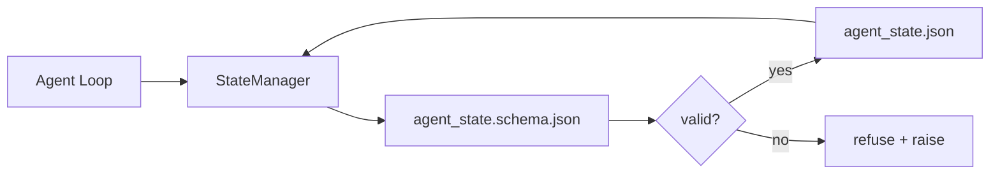

# Repo Memory 和 Durable State

> Chat history 是 volatile 的。Repo 是 durable 的。Workbench 把 agent state 存进 versioned files，让下一个 session、下一个 agent、下一个 reviewer 都从同一个 source of truth 读取。

**类型：** 构建
**语言：** Python (stdlib + `jsonschema` optional)
**前置要求：** 阶段 14 · 32（Minimal Workbench）
**时间：** ~60 分钟

## 学习目标

- 定义什么属于 repo memory，什么属于 chat history。
- 为 `agent_state.json` 和 `task_board.json` 编写 JSON Schemas。
- 构建一个 state manager，能 atomically load、validate、mutate、persist state。
- 使用 schema 在坏写入腐蚀 workbench 前拒绝它。

## 问题

Agent 完成一个 session。Chat 关闭。下一个 session 打开并询问从哪里开始。Model 说 “let me check the files”，读到 stale notes，然后重做已经完成的工作。更糟的是，它重写了一个已经完成的文件，因为没人告诉它那个文件已经完成。

Workbench 的修复方式是 repo memory：state 存在 repo 中的 JSON files 里，受 schema 约束，atomically 持久化，并且在 code review 中 diff-friendly。Chat 是 transient feed；repo 是 system of record。

## 概念



### 什么属于 repo memory

| Belongs | Does not belong |
|---------|-----------------|
| Active task id | Raw chat transcripts |
| Touched files this session | Token-level reasoning traces |
| Assumptions the agent made | "The user seemed frustrated" |
| Open blockers | Sampled completions |
| Next action | Vendor-specific model ids |

测试标准是 durability：三个月后在 CI rerun 中它还有用吗？如果有，放 repo。如果没有，放 telemetry。

### Schema-first state

JSON Schema 是 contract。没有它，每个 agent 都会发明新 fields，每个 reviewer 都要学习新形状，每个 CI script 都要 special-case 过去版本。有了它，bad write 会被 refused。

Schema 覆盖：

- Required keys。
- Allowed `status` values。
- Forbidden values（例如 arrays 不允许 `null`）。
- Pattern constraints（task ids 匹配 `T-\d{3,}`）。
- 用于 migrations 的 version field。

### Atomic writes

State writes 需要能扛住 partial failures：写入 tempfile、fsync、rename 覆盖 target。State file 是 source of truth；半写入文件比没有文件更糟。

### Migrations

Schema 改变时，在 schema bump 旁边发布 migration script。State file 携带 `schema_version` field；manager 拒绝加载自己无法 migrate 的版本。

## 构建它

`code/main.py` 实现：

- `agent_state.schema.json` 和 `task_board.schema.json`。
- 一个 stdlib-only validator（JSON Schema 子集：required、type、enum、pattern、items）。
- 带 atomic temp-and-rename writes 的 `StateManager.load`、`StateManager.update`、`StateManager.commit`。
- 一个 demo：mutate state、persist、reload，并证明 round-trip。

运行它：

```
python3 code/main.py
```

脚本会写入 `workdir/agent_state.json` 和 `workdir/task_board.json`，跨两 turn 修改它们，并在每步打印 validated state。

## Production patterns in the wild

四种 patterns 能把本课 minimum 变成 multi-agent monorepo 能承受的东西。

**Atomic temp-and-rename is not optional。** 2026 年 3 月 Hive project bug report 清楚记录了 failure mode：`state.json` 通过 `write_text()` 写入，exceptions 被捕获并吞掉。Partial writes 让 sessions 在无信号情况下基于 corrupt state resume。修复总是：在 target 同目录中 `tempfile.mkstemp`、write、`fsync`、`os.replace`（POSIX 和 Windows 上的 atomic rename）。本课的 `atomic_write` 正是这样做的。

**Idempotency keys on every non-idempotent tool call。** 如果 agent 在调用 tool 后、checkpoint result 前 crash，recovery 会 retry tool call。Reads 安全；emails、DB inserts、file uploads 危险。Pattern：每个 tool call ID 在执行前写入 `pending_calls.jsonl`。Retry 时检查 ID；如果存在，跳过 call 并使用 cached result。Anthropic 和 LangChain 在 2026 guidance 中都指出这一点；LangGraph checkpointer 持久化 pending writes 的原因相同。

**Separate large artifacts from state。** 不要把 CSVs、long transcripts 或 generated files 存进 `agent_state.json`。把 artifact 保存为单独文件（或上传到 object storage），state 中只保留 path。Checkpoints 保持小而快；artifacts 独立增长。

**Event sourcing for audit, snapshots for resume。** 每次 mutation 追加到 event log（`state.events.jsonl`）；定期 snapshot 到 `state.json`。Resume 读取 snapshot，然后 replay snapshot timestamp 之后的 events。这会多花磁盘，但能逐字 replay agent decisions — debug long-horizon runs 时很关键。Postgres 内部 WAL 也是同样形状。

**Schema migrations or refuse to load。** `schema_version` integer 是 contract。Manager 加载未知版本文件时拒绝读取。在 schema bump 旁边发布 migration script；`tools/migrate_state.py` 在每次 startup 上 idempotently 运行。

## 使用它

在 production 中：

- **LangGraph checkpointers。** 同样 idea，不同 storage。Checkpointer 把 graph state 持久化到 SQLite、Postgres 或 custom backend。本课教的 schema，是 checkpointer 死掉、你需要手读 state 时会用到的东西。
- **Letta memory blocks。** 带 structured schemas 的 persistent blocks（Phase 14 · 08）。同样 discipline，只是 scoped 到 long-running personas。
- **OpenAI Agents SDK session store。** Pluggable backends，schema-aware。本课中的 state file 是 local-file backend。

## 发布它

`outputs/skill-state-schema.md` 会生成 project-specific JSON Schema pair（state + board）、一个接好 atomic writes 的 Python `StateManager`，以及 migration scaffold，让下一次 schema bump 不会弄坏 workbench。

## 练习

1. 添加 `last_human_touch` timestamp。拒绝 agent 在 human edit 后五秒内写入。
2. 扩展 validator 支持 `oneOf`，让 task 可以是 build task 或 review task，且 required fields 不同。
3. 添加 `schema_version` field，并写 v1 到 v2 的 migration（把 `blockers` 重命名为 `risks`）。
4. 把 storage backend 从 local file 移到 SQLite。保持 `StateManager` API 不变。
5. 让两个 agents 在 50 ms write race 下写同一个 state file。哪里会出错？Atomic rename 如何救你？

## 关键术语

| 术语 | 人们常说 | 实际含义 |
|------|----------------|------------------------|
| Repo memory | "Notes file" | 存在 repo tracked files 中、受 schema 约束的 state |
| Schema-first | "Validate inputs" | 先定义 contract，再定义 writer，拒绝 drift |
| Atomic write | "Just rename" | 先写 temp、fsync、rename，避免 partial failures corrupt |
| Migration | "Schema bump" | 把 vN state 转成 v(N+1) state 的 script |
| System of record | "Source of truth" | Workbench 视为权威的 artifact |

## 延伸阅读

- [JSON Schema specification](https://json-schema.org/specification.html)
- [LangGraph checkpointers](https://langchain-ai.github.io/langgraph/concepts/persistence/)
- [Letta memory blocks](https://docs.letta.com/concepts/memory)
- [Fast.io, AI Agent State Checkpointing: A Practical Guide](https://fast.io/resources/ai-agent-state-checkpointing/) — schema-first checkpointing with idempotency
- [Fast.io, AI Agent Workflow State Persistence: Best Practices 2026](https://fast.io/resources/ai-agent-workflow-state-persistence/) — concurrency control、TTL、event sourcing
- [Hive Issue #6263 — non-atomic state.json writes silently ignored](https://github.com/aden-hive/hive/issues/6263) — real project 中的 failure mode
- [eunomia, Checkpoint/Restore Systems: Evolution, Techniques, Applications](https://eunomia.dev/blog/2025/05/11/checkpointrestore-systems-evolution-techniques-and-applications-in-ai-agents/) — OS 历史中的 CR primitives 应用于 agents
- [Indium, 7 State Persistence Strategies for Long-Running AI Agents in 2026](https://www.indium.tech/blog/7-state-persistence-strategies-ai-agents-2026/)
- [Microsoft Agent Framework, Compaction](https://learn.microsoft.com/en-us/agent-framework/agents/conversations/compaction) — vendor checkpoint manager
- Phase 14 · 08 — memory blocks and sleep-time compute
- Phase 14 · 32 — 本课 schematize 的 three-file minimum
- Phase 14 · 40 — handoff packets 读取同一 schema
