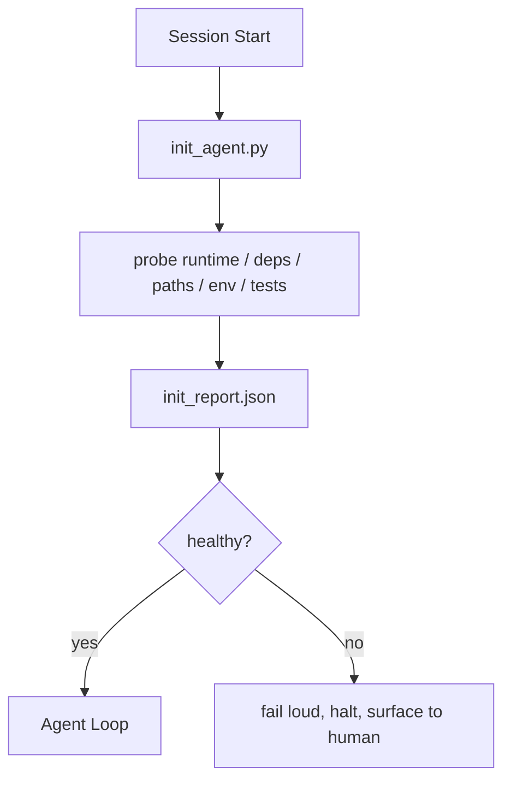

# Agents 的 Initialization Scripts

> 每个冷启动 session 都要付一笔税。Agent 读取同样的文件、重试同样的 probes、重新发现同样的 paths。Init script 把这笔税只付一次，并把答案写进 state。

**类型：** 构建
**语言：** Python (stdlib)
**前置要求：** 阶段 14 · 32（Minimal Workbench），阶段 14 · 34（Repo Memory）
**时间：** ~45 分钟

## 学习目标

- 识别 agent 不应在每个 session 重做的工作。
- 构建 deterministic init script，probe runtime、dependencies、repo health。
- 持久化 probe result，让 agent 读取它，而不是重新运行 checks。
- 当 initialization 失败时，fail loud、fail fast，并提供唯一查看位置。

## 问题

打开一个 session。Agent 猜 Python version。猜 test command。列出 repo root 五次来找 entry point。尝试 import 一个未安装 package。问用户 config file 在哪里。等它真正编辑前，一万 tokens 已经花在本应由一个脚本完成的 setup work 上。

修复方式是一个 initialization script：在 agent 做任何事情前运行，并写出 agent startup 时读取的 `init_report.json`。

## 概念



### Init script probe 什么

| Probe | Why it matters |
|-------|----------------|
| Runtime versions | 错误 Python 或 Node version 会造成 silent wrong-version bugs |
| Dependency availability | 现在捕获 missing package，比后面遇到便宜十倍 |
| Test command | Agent 必须知道如何 verify；如果 command 缺失，workbench 已坏 |
| Repo paths | Hard-coded paths 会 drift；一次 resolve 并 pin |
| Environment variables | 缺少 `OPENAI_API_KEY` 是 failure surface，不是 runtime mystery |
| State + board freshness | Crashed session 留下的 stale state 是 footgun |
| Last-known-good commit | Session 结束 handoff diff 的 anchor |

### Fail loud, fail fast, fail in one place

Probe failure 意味着 halt 并 surface 给 human。没有 “the agent will figure it out”。Init 的意义就是在 workbench 坏掉时拒绝启动。

### Idempotent

连续运行两次。第二次除了 fresh timestamp 外应该是 no-op。Idempotency 让你可以把脚本接入 CI、hooks 或 pre-task slash command。

### Init versus startup rules

Rules（Phase 14 · 33）描述行动前必须满足什么。Init 是让这些 rules 可以被检查的脚本。没有 init 的 rules 会退化成 “be careful”。没有 rules 的 init 会变成精致的 failure。

## 构建它

`code/main.py` 实现 `init_agent.py`：

- 五个 probes：Python version、通过 `importlib.util.find_spec` 检查 listed dependencies、test command resolvability、required env vars、state file freshness。
- 每个 probe 返回 `(name, status, detail)`。
- 脚本写入带完整 probe set 的 `init_report.json`，如果任何 block-severity probe 失败，则以非零退出。

运行它：

```
python3 code/main.py
```

脚本会打印 probe table、写入 `init_report.json`，happy path 退出 0；否则非零退出并列出 failed probes。

## Production patterns in the wild

三种 patterns 能区分有用的 init script 和仪式。

**Last-known-good commit anchoring。** Probe 当前 commit 与上次 successful merge 写入的 `LKG` file。如果 diff 超过 budget（默认 50 files），拒绝启动并要求 human 批准新 baseline。这就是 Cloudflare AI Code Review 用来 scope reviewer agents 的方式：每个 review session 都 anchor 到同一个 last-known-good，并且不会跨 sessions 复合 drift。

**Lock files with TTL。** 第一次 successful probe pass 后写入 `prereqs.lock`。后续 runs 在 N 小时内（默认 24h）信任 lock，并跳过昂贵 probes。Init script 先读 lock；如果它 fresh 且 dependency manifest hash 匹配，就 short-circuit。这和 Docker layer caches 的模式一样：idempotent probe + content hash = skip。

**No network, no LLM, no surprises in the hot path。** Init probes 是 deterministic plumbing。一个调用 LLM 分类 failure，或访问外部服务检查 license 的 probe，不是 probe；它是 workflow。如果一个 probe 在 dry run 中超过三秒，把它当作 workbench smell，要么移出 init，要么缓存结果。

## 使用它

在 production 中：

- **Claude Code hooks。** `pre-task` hook 调用 init script；如果失败，拒绝 launch agent。
- **GitHub Actions。** `setup-agent` job 运行 init script；agent job 依赖它。
- **Docker entrypoint。** Agent container 在 exec agent runtime 前运行 init script；失败时 logs 暴露出来。

Init script 可移植，因为它不调用特定 framework。Bash、Make 或 tasks file 都可以包它。

## 发布它

`outputs/skill-init-script.md` 会访谈项目，把 setup work 分类成 probes，并输出 project-specific `init_agent.py`，以及一个在任意 agent step 前运行它的 CI workflow。

## 练习

1. 添加一个 probe：diff 当前 commit 与 last-known-good commit；如果超过 50 files changed，拒绝启动。
2. 让脚本写入 `prereqs.lock` file，并在 lock 超过七天时拒绝启动。
3. 添加 `--fix` flag，自动安装 missing dev dependencies，但没有 approval 时永不修改 runtime dependencies。
4. 把 probes 从 hardcoded functions 移到 YAML registry。说明取舍。
5. 给每个 probe 添加 timing budget。超过三秒的 probe 是 workbench smell。

## 关键术语

| 术语 | 人们常说 | 实际含义 |
|------|----------------|------------------------|
| Probe | "A check" | 返回 `(name, status, detail)` 的 deterministic function |
| Init report | "Setup output" | 写在 state 旁边、记录 probe results 的 JSON |
| Idempotent | "Safe to re-run" | 连续两次运行，除 timestamp 外产生相同 reports |
| Fail loud | "Don't swallow" | Halt 并 surface 给 human；没有 silent fallback |
| Setup tax | "Bootstrap cost" | Agent 每个 session 用来重新发现显然信息的 tokens |

## 延伸阅读

- [Anthropic, Effective harnesses for long-running agents](https://www.anthropic.com/engineering/effective-harnesses-for-long-running-agents)
- [GitHub Actions, composite actions for setup](https://docs.github.com/en/actions/sharing-automations/creating-actions/creating-a-composite-action)
- [microservices.io, GenAI dev platform: guardrails](https://microservices.io/post/architecture/2026/03/09/genai-development-platform-part-1-development-guardrails.html) — pre-commit + CI checks as init
- [Augment Code, How to Build Your AGENTS.md (2026)](https://www.augmentcode.com/guides/how-to-build-agents-md) — init expectations
- [Codex Blog, Codex CLI Context Compaction](https://codex.danielvaughan.com/2026/03/31/codex-cli-context-compaction-architecture/) — session start as compaction-aware init
- Phase 14 · 33 — 本脚本启用的 rule set
- Phase 14 · 34 — 本脚本 seed 的 state file
- Phase 14 · 38 — init script 喂给的 verification gate
- Phase 14 · 40 — 消费 init report last-known-good 的 handoff
