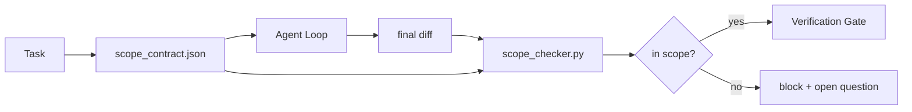

# Scope Contracts 和 Task Boundaries

> Model 不知道 work 在哪里结束。Scope contract 是一个 per-task file，说明工作从哪里开始、在哪里结束、如果溢出如何 rollback。Contract 把 “stay in scope” 从愿望变成 check。

**类型：** 构建
**语言：** Python (stdlib)
**前置要求：** 阶段 14 · 32（Minimal Workbench），阶段 14 · 33（Rules as Constraints）
**时间：** ~50 分钟

## 学习目标

- 写出 agent 在 task start 读取、verifier 在 task end 读取的 scope contract。
- 指定 allowed files、forbidden files、acceptance criteria、rollback plan、approval boundaries。
- 实现 scope checker，把 diff 与 contract 对比并标记 violations。
- 让 scope creep 可见、自动化、可 review。

## 问题

Agents 会 creep。Task 是 “fix the login bug”。Diff 却触碰 login route、email helper、database driver、README、release script。每一次 touch 在当下都有合理理由。合在一起，它们已经是一个和被 review 的东西不同的 change。

Scope creep 是 agent work 中最 under-monitored 的 failure mode，因为 agent 真诚地叙述每一步。修复方式不是更严格的 prompt。修复方式是一个写在磁盘上的 contract，说明承诺了什么，并用 check 比较结果是否符合承诺。

## 概念



### Scope contract 中放什么

| Field | Purpose |
|-------|---------|
| `task_id` | 链接到 board 上的 task |
| `goal` | Reviewer 可验证的一句话 |
| `allowed_files` | Agent 可以写的 globs |
| `forbidden_files` | Agent 即使意外也不得触碰的 globs |
| `acceptance_criteria` | 证明 done 的 test commands 或 assertion lines |
| `rollback_plan` | 如果需要 halt，operator 可执行的一段 runbook |
| `approvals_required` | 需要 explicit human sign-off 的 scope 外 actions |

没有 `forbidden_files` 的 contract 不完整。Negative space 是 contract 的一半。

### Globs, not raw paths

真实 repos 会移动文件。用 globs（`app/**/*.py`、`tests/test_signup*.py`）固定 contracts，这样 sessions 之间的 refactor 不会让 contract 失效。

### Rollback is part of scope

列出如何 rollback 会迫使 contract author 思考哪里可能出错。一个无法 rollback 的 contract，不应该被批准。

### Scope check is a diff check

Agent 写出 diff。Checker 读取 diff、allowed globs、forbidden globs，以及已运行 acceptance commands 列表。每个 violation 都是一个 tagged finding，verification gate 可以拒绝。

## 构建它

`code/main.py` 实现：

- `scope_contract.json` schema（JSON Schema 子集，glob arrays）。
- 一个 diff parser，把 touched files list 和 run commands list 转成 `RunSummary`。
- 一个 `scope_check`，根据 contract 返回 `(violations, in_scope, off_scope)`。
- 两个 demo runs：一个 staying in scope，一个 creeping。Checker 会用 exact file 和 reason 标记 creep。

运行它：

```
python3 code/main.py
```

输出：contract、两次 runs、per-run verdicts，以及保存的 `scope_report.json`。

## Production patterns in the wild

一个实践者运行 “specsmaxxing”（在调用 agent 前先用 YAML 写 scope contracts）报告说，在三周内 rabbit-hole rate 从 52% 降到 21%，没有改 agent。做事的是 contract，不是 model。三种 patterns 能让收益稳住。

**Violation budgets, not binary failures。** `agent-guardrails`（通过 MCP 被 Claude Code、Cursor、Windsurf、Codex 使用的 OSS merge gate）为每个 task 提供 `violationBudget`：budget 内的 minor scope slips 作为 warnings 暴露；只有超过 budget 时 merge gate 才拒绝。搭配 `violationSeverity: "error" | "warning"`。Budget 是一个能 ship 的 gate 和一个被讨厌的团队禁用的 gate 之间的区别。

**Severity asymmetry by path family。** 对 `docs/**` 的 off-scope writes 通常是 `warn`；对 `scripts/**`、`migrations/**`、`config/prod/**` 的 off-scope writes 永远是 `block`。这种 asymmetry 必须放在 contract 中，而不是 runtime 中，因为它 project-specific 且 per task 会变。

**Time and network budgets next to file budgets。** `time_budget_minutes` field 限制 wall clock；超过后 runtime 没有 re-approval 就拒绝继续。`network_egress` hostnames allowlist 防止 agent 悄悄访问 task 范围外的 external API。这些也是 scope dimensions；file globs 必要但不充分。

**Multi-contract merge semantics (least privilege)。** 当两个 scope contracts 同时适用（例如 project-wide contract + task-specific one），merge 规则是：**intersect** `allowed_files`（两个 contracts 都必须允许该 path）、**union** `forbidden_files`（任一禁止即可）、`time_budget_minutes` 取最严格（min）、`approvals_required` 累积。`network_egress` 中 `None` 表示不 enforce，`[]` 表示 deny-all，`[...]` 表示 allowlist；merge 时，`None` defer 给另一边，两个 lists 取交集，deny-all 保持 deny-all。把这些写进 contract schema，使 merge mechanical 且可 review。

## 使用它

Production patterns：

- **Claude Code slash commands。** `/scope` command 写 contract，并把它固定为 session context。Subagents 行动前读取 contract。
- **GitHub PRs。** 把 contract 作为 PR body 中的 JSON file 或 checked-in artifact 推送。CI 针对 merge diff 运行 scope checker。
- **LangGraph interrupts。** Scope violation 触发 interrupt；handler 询问 human 是扩大 contract，还是让 agent back off。

Contract 随 task 移动。Task 关闭时，contract 归档到 `outputs/scope/closed/`。

## 发布它

`outputs/skill-scope-contract.md` 会为 task description 生成 scope contract，以及一个 glob-aware checker，在每个 agent diff 上通过 CI 运行。

## 练习

1. 添加 `network_egress` field，列出允许的 external hosts。拒绝触碰其他 hosts 的 runs。
2. 扩展 checker，对 `docs/**` soft fail，对 `scripts/**` hard fail。说明 asymmetry。
3. 用 static rule set（无 LLM）从 `goal` field 推导 `allowed_files`。第一个 edge case 会出什么问题？
4. 添加 `time_budget_minutes`，wall clock 超过后拒绝继续。
5. 对同一个 diff 运行两个 contracts。当两者都适用时，正确的 merge semantics 是什么？

## 关键术语

| 术语 | 人们常说 | 实际含义 |
|------|----------------|------------------------|
| Scope contract | "The task brief" | Per-task JSON，列出 allowed/forbidden files、acceptance、rollback |
| Scope creep | "It also touched..." | 同一 task 中改变了 contract 之外的 files |
| Rollback plan | "We can revert" | 用于 halt 的一段 operator runbook |
| Approval boundary | "Needs sign-off" | Contract 中列为需要 explicit human approval 的 action |
| Diff check | "Path audit" | 把 touched files 和 contract globs 对比 |

## 延伸阅读

- [LangGraph human-in-the-loop interrupts](https://langchain-ai.github.io/langgraph/concepts/human_in_the_loop/)
- [OpenAI Agents SDK tool approval policies](https://platform.openai.com/docs/guides/agents-sdk)
- [logi-cmd/agent-guardrails — merge gates and scope validation](https://github.com/logi-cmd/agent-guardrails) — violation budgets、severity tiers
- [Dev|Journal, Preventing AI Agent Configuration Drift with Agent Contract Testing](https://earezki.com/ai-news/2026-05-05-i-built-a-tiny-ci-tool-to-keep-ai-agent-configs-from-drifting-in-my-repo/) — 无 external deps 的 `--strict` mode
- [Agentic Coding Is Not a Trap (production logs)](https://dev.to/jtorchia/agentic-coding-is-not-a-trap-i-answered-the-viral-hn-post-with-my-own-production-logs-33d9) — specsmaxxing receipts：52% → 21%
- [OpenCode permission globs](https://opencode.ai/docs/agents/) — fine-grained per-permission scope
- [Knostic, AI Coding Agent Security: Threat Models and Protection Strategies](https://www.knostic.ai/blog/ai-coding-agent-security) — scope as part of least privilege
- [Augment Code, AI Spec Template](https://www.augmentcode.com/guides/ai-spec-template) — three-tier boundary system（must/ask/never）
- Phase 14 · 27 — 与 scope locks 搭配的 prompt injection defenses
- Phase 14 · 33 — 这个 contract 按 task 特化的 rule set
- Phase 14 · 38 — checker report 接入的 verification gate
