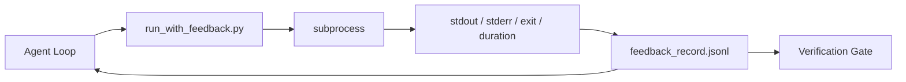

# Runtime Feedback Loops

> 看不到真实 command output 的 agents 会猜。Feedback runner 把 stdout、stderr、exit code 和 timing 捕获成下一 turn 可读的 structured record。然后 agent 响应事实，而不是响应它自己对事实的预测。

**类型：** 构建
**语言：** Python (stdlib)
**前置要求：** 阶段 14 · 32（Minimal Workbench），阶段 14 · 35（Init Script）
**时间：** ~50 分钟

## 学习目标

- 区分 runtime feedback 和 observability telemetry。
- 构建 feedback runner，包裹 shell commands 并持久化 structured records。
- 确定性截断大 outputs，让 loop 保持在 token budget 内。
- 当 feedback 缺失时拒绝推进 loop。

## 问题

Agent 说 “running tests now”。下一条消息说 “all tests pass”。现实是没有 test 跑过。Agent 想象了 output，或者运行了 command 但没读结果，或者读了结果却悄悄截掉了 failure line。

Feedback runner 消除这个 gap。每个 command 都经过 runner。每条 record 带 command、captured stdout/stderr、exit code、wall-clock duration，以及一行 agent note。Agent 在下一 turn 读取 record。Verification gate 在 task 结束时读取 records。

## 概念



### Feedback record 中放什么

| Field | Why it matters |
|-------|----------------|
| `command` | Exact argv，没有 shell expansion surprises |
| `stdout_tail` | 最后 N 行，deterministic truncation |
| `stderr_tail` | 最后 N 行，与 stdout 分开 |
| `exit_code` | 无歧义 success signal |
| `duration_ms` | 暴露 slow probes 和 runaway processes |
| `started_at` | 用于 replay 的 timestamp |
| `agent_note` | Agent 写的一行预期说明 |

### Truncation is deterministic

50 MB log 会摧毁 loop。Runner 用 `...truncated N lines...` marker 截断 head 和 tail，并且确定性处理，使相同 output 总是产生相同 record。不要 sampling；agent 需要看的部分（final error、final summary）通常在 tail。

### Feedback versus telemetry

Telemetry（Phase 14 · 23，OTel GenAI conventions）给 human operators 跨时间 review runs。Feedback 给这次 run 的下一 turn。它们共享字段，但存放在不同文件中，retention 也不同。

### Refuse to advance without feedback

如果 runner 在捕获 exit 前报错，record 携带 `exit_code: null` 和 `error: <reason>`。Agent loop 必须拒绝在 `null` exit 上声称成功。No exit, no progress。

## 构建它

`code/main.py` 实现：

- `run_with_feedback(command, agent_note)`，包裹 `subprocess.run`，捕获 stdout/stderr/exit/duration，确定性截断，追加到 `feedback_record.jsonl`。
- 一个小 loader，把 JSONL stream 到 Python list。
- 一个 demo，运行三个 commands（success、failure、slow），并打印每个 command 的最后一条 record。

运行它：

```
python3 code/main.py
```

输出：三条 feedback records 追加到 `feedback_record.jsonl`，每种 command 的最后一条 inline 打印。跨 reruns tail 这个文件，观察 loop 如何累积。

## Production patterns in the wild

三种 patterns 能把 runner 加固到可发布。

**Redact at write, not at read。** 任何触碰 stdout 或 stderr 的 record 都可能泄露 secrets。Runner 在 JSONL append 前运行 redaction pass：剔除匹配 `^Bearer `、`password=`、`api[_-]?key=`、`AKIA[0-9A-Z]{16}`（AWS）、`xox[baprs]-`（Slack）的行。在 read 时 redaction 是 foot-gun；磁盘上的文件才是 attacker 会拿到的东西。每季度根据 production runtime 观察到的 secret formats 审计 redaction patterns。

**Rotation policy, not a single file。** 把 `feedback_record.jsonl` 限制在每文件 1 MB；溢出后 rotate 到 `.1`、`.2`，丢弃 `.5`。Agent loop 只读取当前文件，所以 runtime cost 有界。CI artifact storage 保存完整 rotated set。没有 rotation，这个文件会成为每次 loader call 的瓶颈。

**Parent-command id for retry chains。** 每条 record 都有 `command_id`；retries 携带 `parent_command_id` 指向上一次尝试。Reviewer 的 “failed attempts” list（Phase 14 · 40）和 verification gate 的 audit 都沿着这条链。没有这个 link，retries 看起来像独立 successes，audit 会隐藏 failure history。

## 使用它

Production patterns：

- **Claude Code Bash tool。** 这个 tool 已经捕获 stdout、stderr、exit、duration。本课 runner 是任何 agent product 的 framework-agnostic 等价物。
- **LangGraph nodes。** 用 runner 包裹任何 shell node，让 record 持久化在 graph state 之外。
- **CI logs。** 把 JSONL pipe 到 CI artifact store；reviewers 可以不用重新运行 session 就 replay 任意 command。

Runner 是很薄的一层 wrapper，因为它拥有 record shape，所以能跨所有 framework migration 存活。

## 发布它

`outputs/skill-feedback-runner.md` 会生成 project-specific `run_with_feedback.py`，带正确 truncation budget、接入 workbench 的 JSONL writer，以及 agent 每 turn 读取的 loader。

## 练习

1. 给每条 record 添加 `cwd` field，让同一 command 在不同目录运行时可区分。
2. 添加 `redaction` step，剥离匹配 `^Bearer ` 或 `password=` 的行。用 fixture record 测试。
3. 把 `feedback_record.jsonl` 总大小限制在 1 MB，并 rotate 到 `.1`、`.2` files。为 rotation policy 辩护。
4. 添加 `parent_command_id`，让 retry chains 可见：哪个 command 产生了下一个 command 消费的 input。
5. 把 JSONL pipe 到一个 tiny TUI，高亮最新 non-zero exit。一个对 review 有用的 TUI 必须展示哪八个 key features？

## 关键术语

| 术语 | 人们常说 | 实际含义 |
|------|----------------|------------------------|
| Feedback record | "Run log" | 带 command、output、exit、duration 的 structured JSONL entry |
| Tail truncation | "Trim the log" | 确定性 head+tail capture，让 records fits token budget |
| Refuse-on-null | "Block on missing data" | 当 `exit_code` 为 null 时，loop 不得推进 |
| Agent note | "Expectation tag" | Agent 在读取结果前写的一行 prediction |
| Telemetry split | "Two log files" | Feedback 给下一 turn，telemetry 给 operator |

## 延伸阅读

- [OpenTelemetry GenAI semantic conventions](https://opentelemetry.io/docs/specs/semconv/gen-ai/)
- [Anthropic, Effective harnesses for long-running agents](https://www.anthropic.com/engineering/effective-harnesses-for-long-running-agents)
- [Guardrails AI x MLflow — deterministic safety, PII, quality validators](https://guardrailsai.com/blog/guardrails-mlflow) — redaction patterns as regression tests
- [Aport.io, Best AI Agent Guardrails 2026: Pre-Action Authorization Compared](https://aport.io/blog/best-ai-agent-guardrails-2026-pre-action-authorization-compared/) — pre/post-tool capture
- [Andrii Furmanets, AI Agents in 2026: Practical Architecture for Tools, Memory, Evals, Guardrails](https://andriifurmanets.com/blogs/ai-agents-2026-practical-architecture-tools-memory-evals-guardrails) — observability surfaces
- Phase 14 · 23 — telemetry 侧的 OTel GenAI conventions
- Phase 14 · 24 — agent observability platforms（Langfuse、Phoenix、Opik）
- Phase 14 · 33 — 要求在 declare done 前必须有 feedback 的 rule
- Phase 14 · 38 — 读取 JSONL 的 verification gate
