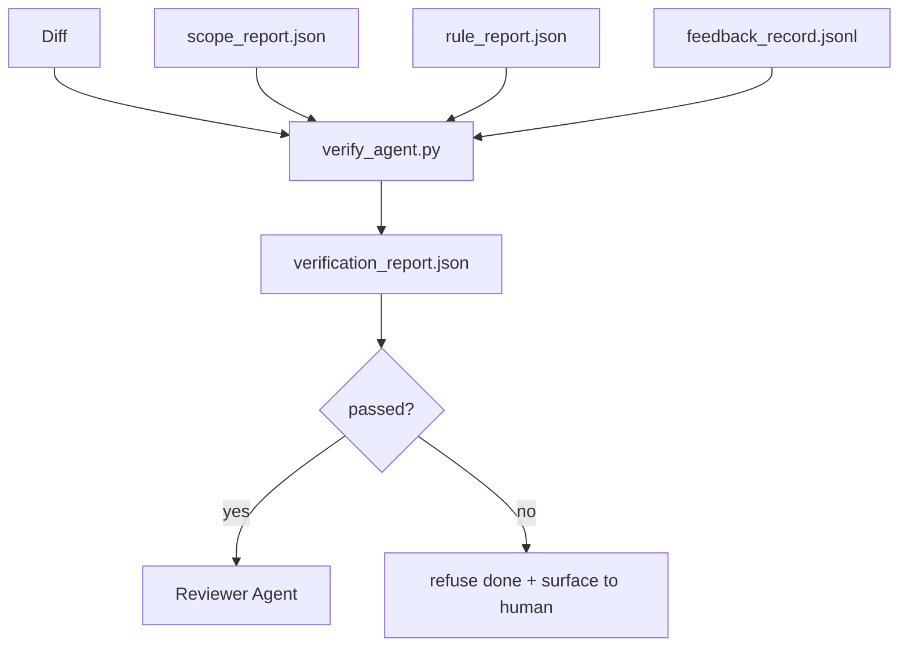

# Verification Gates

> Agent 不能给自己的工作标 done。Verification gate 读取 scope contract、feedback log、rule report 和 diff，然后回答一个问题：这个 task 真的完成了吗？如果 gate 说 no，task 就不是 done，不管 chat 怎么说。

**类型：** 构建
**语言：** Python (stdlib)
**前置要求：** 阶段 14 · 33（Rules），阶段 14 · 36（Scope），阶段 14 · 37（Feedback）
**时间：** ~55 分钟

## 学习目标

- 把 verification gate 定义为 workbench artifacts 上的 deterministic function。
- 把 rule report、scope report、feedback records 和 diff 合并成一个 verdict。
- 发出 `verification_report.json`，让 reviewer agent 和 CI 都能读取。
- 在任何 block-severity failure 上无例外拒绝推进 task。

## 问题

Agents 太容易宣布成功。三种 failure shapes 最常见：

- “Looks good。” Model 读自己的 diff 并认定正确。
- “Tests passed。” 说得很自信。没有测试实际运行的记录。
- “Acceptance met。” Acceptance criteria 被解释得足够宽，以至于 “anything resembling done” 都算。

Workbench 的修复方式是一个 verification gate：读取 agent 已经产生的 artifacts 并做判断。Gate 是 deterministic。Gate 在 version control 中。Gate 接入 CI。Agent 不能贿赂它。

## 概念



### Gate 检查什么

| Check | Source artifact | Severity |
|-------|-----------------|----------|
| All acceptance commands ran | `feedback_record.jsonl` | block |
| All acceptance commands exited zero | `feedback_record.jsonl` | block |
| Scope check has no forbidden writes | `scope_report.json` | block |
| Scope check has no off-scope writes | `scope_report.json` | block or warn |
| All block-severity rules pass | `rule_report.json` | block |
| No `null` exit codes in feedback | `feedback_record.jsonl` | block |
| Touched files match `scope.allowed_files` | both | warn |

`warn` finding 会注释 verdict；`block` finding 会阻止 `passed: true`。

### Deterministic, not probabilistic

Gate 对同一 artifact set 必须每次产生相同 verdict。没有 LLM judges。LLM judges 属于 reviewer side（Phase 14 · 39），那里目标是 qualitative evaluation，不是 status。

### One report, one path

Gate 每次 task close-out 发出一个 `verification_report.json`，写到 `outputs/verification/<task_id>.json`。CI 消费同一路径。多个 gates、多个 paths 会分叉 source of truth。

### Refuse without exception

Block-severity findings 不能由 agent override。只能由 human override，并记录 `override_reason` 和 `overridden_by` user id。Override 是 signed change，不是 agent decision。

## 构建它

`code/main.py` 实现：

- 每个 input artifact 的 loader，全部本地 stub，保证 lesson self-contained。
- 一个 `verify(task_id, artifacts) -> VerdictReport` pure function。
- 一个 printer，展示 per-check results 和 final pass/fail。
- 三个 task scenarios 的 demo：clean pass、scope creep、missing acceptance。

运行它：

```
python3 code/main.py
```

输出：三个 verdict reports，每个都保存到脚本旁边。

## Production patterns in the wild

四种 patterns 能把 gate 从 “另一个 lint job” 提升为 “deciding edge”。

**Defense-in-depth, not single gate。** Pre-commit hook → CI status check → pre-tool authz hook → pre-merge gate。每层都是 deterministic，所以某层失败会被下一层捕获。microservices.io 的 2026 年 3 月 playbook 说得很明确：pre-commit hook 是 non-bypassable，因为和 model-side skill 不同，它不依赖 agent 遵守 instructions。Verification gate 位于 CI / pre-merge layer。

**Defense by deterministic check, model-judge only for nuance。** Anthropic 的 2026 Hybrid Norm pairing：verifiable rewards（unit tests、schema checks、exit codes）回答 “code 是否解决问题？” — LLM rubrics 回答 “code 是否 readable、secure、on-style？” Gate 运行第一类；reviewer（Phase 14 · 39）运行第二类。混用会让 signal 坍塌。

**Signed override log, not Slack threads。** 每次 override 都在 `outputs/verification/overrides.jsonl` 中发出一行，包含：timestamp、finding code、reason、signing user、current HEAD commit。Runtime 拒绝任何缺少 signature 的 override；audit trail 由 git track。这是 override policy 和 override theater 的分界线。

**Coverage floor as a first-class check。** `coverage_report.json` 喂给 `coverage_floor`（默认 80%）check。如果 measured coverage 低于 floor，或比上次 merge floor 低超过 1 percentage point，gate fail。没有这个 check，agents 会悄悄删除失败 tests，而 verification reports 仍然是 green。

**`--strict` mode promotes warns to blocks。** 对 release branches、ship-blocking PRs 或 post-incident triage，`--strict` 会把每个 warning 变成 hard fail。Flag 按 branch opt-in；不作为全局默认，因为 strict-on-everything 会腐蚀日常 flow。

## 使用它

Production patterns：

- **CI step。** `verify_agent` job 针对 agent final artifacts 运行 gate。没有 `passed: true`，merge protection 拒绝。
- **Pre-handoff hook。** Agent runtime 在生成 handoff doc 前调用 gate。没有 green verdict，就没有 handoff。
- **Manual triage。** 当 agent 声称成功而 human 怀疑时，operator 阅读 report。

Gate 是 workbench flow 中的 deciding edge。其他所有 surface 都在它上游。

## 发布它

`outputs/skill-verification-gate.md` 会把 gate 接入特定 project：哪些 acceptance commands 喂给它、哪些 rules 是 block-severity、哪些 off-scope writes 可以容忍、override audit log 如何存储。

## 练习

1. 添加 `coverage_floor` check：test command 必须产生至少 80% 的 coverage report。决定哪个 artifact 携带 floor。
2. 支持 `--strict` mode，把所有 `warn` 提升为 `block`。记录 strict mode 适合作为默认的场景。
3. 让 gate 除 JSON 外再产出 Markdown summary。说明 summary 中该放哪些字段。
4. 添加 `time_since_last_human_touch` check：human keystroke 后 60 秒内编辑的文件免于 off-scope flags。
5. 在你产品的一次真实 agent diff 上运行 gate。多少 findings 是真实的，多少是 noise？Gate 还需要在哪里增长？

## 关键术语

| 术语 | 人们常说 | 实际含义 |
|------|----------------|------------------------|
| Verification gate | "The check that stops things" | Workbench artifacts 上的 deterministic function，产出 pass/fail verdict |
| Block severity | "Hard fail" | 阻止 `passed: true`，需要 signed override 的 finding |
| Override log | "Why we let it through" | 带 reason 和 user id 的 signed entries，由 review 审计 |
| Acceptance command | "The proof" | 零退出就定义 `done` 的 shell command |
| One report path | "Source of truth" | `outputs/verification/<task_id>.json`，CI 和 humans 都消费 |

## 延伸阅读

- [Anthropic, Harness design for long-running application development](https://www.anthropic.com/engineering/harness-design-long-running-apps)
- [OpenAI Agents SDK guardrails](https://platform.openai.com/docs/guides/agents-sdk/guardrails)
- [microservices.io, GenAI dev platform: guardrails](https://microservices.io/post/architecture/2026/03/09/genai-development-platform-part-1-development-guardrails.html) — pre-commit 和 CI 之间的 defense in depth
- [ICMD, The 2026 Playbook for Agentic AI Ops](https://icmd.app/article/the-2026-playbook-for-agentic-ai-ops-guardrails-costs-and-reliability-at-scale-1776661990431) — approval-gate ladder（draft → approval → auto under thresholds）
- [Type-Checked Compliance: Deterministic Guardrails (arXiv 2604.01483)](https://arxiv.org/pdf/2604.01483) — Lean 4 作为 deterministic gating 的上限
- [logi-cmd/agent-guardrails — merge gate spec](https://github.com/logi-cmd/agent-guardrails) — scope + mutation-testing gates
- [Guardrails AI x MLflow](https://guardrailsai.com/blog/guardrails-mlflow) — deterministic validators as CI scorers
- [Akira, Real-Time Guardrails for Agentic Systems](https://www.akira.ai/blog/real-time-guardrails-agentic-systems) — pre/post-tool gates
- Phase 14 · 27 — prompt injection defenses（gate 的 adversarial pair）
- Phase 14 · 36 — gate enforce 的 scope contract
- Phase 14 · 37 — gate score 的 feedback log
- Phase 14 · 39 — gate handoff 给的 reviewer agent
