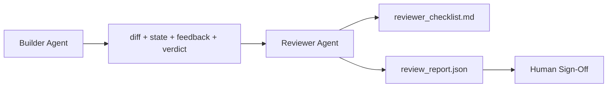

# Reviewer Agent：把 Builder 和 Marker 分开

> 写代码的 agent 不能给代码打分。Reviewer 是第二个 loop，拥有不同 system prompt、不同 goal，并且对 builder 产出的所有东西只有 read-only access。Builder 和 reviewer 之间的 gap，是大部分 reliability 存在的地方。

**类型：** 构建
**语言：** Python (stdlib)
**前置要求：** 阶段 14 · 38（Verification Gate）
**时间：** ~55 分钟

## 学习目标

- 说明为什么同一个 agent 不能可靠地 review 自己的工作。
- 构建 reviewer agent loop，消费 builder artifacts 并发出 structured review report。
- 编写 reviewer rubric，按具体 dimensions 打分，而不是按 vibes。
- 把 reviewer 接入 workbench，让 human review step 从真实 artifact 开始。

## 问题

你让 agent 修 bug。它编辑四个文件，运行 tests，并报告 done。Verification gate（Phase 14 · 38）确认 acceptance 跑过且 scope 没破。Gate 说 `passed: true`。你 merge。两天后你发现 fix 修的是 bug 的另一半。

Acceptance 必要，但不充分。Reviewer 会问 acceptance 无法问的问题：这是否解决了正确的问题？是否在未标记的情况下扩大了 scope？是否记录了本应被质疑的 assumptions？是否让 workbench 处于下一个 session 能接手的状态？

## 概念



### Reviewer rubric

五个 dimensions，每个 0 到 2 分。

| Dimension | Question |
|-----------|----------|
| Problem fit | Change 是否解决 task stated，而不是附近另一个 task？ |
| Scope discipline | Edits 是否被限制在 contract 内，或 contract 是否被 deliberate 扩大？ |
| Assumptions | 所有 hidden assumptions 是否写在可 review 的地方？ |
| Verification quality | Acceptance command 是否真的证明 goal，还是证明了更弱版本？ |
| Handoff readiness | 下一个 session 是否能从当前 state 干净接手？ |

总分 10。低于 7 是 soft fail；低于 5 是 hard fail。

### Reviewer is a separate role, not a separate model

Reviewer 可以和 builder 使用同一个 model。Discipline 在于 role separation：不同 system prompt、不同 inputs、对 diff 没有 write access。Posture 的变化就是 signal 的变化。

### Reviewer cannot edit the diff

Reviewer 读取 diff、state、feedback、verdict。它写 report。它不 patch diff。如果 report 说 “fix this”，下一轮 builder turn 做修复；reviewer 回到 review。混合 roles 会破坏 gap。

### Reviewer rubric versus verification gate

Gate（Phase 14 · 38）检查 deterministic facts：acceptance 是否运行、rules 是否通过、scope 是否保持。Reviewer 做 qualitative judgments：这是否是正确 work、是否记录好、handoff 是否可用。两者都需要。

## 构建它

`code/main.py` 实现：

- 一个 `ReviewerInputs` dataclass，bundle reviewer 读取的 artifacts。
- 一个 rubric scorer，每个 dimension 一个 function。每个 function 都 deterministic，并在本课中 stub-grade；真实实现会调用 LLM。
- 一个 `review_report.json` writer，包含五个 scores、total、verdict（`pass`、`soft_fail`、`hard_fail`）。
- 两个 demo cases：clean change 和 “right tests, wrong problem” change。

运行它：

```
python3 code/main.py
```

输出：两个 review reports 写入磁盘，并在 console 中打印 dimensional scores table。

## Production patterns in the wild

Receipts：Cloudflare 2026 年 4 月 AI Code Review system 在 30 天内跨 5,169 repos、48,095 merge requests 跑了 131,246 次 review。Median review 3 分 39 秒完成。最多七个 specialist reviewers（security、performance、code quality、docs、release management、compliance、Engineering Codex）在 Review Coordinator 下并行运行，Coordinator 去重 findings 并判断 severity。Top-tier model 只给 coordinator 使用；specialists 使用更便宜 tiers。

四种 patterns 让它能 scale。

**Specialist pool, not one big reviewer。** 一个带 5-dimension rubric 的 reviewer 适合 solo repos。一旦 codebase 有 security-critical、performance-critical、docs surfaces，就拆成 prompts 更小的 specialists。Coordinator 做 deduplication；specialists 不运行完整 rubric。Model-tier separation 自然出现：cheap specialists，expensive coordinator。

**Bias mitigation as design requirement, not optimization。** LLM judges 有四种可靠 biases（Adnan Masood, April 2026）：position bias（GPT-4 在 (A,B) vs (B,A) ordering 上约 40% inconsistent）、verbosity bias（长 outputs 约 +15% score inflation）、self-preference（judges 偏好同 model family outputs）、authority（judges 过度给 known authors references 加分）。Mitigations：两个 order 都评估，只统计 consistent wins；使用明确奖励 conciseness 的 1-4 scales；跨 model families 轮换 judges；评分前剥离 author names。

**Calibration set, not vibes。** 一个 10-20 task historical set，带 known correct verdicts。每次 prompt change 都跑 reviewer。如果与历史记录 agreement 低于 80%，rubric 需要 revision 后才能 ship reviewer。每个团队最终都会重新发现这个规律；最好一开始就做。

**Hybrid norm with the gate。** Verification gate（Phase 14 · 38）处理 deterministic checks（acceptance 是否运行、tests 是否通过、scope 是否保持）。Reviewer 处理 semantic checks（这是否是正确 work、assumptions 是否记录、handoff 是否可用）。Anthropic 2026 guidance 明确强调这个 split：不要让 reviewer 重做 gate 已经证明的东西。

## 使用它

Production patterns：

- **Claude Code subagents。** Builder 关闭 task 后，reviewer subagent 运行。它在 PR 上发布带 rubric scores 的 comment。
- **OpenAI Agents SDK handoffs。** Builder 在 task completion 时 hand off 给 Reviewer。Reviewer 可以带 findings hand back，或交给 human。
- **Two-model pairing。** Builder 用更快更便宜 model。Reviewer 用更强 model 和更小 context，专注 judgment。

Reviewer 是 workbench 在 humans 无法做每次 review 时生长出的第二双眼睛。

## 发布它

`outputs/skill-reviewer-agent.md` 会生成 project-specific reviewer rubric、接入 builder artifacts 的 reviewer agent stub，以及与 verification gate 的 integration，让 human review 从 written report 开始，而不是空白页面。

## 练习

1. 添加一个针对你产品领域的第六 dimension。说明它为什么不能被现有五个吸收。
2. 用两个不同 system prompts（terse、verbose）运行 reviewer。哪一个产生的 report 更可能被 human 阅读？
3. 给每个 dimension 添加 `confidence` field。当最低 dimension 的 confidence 低于 0.6 时拒绝发布 report。
4. 构建 calibration set：10 个 historical task close-outs，带 known correct verdicts。用 reviewer 跑它们。它在哪里与 historical record 不一致？
5. 添加 “request more evidence” affordance：reviewer 可以在 scoring 前向 builder 请求特定 test run。怎样的 back-off 才能避免 loop？

## 关键术语

| 术语 | 人们常说 | 实际含义 |
|------|----------------|------------------------|
| Reviewer rubric | "Checklist" | 五维 0-2 scoring，每个 dimension 有书面 question |
| Soft fail | "Needs revisions" | Total 低于 7；builder 获取 findings 去处理 |
| Hard fail | "Reject" | Total 低于 5 或任一 dimension 为 0；halt 并 surface 给 human |
| Role separation | "Different prompt" | 同一 model 可扮演两种 roles；discipline 在 inputs 和 posture |
| Confidence floor | "Don't ship low-signal reports" | Rubric 不确定时拒绝发出 verdict |

## 延伸阅读

- [OpenAI Agents SDK handoffs](https://platform.openai.com/docs/guides/agents-sdk/handoffs)
- [Anthropic Claude Code subagents](https://docs.anthropic.com/en/docs/agents-and-tools/claude-code/sub-agents)
- [Cloudflare, Orchestrating AI Code Review at Scale](https://blog.cloudflare.com/ai-code-review/) — 7-specialist + coordinator architecture，30 天 131k runs
- [Agent-as-a-Judge: Evaluating Agents with Agents (OpenReview / ICLR)](https://openreview.net/forum?id=DeVm3YUnpj) — DevAI benchmark，366 hierarchical solution requirements
- [Adnan Masood, Rubric-Based Evaluations and LLM-as-a-Judge: Methodologies, Biases, Empirical Validation](https://medium.com/@adnanmasood/rubric-based-evals-llm-as-a-judge-methodologies-and-empirical-validation-in-domain-context-71936b989e80) — 4 biases 和 mitigations
- [MLflow, LLM-as-a-Judge Evaluation](https://mlflow.org/llm-as-a-judge) — separated builder/evaluator 的 production tooling
- [LangChain, How to Calibrate LLM-as-a-Judge with Human Corrections](https://www.langchain.com/articles/llm-as-a-judge) — calibration-set workflow
- [Evidently AI, LLM-as-a-judge: a complete guide](https://www.evidentlyai.com/llm-guide/llm-as-a-judge)
- [Arize, LLM as a Judge — Primer and Pre-Built Evaluators](https://arize.com/llm-as-a-judge/)
- Phase 14 · 05 — Self-Refine and CRITIC（single-agent self-review baseline）
- Phase 14 · 30 — Eval-driven agent development（calibration set generator）
- Phase 14 · 38 — reviewer 读取的 verification gate
- Phase 14 · 40 — reviewer report 喂给的 handoff packet
