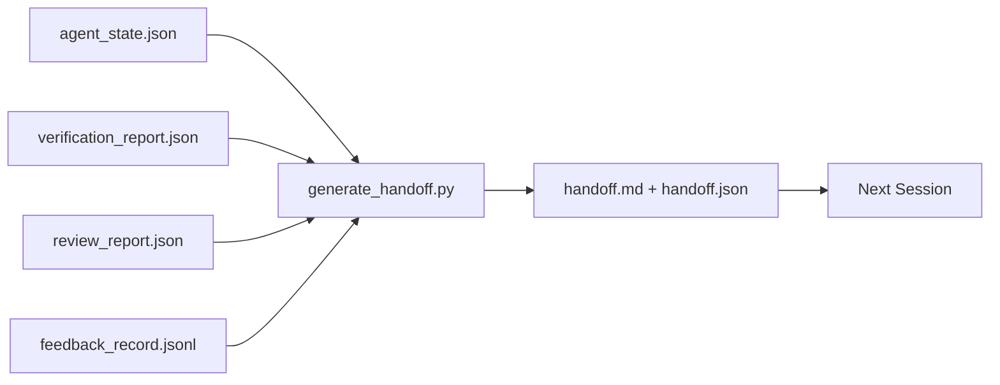

# Multi-Session Handoff

> Session 终会结束。Work 不会。Handoff packet 是把 “agent 工作了一小时” 变成 “下个 session 第一分钟就有产出” 的 artifact。有意构建它，不要当成事后补充。

**类型：** 构建
**语言：** Python (stdlib)
**前置要求：** 阶段 14 · 34（Repo Memory），阶段 14 · 38（Verification），阶段 14 · 39（Reviewer）
**时间：** ~50 分钟

## 学习目标

- 识别每个 handoff packet 需要的七个 fields。
- 从 workbench artifacts 生成 handoff，而不是手写 prose。
- 把大型 feedback logs trim 成 handoff-sized summary。
- 让下一个 session 的 first action deterministic。

## 问题

Session 结束。Agent 说 “great, we made progress”。下一个 session 打开。下一个 agent 问 “where did we leave off?” 第一个 agent 的答案没了。下一个 agent 重新发现、重新运行同样 commands、重新问 human 同样 questions，烧掉三十分钟来恢复上一 session 最后三十秒。

坏 handoff 的成本会在 task 生命周期的每个 session 支付。修复方式是在 session end 自动生成 packet：改变了什么、为什么、尝试了什么、什么失败了、还剩什么、下次第一步做什么。

## 概念



### 每个 handoff 携带七个 fields

| Field | Question it answers |
|-------|---------------------|
| `summary` | 一段话说明做了什么 |
| `changed_files` | Diff 一眼看懂 |
| `commands_run` | 实际执行了什么 |
| `failed_attempts` | 尝试了什么，为什么没工作 |
| `open_risks` | 下个 session 可能踩的坑，带 severity |
| `next_action` | 下个 session 要执行的第一个具体步骤 |
| `verdict_pointer` | 指向 verification + review reports 的路径 |

`next_action` field 是承重的那个。缺少 `next_action` 的 handoff，即使其他都有，也只是 status report，不是 handoff。

### Handoffs are generated, not written

手写 handoff 会在艰难日子被跳过。Generator 读取 workbench artifacts 并发出 packet。Agent 的工作是把 workbench 留在 generator 能 summarize 的状态，而不是自己写 summary。

### Two forms：human-readable and machine-readable

`handoff.md` 给 human 阅读。`handoff.json` 给下一个 agent 加载。两者来自同一 source artifacts。如果它们分歧，JSON 胜出。

### Feedback log trimming

完整 `feedback_record.jsonl` 可能有数百 entries。Handoff 只携带最后 K 条，以及每条 non-zero exit。下个 session 需要时可以加载 full log，但 packet 保持小。

## 构建它

`code/main.py` 实现：

- 一个 loader，把 state、verdict、review 和 feedback 聚合到单个 `WorkbenchSnapshot`。
- 一个 `generate_handoff(snapshot) -> (markdown, payload)` function。
- 一个 filter，选择最后 K 条 feedback entries 加所有 non-zero exits。
- 一个 demo run，在脚本旁边写 `handoff.md` 和 `handoff.json`。

运行它：

```
python3 code/main.py
```

输出：打印 handoff body，并在磁盘写入两个文件。

## Production patterns in the wild

Codex CLI、Claude Code、OpenCode 各自都有不同 compaction story；structured handoff packet 位于三者之上。

**Compaction strategies vary; the packet schema does not。** Codex CLI 的 POST /v1/responses/compact 是 server-side opaque AES blob（OpenAI models 的 fast path）；fallback 是追加为 `_summary` user-role message 的本地 “handoff summary”。Claude Code 在 95% context 时运行 five-stage progressive compaction。OpenCode 做 timestamp-based message hiding 加 5-heading LLM summary。三种机制不同，同一个需求：把压缩后必须幸存的内容 serialize 成 portable artifact。Packet 就是这个 artifact。

**Fresh-session handoff is not compaction。** Compaction 延长 session；handoff 干净关闭一个 session 并启动下一个。Hermes Issue #20372 的 framing（2026 年 4 月）是对的：当 in-place compression 开始降质时，agent 应该写 compact handoff、结束 session、用 fresh context resume。Packet 让这个 transition 便宜。错误做法是一直压缩到 quality collapse；修复方式是为早而干净的 handoff 预留 budget。

**One active handoff per branch and topic。** Multi-agent coordination 更多因 stale handoffs 而坏，而不是 bad model output。始终包含 `branch`、`last_known_good_commit`，以及 `active | superseded | archived` 的 `status`。Stale handoffs 归档；只有 active handoff 驱动下一个 session。这是 handoff-as-notes 和 handoff-as-state 的区别。

**Wrap up before 50-75% context, not at the wall。** 手写 pattern playbook（CLAUDE.md + HANDOVER.md）报告说，在 50-75% context budget 结束 session 比在 95% 结束效果更好。Packet generator 在 compression artifacts 污染 source state 前干净运行。Context 完整时写很便宜；model 已经 losing its place 时写很贵。

## 使用它

Production patterns：

- **Session-end hook。** Runtime 在 user 关闭 chat 时触发 generator。Packet 进入 `outputs/handoff/<session_id>/`。
- **PR template。** Generator 生成的 markdown 也是 PR body。Reviewers 不用打开五个其他文件就能读它。
- **Cross-agent handoff。** 用一个产品构建（Claude Code），用另一个继续（Codex）。Packet 是 lingua franca。

Packet 小、规则、便宜。每个 session 都会复利节省成本。

## 发布它

`outputs/skill-handoff-generator.md` 会生成适合项目 artifact paths 的 generator、运行它的 end-of-session hook，以及下个 agent startup 时读取的 `handoff.json` schema。

## 练习

1. 添加 `assumptions_to_validate` field，暴露 builder 记录但 reviewer 没有打到 1 分以上的每个 assumption。
2. 对 failing runs 和 passing runs 采用不同 feedback summary trimming。说明 asymmetry。
3. 包含一个 “questions for the human” list。什么 threshold 决定一个 question 进入 packet，而不是进入 chat message？
4. 让 generator idempotent：运行两次产生相同 packet。要做到这一点，哪些东西必须稳定？
5. 添加 “next session prereqs” section，列出下个 session 在行动前必须加载的 artifacts。

## 关键术语

| 术语 | 人们常说 | 实际含义 |
|------|----------------|------------------------|
| Handoff packet | "Session summary" | 携带七个 fields 的 generated artifact，同时有 markdown 和 JSON |
| Next action | "What to do first" | 启动下一个 session 的那个具体步骤 |
| Feedback trim | "Log summary" | 最后 K 条 records 加每条 non-zero exit |
| Status report | "What we did" | 缺少 `next_action` 的 document；有用，但不是 handoff |
| Verdict pointer | "Receipt" | 指向 verification + review reports 的 path，用于 traceability |

## 延伸阅读

- [Anthropic, Effective harnesses for long-running agents](https://www.anthropic.com/engineering/effective-harnesses-for-long-running-agents)
- [OpenAI Agents SDK handoffs](https://platform.openai.com/docs/guides/agents-sdk/handoffs)
- [Codex Blog, Codex CLI Context Compaction: Architecture, Configuration, Managing Long Sessions](https://codex.danielvaughan.com/2026/03/31/codex-cli-context-compaction-architecture/) — POST /v1/responses/compact 和 local fallback
- [Justin3go, Shedding Heavy Memories: Context Compaction in Codex, Claude Code, OpenCode](https://justin3go.com/en/posts/2026/04/09-context-compaction-in-codex-claude-code-and-opencode) — three-vendor compaction comparison
- [JD Hodges, Claude Handoff Prompt: How to Keep Context Across Sessions (2026)](https://www.jdhodges.com/blog/ai-session-handoffs-keep-context-across-conversations/) — CLAUDE.md + HANDOVER.md，50-75% context budget
- [Mervin Praison, Managing Handoffs in Multi-Agent Coding Sessions: Fresh Context Without Losing Continuity](https://mer.vin/2026/04/managing-handoffs-in-multi-agent-coding-sessions-fresh-context-without-losing-continuity/) — distributed-systems framing
- [Hermes Issue #20372 — automatic fresh-session handoff when compression becomes risky](https://github.com/NousResearch/hermes-agent/issues/20372)
- [Hermes Issue #499 — Context Compaction Quality Overhaul](https://github.com/NousResearch/hermes-agent/issues/499) — handoff-oriented prompts in Codex CLI
- [Microsoft Agent Framework, Compaction](https://learn.microsoft.com/en-us/agent-framework/agents/conversations/compaction)
- [OpenCode, Context Management and Compaction](https://deepwiki.com/sst/opencode/2.4-context-management-and-compaction)
- [LangChain, Context Engineering for Agents](https://www.langchain.com/blog/context-engineering-for-agents)
- Phase 14 · 34 — generator 读取的 state file
- Phase 14 · 38 — packet 指向的 verification verdict
- Phase 14 · 39 — packet 中 bundle 的 reviewer report
