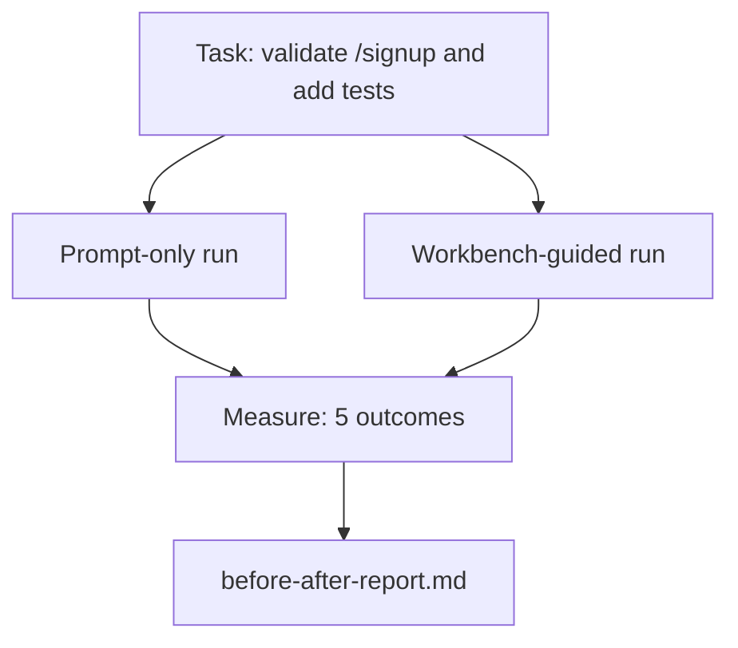

# 真实 Repo 上的 Workbench

> 十一课 surfaces 如果无法接触真实 codebase，就一文不值。本课在一个小型 sample app 上把同一 task 跑两次：prompt-only versus workbench-guided。数字自己会说话。

**类型：** 构建
**语言：** Python (stdlib)
**前置要求：** 阶段 14 · 32 到 14 · 40
**时间：** ~60 分钟

## 学习目标

- 在一个小应用上把七个 workbench surfaces 汇总起来。
- 同一 task 跑两次（prompt-only 和 workbench-guided），并测量五个 outcomes。
- 阅读 before/after report，判断哪些 surfaces 产生了最大 leverage。
- 面对 “but my model is good enough” 的 pushback，为 workbench 辩护。

## 问题

Toy task 上的 demo 说服不了任何人。Workbench 的 case，需要在 real-feeling repo 上做 real-feeling task，并以更少 failures、更少 reverts、以及下个 session 可用的 packet 进入 production。

本课提供那个 real-feeling repo，并让同一 task 走两条 pipelines。结果是一份 before/after report，可以交给 skeptic。

## 概念



### Sample app

`sample_app/` 中的 minimal FastAPI-style handler：

- `app.py`，包含 `/signup`（还没有 validation）。
- `test_app.py`，包含一个 happy-path test。
- `README.md` 和 `scripts/release.sh` 作为 forbidden-zone bait。

### Task

> Add input validation to `/signup`: reject passwords shorter than 8 characters, return 422 with a typed error envelope. Add a test that proves the new behavior.

### 两条 pipelines

Prompt-only：

1. 读取 README。
2. 读取 `app.py`。
3. 编辑文件。
4. 声称 done。

Workbench-guided：

1. 运行 init script（第 35 课）。
2. 读取 scope contract（第 36 课）。
3. 读取 state（第 34 课）。
4. 只编辑 allowed files。
5. 通过 feedback runner 运行 acceptance command（第 37 课）。
6. 运行 verification gate（第 38 课）。
7. 运行 reviewer（第 39 课）。
8. 生成 handoff（第 40 课）。

### 测量的五个 outcomes

| Outcome | Why it matters |
|---------|----------------|
| `tests_actually_run` | 大多数 “tests passed” claims 不可验证 |
| `acceptance_met` | 证明 goal 的 test 必须就是实际运行的 test |
| `files_outside_scope` | Scope creep 是最主要的 silent failure |
| `handoff_quality` | 下个 session 会为它付费，或从中获益 |
| `reviewer_total` | Gate 之外的 qualitative judgment |

## 构建它

`code/main.py` 会在同一个 sample app fixture 上编排两条 pipelines。两条 pipelines 都是 scripted（loop 中没有 LLM），所以 measurement 可复现。脚本把 comparison 写入 `before-after-report.md` 和 `comparison.json`。

运行它：

```
python3 code/main.py
```

输出：每条 pipeline 的 outcomes console table、保存在脚本旁边的 markdown report，以及给想 chart 的人的 JSON。

## Production patterns in the wild

Skeptic 的问题是 “workbench 到底有多大帮助？” 2026 年数字说明：比解释更有力。

**Terminal Bench Top-30 to Top-5 on the same model。** LangChain 的 *Anatomy of an Agent Harness*（2026 年 4 月）：一个 coding agent 仅通过改变 harness，就在 Terminal Bench 2.0 上从 top 30 之外跳到第五名。同一个 model。不同 surfaces。二十五名差距。

**Vercel 80% to 100% by deleting tools。** Vercel 报告删除 agent 80% 的 tools 后，success rate 从 80% 到 100%。更小的 tool surface、更尖锐的 scope、更少失败方式。Negative space wins。

**Harvey 2x accuracy via harness alone。** Legal agents 通过 harness optimization 把 accuracy 提升超过一倍，没有换 model。

**88% of enterprise AI agent projects fail to reach production。** preprints.org 的 *Harness Engineering for Language Agents* paper（2026 年 3 月）把 failures 追到 runtime，而不是 reasoning：stale state、brittle retries、overgrown context、poor recovery from intermediate mistakes。

**Long-context collapse。** WebAgent baseline 40-50% success 在 long-context conditions 下跌到 10% 以下，主要来自 infinite loops 和 goal loss。Ralph Loop 和 handoff packet 就是为吸收这个而存在。

**False negatives still exist。** Single-step factual tasks、one-line lints、formatter runs、model verbatim memorized 的任何东西 — 这些 prompt-only 会更快。Benchmark 应诚实列出它们，避免把 workbench 描述成万能。

Takeaway 不是 “harness 永远赢”。Models 会随时间吸收 harness tricks。Takeaway 是：今天，engineering load 位于七个 surfaces 中，数字证明了这一点。

## 使用它

当下面情况出现时，本课就是你引用的 case file：

- 有人问为什么每个 PR 都带 `agent-rules.md` 和 scope contract。
- 团队想 “just for this sprint” 取消 verification gate。
- 一个新 agent product 发布，你需要 portable benchmark 来判断它是否真的节省时间。

数字比解释传播得更远。

## 发布它

`outputs/skill-workbench-benchmark.md` 是一个 portable evaluation harness，会把任意 agent product 通过两条 pipelines 跑在项目自己的 sample app 上，并报告五个 outcomes。

## 练习

1. 添加第六个 outcome：time-to-first-meaningful-edit。你如何干净地测量它？
2. 在你 codebase 的真实 second-day task 上运行 comparison。Workbench numbers 在哪里滑落？
3. 添加一个 “false negative” pass：prompt-only 会更快且 workbench overhead 是真实成本的 tasks。为继续保留 workbench 辩护。
4. 把 scripted “agent” 替换成真实 LLM call。哪些 outcomes 变得更 noisy？
5. 写一页面向非工程师的 summary。哪些内容能留下来？

## 关键术语

| 术语 | 人们常说 | 实际含义 |
|------|----------------|------------------------|
| Sample app | "Toy repo" | 足够小、但 realistic 到能 exercise 七个 surfaces 的 repo |
| Pipeline | "Workflow" | Agent 遵循的 ordered surface reads/writes sequence |
| Before/after report | "The receipts" | 你交给 skeptic 的 artifact |
| False negative | "Workbench overkill" | Prompt-only 更快的 tasks；诚实列出很有用 |
| Workbench benchmark | "Reliability score" | 在你的 codebase 上运行 comparison 的 portable harness |

## 延伸阅读

- [LangChain, The Anatomy of an Agent Harness](https://blog.langchain.com/the-anatomy-of-an-agent-harness/) — Terminal Bench Top-30 to Top-5 receipt
- [MongoDB, The Agent Harness: Why the LLM Is the Smallest Part of Your Agent System](https://www.mongodb.com/company/blog/technical/agent-harness-why-llm-is-smallest-part-of-your-agent-system) — Vercel + Harvey numbers
- [preprints.org, Harness Engineering for Language Agents](https://www.preprints.org/manuscript/202603.1756) — 88% enterprise failure rate、runtime root causes
- [HN: Improving 15 LLMs at Coding in One Afternoon. Only the Harness Changed](https://news.ycombinator.com/item?id=46988596) — replicated across 15 models
- [Cloudflare, Orchestrating AI Code Review at Scale](https://blog.cloudflare.com/ai-code-review/) — production 中 30 天 131k review runs
- [Anthropic, Building Effective Agents](https://www.anthropic.com/research/building-effective-agents)
- Phases 14 · 32 to 14 · 40 — 本课 end-to-end exercise 的 surfaces
- Phase 14 · 19 — 本课补充的 macro benchmarks：SWE-bench、GAIA、AgentBench
- Phase 14 · 30 — 这个 harness 接入的 eval-driven agent development
