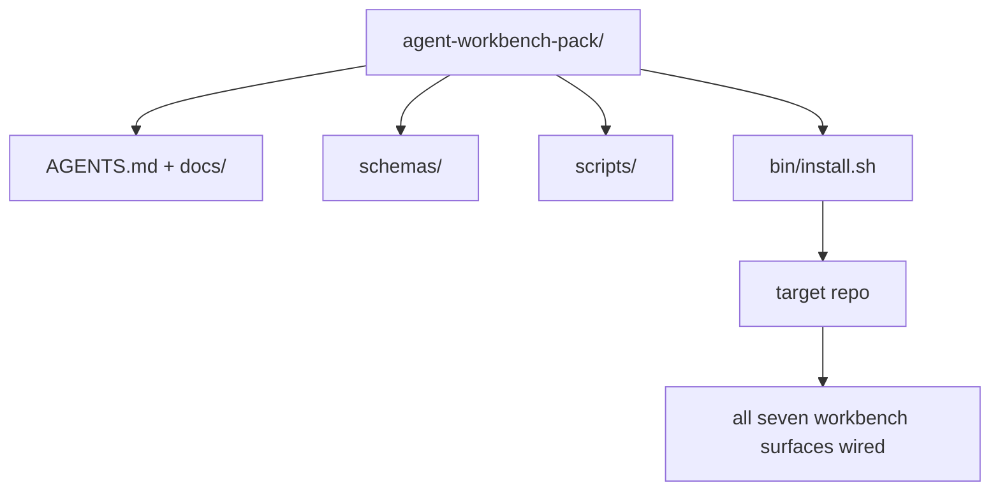

# Capstone：Ship 一个可复用的 Agent Workbench Pack

> Mini-track 的终点是一个可以放进任意 repo 的 pack。十一课 surfaces 压缩成一个 directory，你可以 `cp -r`，第二天早上就让 agent 更可靠地工作。Capstone 是这套 curriculum 交易的 artifact。

**类型：** 构建
**语言：** Python (stdlib)
**前置要求：** 阶段 14 · 31 到 14 · 41
**时间：** ~75 分钟

## 学习目标

- 把七个 workbench surfaces 打包成一个 drop-in directory。
- 固定 schemas、scripts、templates，让新 repo 获得 known-good baseline。
- 添加单个 installer script，idempotently 放下 pack。
- 决定什么留在 pack 里、什么留在外面，并为每个 cut 辩护。

## 问题

一个存在于 Google Doc、chat history 和三个半记得脚本里的 workbench，每个季度都会被重建一次。解法是 versioned pack：一个 repo 或 directory，包含 surfaces、schemas、scripts 和 one-command installer。

本课结束时，你会在磁盘上发布 `outputs/agent-workbench-pack/`，并提供一个 `bin/install.sh`，能把它放进任意 target repo。

## 概念



### Pack layout

```
outputs/agent-workbench-pack/
├── AGENTS.md
├── docs/
│   ├── agent-rules.md
│   ├── reliability-policy.md
│   ├── handoff-protocol.md
│   └── reviewer-rubric.md
├── schemas/
│   ├── agent_state.schema.json
│   ├── task_board.schema.json
│   └── scope_contract.schema.json
├── scripts/
│   ├── init_agent.py
│   ├── run_with_feedback.py
│   ├── verify_agent.py
│   └── generate_handoff.py
├── bin/
│   └── install.sh
└── README.md
```

### 什么留在里面，什么留在外面

In：

- Surface schemas。它们是 contract。
- 上面四个 scripts。它们是 runtime。
- 四个 docs。它们是 rules 和 rubric。

Out：

- Project-specific tasks。Tasks 属于 target repo 的 board，而不是 pack。
- Vendor SDK calls。Pack 是 framework-agnostic。
- Onboarding prose。Pack 放在团队已有 onboarding 旁边，而不是塞进去。

### Installer

一个短 `bin/install.sh`（或 `bin/install.py`）：

1. 没有 `--force` 时，拒绝覆盖现有 pack。
2. 把 pack 复制进 target repo。
3. 如果存在 `.github/workflows/`，接入 CI。
4. 打印 next steps：填 board、设置 acceptance commands、运行 init script。

### Versioning

Pack 携带 `VERSION` file。需要 migrations 的 schema bumps 和 script changes 增加 major。Doc-only changes 增加 patch。Target repo 的 `agent_state.json` 记录初始化时使用的 pack version。

## 构建它

`code/main.py` 会把 pack 组装进本课旁边的 `outputs/agent-workbench-pack/`，用这个 mini-track 前面 lessons 中的 schemas、scripts 和你已经写过的 docs 作为 seed。

运行它：

```
python3 code/main.py
```

脚本会 copy 并 pin surfaces，写 README，打印 pack tree，并以 0 退出。重复运行是 idempotent。

## Production patterns in the wild

Pack 只有在 forks、updates、不友善 upstream 中仍能存活时才有价值。四种 patterns 能做到这一点。

**`VERSION` is the contract, not the marketing。** Major bumps 需要 state migration。Minor bumps 需要 checker re-run。Patch bumps 是 doc-only。Installer 每次 install 都把 `.workbench-version` 写入 target repo；如果 target lock 与 pack 的 `VERSION` 不一致，`lint_pack.py` 拒绝 ship。这就是 `npm`、`Cargo`、`pyproject.toml` 经受十年 churn 的方式；agents 不改变规则。

**Single source for cross-tool distribution。** Nx 提供一个 `nx ai-setup`，从单一 config 放下 `AGENTS.md`、`CLAUDE.md`、`.cursor/rules/`、`.github/copilot-instructions.md` 和 MCP server。Pack 也应如此；installer 发出 symlinks（`ln -s AGENTS.md CLAUDE.md`），让 single source of truth fan out 到每个 coding agent。为了支持某个工具而 fork pack，是 failure mode。

**`uninstall.sh` that refuses on non-trivial state。** 卸载 pack 不得删除用户的 `agent_state.json`、`task_board.json` 或 `outputs/`。Uninstaller 删除 schemas、scripts、docs 和 `AGENTS.md`（带 `--keep-agents-md` opt-out），并在 state files 有任何 uncommitted changes 时拒绝继续。State 属于用户；pack 不拥有它。

**Skill-as-publishable. SkillKit-style distribution。** Pack 作为 SkillKit skill 发布：`skillkit install agent-workbench-pack` 从 single source 把它放到 32 个 AI agents 中。Pack repo 是 source of truth；SkillKit 是 distribution channel。Vendor lock-in 坍塌；七个 surfaces 保持不变。

## 使用它

Pack 有三个发布位置：

- **作为你放进 repo 的 directory。** `cp -r outputs/agent-workbench-pack /path/to/repo`。
- **作为 public template repo。** Fork-and-customize，用 `VERSION` 控制 drift。
- **作为 SkillKit skill。** 接入你的 agent product，让一个 command 放下它。

Pack 是配方。每次 install 是一份成品。

## 发布它

`outputs/skill-workbench-pack.md` 会生成 project-tuned pack：rules 根据团队 history 收紧，scope globs 匹配 repo，rubric dimensions 用一个 domain-specific entry 扩展。

## 练习

1. 决定哪个 optional fifth doc 值得提升进 canonical pack。为这个 cut 辩护。
2. 用 Python 重写 installer，添加 `--dry-run` flag。对比它和 bash 的 ergonomics。
3. 添加 `bin/uninstall.sh`，安全移除 pack，并在 state files 有 non-trivial history 时拒绝。什么算 non-trivial？
4. 添加 `lint_pack.py`，当 pack 与 `VERSION` drift 时 fail。接入 pack 自己 repo 的 CI。
5. 编写从 hand-rolled workbench 迁移到这个 pack 的 migration runbook。最小化 downtime 的操作顺序是什么？

## 关键术语

| 术语 | 人们常说 | 实际含义 |
|------|----------------|------------------------|
| Workbench pack | "The starter kit" | 携带所有七个 surfaces 的 versioned directory |
| Installer | "Setup script" | Idempotently 放下 pack 的 `bin/install.sh` |
| Pack version | "VERSION" | Schema/script changes 增 major；doc-only 增 patch |
| Drop-in pack | "cp -r and go" | Pack 第一天就能不经 per-repo customization 工作 |
| Forkable template | "GitHub template" | Public repo，可用 GitHub “Use this template” 克隆 |

## 延伸阅读

- Phases 14 · 31 to 14 · 41 — 这个 pack bundle 的每个 surface
- [SkillKit](https://github.com/rohitg00/skillkit) — 把这个 skill 安装到 32 个 AI agents
- [Nx Blog, Teach Your AI Agent How to Work in a Monorepo](https://nx.dev/blog/nx-ai-agent-skills) — 跨六种工具的 single-source generator
- [agents.md — the open spec](https://agents.md/) — pack router 必须实现的内容
- [HKUDS/OpenHarness](https://github.com/HKUDS/OpenHarness) — pack-equivalent 的 reference implementation
- [andrewgarst/agentic_harness](https://github.com/andrewgarst/agentic_harness) — Redis-backed reference，带 eval suite
- [Augment Code, A good AGENTS.md is a model upgrade](https://www.augmentcode.com/blog/how-to-write-good-agents-dot-md-files) — pack docs quality bar
- [Anthropic, Effective harnesses for long-running agents](https://www.anthropic.com/engineering/effective-harnesses-for-long-running-agents)
- [Anthropic, Harness design for long-running application development](https://www.anthropic.com/engineering/harness-design-long-running-apps)
- Phase 14 · 30 — 消费 pack verification gate 的 eval-driven agent development
- Phase 14 · 41 — 这个 pack 改善的 before/after benchmark
